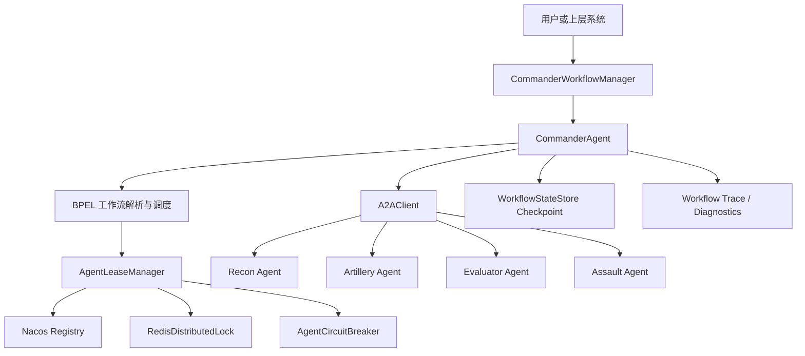
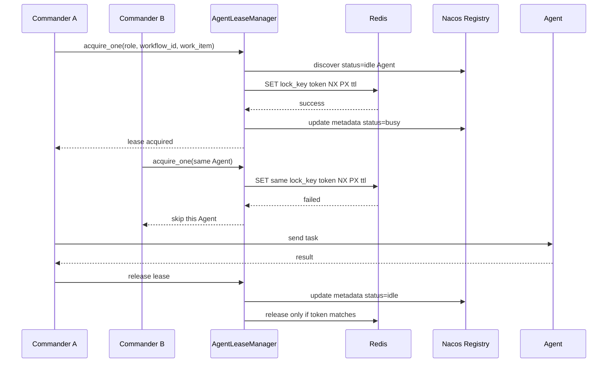
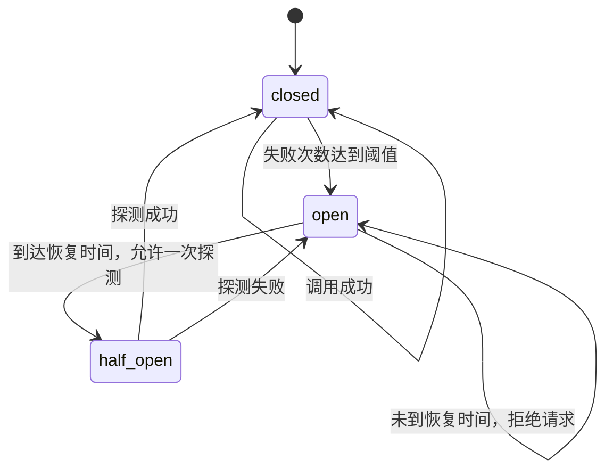
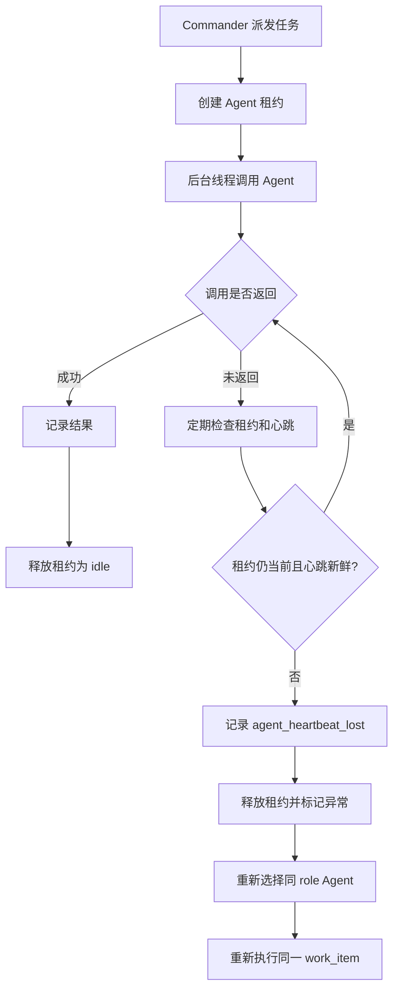
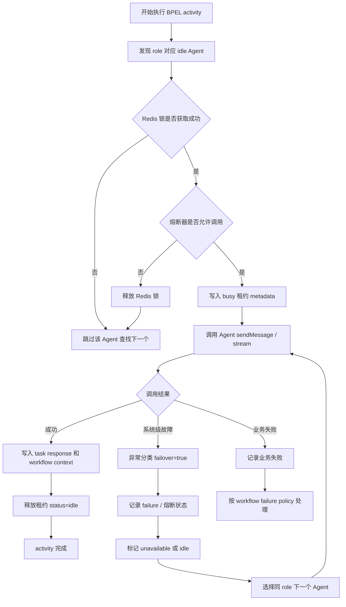

# A2A 项目

## 一、本周工作

本周主要围绕 A2A 多 Agent 工作流框架的稳定性和工程化能力进行完善。

核心目标是让 Commander 在真实多 Agent 环境中具备更强的容错能力：当某个 Agent 宕机、连接失败、超时、ready 状态不可用、运行中心跳丢失，或者多个 Commander 同时调度同一类 Agent 时，系统能够通过租约、分布式锁、熔断和重新指派机制保证工作流继续推进。

本周重点完成内容如下：

1. 新增 Redis 分布式锁能力，支持多 Commander 场景下对同一 Agent 实例的互斥租用。
2. 新增 Agent 熔断器，支持 `closed / open / half_open` 状态流转，避免反复调用异常 Agent。
3. 增强运行中心跳检测，支持 Agent 执行过程中失联后的自动 failover。
4. 补充 trace、异常诊断、迟到响应忽略等可观测能力。

## 二、整体架构流程

当前系统中，Commander 是工作流控制面，具体业务能力由 Recon、Artillery、Evaluator、Assault 等 Agent 提供。Commander 不直接假设某个 Agent 永远可用，而是通过 Registry 发现 Agent，再通过租约和锁控制任务派发。



核心链路可以理解为：

1. `CommanderWorkflowManager` 接收 workflow 提交请求。
2. 每个 workflow 由独立的 `CommanderAgent` 执行。
3. Commander 根据 BPEL 活动节点决定需要调用的 Agent role。
4. `AgentLeaseManager` 从 Registry 中查找 `idle` 的 Agent。
5. 如果开启分布式锁，则先通过 Redis 对 Agent 实例加锁。
6. 租约成功后，将 Agent metadata 更新为 `busy`。
7. Commander 调用远端 Agent。
8. 调用成功则释放租约并恢复为 `idle`。
9. 调用失败、心跳丢失或熔断打开时，将 Agent 标记为 `unavailable` 或记录失败，并尝试重新指派其他 Agent。

## 三、Agent 租约与分布式锁

### 3.1 设计目标

之前系统主要依赖 Registry metadata 中的 `status=idle/busy` 来判断 Agent 是否可用。在单 Commander 场景下基本可用，但如果存在多个 Commander 实例并发调度，就可能出现两个 Commander 同时看到同一个 Agent 是 `idle`，然后重复派发任务的问题。

本周新增 Redis 分布式锁后，Agent 租用流程变为：



### 3.2 关键代码：Redis 分布式锁

文件：`commander_agent/distributed_lock.py`

```python
RELEASE_SCRIPT = """
if redis.call('get', KEYS[1]) == ARGV[1] then
    return redis.call('del', KEYS[1])
end
return 0
"""

RENEW_SCRIPT = """
if redis.call('get', KEYS[1]) == ARGV[1] then
    return redis.call('pexpire', KEYS[1], ARGV[2])
end
return 0
"""
```

这两个 Lua 脚本是分布式锁安全性的关键：

- `RELEASE_SCRIPT` 保证只有当前持有 token 的 owner 才能删除锁，避免旧 owner 误删新 owner 的锁。
- `RENEW_SCRIPT` 保证只有当前 owner 才能续约，避免锁所有权已经变化后继续延长旧锁。

```python
def acquire(self, resource: str) -> Optional[DistributedLockHandle]:
    key = self.resource_key(resource)
    token = uuid4().hex
    acquired = self.client.set(key, token, nx=True, px=self.ttl_ms)
    if not acquired:
        return None
    handle = DistributedLockHandle(key=key, token=token)
    with self._lock:
        self._handles[key] = handle
    return handle
```

这段代码通过 Redis `SET key token NX PX ttl` 完成互斥加锁：

- `NX` 表示只有 key 不存在时才能写入。
- `PX` 表示设置毫秒级过期时间，避免进程异常退出后死锁。
- `token` 是本次锁的唯一所有权凭证。

```python
def _renew_loop(self):
    while not self._stop_event.wait(self.renew_interval):
        with self._lock:
            handles = list(self._handles.values())
        for handle in handles:
            try:
                self.renew(handle)
            except redis.RedisError:
                time.sleep(0)
```

后台续约线程用于长任务场景。只要 Commander 仍然持有租约，锁就会周期性续期，避免任务未完成但锁提前过期。

### 3.3 关键代码：租约接入分布式锁

文件：`commander_agent/agent_leases.py`

```python
if self.distributed_lock is not None:
    lock_handle = self.distributed_lock.acquire(
        f"{self.service_name}:{key}"
    )
    if lock_handle is None:
        return None
```

租约申请时先尝试获取分布式锁。如果锁获取失败，说明其他 Commander 正在使用该 Agent，当前调度直接跳过。

```python
metadata_updates={
    "status": "busy",
    "lease_workflow_id": workflow_id,
    "lease_work_item": work_item,
    "lease_acquired_at": acquired_at,
    **lock_metadata,
    **circuit_metadata,
}
```

锁成功后，系统会把 Agent 状态同步到 Registry：

- `status=busy`：表示 Agent 已被占用。
- `lease_workflow_id`：记录当前占用它的 workflow。
- `lease_work_item`：记录具体任务项。
- `lease_lock_backend=redis`：表示该租约由 Redis 分布式锁保护。
- `lease_lock_key`：记录 Redis 锁 key，便于恢复 stale busy 状态。

### 3.4 stale busy 恢复逻辑

如果 Commander 崩溃，Nacos 中的 Agent 可能仍显示 `busy`。本周逻辑会结合 Redis 锁判断该 busy 是否已经失效：

```python
if self.distributed_lock.is_key_locked(lock_key):
    continue

self.registry.update_instance_metadata(
    self.service_name,
    target,
    metadata_updates={"status": "idle"},
    remove_keys=[
        "lease_workflow_id",
        "lease_work_item",
        "lease_acquired_at",
        "lease_lock_backend",
        "lease_lock_key",
    ],
)
```

如果 Registry 中显示 `busy`，但 Redis 中对应锁已经不存在，说明原 Commander 的租约已经过期，可以安全恢复为 `idle`。

## 四、Agent 熔断机制

### 4.1 设计目标

如果某个 Agent 连续失败，Commander 不应该反复把任务派给它。本周新增 `AgentCircuitBreaker`，对每个 Agent 实例维护独立熔断状态。

状态流转如下：



### 4.2 关键代码

文件：`commander_agent/circuit_breaker.py`

```python
def allow_request(self, target: dict) -> bool:
    key = self.instance_key(target)
    metadata = target.get("metadata", {}) or {}
    with self._lock:
        record = self._record_from_metadata(key, metadata)
        if metadata.get("status") == "unavailable" and record.state == "closed":
            return False
        if record.state == "closed":
            return True
        if record.state == "open":
            if self._clock() < (record.open_until_ts or 0):
                return False
            record.state = "half_open"
            record.probe_in_flight = True
            return True
        if record.state == "half_open" and not record.probe_in_flight:
            record.probe_in_flight = True
            return True
        return False
```

这段逻辑用于判断 Agent 是否允许被调用：

- `closed`：正常调用。
- `open` 且未到恢复时间：拒绝调用。
- `open` 且超过恢复时间：进入 `half_open`，允许一次探测。
- `half_open` 探测中：拒绝其他并发请求。

```python
def record_failure(self, target_or_key) -> dict:
    key = self._key(target_or_key)
    with self._lock:
        record = self._records.setdefault(key, CircuitRecord())
        record.failure_count += 1
        record.probe_in_flight = False
        if record.state == "half_open" or record.failure_count >= self.failure_threshold:
            now = self._clock()
            record.state = "open"
            record.opened_at_ts = now
            record.open_until_ts = now + self.recovery_timeout
        return self.snapshot(key)
```

失败次数达到阈值后，Agent 进入 `open` 状态。之后在恢复时间窗口内不会再被调度，降低无效重试和级联失败风险。

## 五、运行中心跳丢失与自动重新指派

### 6.1 问题背景

有些 Agent 不是调用前就不可用，而是在任务执行中突然失联。例如 Commander 已经把任务派给某个 Recon Agent，但该 Agent 在处理过程中停止心跳。此时如果 Commander 一直等待，工作流会卡住。

本周新增 active lease heartbeat watcher。Commander 在远程调用执行过程中定期检查租约是否仍然有效、Agent 心跳是否仍新鲜。



### 6.2 关键代码

文件：`commander_agent/main.py`

```python
if not self.lease_manager.is_lease_fresh(lease):
    error = RuntimeError(f"heartbeat lost for {lease.instance_key}")
    error_info = classify_agent_error(error)
    self._trace(
        "agent_heartbeat_lost",
        role=role_needed,
        work_item=lease.work_item,
        target=lease.instance_key,
        check_interval=self.lease_heartbeat_check_interval,
        **error_info.trace_fields(),
    )
    self._release_agent_lease(
        lease,
        available=False,
        error=error,
    )
    return False, error
```

如果检测到心跳丢失，Commander 会：

1. 生成 `AGENT_HEARTBEAT_LOST` 类型错误。
2. 写入 workflow trace。
3. 释放当前租约。
4. 记录 Agent failure 或打开熔断。
5. 返回失败结果，由上层调度逻辑继续尝试其他 Agent。

### 6.3 迟到响应保护

故障转移后，原 Agent 可能又返回了旧结果。为了避免旧结果覆盖新 Agent 的结果，本周补充了迟到响应保护：

```python
def _lease_allows_response(self, lease, target_label: str, work_item: str, role: str) -> bool:
    if lease is None or self.lease_manager is None:
        return True
    if self.lease_manager.is_current(lease) and self.lease_manager.is_lease_fresh(lease):
        return True
    error_info = classify_agent_error("late response ignored after failover")
    self._trace(
        "agent_late_response_ignored",
        role=role,
        work_item=work_item,
        target=target_label,
        lease_instance=lease.instance_key,
        **error_info.trace_fields(),
    )
    return False
```

这保证了只有当前仍持有有效租约的 Agent 响应才会被写入 workflow context。

## 六、端到端故障转移流程

完整 failover 流程如下：



这个流程的关键点是：系统级故障会触发 Agent 层面的重新指派，业务失败不会被误判为宕机。

系统级故障：

```
连接失败
请求超时
Agent 返回 503
Agent not ready
运行中心跳丢失
```

这些说明的是：

```
这个 Agent 可能挂了、卡住了、网络不通，或者当前不可服务。
```

所以 Commander 会认为：**不是任务本身失败，而是执行这个任务的 Agent 不可靠**。
于是它会把这个 Agent 标记为异常，然后找同 role 的其他 Agent 重新执行同一个 `work_item`。


业务失败就不一样。

比如：

```
Evaluator Agent 正常返回：评估结果不达标
Assault Agent 正常返回：突击条件不足
Recon Agent 正常返回：没有发现目标
```

这些说明的是：

```
Agent 是正常工作的，只是业务结论是失败、不通过、不能继续。
```

这时候不能把 Agent 当成宕机，也不能盲目换一个 Agent 重跑。否则会出现逻辑错误。
