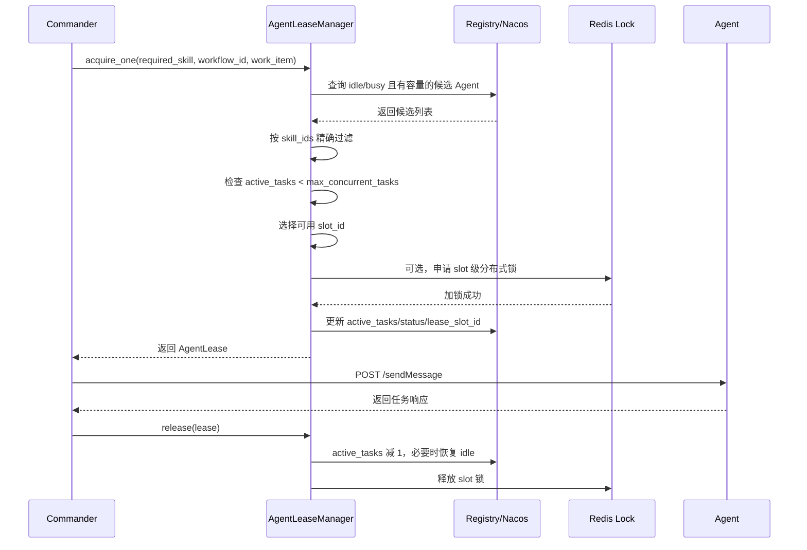
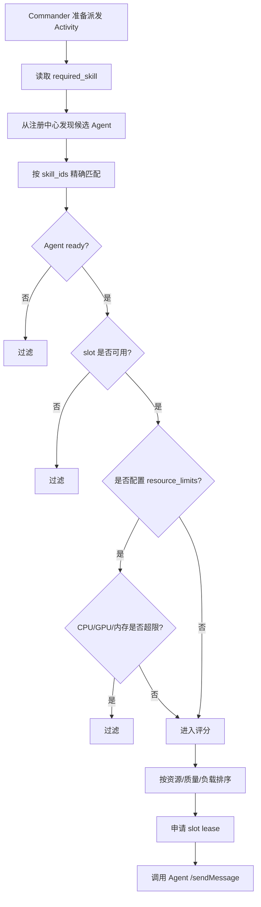

# Agent 并发 Slot 

## 1. Agent 并发 Slot 说明

### 1.1 为什么需要 slot

之前的逻辑接近于“一个 Agent 被选中后整体置为 busy”，这会导致同一个 Agent 同一时间只能执行一个任务。

但真实 Agent 可能具备并发处理能力，因此当前引入了 slot 概念。slot 可以理解为 Agent 实例内部的“可用执行位”。Commander 不再只判断 Agent 是否 busy，而是判断该 Agent 是否还有可用 slot。

### 1.2 slot 的核心字段

Agent 通过 metadata 或心跳上报以下字段：

| 字段 | 类型 | 示例 | 含义 |
| --- | --- | --- | --- |
| `status` | string | `idle` / `busy` / `unavailable` | Agent 总体调度状态。只要 `active_tasks > 0`，通常为 `busy`。 |
| `active_tasks` | string/int | `"1"` | 当前正在执行的任务数量。 |
| `max_concurrent_tasks` | string/int | `"3"` | 该 Agent 最大并发任务数。 |
| `available_task_slots` | string/int | `"2"` | 剩余可用 slot 数，等于 `max_concurrent_tasks - active_tasks`。 |
| `task_execution_status` | string | `idle` / `busy` / `saturated` | 任务执行状态。`saturated` 表示 slot 已满。 |
| `lease_workflow_id` | string | `wf-001` | 当前最近一次租约对应的 workflow。 |
| `lease_work_item` | string | `wf-001:activity-001` | 当前最近一次租约对应的 work item。 |
| `lease_acquired_at` | string | `2026-07-19T10:00:00Z` | 租约获取时间。 |
| `lease_slot_id` | string/int | `"0"` | 当前占用的 slot 编号。 |

### 1.3 slot 编号规则

Commander 会根据 `max_concurrent_tasks` 生成 slot 编号：

```text
max_concurrent_tasks = 3
可用 slot_id = 0, 1, 2
```

每个租约对应一个 slot：

```text
instance_key = 10.0.0.10:8012
slot_id = 1
slot_key = 10.0.0.10:8012:slot:1
```

如果启用了 Redis 分布式锁，锁资源名会进一步包含服务名：

```text
A2A-Agent:10.0.0.10:8012:slot:1
```

这样多个 Commander 并发调度时，不会抢到同一个 Agent 的同一个 slot。

### 1.4 slot 申请流程



### 1.5 slot 状态变化示例

假设某 Agent：

```json
{
  "status": "idle",
  "active_tasks": "0",
  "max_concurrent_tasks": "2",
  "available_task_slots": "2",
  "task_execution_status": "idle"
}
```

第一个任务获取 slot 0 后：

```json
{
  "status": "busy",
  "active_tasks": "1",
  "max_concurrent_tasks": "2",
  "available_task_slots": "1",
  "task_execution_status": "busy",
  "lease_workflow_id": "wf-001",
  "lease_work_item": "wf-001:scan-001",
  "lease_slot_id": "0"
}
```

第二个任务获取 slot 1 后：

```json
{
  "status": "busy",
  "active_tasks": "2",
  "max_concurrent_tasks": "2",
  "available_task_slots": "0",
  "task_execution_status": "saturated",
  "lease_workflow_id": "wf-002",
  "lease_work_item": "wf-002:scan-001",
  "lease_slot_id": "1"
}
```

此时再有第三个任务请求该 Agent，会因为没有可用 slot 被跳过。Commander 会继续尝试其他候选 Agent；如果没有其他可用 Agent，则根据重试策略和失败策略处理。

### 1.6 Agent 侧容量保护

Commander 侧会申请 slot，Agent 自己也会做一次容量保护。

Agent 收到 `/sendMessage` 后会检查：

```text
ready == true
active_tasks < max_concurrent_tasks
```

如果 Agent 不可用，返回：

```json
{
  "status": "failed",
  "error_code": "AGENT_NOT_READY",
  "error": "agent is not ready"
}
```

如果 Agent slot 已满，返回：

```json
{
  "status": "failed",
  "error_code": "AGENT_RESOURCE_EXHAUSTED",
  "error": "agent task capacity is full"
}
```

因此当前有两层保护：

1. Commander 调度前根据 Registry metadata 判断容量。
2. Agent 收到请求后根据自身实时状态再次判断容量。

## 2. Agent 资源判断与任务派发

### 2.1 当前是否会判断 Agent 资源

当前系统在申请 Agent 并派发任务前，**会读取 Agent 侧上报的资源信息**，但要区分两类判断：

1. **slot 容量是强判断**：如果 Agent 当前并发任务数已经达到上限，Commander 不会继续派发给该 Agent。
2. **CPU、内存、GPU 默认主要用于评分排序**：资源占用越低、历史质量越好、当前负载越低的 Agent 优先级越高。
3. **如果显式配置了 `resource_limits`，CPU、内存、GPU 也会变成强判断**：超过阈值的 Agent 会被直接过滤掉。

### 2.2 Agent 侧上报的资源字段

Agent 会通过心跳或注册 metadata 上报资源、容量和质量指标。Commander 派发任务时读取的是这些 metadata。

常见字段如下：

| 字段 | 类型 | 示例 | 含义 |
| --- | --- | --- | --- |
| `resource_monitor_available` | string/bool | `"true"` | Agent 资源监控是否可用。 |
| `node_online` | string/bool | `"true"` | Agent 所在节点是否在线。 |
| `resource_cpu_percent` | number/string | `35.2` | 系统 CPU 使用率。 |
| `resource_memory_percent` | number/string | `62.5` | 系统内存使用率。 |
| `resource_disk_percent` | number/string | `70.1` | 磁盘使用率。 |
| `process_cpu_percent` | number/string | `12.0` | Agent 进程 CPU 使用率。 |
| `process_memory_mb` | number/string | `512.6` | Agent 进程内存占用。 |
| `resource_gpu_available` | string/bool | `"true"` | 是否检测到 GPU。 |
| `resource_gpu_percent` | number/string/null | `55.0` | GPU 使用率。 |
| `resource_gpu_memory_percent` | number/string/null | `40.0` | GPU 显存使用率。 |
| `resource_energy_available` | string/bool | `"true"` | 电源或电量信息是否可用。 |
| `resource_energy_percent` | number/string/null | `80.0` | 剩余电量。 |
| `resource_power_plugged` | string/bool/null | `"true"` | 是否接入电源。 |
| `resource_bandwidth_mbps` | number/string/null | `100.0` | 网络带宽估计。 |
| `resource_link_stability` | number/string/null | `0.98` | 链路稳定性估计。 |
| `resource_link_up` | string/bool/null | `"true"` | 网络链路是否可用。 |
| `resource_sampled_at` | string | `2026-07-19T10:00:00Z` | 资源采样时间。 |

同时 Agent 还会上报任务容量字段：

| 字段 | 类型 | 示例 | 含义 |
| --- | --- | --- | --- |
| `active_tasks` | string/int | `"1"` | 当前正在执行的任务数。 |
| `max_concurrent_tasks` | string/int | `"3"` | 最大并发任务数。 |
| `available_task_slots` | string/int | `"2"` | 剩余可用 slot 数。 |
| `task_execution_status` | string | `busy` | `idle`、`busy` 或 `saturated`。 |
| `agent_run_state` | string | `ready` | Agent 当前运行状态。 |

质量评分字段：

| 字段 | 类型 | 示例 | 含义 |
| --- | --- | --- | --- |
| `quality_tasks_completed` | string/int | `"20"` | 已完成任务数。 |
| `quality_tasks_failed` | string/int | `"1"` | 失败任务数。 |
| `quality_success_rate` | number/string | `0.952381` | 历史成功率。 |
| `quality_avg_latency_ms` | number/string | `120.5` | 平均延迟。 |

### 2.3 Commander 派发前的硬性容量判断

当前最明确的硬性拦截逻辑是 slot 容量判断。

Commander 会检查：

```text
agent_run_state 不能是 not_ready 或 unavailable
task_execution_status 不能是 saturated
active_tasks 必须小于 max_concurrent_tasks
```

```
idle       没有任务，完全空闲
busy       正在执行任务，但还没满
saturated  已经满了，不能再接新任务
```

```
active_tasks = 当前正在执行的任务数
max_concurrent_tasks = 这个 Agent 最大能同时执行的任务数
```

等价理解为：

```python
active_tasks < max_concurrent_tasks
```

如果某 Agent 上报：

```json
{
  "agent_run_state": "ready",
  "active_tasks": "2",
  "max_concurrent_tasks": "2",
  "available_task_slots": "0",
  "task_execution_status": "saturated"
}
```

那么该 Agent 已经满载，Commander 不会继续选择它承接新调用。

### 2.4 CPU/GPU/内存默认如何参与派发

默认情况下，CPU、内存、GPU 不一定直接决定“能不能派发”，而是影响“优先派给谁”。

Commander 会给候选 Agent 打分，评分会参考：

```text
CPU 剩余比例
内存剩余比例
GPU 剩余比例
历史成功率
平均延迟
当前 active_tasks 数量
```

简化理解：

```text
资源占用越低，分数越高
历史成功率越高，分数越高
平均延迟越低，分数越高
当前 active_tasks 越少，分数越高
```

例如两个 Agent 都有 `scan_beach_defenses` 技能：

```json
[
  {
    "agent": "Recon_Agent_A",
    "metadata": {
      "skill_ids": "scan_beach_defenses",
      "resource_cpu_percent": "90",
      "resource_memory_percent": "80",
      "active_tasks": "1",
      "max_concurrent_tasks": "2",
      "quality_success_rate": "0.90",
      "quality_avg_latency_ms": "300"
    }
  },
  {
    "agent": "Recon_Agent_B",
    "metadata": {
      "skill_ids": "scan_beach_defenses",
      "resource_cpu_percent": "20",
      "resource_memory_percent": "40",
      "active_tasks": "0",
      "max_concurrent_tasks": "2",
      "quality_success_rate": "0.99",
      "quality_avg_latency_ms": "80"
    }
  }
]
```

在默认资源感知排序下，Commander 会更倾向选择 `Recon_Agent_B`。

### 2.5 resource_limits 硬性过滤

如果 Commander 或 SDK 显式配置了 `resource_limits`，资源会从“排序参考”变成“硬性过滤条件”。

支持的限制字段包括：

```json
{
  "cpu_percent": 90,
  "memory_percent": 90,
  "gpu_percent": 95,
  "gpu_memory_percent": 90,
  "active_tasks": 2
}
```

字段含义：

| 限制字段 | 对应 metadata 字段 | 含义 |
| --- | --- | --- |
| `cpu_percent` | `resource_cpu_percent` | CPU 使用率不能超过该阈值。 |
| `memory_percent` | `resource_memory_percent` | 内存使用率不能超过该阈值。 |
| `gpu_percent` | `resource_gpu_percent` | GPU 使用率不能超过该阈值。 |
| `gpu_memory_percent` | `resource_gpu_memory_percent` | GPU 显存使用率不能超过该阈值。 |
| `active_tasks` | `active_tasks` | 当前任务数不能超过该阈值。 |

示例：

```json
{
  "resource_limits": {
    "cpu_percent": 90,
    "memory_percent": 85,
    "gpu_percent": 95
  }
}
```

如果某 Agent 当前 metadata 为：

```json
{
  "resource_cpu_percent": "96",
  "resource_memory_percent": "60",
  "resource_gpu_percent": "30"
}
```

由于 CPU 已经超过 `90`，该 Agent 会被直接过滤，不会进入最终派发。

### 2.6 资源判断的完整派发流程



### 

