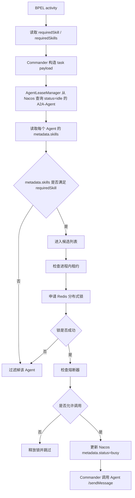
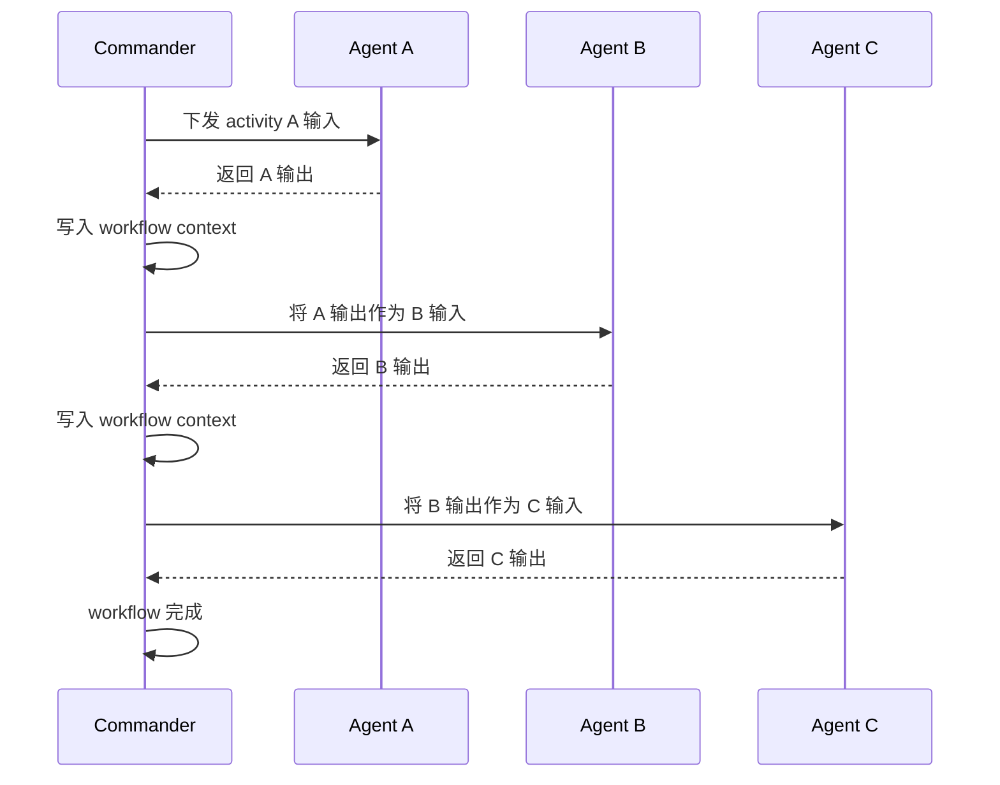

# Agent 技能匹配逻辑说明

## 1. 整体匹配链路



当前 Agent 匹配规则可以总结为：

```text
1. BPEL activity 声明 requiredSkill / requiredSkills。
2. Commander 将 requiredSkill 写入任务 payload。
3. AgentLeaseManager 从 Nacos 获取 status=idle 的 A2A-Agent。
4. Commander 读取 Agent metadata.skills。
5. metadata.skills 必须包含 requiredSkill。
6. 如果 requiredSkills 有多个，必须全部包含。
7. 不再按 role 兜底。
8. skill 匹配成功后，还要经过租约、Redis 分布式锁和熔断器检查。
9. 最终通过检查的 Agent 才会被 Commander 调用。
```

一句话：

```text
现在的 Agent 匹配是“BPEL requiredSkill -> Nacos idle Agent -> metadata.skills 关键字匹配 -> 租约/锁/熔断 -> 调用”。
```

## 2. BPEL 中如何声明需要的技能

### 2.1 单技能 activity

示例：

```xml
<invoke name="SkillOnlyRecon"
        requiredSkill="scan_beach_defenses"
        operation="scanBeachDefenses"
        inputVariable="Sector_A"
        outputVariable="ReconReport"/>
```

含义：

```text
当前 activity 需要 scan_beach_defenses 技能。
Commander 会寻找 skills 中包含 scan_beach_defenses 的 Agent。
```

解析后 work list 中会包含：

```json
{
  "type": "invoke",
  "name": "SkillOnlyRecon",
  "operation": "scanBeachDefenses",
  "command": "scan_beach_defenses",
  "required_skill": "scan_beach_defenses",
  "required_skills": ["scan_beach_defenses"],
  "input_variable": "Sector_A",
  "output_variable": "ReconReport"
}
```

### 2.2 多技能 activity

示例：

```xml
<invoke name="ComplexRecon"
        requiredSkills="scan_beach_defenses,target_identification"
        operation="complexRecon"
        inputVariable="Sector_A"
        outputVariable="ReconReport"/>
```

含义：

```text
当前 activity 要求 Agent 同时具备：
1. scan_beach_defenses
2. target_identification
```

也就是 AND 匹配，不是 OR 匹配。

```text
Agent 必须同时包含两个技能才会被选中。
只包含其中一个不会被选中。
```

## 3. Agent 如何声明 skills

真实 Agent 需要在 Agent Card 和 Nacos metadata 中声明自己的 skills。

### 3.1 Agent Card 中的结构化 skills

示例：

```json
{
  "name": "TerrainAnalysisAgent",
  "description": "真实地形分析 Agent",
  "role": "generalist",
  "skills": [
    {
      "id": "scan_beach_defenses",
      "name": "Beach Defense Scan",
      "description": "探测滩头防御和敌方阵地。",
      "tags": ["scan", "detect", "探测", "侦察"]
    },
    {
      "id": "target_identification",
      "name": "Target Identification",
      "description": "识别目标类型和威胁等级。",
      "tags": ["target", "identify", "目标识别"]
    }
  ]
}
```

### 3.2 Nacos metadata 中的 skills

Nacos metadata 更适合保存简单 key-value，因此项目会把 Agent Card 中的 skills 压缩成字符串。

示例：

```json
{
  "status": "idle",
  "role": "generalist",
  "skills": "scan_beach_defenses,Beach Defense Scan,探测,侦察,target_identification,Target Identification,目标识别"
}
```

这里的 `skills` 会被 Commander 读取并拆分成 token。

### 3.3 skills_metadata 代码

文件：`a2a_protocol/server.py`

```python
def skill_tokens(skills: list[dict]) -> list[str]:
    tokens = []
    for skill in skills or []:
        for value in [
            skill.get("id"),
            skill.get("name"),
            skill.get("description"),
            *(skill.get("tags") or []),
        ]:
            if value:
                tokens.append(str(value))
    seen = set()
    unique = []
    for token in tokens:
        key = token.lower()
        if key not in seen:
            seen.add(key)
            unique.append(token)
    return unique


def skills_metadata(skills: list[dict]) -> dict:
    return {"skills": ",".join(skill_tokens(skills))}
```

这段代码会把结构化 skills：

```json
[
  {
    "id": "scan_beach_defenses",
    "name": "Beach Defense Scan",
    "tags": ["探测", "侦察"]
  }
]
```

转换成：

```json
{
  "skills": "scan_beach_defenses,Beach Defense Scan,探测,侦察"
}
```

## 4. Commander 如何提取 requiredSkill

文件：`commander_agent/main.py`

Commander 会从 task payload 中提取需要的 skill。

```python
def _required_skill_from_payload(role_needed: str, task_payload: dict) -> str:
    explicit_skills = CommanderAgent._split_skill_values(task_payload.get("required_skills"))
    return (
        task_payload.get("required_skill")
        or task_payload.get("skill")
        or task_payload.get("capability")
        or (explicit_skills[0] if explicit_skills else None)
        or task_payload.get("command")
    )
```

### required_skills 提取

如果 payload 是：

```json
{
  "required_skills": ["scan_beach_defenses", "target_identification"]
}
```

最终要求就是：

```text
scan_beach_defenses
target_identification
```

## 5. Nacos 候选 Agent 查询

文件：`commander_agent/agent_leases.py`

核心逻辑：

```python
skill_requirements = self._skill_requirements(required_skill, required_skills)
tags = {"status": "idle"} if skill_requirements else {"role": role, "status": "idle"}
idle = self.registry.discover_service(self.service_name, tags)
if skill_requirements:
    idle = self._filter_by_skill(idle, skill_requirements)
```

当前在有 skill_requirements 的情况下，Nacos 查询条件是：

```python
{"status": "idle"}
```

也就是先拿所有空闲 Agent。

然后 Commander 本地按：

```python
metadata.skills
```

做精筛。

## 6. skills 精筛代码

文件：`commander_agent/agent_leases.py`

### 6.1 过滤候选 Agent

```python
@classmethod
def _filter_by_skill(
    cls,
    instances: list[dict],
    required_skills,
) -> list[dict]:
    requirements = cls._skill_requirements(None, required_skills)
    return [
        instance
        for instance in instances
        if cls._instance_has_skills(instance, requirements)
    ]
```

含义：

```text
遍历 Nacos 返回的 Agent
只保留满足 required_skills 的 Agent
```

### 6.2 多技能必须全部满足

```python
@classmethod
def _instance_has_skills(cls, instance: dict, required_skills: Iterable[str]) -> bool:
    requirements = cls._skill_requirements(None, required_skills)
    if not requirements:
        return False
    return all(cls._instance_has_skill(instance, skill) for skill in requirements)
```

所以多技能是 AND 关系。

例如：

```text
required_skills = ["scan_beach_defenses", "target_identification"]
```

Agent 必须同时包含两个技能才会被选中。

### 6.3 单个技能如何判断

```python
@classmethod
def _instance_has_skill(cls, instance: dict, required_skill: str) -> bool:
    required = cls._normalize_token(required_skill)
    if not required:
        return False
    metadata = instance.get("metadata", {}) or {}
    for token in cls._skill_tokens_from_metadata(metadata):
        normalized = cls._normalize_token(token)
        if normalized and (normalized == required or required in normalized):
            return True
    return False
```

匹配规则：

```text
1. 取出 required_skill
2. 做归一化
3. 从 metadata.skills 中拆出 token
4. 对每个 token 做归一化
5. 如果 token 等于 required_skill，匹配成功
6. 如果 token 包含 required_skill，匹配成功
```

## 7. token 解析和归一化

### 7.1 支持的 metadata 字段

```python
for key in ("skills", "skill", "capabilities", "capability"):
    value = metadata.get(key)
    if value:
        raw_values.append(value)
```

也就是说，目前支持这些字段：

```text
skills
skill
capabilities
capability
```

推荐统一使用：

```text
skills
```

### 7.2 支持的 skills 格式

#### 逗号字符串

```json
{
  "skills": "scan_beach_defenses,target_identification,探测"
}
```

#### 数组

```json
{
  "skills": ["scan_beach_defenses", "target_identification"]
}
```

#### JSON 字符串

```json
{
  "skills": "[{\"id\":\"scan_beach_defenses\",\"tags\":[\"探测\",\"侦察\"]}]"
}
```

代码会尽量解析这些格式。

### 7.3 归一化规则

```python
@staticmethod
def _normalize_token(value: str) -> str:
    return re.sub(r"[\s_\-]+", "", str(value or "").strip().lower())
```

归一化会处理：

```text
大小写
空格
下划线
短横线
```

例如：

```text
scan_beach_defenses -> scanbeachdefenses
scan-beach-defenses -> scanbeachdefenses
Scan Beach Defenses -> scanbeachdefenses
```

因此这些可以匹配：

```text
requiredSkill = scan_beach_defenses
metadata.skills = scan-beach-defenses
metadata.skills = Scan Beach Defenses
metadata.skills = scan_beach_defenses
```

## 8. Agent 执行结果如何传给下一个 activity

当前 workflow 的主执行逻辑可以理解为：

```text
任务开始
-> Commander 按 BPEL 定义的顺序推进 activity
-> activity A 找到具备 requiredSkill 的 Agent
-> Agent A 获取输入并执行算法
-> Agent A 把结果返回 Commander
-> Commander 把 A 的输出写入 workflow context
-> activity B 从 workflow context 读取 A 的输出作为输入
-> Agent B 执行后再把结果返回 Commander
-> Commander 再把 B 的输出传给后续 activity
-> 依次推进直到 workflow 完成
```

需要注意的是，Agent 之间不是直接互相传数据。

不是：

```text
Agent A -> Agent B -> Agent C
```

而是：

```text
Agent A -> Commander -> Agent B -> Commander -> Agent C
```

Commander 是统一协调者，负责：

```text
1. 保存 workflow context
2. 判断下一个 activity
3. 根据 requiredSkill 选择 Agent
4. 把上一步输出组装成下一步输入
5. 保存 checkpoint
6. 处理失败、重试、熔断和 failover
```

示例 BPEL：

```xml
<invoke name="ReconStep"
        requiredSkill="scan_beach_defenses"
        inputVariable="Sector_A"
        outputVariable="ReconReport"/>

<invoke name="EvaluateStep"
        requiredSkill="evaluate_strike"
        inputVariable="ReconReport"
        outputVariable="EvalScore"/>
```

执行含义是：

```text
1. ReconStep 执行后产生 ReconReport。
2. Commander 将 ReconReport 写入 workflow context。
3. EvaluateStep 的 inputVariable 是 ReconReport。
4. Commander 构造 EvaluateStep payload 时，会把 ReconReport 放入 input。
5. Evaluator Agent 执行 evaluate_strike 后返回 EvalScore。
6. Commander 再把 EvalScore 写回 workflow context。
```

对应时序图：



因此，一句话概括：

```text
每个 Agent 只负责执行当前 activity；
跨 activity 的数据传递统一由 Commander 通过 workflow context 完成。
```

## 9. 技能匹配失败会发生什么

如果没有任何 Agent 满足 requiredSkill：

```text
AgentLeaseManager.acquire_one 返回 None
Commander 认为没有可用 Agent
当前 activity 执行失败
workflow 按 failure_policy 处理
```

当前不会自动按 role 兜底，也不会随便找其他 Agent。

例如：

```text
requiredSkill = scan_beach_defenses
Nacos 中只有 role=recon 但没有 skills 的 Agent
```

结果：

```text
不会匹配
activity 失败
workflow 暂停或失败
```

这能保证：

```text
没有声明能力的 Agent 不会被误调度。
```

## 10. 可复现的匹配过程示例

下面是一个简化版脚本，演示当前匹配过程。

```python
from commander_agent.agent_leases import AgentLeaseManager

instances = [
    {
        "ip": "10.0.0.10",
        "port": 8002,
        "metadata": {
            "role": "generalist",
            "status": "idle",
            "skills": "scan_beach_defenses,Beach Defense Reconnaissance,探测,侦察",
        },
    },
    {
        "ip": "10.0.0.20",
        "port": 8003,
        "metadata": {
            "role": "artillery",
            "status": "idle",
            "skills": "suppress_beach_sector_A,火力压制",
        },
    },
    {
        "ip": "10.0.0.30",
        "port": 8004,
        "metadata": {
            "role": "recon",
            "status": "idle",
        },
    },
]

required_skills = ["scan_beach_defenses"]

matched = AgentLeaseManager._filter_by_skill(instances, required_skills)

for instance in matched:
    print(instance["ip"], instance["metadata"]["skills"])
```

输出：

```text
10.0.0.10 scan_beach_defenses,Beach Defense Reconnaissance,探测,侦察
```

说明：

```text
10.0.0.10 skill 匹配成功。
10.0.0.20 skill 不匹配。
10.0.0.30 没有 skills，即使 role=recon，也不匹配。
```

