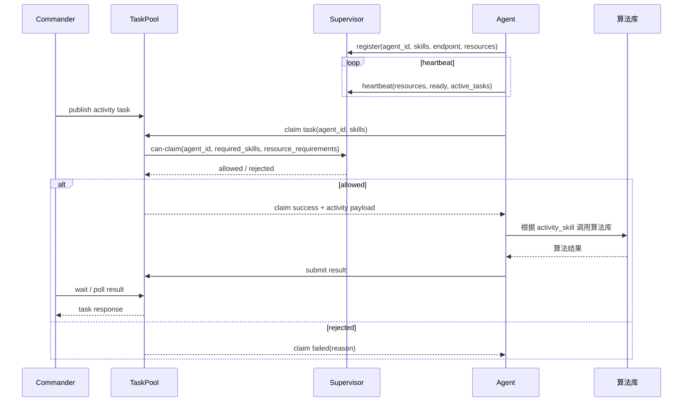

# Crowd 主模式与 Supervisor 监管系统实现说明

## 1. 职责划分

当前 crowd 主模式按四层划分：

```text
Commander：编排 BPEL，生成 activity task，发布到 TaskPool，等待结果。
TaskPool：任务池 + 结果池，负责 publish / claim / submit result。
Supervisor：Agent 注册、心跳、资源监管、状态面板、claim 准入判断。
Agent：执行任务，采集资源，上报 Supervisor，从 TaskPool claim 任务。
```

## 2. 主链路



## 3. Supervisor 管什么

Supervisor 保存 Agent 状态：

```json
{
  "agent_id": "recon-agent-01",
  "name": "Recon_Agent",
  "role": "recon",
  "endpoint": "http://127.0.0.1:8002",
  "status": "online",
  "ready": true,
  "skills": ["scan_beach_defenses"],
  "resources": {
    "resource_state": "ok",
    "system": {
      "cpu_percent": 20.0,
      "memory_percent": 30.0
    }
  },
  "active_tasks": 0,
  "max_concurrency": 1,
  "last_heartbeat_at": "..."
}
```

Supervisor 不执行任务，也不推进 workflow。它只回答 TaskPool：

```text
这个 Agent 当前能不能领取这个 task？
```

## 4. Claim 准入判断

TaskPool 在 claim 前调用 Supervisor 判断：

```text
1. Agent 是否已注册。
2. Agent 是否 online。
3. Agent ready 是否为 true。
4. required_skills 是否被 Agent skills 覆盖。
5. active_tasks 是否小于 max_concurrency。
6. resource_state 是否不是 critical。
7. resource_requirements 是否满足。
```

支持的资源需求字段：

```json
{
  "min_gpu_count": 1,
  "min_gpu_vram_gb": 8,
  "max_cpu_percent": 80,
  "max_memory_percent": 85,
  "max_disk_percent": 90,
  "max_gpu_memory_percent": 80,
  "max_gpu_utilization_percent": 80
}
```

## 5. BPEL 写法

可以在 BPEL invoke 上声明 crowd 模式和资源需求：

```xml
<invoke name="TargetIdentify"
        requiredSkill="target_identification"
        assignmentMode="crowd"
        inputVariable="ReconImage"
        outputVariable="TargetReport"
        minGpuCount="1"
        minGpuVramGb="8"
        maxCpuPercent="80"/>
```

也可以用 JSON：

```xml
<invoke name="TargetIdentify"
        requiredSkill="target_identification"
        assignmentMode="crowd"
        resourceRequirements="{&quot;min_gpu_count&quot;:1,&quot;min_gpu_vram_gb&quot;:8}"
        inputVariable="ReconImage"
        outputVariable="TargetReport"/>
```

## 6. 启动 Supervisor

可以直接启动：

```powershell
python supervisor.py --host 127.0.0.1 --port 8030
```

也可以通过 Commander 入口启动：

```powershell
python -m commander_agent.main --serve-supervisor --supervisor-port 8030
```

状态面板：

```text
http://127.0.0.1:8030/dashboard
```

API：

```text
GET  /agents
GET  /agents/{agent_id}
POST /agents/register
POST /agents/{agent_id}/heartbeat
POST /agents/{agent_id}/can-claim
POST /agents/{agent_id}/task-started
POST /agents/{agent_id}/task-finished
```

## 7. Agent 上报方式

Agent 启动时会注册到 Supervisor：

```text
agent_id
name
role
endpoint
skills
resources
ready
active_tasks
max_concurrency
```

Agent 周期性 heartbeat：

```text
resources
ready
active_tasks
max_concurrency
```

默认配置：

```powershell
$env:A2A_SUPERVISOR_ENABLED="true"
$env:A2A_SUPERVISOR_PATH="D:\A2A\.a2a_state\supervisor.json"
$env:A2A_SUPERVISOR_HEARTBEAT_INTERVAL="5"
```

如果要走 HTTP Supervisor：

```powershell
$env:A2A_SUPERVISOR_URL="http://127.0.0.1:8030"
```

## 8. TaskPool 和 Supervisor 的关系

TaskPool 仍然只管任务和结果，但 claim 前会查询 Supervisor：

```text
TaskPool：有没有任务，任务状态是什么，结果在哪里。
Supervisor：这个 Agent 当前能不能接任务。
```

如果设置：

```powershell
$env:A2A_SUPERVISOR_REQUIRED="true"
```

则未注册到 Supervisor 的 Agent 不能 claim 任务。

## 9. 当前实现文件

| 文件 | 作用 |
| --- | --- |
| `supervisor.py` | Supervisor store、HTTP API、状态面板、claim 准入判断 |
| `task_pool.py` | TaskPool publish / claim / submit result，并查询 Supervisor |
| `a2a_protocol/server.py` | Agent 注册/心跳 Supervisor，claim 前刷新资源，维护 Agent work_list |
| `bpel_workflow.py` | BPEL 解析 assignmentMode 和 resourceRequirements |
| `commander_agent/main.py` | Commander crowd/direct 双模式，支持启动 Supervisor |
| `tests/test_supervisor_taskpool.py` | Supervisor + TaskPool 核心链路测试 |

## 10. 结果流向

crowd 主模式下结果流向：

```text
Agent -> TaskPool -> Commander -> workflow context
```

Supervisor 不保存任务结果，只保存 Agent 状态和资源状态。
