# A2A 项目完整演示

> 演示目标：完整展示当前项目的 A2A 多智能体协同、BPEL 工作流、三层并发、trace、租约、分布式锁、心跳检测、熔断、故障重指派、checkpoint 恢复和 Commander 接管能力。

## 0. 演示总览

这份文档分两层：

1. **稳定主线演示**：不依赖 Docker/Nacos/Redis，适合组会现场主讲，主要展示 BPEL 流程、分支、trace、checkpoint、多 workflow 并发、租约和心跳故障重指派的模拟版。
2. **增强真实环境演示**：依赖 Nacos，有些能力需要 Redis。当前电脑已配置本地 Java 版 Nacos，不强依赖 Docker，适合时间充足时展示，或作为“项目已经支持真实分布式形态”的补充说明。

顺序：

| 顺序 | 演示内容 | 推荐命令 | 是否依赖 Docker/Nacos/Redis |
| --- | --- | --- | --- |
| 1 | 环境与 BPEL 列表 | `python commander_agent/main.py --list-workflows` | 否 |
| 2 | BPEL 成功分支 | `--mock-eval-score 75` | 否 |
| 3 | BPEL 重规划触发分支 | `--mock-eval-score 40` | 否 |
| 4 | trace 与 checkpoint 展示 | 查看 `.a2a_state/workflows/*.json` | 否 |
| 5 | 多 workflow 并发、排队、租约 | `python scripts/demo_workflow_manager.py` | 否 |
| 6 | 宕机恢复 checkpoint resume | `python scripts/demo_resume_after_restart.py --reset` | 否 |
| 7 | Commander failover/takeover | `python scripts/demo_commander_failover_resume.py --reset` | 否 |
| 8 | Agent 故障重指派与运行中心跳丢失 | `python scripts/demo_agent_failover_reassignment.py --reset` | 否 |
| 9 | 异常韧性：重试、熔断、traceback | `python scripts/demo_exception_resilience.py` | 需要 Nacos |
| 10 | 真实 Nacos 心跳超时 failover | `python scripts/demo_real_heartbeat_failover.py` | 需要 Nacos |
| 11 | Redis 分布式锁 | `python -m unittest tests.test_distributed_agent_lock` | 需要 Redis |

### 0.1 统一演示方式

不想一个个零散运行脚本，直接运行总控演示：

```powershell
python scripts/demo_full_showcase.py
```

它会串起：

```text
BPEL 成功流程
-> BPEL 低评分重规划
-> 一体化三层并发
-> checkpoint 断点恢复
-> Commander 心跳检测与 failover 接管
-> Agent 调用失败/熔断/运行中心跳丢失/晚到响应忽略
-> Nacos 增强韧性演示
-> 真实 Nacos 心跳超时 failover
```

如果不跑 Nacos 增强部分：

```powershell
python scripts/demo_full_showcase.py --skip-enhanced
```

如果 Redis 已经在 `127.0.0.1:6379` 启动，还可以加：

```powershell
python scripts/demo_full_showcase.py --include-redis
```

建议用 `demo_full_showcase.py` 串完整故事线；下面各单项脚本保留为老师追问时的展开证据。

### 0.2 Nacos 前端状态展示

当前环境可以展示 Nacos 前端：

```text
地址：http://127.0.0.1:8848/nacos/
账号：nacos
密码：nacos
```

现在原有 Nacos 演示脚本已经支持前端观察暂停。推荐这样运行完整总控演示：

```powershell
python scripts/demo_full_showcase.py --show-nacos-ui --ui-wait-enter
```

看到 `[NACOS UI]` 提示后，先切到浏览器观察 Nacos 页面；看完后回到 PowerShell 按 Enter，流程才会进入下一阶段。

或者单独运行演示九：

```powershell
powershell -ExecutionPolicy Bypass -File scripts\start_demo_infra.ps1
python scripts/demo_exception_resilience.py --show-nacos-ui --ui-wait-enter
```

演示九会停在这些 Nacos 前端可见状态：

```text
1. 7 个可控 Agent 已注册，状态 idle
2. failover-primary 调用失败后变为 unavailable，backup 完成后回到 idle
3. circuit-primary 连续失败后 circuit_state=open
4. heartbeat-primary 运行中变为 busy，带 lease_workflow_id / lease_work_item
5. 心跳丢失后 heartbeat-primary unavailable/circuit open，backup 完成重指派
```

单独运行演示十：

```powershell
powershell -ExecutionPolicy Bypass -File scripts\start_demo_infra.ps1
python scripts/demo_real_heartbeat_failover.py --show-nacos-ui --ui-wait-enter
```

如果想在 Nacos 前端稳定看到 Backup 接管后的 `busy` 状态，加上：

```powershell
python scripts/demo_real_heartbeat_failover.py --show-nacos-ui --ui-wait-enter --backup-delay-seconds 10
```

演示十会停在这些 Nacos 前端可见状态：

```text
1. Primary 和 Backup 注册成功，healthy=true，status=idle
2. Primary 接到长任务后 status=busy
3. Primary 被挂起后，Nacos 自然判定 healthy=false
4. Backup 接管后保持 busy，方便前端观察
5. Backup 完成重指派任务，最终 metadata 可检查
```

如果只想单独练习 Nacos 页面，不跑完整异常流程，可以运行专门的前端状态演示：

```powershell
powershell -ExecutionPolicy Bypass -File scripts\start_demo_infra.ps1
python scripts/demo_nacos_ui_states.py --hold-seconds 10
```

在 Nacos 前端进入：

```text
服务管理 -> 服务列表 -> DEFAULT_GROUP -> A2A-Nacos-UI-Demo -> 详情
```

如果页面没有变化，点击服务详情页里的刷新按钮，或返回服务列表再重新进入详情页；Nacos 前端有时不会自动刷新 metadata。

可以观察四个阶段：

```text
1. 两个 Recon Agent 都是 idle
2. Primary 变为 busy，并带有 lease_workflow_id / lease_work_item
3. Primary 变为 unavailable，带有 unavailable_reason、AGENT_HEARTBEAT_LOST、circuit_state=open；Backup 变为 busy
4. 两个 Agent 恢复 idle
```

## 1. 项目一句话介绍

本项目是一个 **A2A 多智能体协同工作流控制面**。它以抢滩登陆为业务场景，用 Commander Agent 负责任务编排，用 BPEL 描述流程，用 A2A 协议连接不同角色 Agent，并通过 checkpoint、租约、心跳、熔断和 failover 机制提升流程可靠性。

## 2. 核心模块与能力矩阵

| 能力 | 说明 | 关键文件/脚本 |
| --- | --- | --- |
| BPEL 工作流 | 用 XML 定义流程、条件分支和并发派发 | `beachhead_workflow.bpel`, `bpel_workflow.py` |
| A2A 调用 | discovery、auth、sendMessage、sendMessageStream | `a2a_protocol/`, `commander_agent/main.py` |
| Local 模式 | 本地模拟 Agent，不依赖外部服务 | `local_runtime.py` |
| Remote 模式 | 通过 Nacos 发现真实 Agent | `registry/nacos_manager.py` |
| trace | 记录 workflow、activity、agent 调用、异常、failover 事件 | `observability.py`, checkpoint JSON |
| checkpoint | workflow 状态落盘，支持 resume/takeover | `workflow_state_store.py` |
| 多 workflow 并发 | Manager 线程池同时推进多条 workflow | `commander_agent/workflow_manager.py` |
| activity 并发 | BPEL flow/DAG 内部多个 activity 并行 | `commander_agent/main.py` |
| 同角色 Agent 并发 | `dispatchMode="parallel"` 时同一任务派发给多个同类 Agent | `delegate_parallel_task` |
| Agent 租约 | `idle -> busy -> idle/unavailable`，避免重复领取 | `commander_agent/agent_leases.py` |
| 分布式锁 | Redis 锁防止多个 Manager 抢同一个 Agent | `commander_agent/distributed_lock.py` |
| 心跳检测 | Agent 注册后持续 heartbeat，Commander 过滤过期实例 | `registry/nacos_manager.py` |
| 运行中心跳丢失重指派 | Agent 执行中失去心跳，Commander 释放租约并找 backup | `demo_agent_failover_reassignment.py` |
| 熔断 | 连续失败后 open circuit，暂时不再派发到故障 Agent | `commander_agent/circuit_breaker.py` |
| Commander 宕机恢复 | 新 Commander 根据 checkpoint resume/takeover | `recovery_api.py`, demo 脚本 |

## 3. 总体架构图

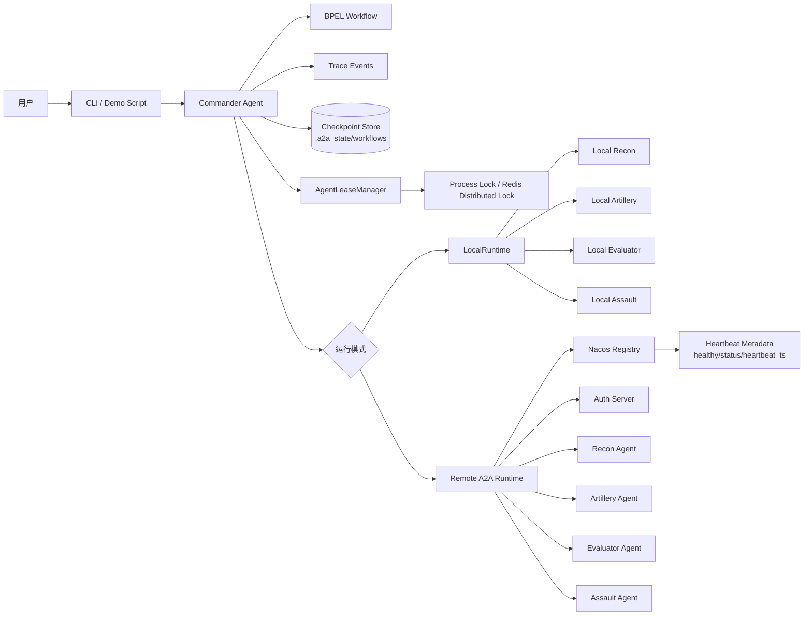
```mermaid
flowchart LR
    User[用户] --> CLI[CLI / Demo Script]
    CLI --> Commander[Commander Agent]
    Commander --> BPEL[BPEL Workflow]
    Commander --> Trace[Trace Events]
    Commander --> State[(Checkpoint Store<br/>.a2a_state/workflows)]
    Commander --> Lease[AgentLeaseManager]
    Lease --> Lock[Process Lock / Redis Distributed Lock]
    Commander --> Runtime{运行模式}

    Runtime --> Local[LocalRuntime]
    Local --> LR[Local Recon]
    Local --> LA[Local Artillery]
    Local --> LE[Local Evaluator]
    Local --> LS[Local Assault]

    Runtime --> Remote[Remote A2A Runtime]
    Remote --> Nacos[Nacos Registry]
    Remote --> Auth[Auth Server]
    Remote --> Recon[Recon Agent]
    Remote --> Artillery[Artillery Agent]
    Remote --> Evaluator[Evaluator Agent]
    Remote --> Assault[Assault Agent]

    Nacos --> Heartbeat[Heartbeat Metadata<br/>healthy/status/heartbeat_ts]
```

重点：

> Local 模式用来稳定展示流程控制能力；Remote 模式用 Nacos 和真实 HTTP Agent 展示分布式部署能力。两者共用 Commander、BPEL、trace、checkpoint、租约和异常处理逻辑。

## 4. 三层并发：

| 层级 | 控制对象 | 控制参数/机制 | 示例 |
| --- | --- | --- | --- |
| 第一层：多 workflow 并发 | 多条完整 workflow 同时跑 | `CommanderWorkflowManager(max_workflows)` | 同时推进 beachhead、reinforced、quick 三个 workflow |
| 第二层：workflow 内 activity 并发 | 一条 BPEL 内多个 activity 并行 | `max_activity_workers`，BPEL `flow`/DAG | 多个互不依赖 activity 并发执行 |
| 第三层：同 role Agent 并发 | 一个 activity 派发给多个同类 Agent | `dispatchMode="parallel"`，`max_agent_workers` | 一个 artillery 任务并发派给多个炮兵 Agent |

### 4.1 三层并发总图

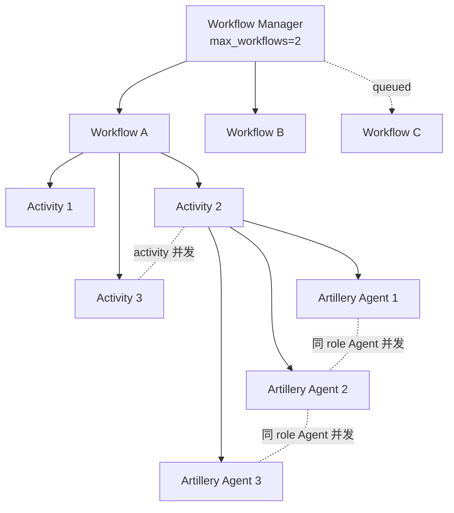
```mermaid
flowchart TD
    Manager[Workflow Manager<br/>max_workflows=2] --> WF1[Workflow A]
    Manager --> WF2[Workflow B]
    Manager -. queued .-> WF3[Workflow C]

    WF1 --> A1[Activity 1]
    WF1 --> A2[Activity 2]
    WF1 --> A3[Activity 3]
    A2 -. activity 并发 .- A3

    A2 --> P1[Artillery Agent 1]
    A2 --> P2[Artillery Agent 2]
    A2 --> P3[Artillery Agent 3]
    P1 -. 同 role Agent 并发 .- P2
    P2 -. 同 role Agent 并发 .- P3
```

讲解：

> 多 workflow 并发解决的是“同时处理几条流程”；activity 并发解决的是“一条流程里互不依赖的步骤能否并行”；同 role Agent 并发解决的是“同一个步骤能否调多个同类 Agent 协同执行”。三者控制粒度不同，互不替代。

## 5. 准备

打开 PowerShell：

```powershell
cd D:\AI\A2A
conda activate a2a
```

验证依赖：

```powershell
python -c "import fastapi, uvicorn, pydantic, requests, redis, nacos, sseclient; print('OK')"
```

列出 BPEL：

```powershell
python commander_agent/main.py --list-workflows
```

输出：

```text
Available BPEL workflows:
- BeachheadAssaultWorkflow: D:\AI\A2A\beachhead_workflow.bpel
- QuickStrikeWorkflow: D:\AI\A2A\quick_strike_workflow.bpel
- ReinforcedBeachheadWorkflow: D:\AI\A2A\reinforced_beachhead_workflow.bpel
```

## 6. 演示一：BPEL 基础成功分支

命令：

```powershell
python commander_agent/main.py --mode local --workflow bpel --workflow-file beachhead_workflow --mock-eval-score 75
```

演示内容：

```text
Recon -> Artillery -> Evaluator -> Assault -> completed
```

为什么会成功：

- `beachhead_workflow.bpel` 中设置了 `EvalScore < 60` 才进入重规划分支。
- 这里 mock 分数是 75，大于 60。
- 所以 case 分支被 skipped，otherwise 分支被执行。
- Assault Agent 完成 `captureBeachhead`。
- 最终 `workflow_status=completed`。

成功分支时序图：

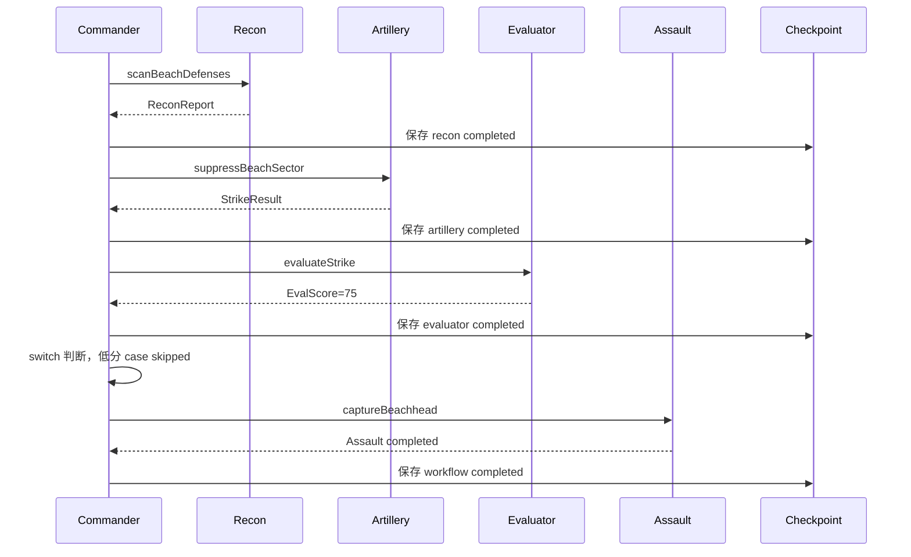
```mermaid
sequenceDiagram
    participant C as Commander
    participant R as Recon
    participant F as Artillery
    participant E as Evaluator
    participant A as Assault
    participant S as Checkpoint

    C->>R: scanBeachDefenses
    R-->>C: ReconReport
    C->>S: 保存 recon completed
    C->>F: suppressBeachSector
    F-->>C: StrikeResult
    C->>S: 保存 artillery completed
    C->>E: evaluateStrike
    E-->>C: EvalScore=75
    C->>S: 保存 evaluator completed
    C->>C: switch 判断，低分 case skipped
    C->>A: captureBeachhead
    A-->>C: Assault completed
    C->>S: 保存 workflow completed
```

输出：

```text
[LOCAL DISCOVERY]
[LOCAL AUTH]
[LOCAL STREAM] Receiving task updates from 'artillery'
"eval_score": 75
"workflow_status": "completed"
"completed_roles": ["recon", "artillery", "evaluator", "assault"]
```

## 7. 演示二：BPEL 重规划触发分支

命令：

```powershell
python commander_agent/main.py --mode local --workflow bpel --workflow-file beachhead_workflow --mock-eval-score 40
```

演示内容：

```text
Recon -> Artillery -> Evaluator -> LLMCommanderAgent analyzeAndReplanning -> throw fault -> paused
```

注意：当前版本演示的是 **重规划触发点**，不是完整自动二次计划执行器。

当前 BPEL 低分分支是：

```xml
<case condition="bpws:getVariableData('EvalScore') &lt; 60">
    <sequence>
        <invoke partnerLink="LLMCommanderAgent" operation="analyzeAndReplanning"
                inputVariable="ReconReport + StrikeResult" outputVariable="CommanderDecision"/>
        <throw faultName="InsufficientSuppressionFault"/>
    </sequence>
</case>
```

因此实际含义是：

```text
发现压制效果不足
-> Commander 生成 CommanderDecision=RE-PLAN
-> 抛出 InsufficientSuppressionFault
-> 暂停当前突击流程
-> checkpoint 保存当前上下文
-> 等待人工接管、resume、takeover，或切换到强化 workflow
```

低分分支时序图：

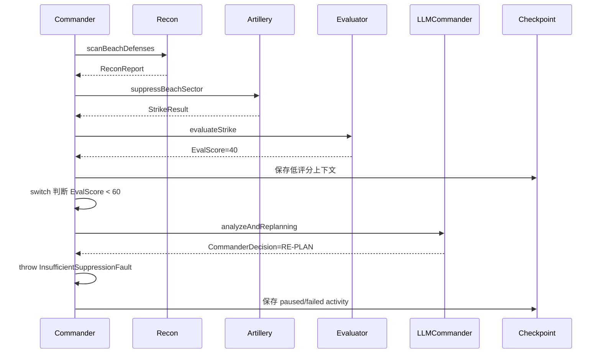
```mermaid
sequenceDiagram
    participant C as Commander
    participant R as Recon
    participant F as Artillery
    participant E as Evaluator
    participant L as LLMCommander
    participant S as Checkpoint

    C->>R: scanBeachDefenses
    R-->>C: ReconReport
    C->>F: suppressBeachSector
    F-->>C: StrikeResult
    C->>E: evaluateStrike
    E-->>C: EvalScore=40
    C->>S: 保存低评分上下文
    C->>C: switch 判断 EvalScore < 60
    C->>L: analyzeAndReplanning
    L-->>C: CommanderDecision=RE-PLAN
    C->>C: throw InsufficientSuppressionFault
    C->>S: 保存 paused/failed activity
```

“具体怎么重规划”：

> 当前版本已经实现“识别失败、生成重规划决策、暂停原流程、保存 checkpoint”。它没有继续把 bomber support 或二次侦察写成新的 BPEL 节点。后续可以有两种扩展：一种是在低分后切换到 `reinforced_beachhead_workflow.bpel`；另一种是在 BPEL 中继续添加 bomber、二次 recon、二次 artillery 和再次 evaluate 节点。

## 8. 演示三：trace 与 checkpoint 展示

每次 workflow 都会写入：

```text
D:\AI\A2A\.a2a_state\workflows\<workflow_id>.json
```

可以打开最近生成的 checkpoint：

```powershell
Get-ChildItem .a2a_state\workflows | Sort-Object LastWriteTime -Descending | Select-Object -First 3
```

查看某个 checkpoint：

```powershell
notepad .a2a_state\workflows\<workflow_id>.json
```

重点看这些字段：

| 字段 | 说明 |
| --- | --- |
| `workflow_id` | 工作流唯一 ID |
| `status` / `workflow_status` | 当前 workflow 状态 |
| `current_activatity` | 当前或最后执行的 activity |
| `work_list` | BPEL 解析后的工作项列表 |
| `trace` | 完整事件轨迹 |
| `completed_roles` | 已完成角色 |
| `agent_results` | 每个 Agent 调用结果 |
| `last_error_details` | 异常诊断和 traceback |

trace 事件流示意：

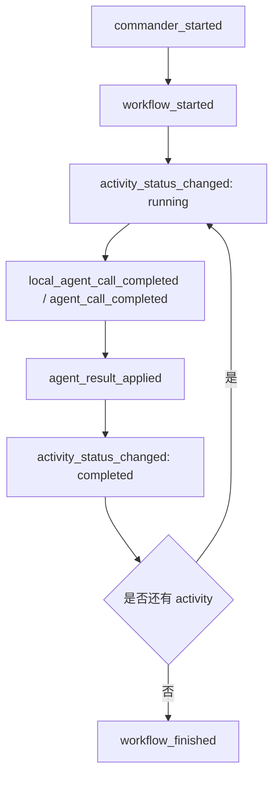
```mermaid
flowchart TD
    A[commander_started] --> B[workflow_started]
    B --> C[activity_status_changed: running]
    C --> D[local_agent_call_completed / agent_call_completed]
    D --> E[agent_result_applied]
    E --> F[activity_status_changed: completed]
    F --> G{是否还有 activity}
    G -- 是 --> C
    G -- 否 --> H[workflow_finished]
```

讲解：

> trace 是这个项目的观测基础。它记录了 Commander 启动、workflow 开始、activity 状态变化、Agent 调用完成、失败、心跳丢失、重指派、熔断等事件。checkpoint 不只是保存结果，也保存了可追溯过程。

## 9. 演示四：Workflow Manager 多 workflow 并发、租约、独立 checkpoint

命令：

```powershell
python scripts/demo_workflow_manager.py
```

这个脚本不依赖 Nacos。它分三段：

1. **Agent 租约和资源锁**：一个 Agent 被 `wf-alpha` 占用后，`wf-beta` 不能抢占；释放后才能重新领取。
2. **常驻 Workflow Manager**：启动本地 Manager HTTP 服务。
3. **三条 workflow 并发/排队**：默认提交三个 workflow，`max_workflows=2`，所以会看到两个 running，一个 queued。

关键输出：

```text
=== PHASE 1: AGENT LEASE AND RESOURCE LOCK ===
[INITIAL] ... status=idle
[ACQUIRE] workflow=wf-alpha ... status=busy
[LOCK] workflow=wf-beta acquire_result=None
[RELEASE] workflow=wf-alpha status=idle
[REACQUIRE] workflow=wf-beta ... status=busy
[PASS] Agent returned to status=idle

=== PHASE 2：常驻 Workflow Manager 多流程并发 ===
[MANAGER] url=http://127.0.0.1:<port> mode=local max_workflows=2
[SUBMIT] ...
[STATUS] ...

=== PHASE 3: INDEPENDENT CHECKPOINTS ===
[CHECKPOINT] ...
[PASS] queued state, concurrent execution, and independent checkpoints verified.

验证：
1. Agent 租约/资源锁有效
2. Workflow Manager 可以并发运行多个 workflow，并对超出的任务排队
3. 每个 workflow 都有独立 checkpoint
```

多 workflow 并发时序图：

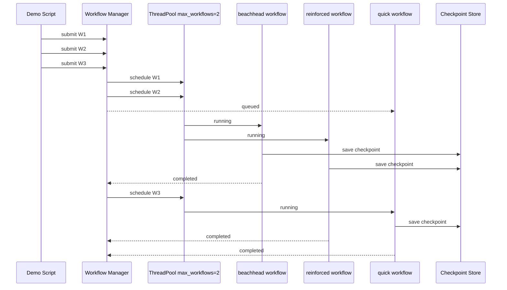
```mermaid
sequenceDiagram
    participant D as Demo Script
    participant M as Workflow Manager
    participant P as ThreadPool max_workflows=2
    participant W1 as beachhead workflow
    participant W2 as reinforced workflow
    participant W3 as quick workflow
    participant S as Checkpoint Store

    D->>M: submit W1
    D->>M: submit W2
    D->>M: submit W3
    M->>P: schedule W1
    M->>P: schedule W2
    M-->>W3: queued
    P->>W1: running
    P->>W2: running
    W1->>S: save checkpoint
    W2->>S: save checkpoint
    W1-->>M: completed
    M->>P: schedule W3
    P->>W3: running
    W3->>S: save checkpoint
    W2-->>M: completed
    W3-->>M: completed
```

租约状态变化图：

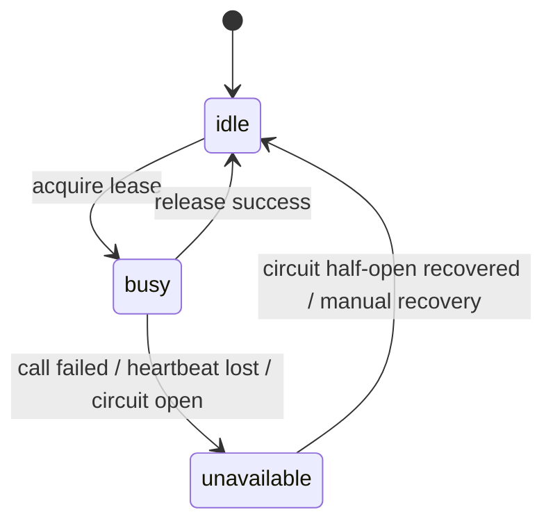
```mermaid
stateDiagram-v2
    [*] --> idle
    idle --> busy: acquire lease
    busy --> idle: release success
    busy --> unavailable: call failed / heartbeat lost / circuit open
    unavailable --> idle: circuit half-open recovered / manual recovery
```

讲解：

> 多 workflow 并发由 Workflow Manager 的线程池控制；Agent 是否可用由租约控制。租约会把 Agent metadata 从 idle 改成 busy，防止另一个 workflow 同时使用同一个 Agent。执行完成后释放回 idle。

## 10.Commander 宕机恢复机制，checkpoint resume

```powershell
同一个 workflow 执行到一半，状态写入 checkpoint，然后重新启动 Commander，新 Commander 读取 checkpoint，从中断点继续执行
证明：
断点续跑，workflow 状态能保存，进程重启后能接着跑，不会从头执行 recon、artillery
```

命令：

```powershell
python scripts/demo_resume_after_restart.py --reset
```

这个脚本演示的是 Commander 进程中断后的恢复：

```text
第一阶段：Commander 1 启动 workflow，执行前几步并保存 checkpoint
第二阶段：进程重启，Commander 2 使用同一个 workflow_id resume
第三阶段：Commander 2 从 checkpoint 继续执行直到完成
```

恢复时序图：

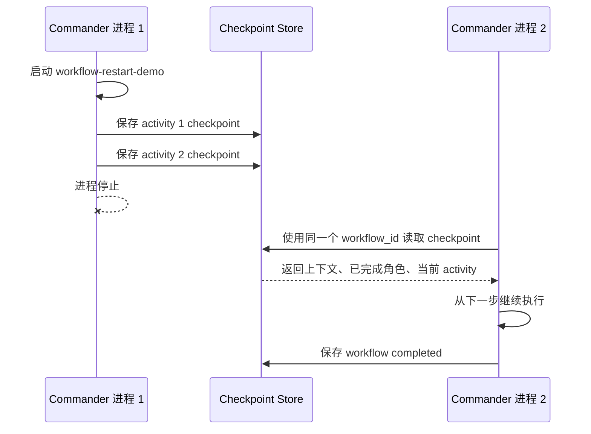
```mermaid
sequenceDiagram
    participant C1 as Commander 进程 1
    participant S as Checkpoint Store
    participant C2 as Commander 进程 2

    C1->>C1: 启动 workflow-restart-demo
    C1->>S: 保存 activity 1 checkpoint
    C1->>S: 保存 activity 2 checkpoint
    C1--xC1: 进程停止
    C2->>S: 使用同一个 workflow_id 读取 checkpoint
    S-->>C2: 返回上下文、已完成角色、当前 activity
    C2->>C2: 从下一步继续执行
    C2->>S: 保存 workflow completed
```

输出：

```text
[PHASE 1] Start a fresh workflow and stop halfway.
"label": "after_first_run"

[PHASE 2] Simulate a process restart and resume the same workflow id.
"label": "after_resume"
```

讲解：

> 宕机恢复依赖 workflow_id 和 checkpoint。第一次运行不会把状态只放在内存里，而是把上下文写到 `.a2a_state/workflows`。第二次启动 Commander 时指定同一个 workflow_id，就能恢复执行位置。

## 12. 演示七：Commander failover / takeover

```
先启动 primary Commander API，通过 heartbeat 检查 primary 是否存活
模拟 primary Commander 宕机，检测到连续心跳失败，启动 failover Commander
failover Commander 读取 checkpoint
接管并继续执行 workflow
证明：
不仅能从 checkpoint 恢复，还能在 Commander 宕机后由另一个 Commander 接管
```

命令：

```powershell
python scripts/demo_commander_failover_resume.py --reset
```

内容：

```text
Primary Commander 先执行部分 workflow
-> checkpoint 已写入磁盘
-> 模拟 Primary Commander 不可用
-> Backup Commander Recovery API 在新端口启动
-> Backup 读取同一个 checkpoint
-> resume/takeover 后继续执行
```

Commander 接管时序图：

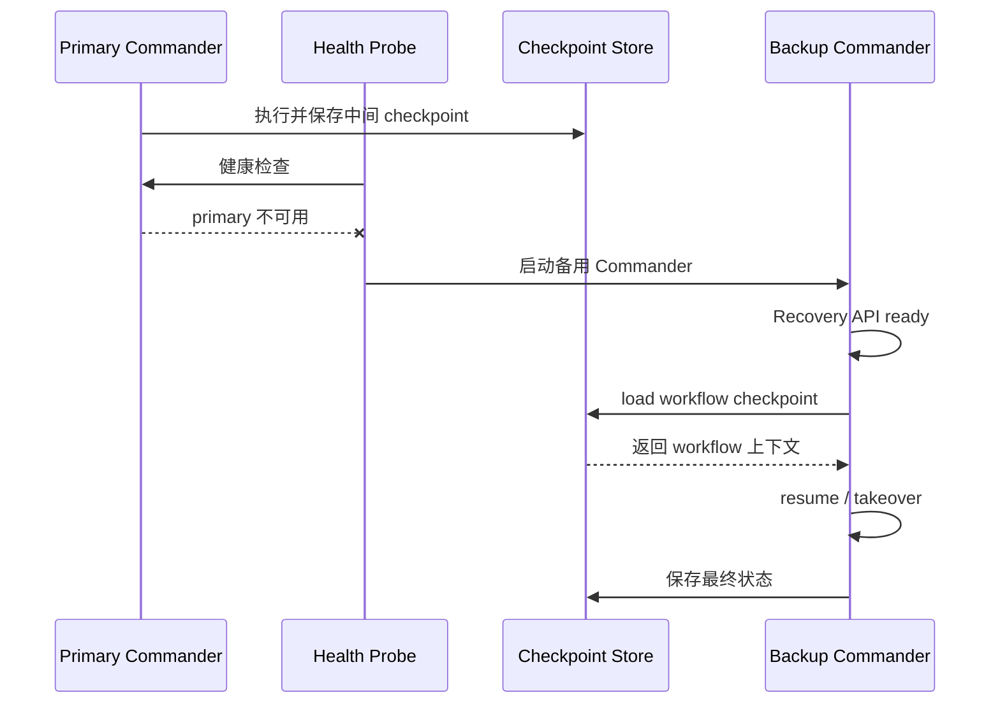
```mermaid
sequenceDiagram
    participant P as Primary Commander
    participant H as Health Probe
    participant S as Checkpoint Store
    participant B as Backup Commander

    P->>S: 执行并保存中间 checkpoint
    H->>P: 健康检查
    P--xH: primary 不可用
    H->>B: 启动备用 Commander
    B->>B: Recovery API ready
    B->>S: load workflow checkpoint
    S-->>B: 返回 workflow 上下文
    B->>B: resume / takeover
    B->>S: 保存最终状态
```

讲解：

> 第 11 节是“同一个 Commander 逻辑重启后 resume”，第 12 节是“另一个 Commander 进程接管”。核心都是 checkpoint，但 failover 演示更接近主备控制面。

## 13. 演示八：Agent 故障重指派、运行中心跳丢失、晚到响应拒绝

命令：

```powershell
python scripts/demo_agent_failover_reassignment.py --reset
```

两个 Recon Agent：

```text
Recon_Primary
Recon_Backup
```

它分两个大场景。

### 12.1 场景 A：调用失败后的同类 Agent 重指派

过程：

Commander 先把 recon 任务租给主 Agent，主 Agent 调用失败后被熔断隔离，Commander 释放租约并重新选择备用 Agent，备用 Agent 完成任务，最终 workflow 没有失败，只是完成了一次同角色 Agent failover。

```text
Commander 尝试调用 Recon_Primary
-> Recon_Primary 模拟 connection refused
-> Commander 标记 Primary unavailable
-> Commander 释放/隔离 Primary
-> Commander 找同 role 的 Recon_Backup
-> Recon_Backup 完成任务
-> checkpoint 保存 Backup 结果
```

时序图：

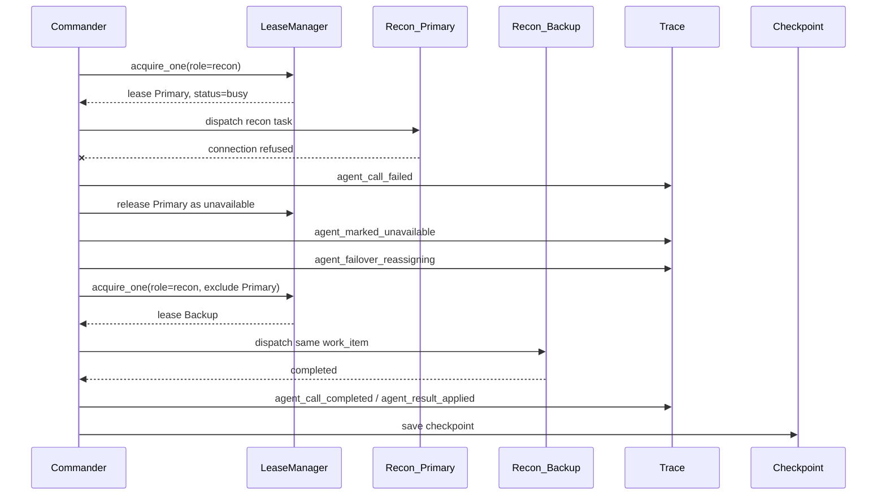
```mermaid
sequenceDiagram
    participant C as Commander
    participant L as LeaseManager
    participant P as Recon_Primary
    participant B as Recon_Backup
    participant T as Trace
    participant S as Checkpoint

    C->>L: acquire_one(role=recon)
    L-->>C: lease Primary, status=busy
    C->>P: dispatch recon task
    P--xC: connection refused
    C->>T: agent_call_failed
    C->>L: release Primary as unavailable
    C->>T: agent_marked_unavailable
    C->>T: agent_failover_reassigning
    C->>L: acquire_one(role=recon, exclude Primary)
    L-->>C: lease Backup
    C->>B: dispatch same work_item
    B-->>C: completed
    C->>T: agent_call_completed / agent_result_applied
    C->>S: save checkpoint
```

重点输出：

```text
[DOWN] Recon_Primary is down; simulated connection refused.
[RECOVERED] Recon_Backup accepted and completed the reassigned task.
[PHASE 5] Failover trace
[PASS] Down Agent was isolated and the task was reassigned.
```

### 12.2 场景 B：运行中心跳丢失后重指派

过程：

```text
Commander 已经把任务派给 Primary
-> Primary 执行中 heartbeat_ts 变旧
-> Commander 的 lease heartbeat watcher 判断租约不新鲜
-> 触发 agent_heartbeat_lost
-> Commander 重新指派 Backup
-> Primary 后来返回结果，但已经失去租约
-> late response 被拒绝
```

运行中心跳丢失时序图：

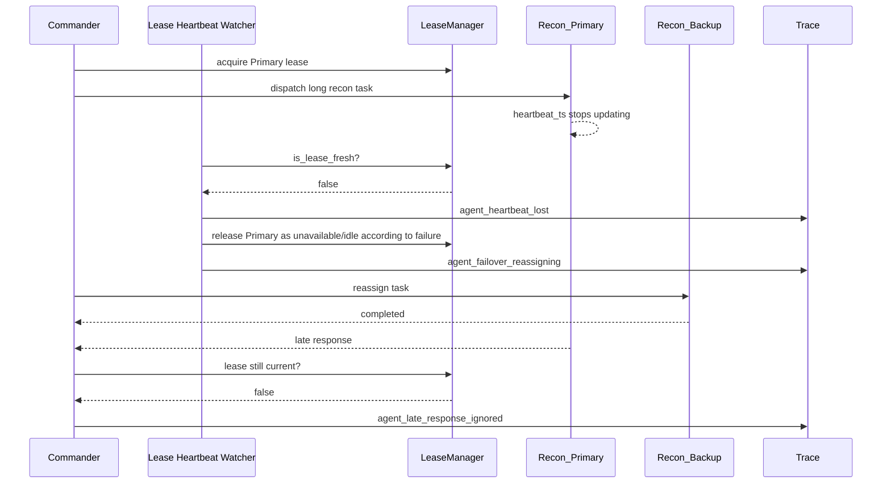
```mermaid
sequenceDiagram
    participant C as Commander
    participant Watcher as Lease Heartbeat Watcher
    participant L as LeaseManager
    participant P as Recon_Primary
    participant B as Recon_Backup
    participant T as Trace

    C->>L: acquire Primary lease
    C->>P: dispatch long recon task
    P-->>P: heartbeat_ts stops updating
    Watcher->>L: is_lease_fresh?
    L-->>Watcher: false
    Watcher->>T: agent_heartbeat_lost
    Watcher->>L: release Primary as unavailable/idle according to failure
    Watcher->>T: agent_failover_reassigning
    C->>B: reassign task
    B-->>C: completed
    P-->>C: late response
    C->>L: lease still current?
    L-->>C: false
    C->>T: agent_late_response_ignored
```

重点输出：

```text
[HEARTBEAT LOST] Recon_Primary stops heartbeating while task is running.
[IGNORED] Recon_Primary late result was rejected by lease/heartbeat guard.
[RECOVERED] Recon_Backup completed after heartbeat-triggered reassignment.
[PASS] Active heartbeat loss triggered reassignment before the original call returned.
```

讲解：

> 这里展示的是 Agent 级恢复，不是 Commander 宕机恢复。Primary 开始执行后失去心跳，Commander 的 active lease watcher 会发现租约不再 fresh，于是当前 Commander 直接重指派同 role Backup。Primary 后面即使返回，结果也会因为租约失效被拒绝，避免旧结果覆盖新结果。只有当 Commander 自己也挂了，才需要第 11/12 节的 checkpoint resume 或 takeover。

## 14. 演示九：熔断机制、自动重试、traceback，增强版

这个演示需要 Nacos、auth mock 和多个真实可控 Agent。当前电脑已配置好：

```text
Nacos: D:\tools\nacos
Auth mock: scripts/mock_auth_server.py
启动脚本: scripts/start_demo_infra.ps1
停止脚本: scripts/stop_demo_infra.ps1
```

先启动基础服务：

```powershell
powershell -ExecutionPolicy Bypass -File scripts\start_demo_infra.ps1
```

然后运行：

```powershell
python scripts/demo_exception_resilience.py
python scripts/demo_exception_resilience.py --show-nacos-ui --ui-wait-enter
```

这个脚本覆盖：

1. 7 个可控 Agent 已注册，状态 idle
2. failover-primary 调用失败后变为 unavailable，backup 完成后回到 idle
3. circuit-primary 连续失败后 circuit_state=open
4. heartbeat-primary 运行中变为 busy，带 lease_workflow_id / lease_work_item
5. 心跳丢失后 heartbeat-primary unavailable/circuit open，backup 完成重指派

| 阶段 | 能力 | 说明 |
| --- | --- | --- |
| 1 | 自动重试 | 第一次 HTTP 失败，第二次成功 |
| 2 | 同类 Agent failover | primary 一直失败，backup 成功 |
| 3 | 熔断与半开恢复 | 连续失败后 circuit open，期间拒绝请求；超时后 half-open 探测恢复 |
| 4 | 租约 busy、心跳丢失、晚到响应忽略 | 运行中故障重指派 |
| 5 | traceback | Commander trace 和 Agent 日志保留异常诊断 |

熔断机制时序图：

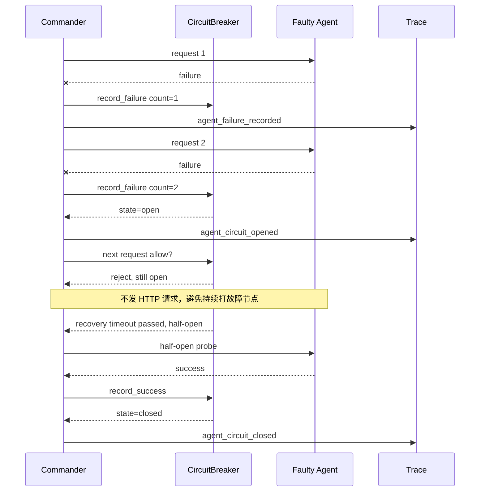
```mermaid
sequenceDiagram
    participant C as Commander
    participant CB as CircuitBreaker
    participant A as Faulty Agent
    participant T as Trace

    C->>A: request 1
    A--xC: failure
    C->>CB: record_failure count=1
    C->>T: agent_failure_recorded
    C->>A: request 2
    A--xC: failure
    C->>CB: record_failure count=2
    CB-->>C: state=open
    C->>T: agent_circuit_opened
    C->>CB: next request allow?
    CB-->>C: reject, still open
    Note over C,A: 不发 HTTP 请求，避免持续打故障节点
    CB-->>C: recovery timeout passed, half-open
    C->>A: half-open probe
    A-->>C: success
    C->>CB: record_success
    CB-->>C: state=closed
    C->>T: agent_circuit_closed
```

结果摘要：

```text
[RETRY] success=True attempts=2
[FAILOVER] success=True targets=[primary, backup]
[CIRCUIT] blocked=True recovered=True
[HEARTBEAT] success=True busy_seen=True
[TRACEBACK] commander=True agent=True
[PASS] All resilience mechanisms were observed
```

生成报告：

```text
.a2a_state/exception_resilience_demo/outputs/summary.json
.a2a_state/exception_resilience_demo/outputs/commander.log
.a2a_state/exception_resilience_demo/outputs/report.md
```

讲解：

> 熔断和 failover 不一样。failover 是某次调用失败后换 backup；熔断是某个实例连续失败后，短时间内不再尝试它，避免重复打故障节点。恢复窗口到达后会进入 half-open，用一次探测请求判断能否恢复。

## 15. 演示十：真实 Nacos 心跳超时 failover，增强版

先确认 Nacos 已启动：

```powershell
powershell -ExecutionPolicy Bypass -File scripts\start_demo_infra.ps1
```

运行：

```powershell
python scripts/demo_real_heartbeat_failover.py
python scripts/demo_real_heartbeat_failover.py --startup-timeout 60 --unhealthy-timeout 45 --show-nacos-ui --ui-wait-enter --backup-delay-seconds 10
```

这个脚本展示真实 Nacos 心跳：

1. Primary 和 Backup 注册成功，healthy=true，status=idle
2. Primary 接到长任务后 status=busy
3. Primary 被挂起后，Nacos 自然判定 healthy=false
4. Backup 接管后保持 busy，方便前端观察
5. Backup 完成重指派任务，最终 metadata 可检查

```text
启动 Primary Agent 和 Backup Agent
-> 两者注册到 Nacos
-> Primary 每 1 秒发送真实 heartbeat
-> Commander 把任务派给 Primary
-> Primary 被挂起，HTTP 任务和 heartbeat 线程都被冻结
-> Nacos 自然判定 Primary healthy=false
-> Commander trace 记录 agent_heartbeat_lost
-> Commander 重指派 Backup
-> Backup 完成任务
```

真实心跳 failover 时序图：

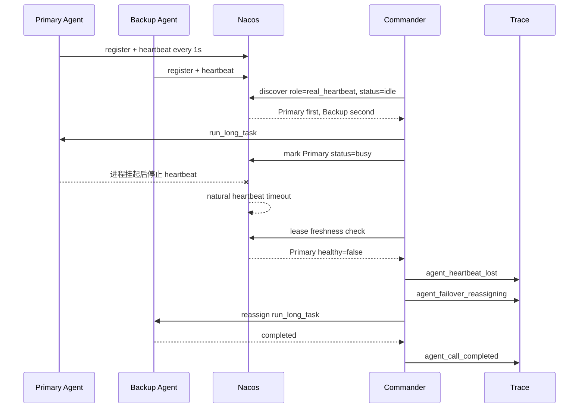
```mermaid
sequenceDiagram
    participant P as Primary Agent
    participant B as Backup Agent
    participant N as Nacos
    participant C as Commander
    participant T as Trace

    P->>N: register + heartbeat every 1s
    B->>N: register + heartbeat
    C->>N: discover role=real_heartbeat, status=idle
    N-->>C: Primary first, Backup second
    C->>P: run_long_task
    C->>N: mark Primary status=busy
    P--xN: 进程挂起后停止 heartbeat
    N-->>N: natural heartbeat timeout
    C->>N: lease freshness check
    N-->>C: Primary healthy=false
    C->>T: agent_heartbeat_lost
    C->>T: agent_failover_reassigning
    C->>B: reassign run_long_task
    B-->>C: completed
    C->>T: agent_call_completed
```

输出：

```text
[HEARTBEAT] Primary -> Nacos
[FAULT] NtSuspendProcess Primary
[NACOS] Primary healthy=false after ...
[COMMANDER] heartbeat lost
[FAILOVER] release Primary and find same-role backup
[DISPATCH] Commander -> Backup
[COMPLETE] Backup finished task
[PASS] All natural heartbeat checks passed
```

报告位置：

```text
.a2a_state/real_heartbeat_demo/outputs/report.md
.a2a_state/real_heartbeat_demo/outputs/summary.json
.a2a_state/real_heartbeat_demo/outputs/commander.log
```

## 16. 演示十一：Redis 分布式锁

分布式锁用于多个 Manager 进程同时存在时，防止它们因为 Nacos metadata 读取延迟或 stale snapshot 而同时领取同一个 Agent。

需要 Redis：

```powershell
docker run -d --name a2a-redis -p 6379:6379 redis:7
```

运行测试演示：

```powershell
python -m unittest tests.test_distributed_agent_lock
```

这个测试覆盖：

| 测试 | 说明 |
| --- | --- |
| `test_two_managers_cannot_lease_the_same_stale_instance` | 两个 Manager 看见同一个 stale idle Agent，只有一个能拿到 Redis 锁 |
| `test_expired_owner_cannot_delete_a_new_owners_lock` | 旧 owner 的 token 不能删除新 owner 的锁 |
| `test_renewal_keeps_long_running_lease_alive` | 长任务期间自动续约 |
| `test_expired_redis_lock_recovers_stale_nacos_busy_state` | Redis 锁过期后可以回收 stale busy metadata |

分布式锁时序图：

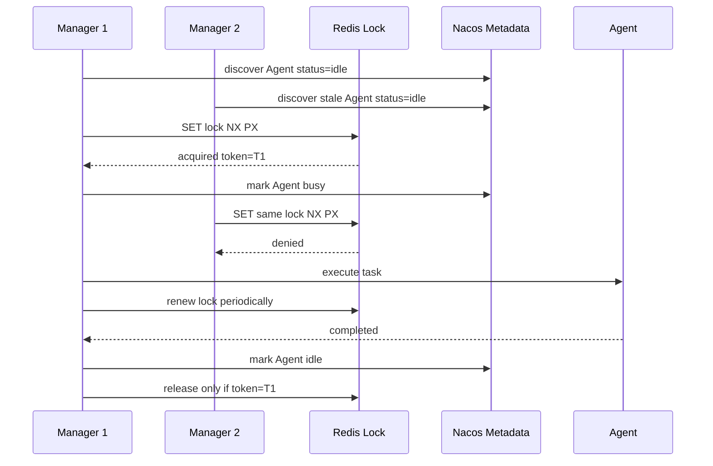
```mermaid
sequenceDiagram
    participant M1 as Manager 1
    participant M2 as Manager 2
    participant R as Redis Lock
    participant N as Nacos Metadata
    participant A as Agent

    M1->>N: discover Agent status=idle
    M2->>N: discover stale Agent status=idle
    M1->>R: SET lock NX PX
    R-->>M1: acquired token=T1
    M1->>N: mark Agent busy
    M2->>R: SET same lock NX PX
    R-->>M2: denied
    M1->>A: execute task
    M1->>R: renew lock periodically
    A-->>M1: completed
    M1->>N: mark Agent idle
    M1->>R: release only if token=T1
```

讲解：

> Nacos metadata 适合展示状态，但分布式环境中可能存在读取延迟。Redis 锁是强互斥层，真正保证多个 Manager 不会同时领取同一个 Agent。释放锁时会校验 token，防止旧 owner 误删新 owner 的锁。

## 17. activity 并发和 Agent 并发演示

三层并发综合演示：

```powershell
python scripts/demo_three_layer_concurrency.py
```

这条命令会连续验证：

```text
1. 同 role Agent 并发：一个 artillery activity 同时派给多个 artillery Agent
2. activity 并发：一个 BPEL flow 内 recon/evaluator 两个互不依赖 activity 并行
3. 多 workflow 并发：Manager 同时运行 2 条 workflow，第 3 条进入 queued
```

关键输出：

```text
[OBSERVED] max_parallel_agent_calls=3
[OBSERVED] max_parallel_activities=2
[STATUS] demo-manager-beachhead=running | demo-manager-reinforced=running | demo-manager-quick=queued
[PASS] workflow manager enforced running/queued concurrency limit
```

如果把三层并发放进**同一个大场景**里演示，运行：

```powershell
python scripts/demo_integrated_concurrency.py
```

这个一体化脚本会同时提交 3 条 workflow，但只允许 2 条 workflow 并发运行；每条 workflow 内部包含一个 BPEL `flow`，让 artillery activity 和 evaluator activity 并发；其中 artillery activity 又会并发派发给 3 个 artillery Agent。

关键输出：

```text
[WORKFLOW] integrated-wf-1 admitted_after_ms=0.0
[WORKFLOW] integrated-wf-2 admitted_after_ms=0.0
[WORKFLOW] integrated-wf-3 admitted_after_ms=488.0
[OBSERVED] max_parallel_workflows=2
[OBSERVED] max_parallel_activities=4
[OBSERVED] max_parallel_agent_calls=6
[PASS] integrated demo observed all three concurrency layers in one run
```

解释：

```text
max_parallel_workflows=2：调度层最多同时放行 2 条 workflow。
max_parallel_activities=4：因为有 2 条 workflow 同时运行，每条 workflow 内部同时跑 2 个 activity，所以全局看到 4 个 activity。
max_parallel_agent_calls=6：因为有 2 条 workflow 同时运行，每条 workflow 的 artillery activity 并发调用 3 个 Agent，所以全局看到 6 个 Agent 调用。
```

### 16.1 同 role Agent 并发

在 `beachhead_workflow.bpel` 中：

```xml
<invoke partnerLink="ArtilleryAgent" operation="suppressBeachSector"
        dispatchMode="parallel"
        inputVariable="StrikeCoordinates" outputVariable="StrikeResult"/>
```

含义：

```text
这个 artillery activity 可以找多个 role=artillery 的 Agent 并发执行。
```

Local 模式里只有一个本地 Artillery Agent，所以主要展示 `dispatchMode=parallel` 和 stream；Remote 模式或测试中有多个 artillery 实例时，会用 `ThreadPoolExecutor(max_agent_workers)` 并发派发。

同 role Agent 并发时序图：

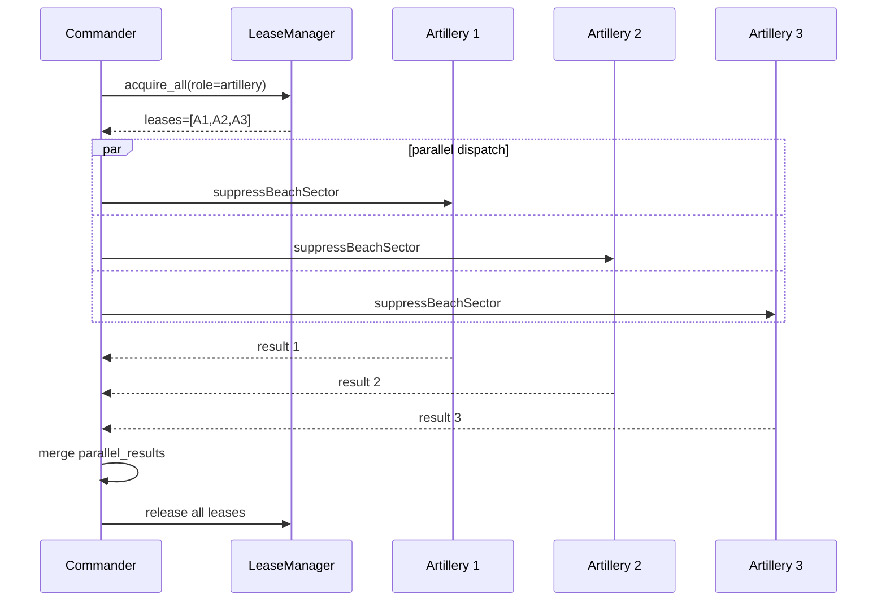
```mermaid
sequenceDiagram
    participant C as Commander
    participant L as LeaseManager
    participant A1 as Artillery 1
    participant A2 as Artillery 2
    participant A3 as Artillery 3

    C->>L: acquire_all(role=artillery)
    L-->>C: leases=[A1,A2,A3]
    par parallel dispatch
        C->>A1: suppressBeachSector
    and
        C->>A2: suppressBeachSector
    and
        C->>A3: suppressBeachSector
    end
    A1-->>C: result 1
    A2-->>C: result 2
    A3-->>C: result 3
    C->>C: merge parallel_results
    C->>L: release all leases
```

### 16.2 activity 并发

Commander 支持 BPEL `flow`/DAG activity 并发，控制参数是：

```powershell
--max-activity-workers 2
```

说明：

> 如果一个 BPEL flow 里有多个互不依赖的 activity，Commander 会用 activity worker pool 并发执行；如果存在依赖边，则按 DAG 依赖推进。

### 16.3 多 workflow 并发

Manager 层控制：

```powershell
python scripts/demo_workflow_manager.py --max-workflows 2
```

含义：

```text
最多同时跑两条 workflow，多余 workflow queued。
```

## 18. 每个演示的内部执行逻辑

```text
先讲触发了什么能力，再讲 Commander 内部怎么推进，
然后讲 checkpoint / Nacos / lease / circuit / trace 中哪些状态发生了变化。
```

### 18.1 演示总线：一体化总演示脚本

推荐总入口：

```powershell
python scripts/demo_full_showcase.py
```

如果要包含增强版 Nacos 演示：

```powershell
python scripts/demo_full_showcase.py --show-nacos-ui --ui-wait-enter
```

内部执行逻辑：

1. 先执行基础 BPEL 成功分支，证明 Commander 能按流程编排多个 Agent。
2. 再执行低评分重规划分支，证明 workflow 不是死流程，而是能根据评估结果动态进入异常/重规划路径。
3. 再执行三层并发演示，证明并发不是单一线程池，而是 workflow、activity、Agent 三层分别受控。
4. 再执行 checkpoint resume，证明进程重启后可以从已保存上下文继续。
5. 再执行 Commander failover，证明主 Commander 不可用后，备用 Commander 可以读取同一个 checkpoint 接管。
6. 再执行 Agent failover，证明单个 Agent 调用失败或心跳丢失时，可以释放租约并重指派给同 role 备用 Agent。
7. 最后执行增强版 Nacos/熔断/真实心跳演示，证明在远程注册中心里也能观察状态变化。

讲解：

```text
这不是一个新的业务流程，而是把分散能力按演示顺序串起来。
每个子演示验证一个机制，组合起来就是完整的分布式 A2A workflow 运行链路。
```

### 18.2 演示一：BPEL 基础成功分支

命令：

```powershell
python commander_agent/main.py --mode local --workflow bpel --workflow-file beachhead_workflow
```

内部执行逻辑：

1. Commander 读取 `beachhead_workflow.bpel`，解析出 sequence、invoke、switch 等 BPEL activity。
2. 初始化 workflow context，生成 `workflow_id`，并创建 checkpoint 文件。
3. 执行 Recon activity：
   - Commander 根据 role=`recon` 找到 Recon Agent。
   - 调用 `scanBeachDefenses`。
   - 把侦察结果写入 context，例如 `recon_report`。
   - checkpoint 更新：当前 activity 已完成，`completed_roles` 增加 `recon`。
4. 执行 Artillery activity：
   - Commander 找到 role=`artillery` 的 Agent。
   - 调用 `suppressBeachSector`。
   - 把火力压制结果写入 context，例如 `strike_result`。
   - checkpoint 更新：`completed_roles` 增加 `artillery`。
5. 执行 Evaluator activity：
   - Commander 调用 role=`evaluator` 的 Agent。
   - Evaluator 生成 `eval_score`。
   - 如果 `eval_score >= 60`，进入成功分支。
6. 执行 Assault activity：
   - Commander 调用 role=`assault` 的 Agent。
   - Assault 完成抢滩任务。
   - workflow status 变为 `completed`。
7. 最终 checkpoint 保存完整 context、已完成 role、最后 activity、trace。

状态变化：

```text
created/running -> recon completed -> artillery completed -> evaluator completed
-> switch 判断通过 -> assault completed -> workflow completed
```

时序图：

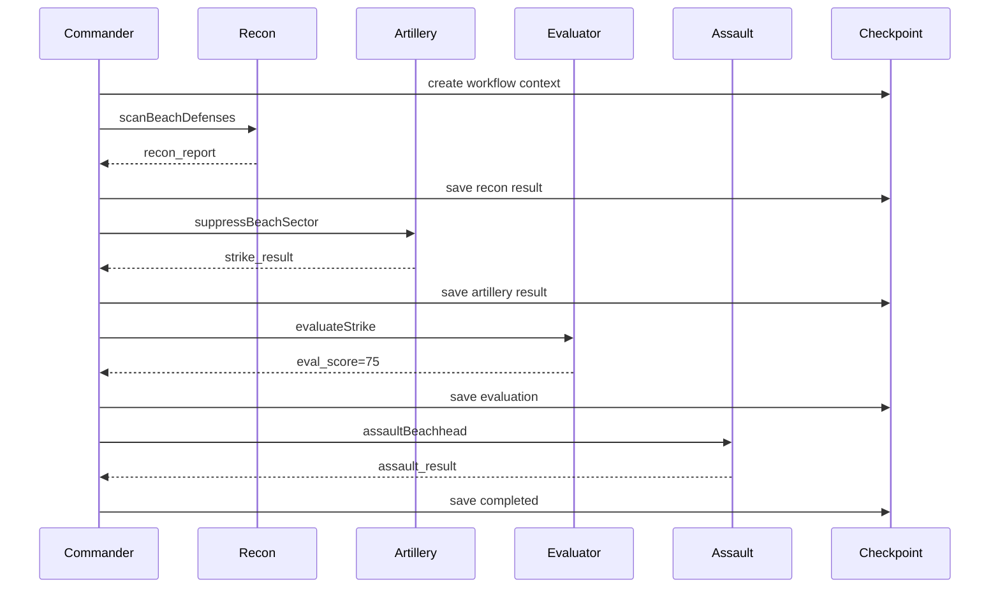
```mermaid
sequenceDiagram
    participant C as Commander
    participant R as Recon
    participant A as Artillery
    participant E as Evaluator
    participant S as Assault
    participant CK as Checkpoint

    C->>CK: create workflow context
    C->>R: scanBeachDefenses
    R-->>C: recon_report
    C->>CK: save recon result
    C->>A: suppressBeachSector
    A-->>C: strike_result
    C->>CK: save artillery result
    C->>E: evaluateStrike
    E-->>C: eval_score=75
    C->>CK: save evaluation
    C->>S: assaultBeachhead
    S-->>C: assault_result
    C->>CK: save completed
```

### 18.3 演示二：BPEL 低评分重规划分支

命令：

```powershell
python commander_agent/main.py --mode local --workflow bpel --workflow-file beachhead_workflow --mock-eval-score 40
```

内部执行逻辑：

1. 前半段和成功分支一样：Recon -> Artillery -> Evaluator。
2. Evaluator 返回 `eval_score=40`。
3. BPEL switch 判断：40 小于阈值 60，所以不进入 Assault。
4. Commander 进入重规划/异常处理分支：
   - 记录 `InsufficientSuppressionFault`。
   - 调用或模拟 `LLMCommanderAgent` 的 `analyzeAndReplanning`。
   - 生成 `CommanderDecision=RE-PLAN`。
5. workflow status 变成 `paused` 或 fault 状态。
6. checkpoint 保存失败点、低评分、last_error、当前 activity。

这里“重规划”不是继续执行一个真实的新攻击步骤，而是证明系统已经识别出当前战果不足，并把 workflow 停在可接管、可 resume、可切换强化 workflow 的状态。

状态变化：

```text
running -> evaluator completed -> score below threshold
-> replanning branch -> last_error=InsufficientSuppressionFault
-> workflow paused
```

时序图：

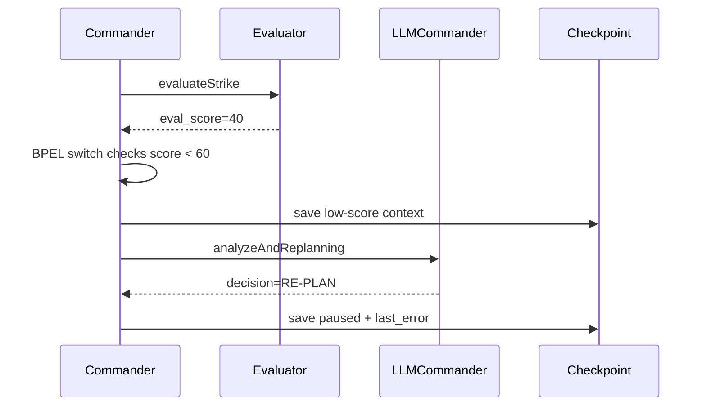
```mermaid
sequenceDiagram
    participant C as Commander
    participant E as Evaluator
    participant L as LLMCommander
    participant CK as Checkpoint

    C->>E: evaluateStrike
    E-->>C: eval_score=40
    C->>C: BPEL switch checks score < 60
    C->>CK: save low-score context
    C->>L: analyzeAndReplanning
    L-->>C: decision=RE-PLAN
    C->>CK: save paused + last_error
```

### 18.4 演示三：trace 与 checkpoint 展示

命令：

```powershell
python commander_agent/main.py --mode local --workflow bpel --workflow-file beachhead_workflow --details
```

内部执行逻辑：

1. Commander 每推进一个关键动作，就写入 trace：
   - workflow started
   - activity started
   - agent dispatch
   - agent result applied
   - checkpoint saved
   - workflow completed / paused / failed
2. checkpoint 保存的是 workflow 上下文，不只是日志：
   - `workflow_id`：本次 workflow 的唯一 ID。
   - `workflow_status`：当前是 running、paused、completed 还是 failed。
   - `current_activity`：当前或最后一个 activity。
   - `completed_roles`：已经完成的 Agent role。
   - `agent_results`：各 Agent 的输出结果。
   - `last_error`：如果失败，记录错误原因。
   - `trace`：用于回放和讲解流程。

讲解口径：

```text
trace 用来解释“发生过什么”，checkpoint 用来恢复“现在应该从哪里继续”。
```

### 18.5 演示四：Workflow Manager、租约、独立 checkpoint

命令：

```powershell
python scripts/demo_workflow_manager.py
```

内部执行逻辑：

1. Agent lease 阶段：
   - registry 中有一个 artillery Agent，初始 `status=idle`。
   - workflow alpha 申请租约，Agent 变成 `busy`。
   - workflow beta 再申请同一个 Agent，因为已经 busy，所以拿不到。
   - alpha 释放租约后，Agent 回到 `idle`。
   - beta 再申请，成功拿到租约。
2. workflow 线程池阶段：
   - Manager 设置 `max_workflows=2`。
   - 提交 3 条 workflow。
   - 前 2 条进入 running，第 3 条 queued。
   - 当前 2 条完成后，第 3 条才开始运行。
3. checkpoint 阶段：
   - 每条 workflow 都有自己的 checkpoint 文件。
   - 不同 workflow 的状态互不覆盖。

状态变化：

```text
Agent: idle -> busy -> idle -> busy -> idle
Workflow: queued -> running -> completed
```

时序图：

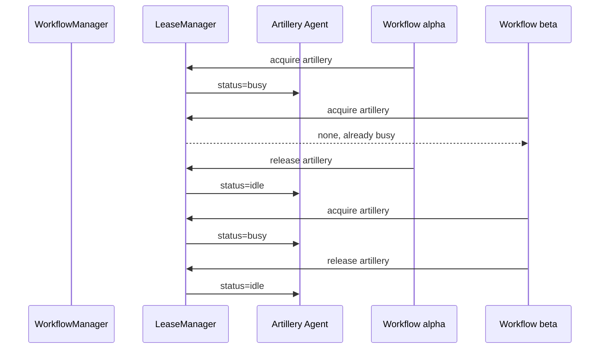
```mermaid
sequenceDiagram
    participant M as WorkflowManager
    participant L as LeaseManager
    participant A as Artillery Agent
    participant W1 as Workflow alpha
    participant W2 as Workflow beta

    W1->>L: acquire artillery
    L->>A: status=busy
    W2->>L: acquire artillery
    L-->>W2: none, already busy
    W1->>L: release artillery
    L->>A: status=idle
    W2->>L: acquire artillery
    L->>A: status=busy
    W2->>L: release artillery
    L->>A: status=idle
```

### 18.6 三层并发一体化演示

命令：

```powershell
python scripts/demo_integrated_concurrency.py
```

内部执行逻辑：

1. 多 workflow 并发：
   - 脚本提交 3 条 workflow。
   - Manager 只允许 `max_workflows=2`。
   - 第 1、2 条 workflow 同时进入 running。
   - 第 3 条 workflow 等待，直到前面有 workflow 完成。
2. activity 并发：
   - 每条 workflow 内部有 BPEL `flow`。
   - `artillery` 和 `evaluator` 两个 activity 没有依赖关系，所以可以同时运行。
   - 每条 workflow 内部最多并发 2 个 activity。
3. Agent 并发：
   - `artillery` activity 使用 `dispatchMode=parallel`。
   - Commander 找到多个 role=`artillery` 的 Agent。
   - 用 `max_agent_workers` 同时派发给多个 Agent。
   - 所有 Agent 返回后合并 parallel result。

为什么会看到这些数字：

```text
max_parallel_workflows=2
表示 Manager 层最多同时放行两条 workflow。

max_parallel_activities=4
表示两条 workflow 同时运行，每条内部两个 activity 并发，所以全局看到 4。

max_parallel_agent_calls=6
表示两条 workflow 同时运行，每条 workflow 的 artillery activity 又并发调用 3 个 Agent，所以全局看到 6。
```

三层关系图：

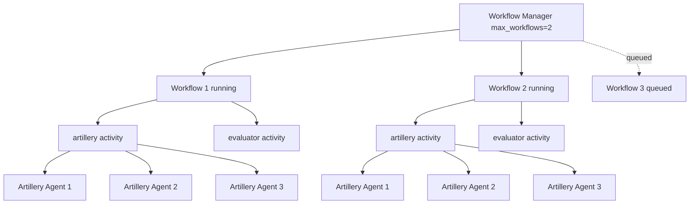
```mermaid
flowchart TD
    M[Workflow Manager max_workflows=2]
    M --> W1[Workflow 1 running]
    M --> W2[Workflow 2 running]
    M -. queued .-> W3[Workflow 3 queued]

    W1 --> W1A[artillery activity]
    W1 --> W1E[evaluator activity]
    W2 --> W2A[artillery activity]
    W2 --> W2E[evaluator activity]

    W1A --> A11[Artillery Agent 1]
    W1A --> A12[Artillery Agent 2]
    W1A --> A13[Artillery Agent 3]
    W2A --> A21[Artillery Agent 1]
    W2A --> A22[Artillery Agent 2]
    W2A --> A23[Artillery Agent 3]
```

### 18.7 演示五/六：checkpoint resume，进程重启后继续执行

命令：

```powershell
python scripts/demo_resume_after_restart.py --reset
```

内部执行逻辑：

1. Phase 1 启动一条新的 workflow。
2. Commander 执行到指定步数后停止，例如只完成：
   - Recon
   - Artillery
3. checkpoint 写入：
   - `workflow_status=paused`
   - `activity=2`
   - `completed_roles=['recon', 'artillery']`
   - 当前 context 和 battle log。
4. Phase 2 模拟进程重启：
   - 新 Commander 实例启动。
   - 不从头创建 workflow。
   - 按相同 `workflow_id` 加载 checkpoint。
5. Commander 根据 checkpoint 判断前两个 role 已完成。
6. 从下一个 activity 继续：
   - Evaluator
   - Assault
7. 最终 workflow 变成 `completed`，checkpoint 更新为最终状态。

这不是“自动发现进程挂了并拉起新进程”，而是“新进程启动后能从 checkpoint 继续”。自动拉起属于演示七或生产环境 supervisor 的职责。

状态变化：

```text
first run: running -> paused at activity=2
restart: load checkpoint -> resume from activity=2 -> completed
```

时序图：

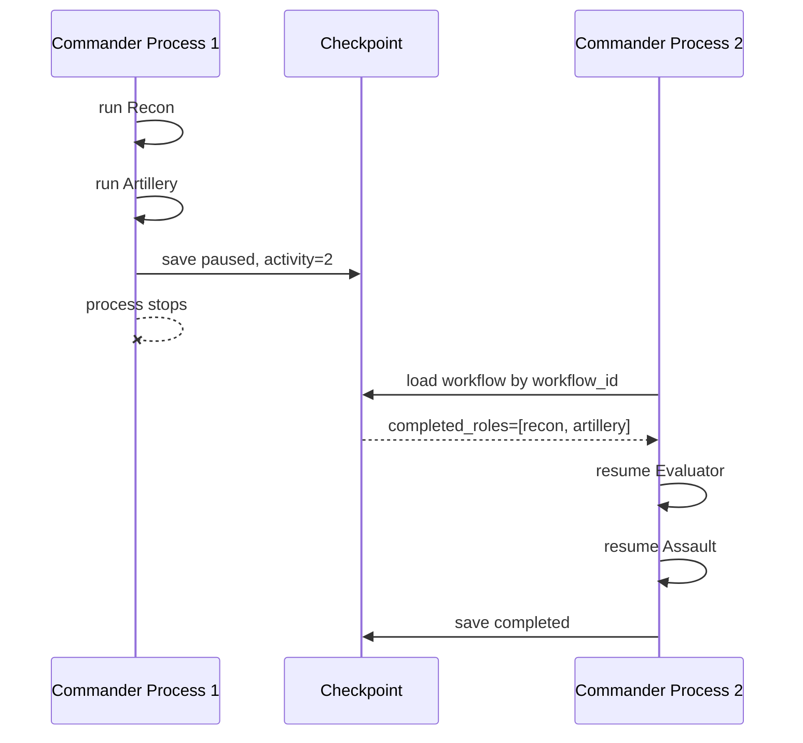
```mermaid
sequenceDiagram
    participant C1 as Commander Process 1
    participant CK as Checkpoint
    participant C2 as Commander Process 2

    C1->>C1: run Recon
    C1->>C1: run Artillery
    C1->>CK: save paused, activity=2
    C1--xC1: process stops
    C2->>CK: load workflow by workflow_id
    CK-->>C2: completed_roles=[recon, artillery]
    C2->>C2: resume Evaluator
    C2->>C2: resume Assault
    C2->>CK: save completed
```

### 18.8 演示七：Commander failover / takeover

命令：

```powershell
python scripts/demo_commander_failover_resume.py --reset
```

内部执行逻辑：

1. Phase 0 先种子化一个可恢复 checkpoint：
   - workflow 已完成 Recon、Artillery。
   - workflow 停在 `paused`。
   - checkpoint 中记录 `activity=2`。
2. Phase 1 启动 primary Commander API。
3. watchdog 定时访问 primary Commander 的健康检查接口。
4. primary 正常时，连续看到 heartbeat ok。
5. 脚本模拟 primary Commander 宕机：
   - 终止 primary 进程。
   - 健康检查开始失败。
6. watchdog 连续 miss 达到阈值，例如 2 次。
7. 判定 primary down。
8. Phase 2 启动 failover Commander API。
9. failover Commander 健康检查通过。
10. watchdog 向 failover Commander 发送：

```text
POST /workflows/{workflow_id}/resume
```

11. failover Commander 读取同一个 checkpoint。
12. 根据 checkpoint 从 activity=2 后继续执行 Evaluator、Assault。
13. 最终 checkpoint 被更新为 `completed`。

重点：

```text
Commander 本身是无状态可替换的，关键状态在 checkpoint。
主 Commander 挂掉后，备用 Commander 只要能访问同一个 checkpoint，就能接管 workflow。
```

状态变化：

```text
primary healthy -> primary missed heartbeat -> primary down
-> failover healthy -> load checkpoint -> resume -> workflow completed
```

时序图：

```mermaid
sequenceDiagram
    participant W as Watchdog
    participant P as Primary Commander
    participant F as Failover Commander
    participant CK as Checkpoint

    W->>P: /health
    P-->>W: ok
    P--xW: process terminated
    W->>P: /health
    P--xW: missed 1
    W->>P: /health
    P--xW: missed 2
    W->>F: start failover Commander
    W->>F: /health
    F-->>W: ok
    W->>F: POST /workflows/{id}/resume
    F->>CK: load paused checkpoint
    F->>F: continue remaining activities
    F->>CK: save completed
```

### 18.9 演示八：Agent 调用失败后的重指派

命令：

```powershell
python scripts/demo_agent_failover_reassignment.py --reset
```

内部执行逻辑：

1. registry 中准备两个同 role Agent：
   - `Recon_Primary`
   - `Recon_Backup`
2. Commander 要执行 role=`recon` 的任务。
3. LeaseManager 先把 Primary 的租约分配给当前 workflow：
   - Primary: `idle -> busy`
   - metadata 记录 `lease_workflow_id`、`lease_work_item`。
4. Commander 调用 Primary。
5. Primary 模拟连接失败，例如 connection refused。
6. Commander 捕获异常，并做三件事：
   - 释放 Primary 租约。
   - 把 Primary 标记为 `unavailable`。
   - 记录 trace：`agent_failover_reassigning`。
7. Commander 继续查找同 role 的可用 Agent。
8. LeaseManager 分配 Backup：
   - Backup: `idle -> busy`
9. Commander 调用 Backup。
10. Backup 成功完成任务。
11. Commander 应用结果，写入 context。
12. Backup 释放租约：
   - Backup: `busy -> idle`

状态变化：

```text
Primary: idle -> busy -> unavailable
Backup: idle -> busy -> idle
Workflow: recon pending -> recon completed
```

时序图：

```mermaid
sequenceDiagram
    participant C as Commander
    participant L as LeaseManager
    participant P as Recon Primary
    participant B as Recon Backup
    participant T as Trace

    C->>L: acquire role=recon
    L-->>C: Primary lease
    C->>P: dispatch recon task
    P--xC: connection refused
    C->>L: release Primary as unavailable
    C->>T: agent_failover_reassigning
    C->>L: acquire role=recon again
    L-->>C: Backup lease
    C->>B: dispatch recon task
    B-->>C: completed
    C->>T: agent_result_applied
    C->>L: release Backup
```

### 18.11 演示九：自动重试、熔断、traceback、Nacos 状态

启动基础设施：

```powershell
powershell -ExecutionPolicy Bypass -File scripts\start_demo_infra.ps1
```

运行演示：

```powershell
python scripts/demo_exception_resilience.py
```

如果要看 Nacos 前端：

```powershell
python scripts/demo_exception_resilience.py --show-nacos-ui --ui-wait-enter
```

内部执行逻辑分为五段。

第一段：自动重试

1. Commander 调用一个会第一次失败的 Agent。
2. 第一次返回临时错误。
3. Commander 判断错误可重试。
4. 等待 retry backoff。
5. 第二次调用成功。
6. summary 中看到 `attempts=2`。

状态变化：

```text
request 1 failed -> retry scheduled -> request 2 success -> result applied
```

第二段：同 role failover

1. Commander 发现两个同 role Agent。
2. 先调用 primary。
3. primary 返回故障。
4. primary 被标记为 unavailable。
5. Commander 选择 backup。
6. backup 成功完成任务。

第三段：熔断

1. Commander 连续调用 `circuit-primary`。
2. 第一次失败后：

```text
circuit_failure_count=1
circuit_state=closed
```

3. 第二次失败达到阈值后：

```text
circuit_failure_count=2
circuit_state=open
status=unavailable
```

4. circuit open 后，下一次请求会被 Commander 直接拦截，不再发 HTTP 请求。
5. 等 recovery timeout 过去后，熔断器进入 half-open。
6. Commander 发一个探测请求。
7. 探测成功后，熔断器关闭：

```text
circuit_state=closed
circuit_failure_count=0
```

重点：

```text
unavailable 是注册中心里给调度看的状态；
circuit open 是 Commander 的保护策略，用来避免持续打坏节点。
```

熔断时序图：

```mermaid
sequenceDiagram
    participant C as Commander
    participant CB as CircuitBreaker
    participant A as Faulty Agent
    participant T as Trace

    C->>A: request 1
    A--xC: failure
    C->>CB: record_failure count=1
    C->>T: agent_failure_recorded
    C->>A: request 2
    A--xC: failure
    C->>CB: record_failure count=2
    CB-->>C: state=open
    C->>T: agent_circuit_opened
    C->>CB: next request allowed?
    CB-->>C: reject
    Note over C,A: no HTTP request is sent while circuit is open
    CB-->>C: timeout passed, half-open
    C->>A: probe request
    A-->>C: success
    C->>CB: record_success
    CB-->>C: state=closed
    C->>T: agent_circuit_closed
```

第四段：Nacos 中的租约状态

1. 脚本把多个可控 Agent 注册到 Nacos。
2. Agent 初始 metadata 中有：

```text
status=idle
circuit_state=closed
heartbeat_ts=...
```

3. Commander 分配任务时，会更新 metadata：

```text
status=busy
lease_workflow_id=...
lease_work_item=...
```

4. 任务结束后恢复：

```text
status=idle
```

5. 故障后变成：

```text
status=unavailable
unavailable_error_code=...
unavailable_reason=...
```

第五段：traceback

1. Agent 侧发生业务异常或系统异常。
2. Agent 把错误类型、错误消息、调用链信息返回或写入日志。
3. Commander 捕获异常。
4. Commander trace 中记录故障事件。
5. 最终 report 中能看到 Commander 侧和 Agent 侧 traceback 都被采集。

讲解口径：

```text
演示九重点不是“真实进程死亡”，而是完整异常韧性：
重试、同 role failover、熔断、租约状态、traceback。
```

### 18.12 演示十：真实 Nacos 心跳超时 failover

启动基础设施：

```powershell
powershell -ExecutionPolicy Bypass -File scripts\start_demo_infra.ps1
```

运行演示：

```powershell
python scripts/demo_real_heartbeat_failover.py --startup-timeout 60 --unhealthy-timeout 45 --show-nacos-ui --ui-wait-enter --backup-delay-seconds 10
```

内部执行逻辑：

1. 脚本启动两个真实 HTTP Agent 进程：
   - Primary，端口 18316。
   - Backup，端口 18317。
2. 两个 Agent 注册到 Nacos 服务：

```text
A2A-Real-Heartbeat-Demo
```

3. 两个 Agent 以固定间隔向 Nacos 发送心跳。
4. 初始状态：

```text
Primary healthy=true, status=idle
Backup  healthy=true, status=idle
```

5. Commander 把长任务派给 Primary。
6. Primary metadata 变成：

```text
status=busy
lease_workflow_id=...
lease_work_item=...
```

7. 脚本模拟 Primary 进程卡死：
   - Windows 下通过挂起进程实现。
   - Primary 的 HTTP 服务和 heartbeat 线程都被冻结。
8. 因为 Primary 不再给 Nacos 发心跳，Nacos 经过超时时间后把它标记为：

```text
healthy=false
```

9. Commander 检测到 Primary 心跳丢失：

```text
heartbeat lost | target=Primary
```

10. Commander 释放 Primary 租约，并查找同 role Backup。
11. Commander 把同一个任务重指派给 Backup。
12. Backup metadata 短暂变成：

```text
status=busy
```

13. Backup 完成任务后回到：

```text
status=idle
```

14. workflow 或任务结果由 Backup 的响应完成。
15. 脚本清理 Primary/Backup 进程。

心跳参数讲解：

```text
Agent 侧大约每 1 秒更新一次内部 heartbeat。
Nacos 的实例心跳间隔通常显示为 5000ms。
Nacos 的超时通常显示为 15000ms。
所以真实 Nacos 前端里看到 healthy=false，一般要等十几秒。
```

状态变化：

```text
Primary: healthy=true idle -> healthy=true busy -> heartbeat stops -> healthy=false unavailable
Backup:  healthy=true idle -> healthy=true busy -> healthy=true idle
```

时序图：

```mermaid
sequenceDiagram
    participant C as Commander
    participant N as Nacos
    participant P as Primary Agent
    participant B as Backup Agent
    participant L as LeaseManager

    P->>N: heartbeat
    B->>N: heartbeat
    C->>L: acquire Primary
    C->>P: dispatch long task
    P->>N: metadata status=busy
    P--xN: process suspended, heartbeat stops
    N-->>C: Primary healthy=false after timeout
    C->>L: release Primary
    C->>L: acquire Backup
    C->>B: reassign task
    B->>N: metadata status=busy
    B-->>C: completed
    B->>N: metadata status=idle
```

### 18.13 演示十一：Redis 分布式锁

如果本机没有 Docker，可以跳过这个增强演示；它依赖 Redis。

内部执行逻辑：

1. 模拟两个 Commander 或两个 Manager 同时看到同一个 idle Agent。
2. 如果只靠本地内存，它们可能都以为自己能拿到这个 Agent。
3. 使用 Redis 分布式锁后，抢锁动作变成原子操作：

```text
SET lock_key token NX PX ttl
```

4. 第一个 Commander 抢锁成功。
5. 第二个 Commander 抢锁失败，只能等待或换 Agent。
6. 持有锁的一方执行任务时按需续约。
7. 释放锁时必须校验 token，避免误删别人后来获得的锁。

状态变化：

```text
no lock -> commander A acquired lock
commander B denied -> A renews or releases
-> lock deleted only when token matches
```

讲解口径：

```text
本地 lease 能解决单进程内的互斥；
Redis 分布式锁解决多个 Commander/Manager 进程同时抢同一个 Agent 的互斥。
```

### 18.14 常见状态字段速查

| 字段 | 含义 | 讲解时怎么说 |
| --- | --- | --- |
| `status=idle` | Agent 空闲 | 可以被 Commander 分配任务 |
| `status=busy` | Agent 已被租约占用 | 当前正在执行某个 workflow 的 work item |
| `status=unavailable` | Agent 暂不可用 | 调用失败、心跳丢失或熔断后，调度暂时不选它 |
| `healthy=true/false` | Nacos 原生健康状态 | 由 Nacos 心跳机制判断，不完全等同于业务 status |
| `lease_workflow_id` | 当前占用该 Agent 的 workflow | 用来防止多个 workflow 抢同一个 Agent |
| `lease_work_item` | 当前执行的具体 work item | 用来识别晚到响应是否还能被接受 |
| `heartbeat_ts` | 最近一次心跳时间戳 | Commander 或 Watcher 用它判断租约是否新鲜 |
| `circuit_failure_count` | 熔断失败计数 | 连续失败达到阈值后打开熔断 |
| `circuit_state=open` | 熔断打开 | Commander 暂时不再向该 Agent 发 HTTP 请求 |
| `circuit_state=closed` | 熔断关闭 | Agent 可以正常参与调度 |
| `unavailable_error_code` | 不可用原因代码 | 例如 HTTP 5xx、连接失败、心跳丢失 |
| `workflow_status=paused` | workflow 暂停 | 通常可以人工接管、resume 或切换强化 workflow |
| `workflow_status=completed` | workflow 完成 | 所有必要 activity 已执行完 |
| `last_error` | 最近错误 | 用来解释 workflow 为什么暂停或失败 |
| `completed_roles` | 已完成 role 列表 | 用来说明恢复时不会从头重复执行 |

### 18.15 从宕机到恢复的完整机制总结

完整链路可以概括为：

```text
故障发生
-> 心跳停止或调用失败
-> Watcher / Commander 检测到异常
-> 释放旧租约
-> 标记旧 Agent unavailable 或 circuit open
-> 记录 trace
-> 查找同 role 可用 Agent
-> 获取新租约
-> 重派同一个 work item
-> 新 Agent 返回结果
-> 校验租约仍然有效
-> 应用结果到 context
-> 保存 checkpoint
```

对应时序图：

```mermaid
sequenceDiagram
    participant C as Commander
    participant W as Watcher
    participant L as LeaseManager
    participant P as Primary Agent
    participant B as Backup Agent
    participant CK as Checkpoint
    participant T as Trace

    C->>L: acquire Primary lease
    C->>P: dispatch work item
    P--xC: call failed or heartbeat lost
    W->>L: lease freshness check
    L-->>W: stale or failed
    W->>L: release Primary
    W->>T: record failure/failover event
    W->>L: mark Primary unavailable or circuit open
    C->>L: acquire same-role Backup
    C->>B: reassign same work item
    B-->>C: result
    C->>L: verify Backup lease is current
    L-->>C: true
    C->>CK: save updated context
    C->>T: agent_result_applied
```

讲解时可以收束成一句话：

```text
checkpoint 负责 workflow 级恢复，lease 负责 Agent 互斥占用，
heartbeat 负责发现运行中失联，circuit breaker 负责保护故障节点，
trace 负责把整个故障和恢复过程解释清楚。
```

## 19. 资源监控模块实现说明

当前系统已经补齐 Agent 资源监控模块。它不是单独的演示脚本，而是接入了 Agent Runtime、Nacos 心跳 metadata 和 Commander 租约调度。

### 19.1 监控内容

每个 Agent Runtime 会采集两类资源指标：

```text
系统级资源：
- CPU 使用率
- 内存总量、可用量、使用率
- 磁盘总量、已用量、剩余量、使用率
- 平台信息

进程级资源：
- 当前 Agent 进程 PID
- 进程 CPU 使用率
- RSS / VMS 内存
- 线程数
- 打开文件数
- IO counters
```

核心实现文件：

```text
resource_monitor.py
a2a_protocol/server.py
registry/nacos_manager.py
commander_agent/agent_leases.py
```

### 19.2 Agent Runtime 暴露的接口

每个 Agent 现在都可以通过下面接口查看资源状态：

```text
GET /resources
GET /metrics
GET /ready
GET /health
GET /.well-known/agent-card
```

区别：

```text
/resources：只看资源监控快照。
/metrics：任务指标 + resources。
/ready：manual ready + resource_ready，资源 critical 时 ready=false。
/health：返回资源状态摘要。
/.well-known/agent-card：声明 resourcesEndpoint=/resources。
```

### 19.3 Nacos metadata 中的资源字段

Agent 注册和心跳时，会把资源状态同步到 Nacos metadata：

```text
resource_monitor_available=true/false
resource_state=ok/warn/critical/unknown
resource_cpu_percent=...
resource_memory_percent=...
resource_disk_percent=...
process_cpu_percent=...
process_memory_mb=...
resource_sampled_at=...
```

也就是说，Nacos 前端不仅能看到 Agent 是否 `idle/busy/unavailable`，还可以看到该 Agent 当前资源负载。

### 19.4 阈值与状态

资源监控会根据阈值计算 `resource_state`：

```text
ok：资源正常
warn：超过 warning 阈值，但仍可运行
critical：超过 critical 阈值，不建议再接新任务
unknown：监控不可用，例如缺少 psutil
```

默认阈值可以通过环境变量调整：

```powershell
$env:A2A_RESOURCE_CPU_WARN_PERCENT="85"
$env:A2A_RESOURCE_CPU_CRITICAL_PERCENT="95"
$env:A2A_RESOURCE_MEMORY_WARN_PERCENT="85"
$env:A2A_RESOURCE_MEMORY_CRITICAL_PERCENT="95"
$env:A2A_RESOURCE_DISK_WARN_PERCENT="90"
$env:A2A_RESOURCE_DISK_CRITICAL_PERCENT="97"
```

### 19.5 调度如何使用资源状态

Commander 的 AgentLeaseManager 在选择 Agent 时会过滤掉：

```text
resource_state=critical
```

内部逻辑：

```text
Commander 查询 role=xxx 且 status=idle 的 Agent
-> LeaseManager 检查 Nacos metadata
-> 如果 resource_state=critical，则跳过该 Agent
-> 选择资源状态 ok/warn/unknown 的同 role Agent
-> 获取租约并派发任务
```

时序图：

```mermaid
sequenceDiagram
    participant A as Agent Runtime
    participant M as ResourceMonitor
    participant N as Nacos
    participant C as Commander
    participant L as LeaseManager

    A->>M: collect cpu/memory/disk/process metrics
    M-->>A: resource_state
    A->>N: heartbeat metadata with resource_state
    C->>L: acquire role=artillery
    L->>N: discover idle Agents
    N-->>L: candidates with resource metadata
    L->>L: skip resource_state=critical
    L-->>C: lease healthy resource Agent
```

### 19.6 资源过载时的行为

资源过载有两层保护：

```text
第一层：调度前过滤
Commander 不优先选择 resource_state=critical 的 Agent。

第二层：Agent Runtime 自保护
如果 Agent 本机已经 critical，并且启用资源拒绝策略，
sendMessage 会返回 AGENT_RESOURCE_EXHAUSTED。
```

开关：

```powershell
$env:A2A_REJECT_WHEN_RESOURCE_CRITICAL="true"
```

讲解时可以这样说：

```text
心跳机制解决“Agent 是否活着”，资源监控解决“Agent 是否适合继续接任务”。
现在 Commander 不只是看 idle/busy，还会结合 resource_state 做资源感知调度。
```
