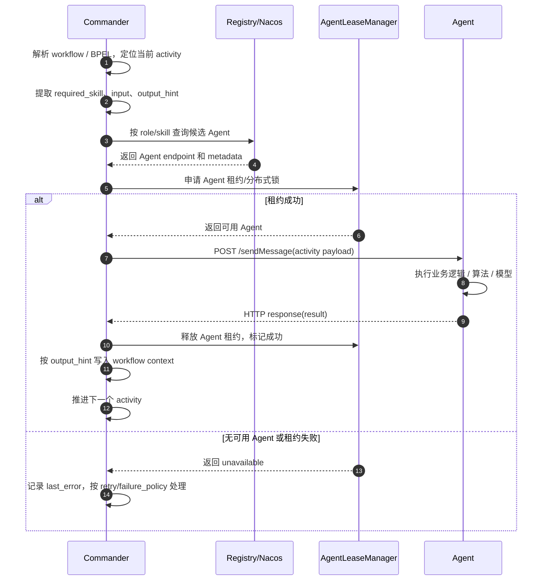
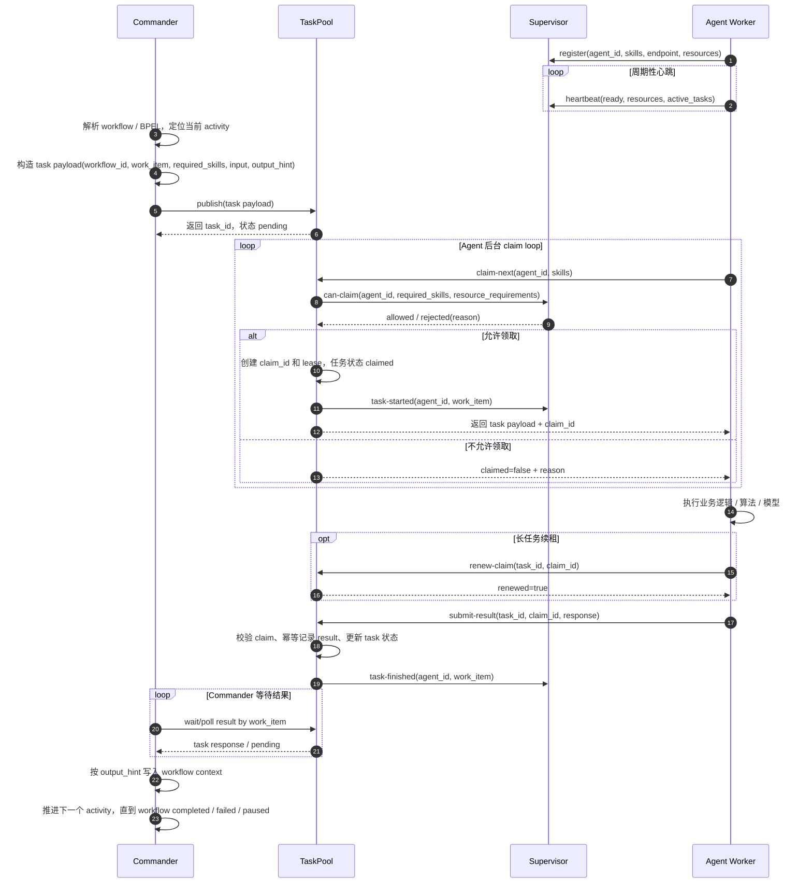

# Direct 与 Crowd 调度模式对比说明

## 1. 背景

当前项目里 Agent 调度主要有两种模式：

```text
direct：Commander 主动发现 Agent，并直接调用 Agent 执行任务。
crowd：Commander 发布任务到 TaskPool，Agent 根据自身能力和状态主动领取任务。
```

这两种模式不是简单的实现细节差异，而是两种不同的系统架构思路。

`direct` 更像“中心化指挥调用”：

```text
Commander -> Agent
```

`crowd` 更像“任务市场 + 群体接单”：

```text
Commander -> TaskPool -> Agent
                    |
                    v
               Supervisor
```

## 2. Direct 模式

### 2.1 工作逻辑

在 direct 模式下，Commander 负责完整的调度决策。

典型链路如下：

```text
1. Commander 解析 workflow / BPEL。
2. Commander 判断当前 activity 需要什么 role 或 skill。
3. Commander 通过注册中心或本地 registry 查找候选 Agent。
4. Commander 选择一个或多个 Agent。
5. Commander 直接调用 Agent 的 /sendMessage 接口。
6. Agent 执行任务并同步返回结果。
7. Commander 将结果写回 workflow context，然后推进下一步。
```

简化结构：

```text
┌───────────┐       discover / select       ┌──────────┐
│ Commander │ ----------------------------> │ Registry │
└─────┬─────┘                               └──────────┘
      │
      │ direct call /sendMessage
      v
┌───────────┐
│   Agent   │
└───────────┘
```

direct 模式时序图：



图解说明：

```text
1. Commander 是 direct 模式里的调度中心。它既负责推进 workflow，也负责选择具体 Agent。
2. Registry/Nacos 只负责告诉 Commander 当前有哪些 Agent、它们的 endpoint 和基础 metadata。
3. AgentLeaseManager 用来避免同一个 Agent 被多个 workflow 同时占用，本质上是在保护 Agent 使用权。
4. 租约成功后，Commander 会直接调用目标 Agent 的 /sendMessage 接口。
5. Agent 执行完成后，结果会作为 HTTP response 直接返回给 Commander。
6. Commander 收到结果后释放 Agent 租约，并把结果写入 workflow context。
7. 如果没有可用 Agent、租约失败或调用失败，错误会直接回到 Commander，由 Commander 决定重试、暂停或失败。
```

这个模式的关键点是：

```text
结果路径短：Agent -> Commander。
状态集中在 Commander：当前步骤、调用结果、失败重试、workflow context 都由 Commander 管。
Agent 是被动服务：只等 Commander 调用，不主动决定自己要执行什么任务。
```

### 2.2 优点

1. **链路短，容易理解**

   Commander 直接找 Agent、直接发请求、直接拿结果，中间环节少，适合早期 demo 和功能验证。

2. **实现成本低**

   不需要独立任务池、任务租约、结果池、Agent 主动领取机制，也不需要复杂的任务状态机。

3. **调试方便**

   一次任务调用基本就是一次 HTTP 请求。失败时只需要看 Commander 到 Agent 的调用链。

4. **Commander 控制力强**

   Commander 可以直接决定调用哪个 Agent、什么时候调用、失败后是否换一个 Agent。

5. **适合小规模固定 Agent 场景**

   如果 Agent 数量少、部署位置固定、状态变化不频繁，direct 模式足够简单有效。

### 2.3 缺点

1. **Commander 职责过重**

   Commander 不仅要编排 workflow，还要负责 Agent 发现、选择、并发控制、失败重试、租约释放、熔断处理等逻辑。

2. **不适合大规模动态 Agent**

   当 Agent 数量增加、Agent 动态上下线、资源状态频繁变化时，Commander 需要维护大量调度细节。

3. **Agent 被动执行**

   Agent 等待 Commander 调用，不能根据自身资源、队列压力、当前能力主动选择任务。

4. **任务审计能力弱**

   direct 模式里任务没有天然进入统一任务池。要追踪任务生命周期，需要额外在 Commander 侧补日志和状态。

5. **失败恢复复杂**

   如果 Commander 调用 Agent 后 Agent 宕机，Commander 需要自己判断调用是否成功、是否重试、是否换 Agent、是否产生重复结果。

6. **不利于接入监控系统**

   监控系统如果要看到所有任务状态，需要从 Commander、Agent、注册中心等多个地方拼数据。

## 3. Crowd 模式

### 3.1 工作逻辑

在 crowd 模式下，Commander 不再直接指定某个 Agent，而是把 activity 转换成任务发布到 TaskPool。

典型链路如下：

```text
1. Commander 解析 workflow / BPEL。
2. Commander 将 activity 封装成 task，发布到 TaskPool。
3. Agent 启动后注册到 Supervisor，并持续上报心跳、资源、ready 状态。
4. Agent 后台 worker 周期性向 TaskPool 请求 claim-next。
5. TaskPool 根据任务 required_skills 找到候选任务。
6. TaskPool 调用 Supervisor 判断该 Agent 是否允许领取任务。
7. Supervisor 根据在线状态、ready 状态、技能、资源、并发、熔断状态做准入判断。
8. TaskPool 将任务 claim 给 Agent，并生成 claim_id 和 lease。
9. Agent 执行任务，执行期间可以续租。
10. Agent 将结果提交回 TaskPool。
11. Commander 从 TaskPool 等待或轮询结果，再推进 workflow。
```

简化结构：

```text
┌───────────┐
│ Commander │
└─────┬─────┘
      │ publish task
      v
┌───────────┐       can-claim        ┌────────────┐
│ TaskPool  │ ---------------------> │ Supervisor │
└─────┬─────┘                         └─────▲──────┘
      │ claim / submit result                │
      v                                      │ register / heartbeat
┌───────────┐                                │
│   Agent   │ -------------------------------┘
└───────────┘
```

crowd / TaskPool 模式时序图：



图解说明：

```text
1. Agent 启动后先注册到 Supervisor，告诉系统自己是谁、在哪里、有什么技能、资源状态如何。
2. Agent 会持续向 Supervisor 发送心跳，更新 ready、resources、active_tasks 等调度状态。
3. Commander 仍然负责解析 workflow，并决定当前应该执行哪个 activity。
4. Commander 不再直接选择 Agent，而是把当前 activity 封装成 task 发布到 TaskPool。
5. TaskPool 保存 task，并让它处于 pending 状态，等待合适的 Agent 主动领取。
6. Agent Worker 在后台循环向 TaskPool 请求 claim-next，表示“我有这些 skills，有任务可以做吗”。
7. TaskPool 找到候选任务后，会请求 Supervisor 做 can-claim 准入判断。
8. Supervisor 根据 Agent 是否 online、ready、资源是否满足、并发是否超限、是否熔断等条件做判断。
9. 通过准入后，TaskPool 创建 claim_id 和 lease，并把 task payload 返回给 Agent。
10. Agent 执行任务。如果任务执行时间较长，Agent 需要定期 renew-claim 续租。
11. Agent 执行完成后，把 result 提交回 TaskPool，而不是直接返回给 Commander。
12. TaskPool 校验 claim、处理结果幂等、更新任务状态，并通知 Supervisor 释放 active task。
13. Commander 通过 work_item 等待或轮询 TaskPool 中的结果。
14. Commander 拿到结果后写回 workflow context，再继续推进下一个 activity。
```

这个模式的关键点是：

```text
结果路径变长：Agent -> TaskPool -> Commander。
任务状态归 TaskPool：pending、claimed、completed、failed、expired 都在 TaskPool 中体现。
Agent 状态归 Supervisor：online、ready、resources、active_tasks、circuit state 都由 Supervisor 监管。
Agent 是主动 worker：它不是等 Commander 调用，而是自己从 TaskPool 领取任务。
Commander 仍然控制 workflow：TaskPool 只处理单个 activity task，不决定 workflow 下一步怎么走。
```

### 3.2 优点

1. **Commander 职责更清晰**

   Commander 只负责 workflow 编排和任务发布，不再直接管理每个 Agent 的选择和执行细节。

2. **更适合动态 Agent 集群**

   Agent 可以动态上线、下线、扩容、缩容。只要注册到 Supervisor 并具备对应技能，就可以参与任务领取。

3. **Agent 可以主动接任务**

   Agent 根据自己的技能、ready 状态、资源状态和并发能力主动 claim 任务，而不是被 Commander 强制调用。

4. **天然支持任务审计**

   TaskPool 里可以记录任务从 pending、claimed、running、completed、failed、expired 的完整生命周期。

5. **更适合监控系统接入**

   监控系统可以围绕 TaskPool、Supervisor、Agent worker 采集统一指标：

   ```text
   任务数量
   pending/running/failed 状态
   Agent 在线数
   Agent 资源使用率
   claim 成功率
   任务耗时
   失败原因分布
   ```

6. **更容易做失败恢复**

   TaskPool 可以通过 claim lease、过期恢复、重复提交幂等、任务重试等机制统一处理异常。

7. **更容易接入真实 Agent**

   真实 Agent 不需要被 Commander 直接绑定，只要实现统一协议：

   ```text
   注册
   心跳
   claim
   执行
   submit result
   ```

### 3.3 缺点

1. **架构复杂度明显增加**

   crowd 模式引入了 TaskPool、Supervisor、Agent worker loop、租约、结果池、状态机等组件。

2. **链路变长**

   direct 模式是 Commander 直接调用 Agent；crowd 模式变成 Commander、TaskPool、Supervisor、Agent 多方协作。

3. **一致性问题更多**

   例如：

   ```text
   TaskPool claim 成功但 Supervisor 没记录 active task
   Agent 结果提交成功但 HTTP 响应超时
   Agent 执行中宕机但 TaskPool 还认为任务 claimed
   Commander 超时重试导致重复任务或重复结果
   ```

4. **需要设计任务状态机**

   必须明确任务状态、claim 状态、Agent 状态之间的关系，否则异常场景很容易乱。

5. **需要更完整的监控和排障能力**

   出问题时不能只看一次 HTTP 调用，而要看任务事件、Agent 心跳、Supervisor 准入、TaskPool 状态、Agent worker 日志。

6. **测试成本更高**

   direct 模式主要测请求和响应；crowd 模式还要测任务发布、领取、续租、超时、重试、幂等、并发、恢复。

## 4. Direct 与 Crowd 对比

| 维度 | direct 模式 | crowd 模式 |
| --- | --- | --- |
| 调度方式 | Commander 主动选择 Agent | Commander 发布任务，Agent 主动领取 |
| 核心链路 | Commander -> Agent | Commander -> TaskPool -> Agent |
| Agent 角色 | 被动接收调用 | 主动 claim 任务 |
| Commander 负担 | 重，负责发现、选择、调用、失败处理 | 轻，主要负责编排和等待结果 |
| 系统组件 | 少 | 多，需要 TaskPool、Supervisor、worker loop |
| 任务状态 | 分散在 Commander 调用过程中 | 集中在 TaskPool |
| Agent 状态 | 依赖注册中心或简单心跳 | Supervisor 统一监管 |
| 资源约束 | Commander 侧处理或弱处理 | Supervisor 准入处理 |
| 监控审计 | 较弱，需要额外拼接 | 较强，任务池天然记录生命周期 |
| 动态扩展 | 较弱 | 较强 |
| 失败恢复 | Commander 自己处理 | TaskPool/Supervisor/Agent 协同处理 |
| 实现复杂度 | 低 | 高 |
| 适用阶段 | demo、小规模、固定 Agent | 多 Agent、动态 Agent、真实部署、需要监控审计 |

## 5. 为什么改成 Crowd 模式工作量会比较大

从 direct 改成 crowd，不是把：

```text
Commander.call_agent()
```

改成：

```text
TaskPool.publish()
```

这么简单。它实际上改变了整个系统的控制流、状态归属和故障处理方式。

### 5.1 控制流从同步调用变成异步任务

direct 模式里，Commander 发请求后马上等 Agent 返回：

```text
request -> response
```

crowd 模式里，Commander 发布任务后，任务什么时候被哪个 Agent 领取是不确定的：

```text
publish -> wait claim -> execute -> submit result -> poll result
```

因此必须增加：

```text
任务状态
等待结果
超时处理
任务重试
结果聚合
```

### 5.2 Agent 选择逻辑从 Commander 转移到 TaskPool/Supervisor

direct 模式下，Commander 自己选择 Agent。

crowd 模式下，Agent 主动 claim，TaskPool 和 Supervisor 共同判断能不能领取。

这意味着要新增：

```text
Agent 注册
Agent 心跳
Agent ready 状态
Agent 技能匹配
Agent 资源快照
Agent 并发额度
Agent 熔断状态
claim 准入判断
```

### 5.3 必须引入任务租约

Agent claim 任务后可能宕机。如果没有 lease，任务会永远卡在 claimed。

所以 crowd 模式必须处理：

```text
claim_id
lease_until
lease renewal
lease expired
expired 后任务回到 pending
迟到结果拒绝
```

这些在 direct 模式里通常不需要单独建模。

### 5.4 必须处理结果幂等

真实网络里会出现这种情况：

```text
Agent submit result 成功
HTTP response 超时
Agent 以为失败，于是重试 submit
```

如果 TaskPool 不做幂等，就会重复记录结果，导致 workflow 错误推进。

因此 crowd 模式需要以 `claim_id` 或 `attempt_id` 做结果幂等。

### 5.5 必须设计任务状态机

direct 模式主要关心调用成功或失败。

crowd 模式至少需要这些状态：

```text
pending
claimed
running
completed
failed
expired
cancelled
retrying
dead_letter
```

同时还要区分 task 状态和 claim 状态。否则多个 Agent、多个 attempt、多个结果会混在一起。

### 5.6 监控维度变多

direct 模式主要监控：

```text
Commander 调用 Agent 成功率
Agent 接口耗时
```

crowd 模式要监控：

```text
任务发布量
任务积压量
claim 成功率
claim 拒绝原因
Agent 在线数
Agent ready 数
Agent 资源状态
任务等待时长
任务执行时长
任务重试次数
任务过期次数
结果提交失败次数
```

这意味着监控系统也要跟着升级。

### 5.7 测试复杂度提升

direct 模式测试一个 Agent 调用即可。

crowd 模式需要覆盖：

```text
Commander publish
Agent claim
Supervisor can-claim
Agent execute
Agent submit result
Commander wait result
Agent 宕机恢复
lease 过期
重复 submit
Supervisor 不可用
TaskPool 重启恢复
多 Agent 并发 claim
```

这些都是额外工作量。

## 6. 从 Direct 到 TaskPool 模式如何转变

这里的 TaskPool 模式可以理解为当前项目里的 crowd 模式核心：Commander 不直接调用 Agent，而是把任务发布到 TaskPool，再由 Agent 主动领取任务。

这个转变不是一次性把所有逻辑搬过去，而是要把原来集中在 Commander 里的调度职责拆出来，重新分配到 Commander、TaskPool、Supervisor、Agent Runtime 四个组件里。

### 6.1 首先要改变系统边界

direct 模式的边界比较简单：

```text
Commander 负责 workflow
Commander 负责找 Agent
Commander 负责调用 Agent
Commander 负责拿结果
Agent 只负责执行 /sendMessage
```

TaskPool 模式下边界要重新划分：

```text
Commander：只负责 workflow 编排、发布 activity task、等待结果、推进上下文。
TaskPool：负责任务状态、claim、lease、结果记录、幂等、任务恢复。
Supervisor：负责 Agent 状态、资源、心跳、ready、并发、熔断和 claim 准入。
Agent Runtime：负责注册、心跳、自动 claim、执行、续租、提交结果。
```

也就是说，迁移的核心不是“多加一个 TaskPool”，而是把原来 Commander 的一部分职责拆走。

### 6.2 Commander 需要改变什么

direct 模式里 Commander 的核心动作是：

```text
select Agent -> call Agent -> receive response -> write context
```

TaskPool 模式里要变成：

```text
build task -> publish task -> wait result -> write context
```

Commander 需要做的变化包括：

```text
1. 把 workflow activity 转成标准 task payload。
2. 给每个 task 生成稳定 work_item。
3. 把 required_skill、input、output_hint、retry_policy、resource_requirements 写入 payload。
4. 调用 TaskPool.publish() 发布任务。
5. 根据 work_item 等待 TaskPool 中的结果。
6. 拿到 result 后按 output_hint 写回 workflow context。
7. 失败时根据 failure_policy 决定 pause、retry、fail 还是继续。
```

direct 模式里 Commander 知道“哪个 Agent 执行了任务”；TaskPool 模式里 Commander 只需要知道“这个 work_item 的结果是什么”。这是一个重要变化。

迁移前：

```text
Commander 关心：我要调用哪个 Agent？
```

迁移后：

```text
Commander 关心：这个 activity 对应的任务有没有完成？
```

### 6.3 Agent 需要改变什么

direct 模式下 Agent 是被动的：

```text
Agent 暴露 /sendMessage
Commander 调用
Agent 执行并返回 response
```

TaskPool 模式下 Agent 要变成主动 worker：

```text
Agent 注册到 Supervisor
Agent 周期性 heartbeat
Agent 周期性向 TaskPool claim-next
Agent claim 成功后执行任务
Agent 执行过程中续租
Agent 执行完成后 submit result
```

这意味着真实 Agent 接入时，不能只实现一个业务函数，还需要接入一套 Agent Runtime。

理想情况下，下游真实 Agent 只需要实现：

```python
def execute_task(payload):
    ...
```

框架负责：

```text
注册
心跳
资源上报
claim
lease renewal
submit result
错误包装
metrics
```

如果没有这个 Runtime 抽象，每个真实 Agent 都要重复实现一遍任务池协议，接入成本会很高。

#### 6.3.1 下游真实 Agent 需要实现哪些功能

从接入方视角看，真实 Agent 最好不要直接面对 TaskPool / Supervisor 的全部协议细节。推荐把 Agent 能力拆成两层：

```text
Agent Runtime / SDK：框架层，负责调度协议和生命周期。
Real Agent Logic：业务层，负责真正执行模型、算法、工具或外部系统调用。
```

也就是说，下游 Agent 接入时，理想上只需要实现业务逻辑，调度侧能力由框架统一提供。

最小接入接口可以是：

```python
class RealAgent:
    agent_id = "recon-agent-01"
    skills = ["scan_beach_defenses"]
    max_concurrency = 1

    def execute_task(self, payload):
        # 真实模型、算法、规划、工具调用等业务逻辑
        return {
            "status": "completed",
            "output": {
                "recon_report": "..."
            }
        }
```

真实 Agent 至少需要提供这些静态信息：

```text
agent_id：Agent 实例唯一标识。
name / role：Agent 名称和角色，便于监控展示。
skills：Agent 具备的能力列表，用于 TaskPool 匹配任务。
endpoint：如果 Agent 仍然暴露 HTTP 服务，需要提供服务地址。
max_concurrency：最大并发任务数。
resource_profile：可选，描述 CPU、内存、GPU、模型加载状态等资源能力。
```

真实 Agent 还需要实现一个稳定的任务执行函数：

```text
execute_task(payload) -> result
```

这个函数应该只关心业务输入和业务输出，不应该关心任务池协议。

输入一般来自 Commander 发布的 activity task：

```json
{
  "workflow_id": "workflow-001",
  "work_item": "workflow-001:activity-scan",
  "activity_id": "activity-scan",
  "required_skills": ["scan_beach_defenses"],
  "input": {
    "sector": "Sector_A"
  },
  "context": {
    "previous_result": "..."
  },
  "output_hint": "recon_report"
}
```

输出应该尽量标准化：

```json
{
  "status": "completed",
  "output": {
    "recon_report": "Sector_A has heavy defenses."
  },
  "metrics": {
    "duration_ms": 1200
  }
}
```

失败时也应该返回结构化错误，而不是只抛出不透明异常：

```json
{
  "status": "failed",
  "error_code": "model_timeout",
  "message": "model inference timed out after 30s",
  "retryable": true
}
```

#### 6.3.2 Agent Runtime / SDK 需要替下游 Agent 做什么

下面这些能力属于 crowd / TaskPool 模式的调度基础能力，建议由框架 Runtime / SDK 统一实现，而不是每个真实 Agent 重复实现。

1. **注册到 Supervisor**

   Agent 启动后，Runtime 要把 Agent 的身份、技能、endpoint、资源画像注册到 Supervisor：

   ```text
   Agent Runtime -> Supervisor: register(agent_id, skills, endpoint, max_concurrency, resources)
   ```

   这一步是让 Supervisor 知道“系统里有哪些 Agent 可以参与调度”。

2. **周期性心跳和资源上报**

   Runtime 要持续上报：

   ```text
   online 状态
   ready 状态
   active_tasks
   CPU / memory / GPU
   resource_state
   draining / unhealthy / disabled 等生命周期状态
   ```

   Supervisor 后续做 can-claim 准入时，会依赖这些状态。

3. **后台 claim loop**

   Runtime 要在后台周期性访问 TaskPool：

   ```text
   Agent Runtime -> TaskPool: claim-next(agent_id, skills)
   ```

   这个动作表示：

   ```text
   我是这个 Agent。
   我具备这些 skills。
   我现在有空闲并发槽。
   有没有适合我的任务？
   ```

   如果没有任务，Runtime 应该等待一小段时间后继续轮询；如果 claim 成功，就进入任务执行阶段。

4. **本地并发控制**

   Runtime 必须限制本地并发，不能无限领取任务。

   需要维护：

   ```text
   max_concurrency
   running_tasks
   available_slots
   ```

   只有有空闲 slot 时才应该 claim 新任务。

5. **任务执行调度**

   Runtime claim 到 task 后，调用真实 Agent 的业务函数：

   ```text
   result = real_agent.execute_task(payload)
   ```

   真实 Agent 不需要知道 claim_id、lease、TaskPool URL 等调度字段。

6. **claim lease 续租**

   如果任务执行时间较长，Runtime 必须在 lease 过期前续租：

   ```text
   Agent Runtime -> TaskPool: renew-claim(task_id, claim_id)
   ```

   如果不续租，TaskPool 可能认为 Agent 已经宕机或失联，把任务重新放回 pending，导致其他 Agent 重复执行。

7. **结果提交**

   任务执行完成后，Runtime 把结果提交到 TaskPool：

   ```text
   Agent Runtime -> TaskPool: submit-result(task_id, claim_id, agent_id, response)
   ```

   TaskPool 记录结果后，Commander 才能通过 work_item 等待到 activity 结果并继续推进 workflow。

8. **异常包装**

   真实 Agent 的业务代码可能抛异常，Runtime 应该统一捕获并包装成标准 failed result：

   ```text
   status=failed
   error_code=agent_execution_error
   message=异常信息
   retryable=true/false
   ```

   这样 TaskPool 和 Commander 才能用统一逻辑处理失败，而不是只等 lease 超时。

9. **submit 重试与幂等**

   网络不稳定时，Agent 可能提交结果成功了，但 HTTP response 丢失。Runtime 需要用同一个 claim_id 重试 submit。

   TaskPool 侧要保证：

   ```text
   同一个 claim_id 的 result 重复提交不会重复计数。
   ```

   Agent Runtime 侧要保证：

   ```text
   重试时不生成新的 claim_id。
   重试时不改变同一次执行的 result 语义。
   ```

10. **优雅下线和 draining**

    Agent 下线或升级时，Runtime 应该支持 draining：

    ```text
    停止领取新任务。
    已领取任务尽量执行完成。
    执行完成后提交结果。
    最后更新 Supervisor 状态为 offline / draining finished。
    ```

11. **任务取消和超时处理**

    后续如果 TaskPool 支持 cancel，Runtime 还需要能感知：

    ```text
    task cancelled
    claim expired
    workflow stopped
    ```

    对长任务来说，这可以避免 Agent 继续执行已经不需要的任务。

12. **本地可观测性**

    Runtime 应该至少提供这些日志和指标：

    ```text
    claim 成功/失败次数
    当前 running_tasks
    任务执行耗时
    submit 成功/失败次数
    renew 成功/失败次数
    最近一次错误
    Agent ready 状态
    ```

    这些信息后续可以接入监控系统或 dashboard。

#### 6.3.3 推荐的 Agent 内部分层

推荐的 Agent 内部结构如下：

```text
Agent Process
  |
  |-- Agent Runtime / SDK
  |     |
  |     |-- SupervisorClient
  |     |     |-- register()
  |     |     |-- heartbeat_loop()
  |     |
  |     |-- TaskPoolClient
  |     |     |-- claim_next()
  |     |     |-- renew_claim()
  |     |     |-- submit_result()
  |     |
  |     |-- WorkerLoop
  |     |     |-- concurrency_control()
  |     |     |-- claim_loop()
  |     |     |-- dispatch_task()
  |     |
  |     |-- LeaseRenewer
  |     |     |-- renew while task running
  |     |
  |     |-- ResultReporter
  |           |-- submit success
  |           |-- submit failed
  |           |-- retry submit
  |
  |-- Real Agent Logic
        |
        |-- execute_task(payload)
```

这样做的好处是：

```text
下游 Agent 接入成本低。
调度协议统一。
错误格式统一。
监控指标统一。
claim / renew / submit 的细节不会散落在每个 Agent 项目里。
```

#### 6.3.4 如果真实 Agent 不想改代码怎么办

如果下游真实 Agent 已经存在，而且不方便改造成 SDK 形式，可以考虑 Sidecar 模式：

```text
TaskPool / Supervisor <-> Agent Sidecar <-> Real Agent HTTP Service
```

Sidecar 负责：

```text
注册
心跳
claim
续租
submit
错误包装
metrics
```

真实 Agent 只需要继续暴露原来的 HTTP 接口，例如：

```text
POST /execute
POST /sendMessage
```

Sidecar claim 到 task 后，再调用真实 Agent：

```text
Sidecar -> Real Agent: POST /execute(payload)
Real Agent -> Sidecar: result
Sidecar -> TaskPool: submit-result
```

这种方式适合：

```text
真实 Agent 已经存在。
真实 Agent 语言不统一。
不希望每个 Agent 都集成 Python SDK。
希望调度逻辑和业务逻辑进程隔离。
```

但 Sidecar 模式也会增加一个本地进程和一跳调用链，需要额外处理 Sidecar 与真实 Agent 之间的健康检查和本地错误。

#### 6.3.5 哪些能力必须由下游 Agent 自己提供

即使有 Runtime / SDK，下面这些仍然需要真实 Agent 自己负责：

```text
1. 准确声明自己的 skills。
2. 准确声明自己的资源需求和资源能力。
3. 实现 execute_task(payload) 的业务逻辑。
4. 保证输出字段符合协议。
5. 给出可理解的业务错误码。
6. 标记错误是否 retryable。
7. 对长任务提供进度或可中断能力，便于后续支持 cancel。
8. 避免在业务函数内部无限阻塞。
```

简单说：

```text
框架负责“怎么接任务、怎么续租、怎么交结果”。
真实 Agent 负责“这个任务到底怎么做、做出的结果是什么意思”。
```

#### 6.3.6 下游 Agent 接入 checklist

接入真实 Agent 前，建议逐项确认：

```text
[ ] Agent 是否有唯一 agent_id？
[ ] Agent 是否声明了 skills？
[ ] Agent 是否声明了 max_concurrency？
[ ] Agent 是否能上报 ready 状态？
[ ] Agent 是否能上报资源状态？
[ ] execute_task(payload) 是否稳定？
[ ] 成功结果是否符合 ResultSpec？
[ ] 失败结果是否有 error_code、message、retryable？
[ ] 长任务是否能续租？
[ ] submit 失败是否能重试？
[ ] Agent 下线时是否能进入 draining？
[ ] 是否有本地日志和 metrics？
```

### 6.4 Agent 选择逻辑要从 Commander 下沉

direct 模式中，Agent 选择逻辑通常在 Commander 里：

```text
1. 查询 registry。
2. 按 role / skill 过滤。
3. 判断 Agent 是否 idle。
4. 加租约或分布式锁。
5. 调用 Agent。
6. 成功或失败后释放租约。
```

TaskPool 模式中，选择逻辑变成两段：

```text
TaskPool：判断任务是否可被这个 Agent claim。
Supervisor：判断这个 Agent 当前是否允许接任务。
```

迁移后判断逻辑大概是：

```text
TaskPool 检查：
1. task 是否 pending。
2. task required_skills 是否和 Agent skills 匹配。
3. task 当前 active claims 是否超过 max_claims。
4. claim lease 是否过期。

Supervisor 检查：
1. Agent 是否注册。
2. Agent 是否 online。
3. Agent ready 是否为 true。
4. Agent active_tasks 是否小于 max_concurrency。
5. Agent 资源是否满足 task resource_requirements。
6. Agent 是否处于 circuit open。
```

所以 direct 里的技能匹配、心跳判断、熔断判断可以复用思想，但不能原封不动搬代码。因为 direct 是 Commander 主动选 Agent，TaskPool 模式是 Agent 主动申请任务。

### 6.5 租约模型要改变

direct 模式里已有的租约通常是 Agent 租约：

```text
workflow A 在一段时间内占用 Agent X
```

它解决的是：

```text
不要让多个 Commander 同时调用同一个 Agent。
```

TaskPool 模式里的租约是 claim 租约：

```text
Agent X 在一段时间内持有 Task T 的 Claim C
```

它解决的是：

```text
不要让一个任务被重复领取。
Agent 宕机后任务不能永远卡住。
迟到结果不能污染 workflow。
```

因此迁移时，租约对象会从：

```text
Agent lease
```

变成：

```text
Task claim lease
```

需要新增或调整：

```text
claim_id
lease_until
lease renewal
claim expired
task 回到 pending
迟到 result 拒绝
active_tasks 释放
```

这就是为什么 direct 里已有租约能力，也不能完全照搬到 TaskPool 模式。

### 6.6 结果接收方式要改变

direct 模式里结果路径是：

```text
Agent -> HTTP response -> Commander
```

TaskPool 模式里结果路径是：

```text
Agent -> TaskPool.submit_result -> TaskPool.results -> Commander.wait_for_result
```

因此必须新增结果池和结果读取逻辑：

```text
1. Agent 提交 result。
2. TaskPool 校验 claim_id、agent_id、lease。
3. TaskPool 做 result 幂等。
4. TaskPool 根据 result 更新 task status。
5. Commander 根据 work_item 拉取聚合后的 result。
6. Commander 写入 workflow context。
```

这里最重要的是幂等。真实网络里很容易出现：

```text
submit result 实际成功
Agent 没收到 HTTP response
Agent 重试 submit
```

如果 TaskPool 不以 `claim_id` 做幂等，就会重复记录结果，导致 workflow 错误推进。

### 6.7 Workflow 如何执行到底

TaskPool 模式并不是把整个 workflow 一次性拆完全部发布出去。

更合理的逻辑是：

```text
Commander 仍然掌握 workflow 推进权。
TaskPool 只处理单个 activity task。
Agent 只执行自己 claim 到的 task。
```

执行流程是：

```text
1. Commander 解析 workflow。
2. 找到当前可执行 activity。
3. 如果是 assign / switch 等本地节点，Commander 本地执行。
4. 如果是 Agent activity，Commander 发布一个 task 到 TaskPool。
5. Commander 等待这个 work_item 的 result。
6. result 回来后写入 context。
7. Commander 根据 context 继续下一步。
8. 重复直到 workflow completed / failed / paused。
```

也就是说，不确定的是：

```text
哪个 Agent 领取任务
什么时候领取
执行多久完成
```

但确定的是：

```text
当前 workflow 执行到哪个 activity
当前 activity 对应哪个 work_item
结果应该写回哪个 output_hint
下一步 workflow 怎么走
```

这些仍然由 Commander 控制。

### 6.8 状态存储要改变

direct 模式里很多状态是调用过程里的临时变量：

```text
candidate Agent
HTTP response
last_error
retry count
lease handle
```

TaskPool 模式下，这些状态需要显式持久化：

```text
tasks
claims
results
agent registry
agent heartbeat
agent resource snapshots
task events
workflow checkpoints
```

这也是复杂度上升的主要原因之一。因为一旦任务变成异步，就不能只依赖内存里的调用栈来表示状态。

建议状态归属如下：

| 状态 | direct 模式位置 | TaskPool 模式建议位置 |
| --- | --- | --- |
| workflow 当前进度 | Commander | Commander checkpoint |
| activity 输入输出 | Commander context | Commander context + task payload/result |
| 任务状态 | Commander 调用过程 | TaskPool |
| claim 状态 | 无或 Commander lease | TaskPool |
| Agent 在线状态 | Registry / heartbeat | Supervisor |
| Agent 资源状态 | 弱感知或 Commander 查询 | Supervisor |
| Agent 并发占用 | Commander lease | Supervisor active_tasks + TaskPool claims |
| 执行结果 | HTTP response | TaskPool results |
| 审计日志 | 分散日志 | task events / traces |

### 6.9 错误处理要改变

direct 模式里主要错误是：

```text
没有找到 Agent
Agent HTTP 调用失败
Agent 返回失败
Commander 超时
```

TaskPool 模式里错误会变成多阶段：

```text
publish 失败
没有 Agent claim
Supervisor 拒绝 claim
claim 成功但 Agent 宕机
lease 续租失败
submit result 失败
result 重复提交
Commander wait timeout
TaskPool 重启恢复
```

因此错误分类也要更细：

```text
调度错误：no_available_agent / skill_mismatch / resource_not_satisfied
执行错误：agent_business_error / agent_timeout / agent_crashed
协议错误：invalid_payload / invalid_result_schema
系统错误：task_pool_unavailable / supervisor_unavailable / storage_error
一致性错误：claim_expired / duplicate_result / stale_result
```

错误分类越清楚，后续 retry、告警、dashboard 才能做对。

### 6.10 监控模型要改变

direct 模式里，监控主要围绕调用链：

```text
Commander 调用次数
Agent HTTP 成功率
Agent HTTP 耗时
```

TaskPool 模式里，需要围绕任务生命周期监控：

```text
任务创建数
pending 任务数
claimed/running 任务数
completed/failed 任务数
任务等待时间
任务执行时间
claim 成功率
claim 拒绝原因
lease 续租次数
lease 过期次数
重复提交次数
Agent 在线数
Agent ready 数
Agent 资源状态
Agent active_tasks
```

所以从 direct 迁移到 TaskPool 模式时，监控不是可选项，而是核心基础设施。没有监控，任务一旦卡住，很难判断卡在 Commander、TaskPool、Supervisor 还是 Agent。

### 6.11 推荐迁移步骤

建议不要一次性把系统全部切到 crowd，而是分阶段迁移：

第一阶段：保留 direct，新增 TaskPool 模式开关。

```text
1. Commander 支持 --agent-dispatch-mode direct/crowd。
2. BPEL activity 支持 assignmentMode。
3. 默认仍然 direct，避免破坏原有流程。
```

第二阶段：抽象标准 task/result 协议。

```text
1. 定义 TaskSpec。
2. 定义 ResultSpec。
3. 定义 ErrorSpec。
4. 定义 ResourceSpec。
5. Commander 从 activity 生成标准 task payload。
```

第三阶段：实现 TaskPool 核心状态机。

```text
1. publish task。
2. claim task。
3. claim lease。
4. submit result。
5. result 幂等。
6. wait result。
```

第四阶段：实现 Supervisor。

```text
1. Agent register。
2. Agent heartbeat。
3. Agent resource snapshot。
4. can-claim 准入。
5. active_tasks 计数。
6. circuit breaker。
```

第五阶段：改造 Agent Runtime。

```text
1. Agent 启动后注册 Supervisor。
2. Agent 定时 heartbeat。
3. Agent 后台 claim loop。
4. Agent 执行 task。
5. Agent 续租。
6. Agent 提交 result。
```

第六阶段：补服务化部署。

```text
1. TaskPool HTTP API。
2. Supervisor HTTP API。
3. Commander 使用 TaskPoolClient。
4. Agent 使用 TaskPoolClient / SupervisorClient。
5. 局域网内通过 URL 连接服务。
```

第七阶段：补真实部署能力。

```text
1. TaskPool 鉴权。
2. TaskPool 存储替换为 Redis / DB。
3. 独立 Agent 进程 E2E。
4. 任务事件模型。
5. Dashboard 和告警。
```

### 6.12 哪些 direct 能力可以复用，哪些不能照搬

可以复用的部分：

```text
技能匹配思想
Agent 健康检查思想
租约 TTL 思想
熔断策略
重试策略
错误分类
workflow checkpoint
trace 日志
```

不能直接照搬的部分：

```text
Commander 选择 Agent 的流程
AgentLeaseManager 的状态流转
同步 HTTP response 结果处理
direct parallel 的结果收集方式
基于 registry metadata 的 busy/idle 判断
```

原因是二者的核心状态不同：

```text
direct 核心状态：Commander 持有某个 Agent 的使用权。
TaskPool 核心状态：某个 Agent 持有某个 task 的 claim。
```

所以正确迁移方式是：

```text
复用策略，不复用流程。
复用判断逻辑，不复用状态流转。
复用错误分类，不复用调用链。
```

### 6.13 迁移后的系统复杂度来自哪里

复杂度主要来自四个方面：

1. **异步化**

   原来一次 HTTP 请求就能表达的事情，现在拆成 publish、claim、execute、submit、wait 多个阶段。

2. **状态显式化**

   原来在 Commander 调用栈里的临时状态，现在必须变成可持久化、可查询、可恢复的任务状态。

3. **多方协作**

   原来只有 Commander 和 Agent，现在多了 TaskPool、Supervisor、Agent worker、监控系统。

4. **异常场景增多**

   每多一个阶段，就多一类失败：发布失败、领取失败、执行失败、续租失败、提交失败、等待超时、重复提交、迟到结果等。

因此，从 direct 到 TaskPool 模式，本质上是从：

```text
远程过程调用
```

升级为：

```text
分布式任务调度
```

这就是工作量显著增加的根本原因。

## 7. 当前项目里 Crowd 模式已经增加的能力

当前项目已经在 crowd 方向上补了一些基础能力：

```text
TaskPool：任务发布、领取、提交结果、等待结果、lease、幂等提交、鉴权、事件查询、completionPolicy、存储抽象。
Supervisor：Agent 注册、心跳、资源状态、claim 准入、并发计数、熔断记录。
Agent Runtime：自动 claim worker、执行任务、续租、提交结果。
Commander：支持 direct/crowd 双模式，BPEL activity 可选择 assignmentMode。
Demo：已有 service-mode E2E 演示链路，并支持独立 Agent 进程版 E2E。
文档：已有 Agent Runtime / SDK 接入说明。
```

启动 crowd service-mode demo：

```bash
python3 scripts/demo_crowd_service_mode.py --timeout 10 --claim-interval 0.05
```

## 8. 仍然需要继续补的能力

如果目标是做一个稳定的任务调度 Agent 平台，后续还建议继续补：

```text
1. Redis / DB 版 TaskPoolStateStore。
2. Dashboard 和监控指标。
3. Agent draining / disabled / unhealthy 等生命周期状态。
4. 任务取消和 dead-letter 队列。
5. 更完整的错误分类和告警策略。
6. majority_vote 的真实投票聚合逻辑。
7. best_score 的领域评分协议。
```

## 9. 总结

`direct` 模式适合快速验证、小规模固定 Agent、链路简单的场景。

`crowd` 模式适合多 Agent、动态上下线、资源敏感、需要监控审计和失败恢复的场景。

从 direct 改到 crowd 的工作量大，是因为系统从“同步调用模型”升级成了“分布式任务调度模型”。这会引入任务池、状态机、租约、幂等、准入监管、监控事件、失败恢复等一整套基础设施。

所以 crowd 不是 direct 的一个小优化，而是从“调用 Agent”升级到“管理 Agent 集群执行任务”的架构转型。
