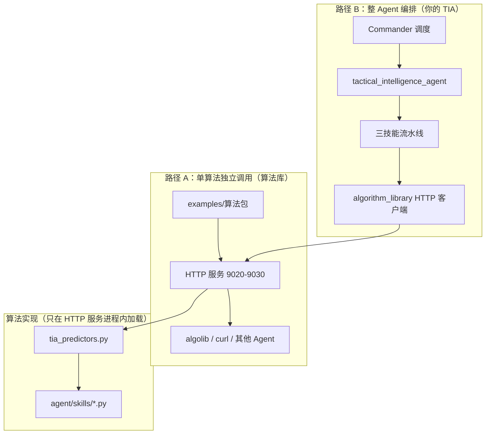
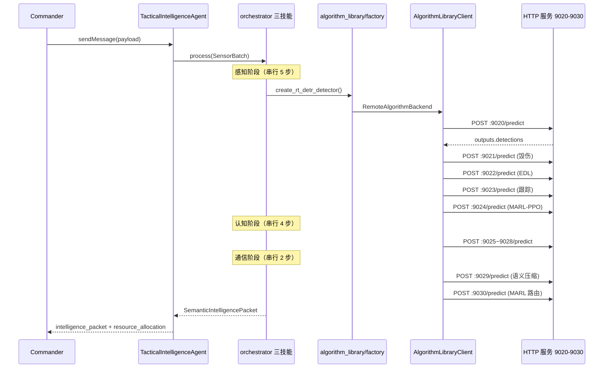

# TIA 算法接入与 Agent 编排指南

> 架构细节见：[TIA_ALGORITHM_PACKAGE_ARCHITECTURE.md](./TIA_ALGORITHM_PACKAGE_ARCHITECTURE.md)

本文档说明两件核心事情：

1. **如何把 TIA 子算法包装进师兄算法库**（register → activate → run）
2. **TIA Agent 如何编排并 HTTP 调用算法库**（默认不加载本地模型）

---

## 0. 先理解两条并行路径



| 路径 | 谁调用 | 何时用 |
|------|--------|--------|
| **A** | `algolib`、验收脚本、curl、其他 Agent | 单独测一个算法、师兄验收 |
| **B** | `TacticalIntelligenceAgent` | 完整战术情报流水线（默认模式） |

**关键原则**：Agent 进程默认 **不直接跑模型**；它只编排流水线，通过 HTTP 调路径 A 的服务。模型权重在 HTTP 服务进程里加载。

---

## 1. 流程一：把算法包装进算法库

### 1.1 师兄要求的交付物

每个 `algorithm_id` 必须能完成：

```text
register  → 算法包目录 + algorithm_card.yaml + schema + golden case
activate  → HTTP /health 返回 ready + model_loaded
run       → POST /predict 输入/输出符合 schema
```

### 1.2 标准目录（以 `marl_ppo_task_scheduler` 为例）

```text
examples/marl_ppo_task_scheduler/1.0.0/     ← 算法库「认识」这个算法的元数据
├── algorithm_card.yaml                     ← 身份证：ID、端口、能力、资源
├── input.schema.json                       ← 输入契约
├── output.schema.json                      ← 输出契约
├── golden_cases/
│   ├── case_001_request.json               ← algolib run 的标准请求
│   └── case_001_response.json              ← 期望输出样例
├── README.md
└── service_contract.md                       ← /health /metadata /predict

services/marl_ppo_task_scheduler/app/main.py  ← FastAPI 入口（端口 9024）

services/a2a_algorithms_common/
├── http_service.py                           ← 统一三端点工厂
└── tia_predictors.py                         ← 把 HTTP inputs 映射到 agent/skills
```

### 1.3 包装一个新算法的步骤（Checklist）

| 步骤 | 做什么 | 文件/命令 |
|------|--------|-----------|
| ① 实现算法后端 | `AlgorithmBackend.run(inputs)` | `agent/skills/<skill>/<name>.py` |
| ② 写 predict 函数 | HTTP `inputs` → `run()` → `outputs` | `tia_predictors.py` 增加 `predict_<id>()` |
| ③ 注册到表 | algorithm_id → predict 函数 | `PREDICTOR_REGISTRY` |
| ④ 生成算法包 | 卡片、schema、golden case、main.py | `python scripts/bootstrap_tia_algorithm_packages.py` |
| ⑤ 手调 schema/卡片 | `when_to_use`、端口、能力描述 | `examples/<id>/1.0.0/` |
| ⑥ 启动 HTTP 服务 | 监听固定端口 | `services/<id>/app/main.py` |
| ⑦ 验收 | register / activate / run | `python scripts/acceptance_tia_algorithm_packages.py` |

### 1.4 单算法 HTTP 调用链

```text
POST http://127.0.0.1:9024/predict
  Body: { algorithm_id, version, inputs, params }
    ↓
services/marl_ppo_task_scheduler/app/main.py
    ↓
create_algorithm_app() → /health 检查 model_loaded
    ↓
tia_predictors.predict_marl_ppo_task_scheduler(inputs)
    ↓
MARLPPOScheduler.run(inputs)    ← 算法实现（mock 或 real）
    ↓
Response: { ok: true, outputs: { sensor_assignments, reattack_plan, ... } }
```

### 1.5 生成 / 启动 / 验收

```powershell
# 1. 生成或刷新 11 个算法包目录
$env:TIA_USE_MOCK="1"
python scripts/bootstrap_tia_algorithm_packages.py

# 2. 启动 TIA 11 个 HTTP 服务（9020–9030）
./scripts/start_a2a_algorithm_services.ps1 -TiaOnly

# 3. Python 等价验收（无需 algolib.exe）
python scripts/acceptance_tia_algorithm_packages.py

# 4. 单算法 curl 测试
curl -X POST http://127.0.0.1:9024/predict `
  -H "Content-Type: application/json" `
  -d "@examples/marl_ppo_task_scheduler/1.0.0/golden_cases/case_001_request.json"
```

### 1.6 algolib 原生流程（可选，需编译 C++）

```powershell
cmake -S . -B build
cmake --build build --config Release

.\build\Release\algolib.exe register .\examples\marl_ppo_task_scheduler\1.0.0
.\build\Release\algolib.exe activate marl_ppo_task_scheduler 1.0.0 python_http_service
.\build\Release\algolib.exe run .\examples\marl_ppo_task_scheduler\1.0.0\golden_cases\case_001_request.json
```

---

## 2. 流程二：Agent 编排调用算法库

### 2.1 整体时序



### 2.2 Agent 侧关键模块

| 模块 | 路径 | 职责 |
|------|------|------|
| 编排器 | `agent/orchestrator.py` | 串联感知 → 认知 → 通信 |
| 技能流水线 | `agent/skills/*/skill.py` | 定义步骤顺序与数据传递 |
| 后端工厂 | `agent/algorithm_library/factory.py` | 按模式创建远程/本地后端 |
| HTTP 客户端 | `agent/algorithm_library/client.py` | `POST /predict` |
| 端点表 | `agent/algorithm_library/endpoints.py` | algorithm_id → 端口 |
| 远程后端 | `agent/algorithm_library/remote_backend.py` | 与本地 `AlgorithmBackend` 同接口 |
| 调度适配 | `agent/skills/perception/schedule_adapter.py` | MARL-PPO 输出 → `resource_allocation` |

### 2.3 三技能编排顺序

```text
感知 PerceptionSkill
  9020 battlefield_rtdetr_detector      → detections
  9021 siamese_mask2former_damage       → damage_reports → 写入 detections
  9022 edl_evidential_verifier          → verified_detections
  9023 motr_neural_kalman_tracker       → tracks
  9024 marl_ppo_task_scheduler          → sensor_assignments + reattack_plan

认知 CognitionSkill
  9025 imagebind_multimodal_encoder     → embeddings
  9026 multimodal_mamba_fusion          → fused_embeddings
  9027 supcon_meta_classifier           → classifications
  9028 synapse_rag_retriever            → entities + rag_context

通信 CommunicationSkill
  9029 knowledge_semantic_comm          → summary + targets + semantic_vector
  9030 marl_dynamic_router              → routes（抗干扰路由）
```

### 2.4 配置（`config/default.yaml`）

```yaml
# 默认：通过算法库 HTTP 调用，Agent 不加载本地模型
execution_mode: algorithm_library

algorithm_library:
  enabled: true
  host: 127.0.0.1
  timeout_ms: 30000
  # 可选：覆盖某个算法的 endpoint
  # endpoints:
  #   marl_ppo_task_scheduler: http://127.0.0.1:9024/predict
```

| 配置项 | 含义 |
|--------|------|
| `execution_mode: algorithm_library` | Agent 走 HTTP 调算法库（**默认**） |
| `execution_mode: in_process` | Agent 进程内直接调 `agent/skills`（开发/单测） |
| `TIA_EXECUTION_MODE` 环境变量 | 覆盖 yaml，优先级最高 |
| `algorithm_library.enabled: false` | 等价于 `in_process` |

### 2.5 启动 Agent 的完整顺序

```powershell
# 终端 1：先启动算法库 HTTP 服务（必须）
$env:TIA_USE_MOCK="1"
./scripts/start_a2a_algorithm_services.ps1 -TiaOnly

# 终端 2：再启动 TIA Agent
$env:TIA_CONFIG="config/default.yaml"
python tactical_intelligence_agent/main.py
```

> **注意**：`TIA_USE_MOCK` 设在 **HTTP 服务进程** 的环境变量里，控制算法库内 mock/real；Agent 进程不需要设此项。

### 2.6 Agent 输出给 Commander 的字段

| 字段 | 来源 |
|------|------|
| `intelligence_packet` | 语义压缩情报包（含 `task_schedule`） |
| `intelligence_packet.task_schedule` | 9024 MARL-PPO 调度结果 |
| `resource_allocation` | `schedule_adapter` 转换，供 `execution_control_planner` 消费 |
| `output_attachments` | 标注图等产物 URI |

---

## 3. 11 个算法清单

| algorithm_id | 端口 | TIA 技能 | 作用 |
|---|---:|---|---|
| `battlefield_rtdetr_detector` | 9020 | 感知 | 目标检测 |
| `siamese_mask2former_damage` | 9021 | 感知 | 毁伤评估 |
| `edl_evidential_verifier` | 9022 | 感知 | 检测验证 |
| `motr_neural_kalman_tracker` | 9023 | 感知 | 多目标跟踪 |
| `marl_ppo_task_scheduler` | 9024 | 感知/规划 | 传感器分配 + 重攻击 |
| `imagebind_multimodal_encoder` | 9025 | 认知 | 多模态嵌入 |
| `multimodal_mamba_fusion` | 9026 | 认知 | 时序融合 |
| `supcon_meta_classifier` | 9027 | 认知 | 敌我分类 |
| `synapse_rag_retriever` | 9028 | 认知 | 知识检索 |
| `knowledge_semantic_comm` | 9029 | 通信 | 语义压缩 |
| `marl_dynamic_router` | 9030 | 通信 | 抗干扰路由 |

---

## 4. 环境变量速查

| 变量 | 设在哪里 | 含义 |
|------|----------|------|
| `TIA_USE_MOCK=1` | HTTP 服务进程 | 算法库内用启发式 mock，无需 GPU |
| `TIA_USE_MOCK=0` | HTTP 服务进程 | 加载 `models/checkpoints/` 真实权重 |
| `TIA_EXECUTION_MODE=algorithm_library` | Agent 进程 | 强制走 HTTP（默认） |
| `TIA_EXECUTION_MODE=in_process` | Agent 进程 | 本地直连，跳过 HTTP |
| `TIA_CONFIG` | Agent 进程 | 配置文件路径 |
| `TIA_SKIP_WARMUP=1` | Agent 进程 | 跳过启动预热 |
| `PORT` | 单个 HTTP 服务 | 覆盖默认监听端口 |

---

## 5. 测试命令

```powershell
# 算法包验收（11/11）
python scripts/acceptance_tia_algorithm_packages.py

# 算法库 HTTP 服务单元测试
pytest tests/python/test_tia_algorithm_services.py -q

# Agent 算法库客户端测试
pytest tests/test_algorithm_library_client.py -q

# MARL-PPO + 本地模式单测（自动 in_process）
pytest tests/test_marl_ppo_scheduler.py -q
```

---

## 6. 常见问题

| 现象 | 原因 | 处理 |
|------|------|------|
| Agent 报「无法连接算法库服务」 | HTTP 服务未启动 | 先跑 `start_a2a_algorithm_services.ps1 -TiaOnly` |
| `/health` 返回 `not_ready` | real 模式缺权重 | 改 `TIA_USE_MOCK=1` 或准备 `models/checkpoints/` |
| Agent 仍在加载本地 GPU 模型 | `execution_mode` 为 `in_process` | 检查 `config/default.yaml` 和 `TIA_EXECUTION_MODE` |
| algolib 编译失败 | CMake 拉不到 GitHub 依赖 | 用 Python 验收脚本代替 |
| 单测失败 | 未设 `in_process` 且无 HTTP 服务 | 单测里设 `TIA_EXECUTION_MODE=in_process` |

---

## 7. 相关文档

| 文档 | 内容 |
|------|------|
| [TIA_ALGORITHM_PACKAGE_ARCHITECTURE.md](./TIA_ALGORITHM_PACKAGE_ARCHITECTURE.md) | 四层架构、文件职责、MARL 细节 |
| [OFFLINE_DEPLOYMENT.md](./OFFLINE_DEPLOYMENT.md) | 内网离线部署 |
| `algorithm_integration_guide_for_juniors.md` | 师兄原始接入规范 |
| `examples/marl_ppo_task_scheduler/1.0.0/README.md` | 单算法包示例 |
