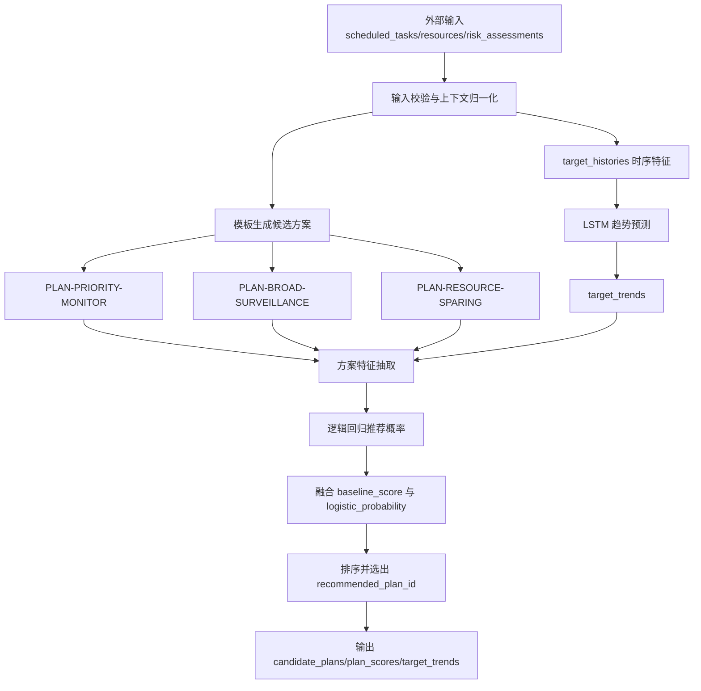
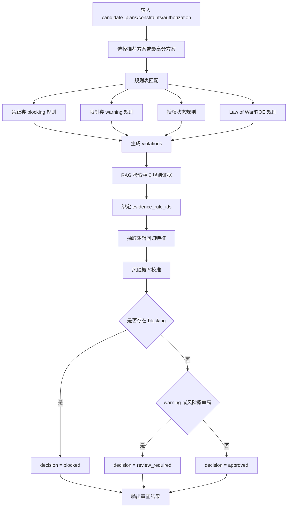

## 2026-06-12-刘子豪-周报

### 1. 根据师兄最新修改进行适配

本周主要围绕主分支最新代码变化，对本人负责的方案生成 Agent 和规则/授权 Agent 进行了小范围适配。当前适配原则是不直接合入主分支的大框架修改，而是在现有 `lzh` 分支内保持功能可运行、接口可对齐、后续可合并。

主要完成内容如下：

- 清理了原先与航迹、威胁排序相关的 Agent、算法、样例数据和脚本引用，将当前工作重心收敛到两个核心能力：方案生成 Agent 与规则/合规授权 Agent。
- 将 `DecisionSupportWorkflow` 调整为两步流程：`DecisionPlanningAgent -> ComplianceAuthorizationAgent`，便于后续围绕方案生成和规则审查形成闭环。
- 对 A2A 返回结构做了标准化适配，两个 Agent 统一输出 `decision_planning_result`、`compliance_authorization_result`、`agent_response`、`selected_algorithms`、`warnings` 和 `rag_evidence`。
- Commander 侧增加外部输入入口，支持通过 CLI、Manager API 和 `CommanderAgent(initial_context=...)` 注入 `scheduled_tasks`、`resources`、`risk_assessments`、`constraints`、`authorization` 等上游数据。
- 保留当前分支原有 `/sendMessage` 调用方式，同时补充 `execute_task()` 兼容接口，为后续与主分支 A2A 基类对接做准备。
- 完成相关回归验证，确认两步决策工作流、local runtime、BPEL 基础流程没有被破坏。

本部分工作的意义在于：先把本人负责模块从原先较发散的航迹/威胁排序试验代码中拆出来，形成边界更清晰、输入输出更稳定的方案生成和规则审查子系统。

### 2. 增强方案生成 Agent 和规则 Agent 的算法实现

结合技术协议中对“方案规划与决策”和“规则/法律/授权约束”的要求，本周对两个 Agent 的算法层进行了增强。当前采用的是纯 Python baseline，不新增 `numpy`、`sklearn`、`torch` 等训练依赖，重点先固定输入输出和推理流程，后续可替换为 ONNX 或真实训练模型。

#### 2.1 方案生成 Agent

方案生成 Agent 当前负责根据外部输入的任务、资源、风险评估、约束和授权状态，生成不少于 3 个候选方案，并给出推荐方案。

本周新增/完善内容如下：

- 新增 `target_histories` 输入，用于描述目标级历史风险变化序列。
- 新增 `planning_objectives` 输入，用于表达方案偏好，例如 `risk_first`、`coverage_first`、`resource_sparing`。
- 保留并规范化 3 类基础候选方案模板：高优先级目标重点监控方案、全域覆盖/广域监控方案、资源节约型方案。
- 在原有多因素评分基础上，引入逻辑回归评分机制，对每个候选方案输出 `logistic_probability`。
- 用纯 Python 实现单层 LSTM cell，对目标历史风险序列进行趋势预测，输出 `target_trends`。
- 将 LSTM 趋势分、覆盖率、风险匹配度、资源效率、约束符合度、授权状态、任务优先级等特征统一纳入方案推荐评分。

方案生成 Agent 的整体流程如下：



算法实现分为 4 层。

第一层是模板生成。当前根据输入任务和资源生成 3 个候选方案：

| 方案 ID | 生成逻辑 | 适用场景 |
| ------- | -------- | -------- |
| `PLAN-PRIORITY-MONITOR` | 按风险分数和任务优先级排序，优先覆盖高风险目标 | 风险优先、需要重点复核 |
| `PLAN-BROAD-SURVEILLANCE` | 覆盖所有计划任务目标，尽量使用可用资源 | 覆盖优先、态势不明确 |
| `PLAN-RESOURCE-SPARING` | 只选择最高优先级目标，并使用最少可用资源 | 资源紧张、需保留后续能力 |

第二层是 baseline 多因素评分。对每个候选方案计算：

```text
baseline_score =
  coverage * 0.35
+ risk_alignment * 0.30
+ resource_efficiency * 0.20
+ constraint_fit * 0.15
```

各特征含义如下：

| 特征 | 计算方式 | 含义 |
| ---- | -------- | ---- |
| `coverage` | 方案覆盖目标数 / 计划任务目标数 | 衡量任务覆盖范围 |
| `risk_alignment` | 方案覆盖目标风险分之和 / 总风险分 | 衡量是否优先关注高风险目标 |
| `resource_efficiency` | 根据使用资源数量占可用资源比例分段打分 | 衡量资源节约程度 |
| `constraint_fit` | 根据约束文本、方案 ID、方案目标数量进行规则化打分 | 衡量方案是否贴合外部约束 |

第三层是 LSTM 趋势预测。输入为目标历史序列：

```json
{
  "target_id": "TGT-B",
  "steps": [
    {
      "timestamp": "2026-06-12T10:00:00Z",
      "risk_score": 58.0,
      "probability": 0.62,
      "priority": 1,
      "resource_pressure": 0.55
    }
  ]
}
```

每个时间步被转换成 4 维向量：

```text
x_t = [
  risk_score / 100,
  probability,
  1 / priority,
  resource_pressure
]
```

单层 LSTM cell 使用四个门控进行递推：

```text
i_t = sigmoid(W_i * x_t + U_i * h_{t-1} + b_i)
f_t = sigmoid(W_f * x_t + U_f * h_{t-1} + b_f)
o_t = sigmoid(W_o * x_t + U_o * h_{t-1} + b_o)
g_t = tanh(W_g * x_t + U_g * h_{t-1} + b_g)

c_t = f_t * c_{t-1} + i_t * g_t
h_t = o_t * tanh(c_t)
```

最后结合首尾风险变化量得到趋势分：

```text
trend_score = sigmoid(
  2.2 * h_t
+ 1.1 * risk_delta
+ 0.8 * probability_delta
)
```

趋势标签规则为：

| `trend_score` 范围 | 趋势标签 |
| ----------------- | -------- |
| `>= 0.6` | `rising` |
| `0.4 - 0.6` | `stable` |
| `<= 0.4` | `falling` |

若没有历史序列，则默认 `trend_score = 0.5`，表示中性趋势，不阻断方案生成。

第四层是逻辑回归推荐评分。对每个候选方案提取以下特征：

| 特征 | 来源 | 说明 |
| ---- | ---- | ---- |
| `coverage` | baseline 特征 | 覆盖率归一化 |
| `risk_alignment` | baseline 特征 | 风险匹配度归一化 |
| `resource_efficiency` | baseline 特征 | 资源效率归一化 |
| `constraint_fit` | baseline 特征 | 约束符合度归一化 |
| `authorization` | 授权状态 | `approved` 分高，`denied/expired` 分低 |
| `lstm_trend` | LSTM 输出 | 方案覆盖目标的平均趋势分 |
| `priority` | 任务优先级 | 优先级越高，特征值越高 |
| `objective_fit` | `planning_objectives` | 判断方案是否匹配风险优先、覆盖优先或资源节约偏好 |

逻辑回归计算公式为：

```text
z = b + w1*x1 + w2*x2 + ... + wn*xn
logistic_probability = sigmoid(z)
```

当前纯 Python baseline 使用固定权重：

| 权重项 | 当前权重 |
| ------ | -------- |
| `intercept` | `-1.45` |
| `coverage` | `1.20` |
| `risk_alignment` | `1.05` |
| `resource_efficiency` | `0.60` |
| `constraint_fit` | `0.85` |
| `authorization` | `0.55` |
| `lstm_trend` | `0.75` |
| `priority` | `0.45` |
| `objective_fit` | `0.35` |

最终分数融合公式为：

```text
final_score = 0.7 * logistic_probability * 100 + 0.3 * baseline_score
```

这样做的好处是：既保留了原有规则评分的可解释性，又让逻辑回归和 LSTM 趋势能够影响最终推荐排序。

方案生成 Agent 当前输出结构中已增加：

```json
{
  "candidate_plans": [],
  "recommended_plan_id": "PLAN-...",
  "plan_scores": [
    {
      "plan_id": "PLAN-...",
      "logistic_probability": 0.82,
      "lstm_trend_score": 0.67,
      "baseline_score": 76.5,
      "final_score": 84.5,
      "features": {}
    }
  ],
  "target_trends": [
    {
      "target_id": "TGT-A",
      "trend": "rising",
      "trend_score": 0.67
    }
  ],
  "method": "template_generation_logistic_lstm_scoring"
}
```

当前算法分工如下：

| 算法 | 当前用途 | 输入特征 | 输出 |
| ---- | -------- | -------- | ---- |
| 模板生成 | 生成基础候选方案 | `scheduled_tasks`、`resources`、`risk_assessments` | `candidate_plans` |
| 逻辑回归 | 对方案进行推荐概率评分 | 覆盖率、风险匹配度、资源效率、约束符合度、授权状态、任务优先级、目标趋势 | `logistic_probability` |
| LSTM | 预测目标风险趋势 | `target_histories.steps` 中的 `risk_score`、`probability`、`priority`、`resource_pressure` | `target_trends` |
| 综合评分 | 融合规则评分和模型评分 | `baseline_score`、`logistic_probability` | `final_score`、`recommended_plan_id` |

#### 2.2 规则/合规授权 Agent

规则 Agent 当前负责对候选方案进行规则校验、合规审查和授权状态判断，输出 `approved`、`blocked` 或 `review_required`。

本周新增/完善内容如下：

- 保留原有关键词规则、规则表 DSL 和本地知识检索证据。
- 将 `medium` 预算下的规则算法增强为“规则表 + RAG 证据 + 逻辑回归校准”。
- 新增 `risk_probability` 和 `compliance_probability`，用于表达方案合规风险概率。
- 新增 `logistic_features`，记录逻辑回归所用特征，便于解释和调参。
- 保持规则优先原则：只要命中 blocking 规则，即使逻辑回归风险概率较低，也必须输出 `blocked`。

规则/合规授权 Agent 的整体流程如下：



规则 Agent 的算法实现分为 5 层。

第一层是方案选择。优先选择 `status = recommended` 的方案；如果没有推荐方案，则选择 `score` 最高的候选方案作为主审查对象。同时保留 `per_plan_results`，对每个候选方案都给出独立审查结果，便于后续比较和回退。

第二层是规则表匹配。当前规则表按以下类型组织：

| 规则类型 | 示例 | 输出 |
| -------- | ---- | ---- |
| 禁止类规则 | 方案动作包含直接执行、不可逆行动等词汇 | `blocking` |
| 限制类规则 | 方案或约束中出现 restricted、boundary、high-risk 等复核词 | `warning` |
| 授权状态规则 | `pending_review`、`unknown`、`denied`、`expired` | `warning` 或 `blocking` |
| 授权范围规则 | 授权范围未覆盖当前方案或未包含 ROE/法律复核 | `warning` |
| Law of War 规则 | 区分原则、比例原则、必要性、人道原则、预防措施等 | `warning` 或 `blocking` |

规则匹配后形成统一的违规结构：

```json
{
  "rule_id": "AUTH-STATE-PENDING",
  "severity": "warning",
  "item": "PLAN-BROAD-SURVEILLANCE",
  "message": "Authorization is pending review.",
  "suggestion": "Obtain human approval before marking the plan approved.",
  "evidence_rule_ids": []
}
```

第三层是 RAG 证据检索。规则 Agent 会将授权状态、方案名称、方案动作、约束条件、命中的规则 ID 和违规说明拼接为检索 query，并从本地规则知识库中召回证据。召回后会按 `rule_id` 去重，并绑定到 `violations.evidence_rule_ids` 中。这样最终审查结果不仅有规则命中，还能追溯到对应依据。

第四层是逻辑回归风险校准。当前抽取的特征如下：

| 特征 | 计算方式 | 含义 |
| ---- | -------- | ---- |
| `blocking_violation_count` | blocking 数量截断到 3 后归一化 | 严重违规程度 |
| `warning_violation_count` | warning 数量截断到 5 后归一化 | 需复核程度 |
| `authorization_status_score` | 根据授权状态映射风险值 | 授权风险 |
| `authorization_out_of_scope` | 是否命中授权范围不足规则 | 授权边界风险 |
| `rag_evidence_count` | RAG 证据数截断到 6 后归一化 | 证据支撑强度 |
| `law_of_war_rule_hit` | 是否命中 `LOW-*` 规则 | 法律/ROE 风险 |

授权状态风险映射为：

| 授权状态 | 风险值 |
| -------- | ------ |
| `approved` | `0.00` |
| `pending_review` | `0.55` |
| `unknown` | `0.65` |
| `expired` | `0.95` |
| `denied` | `1.00` |

逻辑回归计算公式为：

```text
z = b + w1*x1 + w2*x2 + ... + wn*xn
risk_probability = sigmoid(z)
compliance_probability = 1 - risk_probability
```

当前固定权重为：

| 权重项 | 当前权重 |
| ------ | -------- |
| `intercept` | `-2.20` |
| `blocking_violation_count` | `3.00` |
| `warning_violation_count` | `0.85` |
| `authorization_status_score` | `1.10` |
| `authorization_out_of_scope` | `0.90` |
| `rag_evidence_count` | `0.35` |
| `law_of_war_rule_hit` | `0.80` |

第五层是决策融合。最终不是简单按照概率阈值判断，而是采用“规则优先 + 概率校准”的策略：

```text
if blocking_violation_count > 0:
    decision = blocked
elif warning_violation_count > 0:
    decision = review_required
elif risk_probability >= 0.55:
    decision = review_required
else:
    decision = approved
```

该策略保证高风险规则不会被概率模型覆盖，同时也允许逻辑回归在无显式 blocking 的情况下提醒人工复核。

规则 Agent 当前输出结构中已增加：

```json
{
  "decision": "approved | blocked | review_required",
  "risk_probability": 0.72,
  "compliance_probability": 0.28,
  "logistic_features": {
    "blocking_violation_count": 0.0,
    "warning_violation_count": 0.4,
    "authorization_status_score": 0.55,
    "authorization_out_of_scope": 0.0,
    "rag_evidence_count": 0.5,
    "law_of_war_rule_hit": 0.0
  },
  "method": "rule_table_rag_logistic_calibration"
}
```

当前规则 Agent 的算法分工如下：

| 算法 | 当前用途 | 输入特征 | 输出 |
| ---- | -------- | -------- | ---- |
| 关联规则/规则表 | 判断禁止、限制、授权状态和人工复核条件 | `candidate_plans`、`constraints`、`authorization` | `violations`、`blocked_items` |
| RAG 证据检索 | 检索规则、授权、Law of War 相关依据 | 规则命中结果、方案动作、授权状态 | `rag_evidence` |
| 逻辑回归 | 对规则审查结果做风险概率校准 | blocking 数、warning 数、授权风险、证据数量、LOW 规则命中 | `risk_probability`、`compliance_probability` |
| 决策融合 | 形成最终审查结论 | 规则结果、风险概率 | `approved`、`blocked`、`review_required` |

### 3. 查找合适的方案模板与规则文档

本周继续梳理了适合方案生成与规则审查的公开文档和数据源，重点用于后续构建 RAG 知识库、规则模板库和合规审查样例集。

| 序号 | 文档/数据源                                                  | 类型                       | 主要用途                                                     | 下载/入口                                                    |
| ---- | ------------------------------------------------------------ | -------------------------- | ------------------------------------------------------------ | ------------------------------------------------------------ |
| 1    | **Sanremo Handbook on Rules of Engagement**                  | ROE 手册                   | 最适合作为 ROE 规则模板库。可用于抽取 `permission / prohibition / restriction / authorization / exception` 类型规则，做规则 Agent 的核心知识源。Sanremo 手册说明其目的就是帮助起草 ROE，并服务训练、行动和多国协同场景。 | [PDF](https://iihl.org/wp-content/uploads/2022/12/ROE-HANDBOOK-ENGLISH.pdf) |
| 2    | **Newport Rules of Engagement Handbook, 2022**               | ROE 手册                   | 适合做“国家/多国 ROE 开发、训练、演习、兵棋推演、行动规划”的规则模板库。页面明确说明该手册用于帮助开发 national and multinational ROE。 | [下载页](https://digital-commons.usnwc.edu/ils/vol98/iss1/2/) / [PDF](https://digital-commons.usnwc.edu/cgi/viewcontent.cgi?article=2998&context=ils) |
| 3    | **ICRC Handbook on International Rules Governing Military Operations** | 国际规则操作手册           | 适合作为“规则/法律/授权约束 Agent”的总纲知识库。它覆盖 combat、law enforcement、peace support operations，并把国际法框架转化为军事行动中的规则理解。 | [PDF](https://www.icrc.org/sites/default/files/topic/file_plus_list/0431-handbook_on_international_rules_governing_military_operations.pdf) |
| 4    | **ICRC Customary IHL Rules — 161 Rules**                     | 习惯国际人道法规则库       | 最适合结构化成机器可校验规则。ICRC 页面说明该库包含 2005 年研究识别出的 161 条习惯国际人道法规则。 | [规则入口](https://ihl-databases.icrc.org/en/customary-ihl/rules) |
| 5    | **ICRC IHL Treaties, States Parties and Commentaries**       | 条约与评注数据库           | 适合做法律依据检索层，覆盖 Geneva Conventions、Additional Protocols、武器限制条约等。ICRC 页面说明该库包含 IHL 条约文本、相关文件、缔约国和评注。 | [数据库入口](https://ihl-databases.icrc.org/en/ihl-treaties) |
| 6    | **U.S. DoD Law of War Manual, updated July 2023**            | 战争法手册                 | 适合作为大体量法律解释语料，用于区分原则、比例原则、预防措施、目标合法性、指挥责任等问答和合规说明。 | [PDF](https://media.defense.gov/2023/Jul/31/2003271432/-1/-1/0/dod-law-of-war-manual-june-2015-updated-july%202023.pdf) |
| 7    | **Operational Law Handbook, 2024**                           | 作战法手册                 | 适合做“ROE 与作战法关系”的解释库，尤其是 ROE、使用武力、国安法、战区法律支持等内容。 | [PDF](https://tjaglcs.army.mil/Portals/0/Publications/Deskbooks%20and%20Handbooks/2024%20Operational%20Law%20Handbook%20(2024).pdf) |
| 8    | **UK JSP 383: Joint Service Manual of the Law of Armed Conflict** | 武装冲突法手册             | 适合作为英方 LOAC 视角补充，能增强 RAG 对不同法域表达方式的覆盖。GOV.UK 页面说明该手册用于帮助相关人员在行动、训练、规划中适用武装冲突法。 | [下载页](https://www.gov.uk/government/publications/jsp-383-the-joint-service-manual-of-the-law-of-armed-conflict-2004-edition) / [PDF](https://assets.publishing.service.gov.uk/media/5a7952bfe5274a2acd18bda5/JSP3832004Edition.pdf) |
| 9    | **UN Guidelines on Use of Force by Military Components in Peacekeeping Operations** | 联合国维和用武指南         | 适合做“维和/授权任务/自卫/保护平民/必要性与比例性”场景。文档说明其目的是明确联合国维和任务中战术和行动层面的适当用武，并强调与任务授权、ROE、国际法一致。 | [PDF](https://resourcehub01.blob.core.windows.net/%24web/Policy%20and%20Guidance/corepeacekeepingguidance/Thematic%20Operational%20Activities/Military/2016.24%20Guidelines%20on%20Use%20of%20Force%20by%20Military%20Components%20in%20Peacekeeping%20Operations%20Jan2017.pdf) |
| 10   | **UNODC GMCP Rules of Engagement Handbook**                  | 海上执法/海上安全 ROE 手册 | 适合海上场景、登临检查、海上执法、反海盗/海上犯罪任务中的 ROE 检索。搜索结果显示其核心目的之一是说明不同情况下使用武力的 permission 和 limitation。 | [PDF](https://www.unodc.org/documents/Maritime_crime/UNODC_GMCP_Rules_of_Engagement_Handbook.pdf) |

### 4. 初步实现 RAG 的流程

本周初步实现了一个轻量级 RAG 流程，用于支撑方案生成 Agent 的依据增强和规则 Agent 的合规证据检索。当前实现以“可跑通、可解释、可替换”为目标，先完成文档入库、检索、重排、证据绑定和回答生成的最小闭环，后续再逐步替换为向量数据库、OCR 解析和更强的国产模型。

#### 4.1 RAG 流程设计

当前 RAG 流程划分为 8 个步骤：

1. 文档采集：收集 ROE、Law of War、授权链、方案约束等公开文档。
2. 文档清洗：去除页眉页脚、目录噪声、重复段落和无效符号。
3. 规则化分块：按标题、规则编号、条款编号、段落语义进行 chunk 切分。
4. 元数据标注：为每个 chunk 标注 `source`、`rule_id`、`title`、`tags`、`applicable_agent`、`severity_hint`。
5. 向量化索引：将 chunk 转成 embedding，建立本地向量索引。
6. 混合检索：同时使用关键词检索和向量检索，召回候选证据。
7. 重排序：使用 reranker 对候选证据进行相关性排序，保留 top-k。
8. 证据生成与绑定：将证据注入方案生成或规则审查提示词，并把证据 ID 绑定到输出结果中。

#### 4.2 RAG 在两个 Agent 中的作用

| Agent | RAG 作用 | 当前输出 |
| ----- | -------- | -------- |
| 方案生成 Agent | 检索任务约束、资源使用边界、方案模板说明，用于增强候选方案的 `rationale` 和 `assumptions` | `candidate_plans`、`plan_scores`、`rag_evidence` |
| 规则 Agent | 检索 ROE、授权、限制、禁止、例外条件和法律原则，用于解释违规原因和审查建议 | `violations`、`evidence`、`risk_probability` |

#### 4.3 国产小模型选型

RAG 流程中的每个模型环节均优先选择国产小模型，方便后续离线部署、国产化适配和轻量化推理。

| RAG 环节 | 推荐国产小模型 | 参数/特点 | 选择原因 |
| -------- | -------------- | --------- | -------- |
| 查询改写 | `Qwen3-0.6B` | 0.6B，Apache-2.0，支持指令理解和轻量推理 | 用于将用户问题、方案审查请求、BPEL 上下文改写成独立检索 query，成本低、响应快 |
| 关键词抽取 | `Qwen3-0.6B` | 小参数文本生成模型 | 用于抽取 `authorization`、`restriction`、`prohibition`、`exception`、`human-review` 等规则标签 |
| 文档切分辅助 | `Qwen3-0.6B` | 支持结构化输出 | 用于识别标题层级、规则编号和段落语义边界，辅助 chunk 切分 |
| 向量检索 | `BAAI/bge-small-zh-v1.5` | 中文 embedding 小模型，MIT License | 用于中文规则文档、授权说明和方案约束的向量化，部署成本低 |
| 中英文混合向量检索 | `BAAI/bge-base-zh-v1.5` 或 `BAAI/bge-m3` | 中文/多语言语义表示 | 当英文 ROE 和中文方案输入混用时，作为更强检索模型候选 |
| 重排序 | `BAAI/bge-reranker-v2-m3` | 多语言 reranker，轻量、易部署 | 用于对向量召回的 top-50 证据进行重排，提高最终 top-5 证据质量 |
| 规则证据压缩 | `MiniCPM3-4B` | 4B，支持 32k 上下文 | 用于把多条法律/规则证据压缩成简洁审查依据，适合较长上下文 |
| 最终回答生成 | `MiniCPM3-4B` | 小模型中综合能力较强 | 用于生成规则审查说明、方案理由、人工复核建议 |
| 证据一致性检查 | `Qwen3-0.6B` | 快速二次校验 | 用于检查输出结论是否确实被检索证据支持，减少无依据生成 |

当前默认组合为：

```text
Query Rewrite: Qwen3-0.6B
Embedding: BAAI/bge-small-zh-v1.5
Rerank: BAAI/bge-reranker-v2-m3
Evidence Compression: MiniCPM3-4B
Answer Generation: MiniCPM3-4B
Evidence Check: Qwen3-0.6B
```

#### 4.4 当前实现效果

当前 RAG 流程已经能够完成以下闭环：

- 规则文档可被切分为带 `rule_id` 和 `tags` 的知识片段。
- 规则 Agent 在审查候选方案时，可以根据授权状态、方案动作、约束条件和违规规则检索相关证据。
- 检索证据会进入 `rag_evidence`，并与 `violations` 中的 `evidence_rule_ids` 进行绑定。
- 方案生成 Agent 可以根据约束和方案目标引用相关证据，增强 `rationale`、`assumptions` 和 `handoff_notes`。
- 输出结果中保留证据来源，便于人工复查和后续评估。

#### 4.5 后续计划

下一步计划围绕以下方向继续完善：

- 将当前本地检索替换为向量检索 + BM25 混合检索。
- 增加 ROE 规则自动抽取，将公开文档转成结构化规则表。
- 增加 RAG 评估集，统计检索准确率、证据命中率和规则审查准确率。
- 将 `Qwen3-0.6B`、`BAAI/bge-small-zh-v1.5`、`BAAI/bge-reranker-v2-m3`、`MiniCPM3-4B` 封装成可配置模型后端。
- 后续根据算力情况，将模型导出为 ONNX 或通过本地推理服务统一调用。
