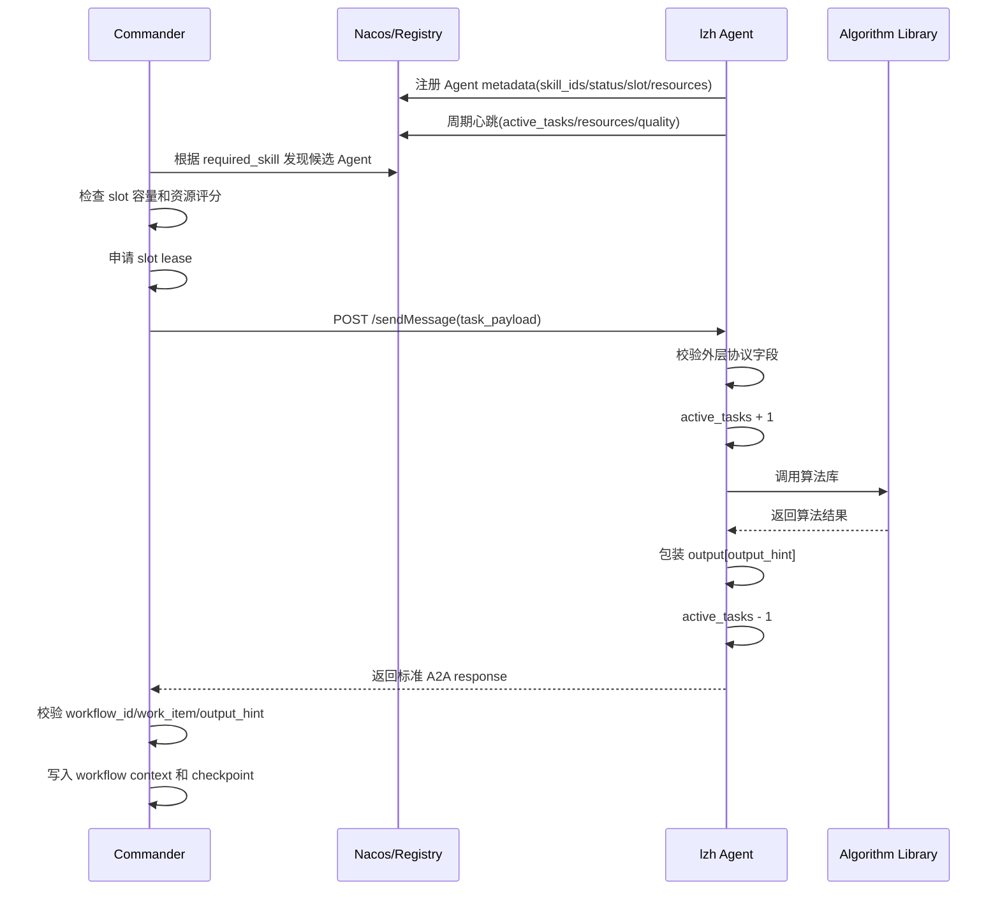

# lzh 分支真实 Agent 接入改进清单

## 1. 目的

本文档用于说明 lzh 分支中的 decision agents 要接入当前 main 分支 Direct 编排主线时，需要补充和统一的内容。

当前 main 分支已经具备：

```text
BPEL 编排
requiredSkill 精确匹配
Agent slot 并发租约
资源与质量评分排序
标准 A2A task/response 协议
checkpoint / 幂等 / 监控基础能力
```

lzh 分支已经具备：

```text
decision_planning agent
compliance_authorization agent
algolib 调用链路
本地 Qwen/Ollama 或 Azure LLM 支持
RAG / 规则 / 算法组合能力
```

因此后续重点不是重写 Commander，而是让 lzh 的真实 Agent 能够按 main 分支的 Direct 协议被 Commander 发现、匹配、调度、执行和回传结果。

## 2. 总体结论

lzh 分支与当前 main 的输入输出对接方向总体是可行的。

它没有完全推翻 main 分支的 A2A 协议，而是在标准 task payload 的 `input` 中放入 decision agent 自己的业务字段，再把算法结果包装到标准 response 的 `output` 中。

推荐保持这个方向：

```text
外层协议使用 main 分支标准 A2A task/response
内层业务字段由 decision agent 自己解释
Commander 只强校验必要的协议字段和 output_hint 对接
暂时不对 input 内部业务结构做强 schema 限制
```

也就是说，现阶段不要求把 `input.agent_request` 里面每个业务字段都严格写死。

但必须保证：

```text
workflow_id / work_item 能对上
required_skill 能匹配到 Agent 注册技能
input 必须是 object
output 必须是 object
成功响应中 output 必须包含 output_hint 指定的 key
Agent 必须能上报 slot / 心跳 / 资源 / 状态
```

## 3. 当前建议的约束范围

### 3.1 暂时不强约束 input 内部业务字段

现阶段不强制要求：

```text
input.agent_request 必须有哪些字段
risk_assessments 每一项必须是什么结构
resources 每一项必须是什么结构
constraints 每一项必须是什么结构
authorization 内部字段必须完全固定
```

这些字段可以先由 lzh Agent 自己兼容处理。

也就是说，下面这种输入可以接受：

```json
{
  "input": {
    "agent_request": {
      "request_id": "decision-planning-demo-001",
      "risk_assessments": [],
      "scheduled_tasks": [],
      "resources": [],
      "planning_objectives": [],
      "constraints": [],
      "authorization": {}
    }
  }
}
```

也可以暂时兼容 lzh 当前从 `input`、`context` 或 `payload` 多处提取字段的方式。

### 3.2 需要强约束的输入外层字段

Commander 发给 Agent 的 task payload 必须满足以下外层字段：

| 字段 | 类型 | 是否必填 | 说明 |
| --- | --- | --- | --- |
| `schema_version` | string | 是 | 当前固定为 `"1.0"`。 |
| `workflow_id` | string | 是 | 工作流实例 ID。 |
| `work_item` | string | 是 | Activity 执行实例 ID，也是幂等键。 |
| `command` | string | 是 | 本次调用动作。 |
| `required_skill` | string | 是 | 本次任务需要的主技能 ID。 |
| `required_skills` | array | 建议 | 技能列表。 |
| `input` | object | 是 | 业务输入对象，内部暂不强约束。 |
| `output_hint` | string | 是 | Agent 成功响应中必须返回的 output key。 |
| `context` | object | 可选 | workflow context 快照。 |
| `work_list` | array | 可选 | workflow work list 快照。 |
| `attachments` | array | 可选 | 附件引用。 |

最小请求示例：

```json
{
  "schema_version": "1.0",
  "workflow_id": "wf-001",
  "work_item": "wf-001:decision-planning",
  "command": "decision_planning",
  "required_skill": "decision_planning_analysis",
  "required_skills": ["decision_planning_analysis"],
  "input": {
    "agent_request": {
      "request_id": "wf-001",
      "risk_assessments": [],
      "scheduled_tasks": [],
      "resources": [],
      "planning_objectives": [],
      "constraints": [],
      "authorization": {}
    }
  },
  "output_hint": "decision_planning_result"
}
```

### 3.3 暂时不强约束 output 内部业务字段

现阶段不强制规定：

```text
decision_planning_result 内部必须有哪些字段
candidate_plans 每一项必须是什么结构
compliance_authorization_result 内部必须有哪些字段
rag_evidence 每一项必须是什么结构
selected_algorithms 的具体内容
```

这些可以先由 lzh Agent 自己定义。

### 3.4 需要强约束的输出外层字段

Agent 返回 response 必须满足以下外层字段：

| 字段 | 类型 | 是否必填 | 说明 |
| --- | --- | --- | --- |
| `schema_version` | string | 是 | 当前固定为 `"1.0"`。 |
| `workflow_id` | string | 是 | 必须与请求一致。 |
| `work_item` | string | 是 | 必须与请求一致。 |
| `agent` | string | 是 | 实际执行 Agent 名称。 |
| `role` | string | 是 | Agent 角色或类型。 |
| `status` | string | 是 | 建议成功为 `completed`，失败为 `failed`。 |
| `output` | object | 是 | 成功时必须包含 `output_hint` 指定的 key。 |
| `metrics` | object | 是 | 执行耗时、算法耗时等指标。 |
| `error` | string/null | 建议 | 失败原因。 |
| `message` | string | 建议 | 简要说明。 |

decision planning 成功响应示例：

```json
{
  "schema_version": "1.0",
  "workflow_id": "wf-001",
  "work_item": "wf-001:decision-planning",
  "agent": "decision_planning_agent",
  "role": "decision_planning",
  "command": "decision_planning",
  "status": "completed",
  "output": {
    "decision_planning_result": {
      "candidate_plans": [],
      "recommended_plan_id": "plan-001",
      "summary": "generated candidate plans"
    },
    "agent_response": {},
    "selected_algorithms": [],
    "warnings": [],
    "rag_evidence": []
  },
  "metrics": {
    "duration_ms": 120.5,
    "algorithm_duration_ms": 90.1
  },
  "error": null,
  "message": "completed"
}
```

compliance authorization 成功响应示例：

```json
{
  "schema_version": "1.0",
  "workflow_id": "wf-001",
  "work_item": "wf-001:compliance-authorization",
  "agent": "compliance_authorization_agent",
  "role": "compliance_authorization",
  "command": "compliance_authorization",
  "status": "completed",
  "output": {
    "compliance_authorization_result": {
      "decision": "review_required",
      "summary": "human review required before downstream handoff"
    },
    "agent_response": {},
    "selected_algorithms": [],
    "warnings": [],
    "rag_evidence": []
  },
  "metrics": {
    "duration_ms": 80.2,
    "algorithm_duration_ms": 60.0
  },
  "error": null,
  "message": "completed"
}
```

## 4. 必须改进项

### 4.1 统一 requiredSkill 与 Agent skill_ids

当前 lzh 分支存在潜在技能 ID 不统一的问题。

可能出现三套名称：

```text
BPEL operation 兜底得到：decision_planning
A2A adapter 注册技能：decision_planning_analysis
JSON-RPC agent card 技能：scheme_planning_decision
```

main 分支远程 Direct 模式是按技能 ID 精确匹配的，因此必须统一。

建议统一为：

```text
decision_planning_analysis
compliance_authorization_analysis
```

BPEL 中显式写：

```xml
<invoke partnerLink="DecisionPlanningAgent"
        operation="generateDecisionPlan"
        requiredSkill="decision_planning_analysis"
        inputVariables="AgentProfile RiskAssessments ScheduledTasks Resources TargetHistories PlanningObjectives Constraints Authorization"
        outputVariable="DecisionPlanningResult"/>

<invoke partnerLink="ComplianceAuthorizationAgent"
        operation="checkComplianceAuthorization"
        requiredSkill="compliance_authorization_analysis"
        inputVariables="DecisionPlanningResult Constraints Authorization"
        outputVariable="ComplianceAuthorizationResult"/>
```

Agent 注册 metadata 中写：

```json
{
  "skill_ids": "decision_planning_analysis"
}
```

```json
{
  "skill_ids": "compliance_authorization_analysis"
}
```

Agent Card 中也保持一致：

```json
{
  "skills": [
    {
      "id": "decision_planning_analysis",
      "name": "Decision Planning Analysis",
      "description": "Generate and score candidate decision-support plans."
    }
  ]
}
```

### 4.2 保留标准 /sendMessage 接口

main 分支 Commander 远程调用 Agent 时，主要期望 Agent 提供：

```text
POST /sendMessage
GET /.well-known/agent-card
GET /health
GET /ready
GET /metrics
GET /resources
```

lzh 分支中如果存在 JSON-RPC 风格的：

```text
message/send
```

可以保留，但需要额外提供 main 分支兼容的 `/sendMessage` adapter。

推荐直接复用 `A2ABaseAgent`，这样可以获得：

```text
标准 task payload 校验
标准 response 包装
work_item 幂等缓存
active_tasks 计数
max_concurrent_tasks 容量保护
metrics
ready/health/resources 接口
```

### 4.3 Agent 必须支持 slot 容量上报

Commander 侧已经实现 slot lease，但 Agent 侧必须上报自己的容量状态。

Agent metadata 或心跳中至少包含：

```json
{
  "status": "idle",
  "agent_run_state": "ready",
  "active_tasks": "0",
  "max_concurrent_tasks": "2",
  "available_task_slots": "2",
  "task_execution_status": "idle"
}
```

状态规则：

```text
active_tasks = 0
-> status=idle
-> task_execution_status=idle

0 < active_tasks < max_concurrent_tasks
-> status=busy
-> task_execution_status=busy

active_tasks >= max_concurrent_tasks
-> status=busy
-> task_execution_status=saturated
```

Agent 收到任务时也要做本地保护：

```python
if active_tasks >= max_concurrent_tasks:
    return {
        "status": "failed",
        "error_code": "AGENT_RESOURCE_EXHAUSTED",
        "error": "agent task capacity is full"
    }
```

注意：

```text
slot 分配由 Commander 做
slot 容量状态由 Agent 上报
Agent 内部仍要维护 active_tasks，防止 Commander metadata 过期导致过量派发
```

### 4.4 Agent 必须支持心跳 SDK / 注册 SDK

lzh 真实 Agent 需要注册到 Nacos 或当前注册中心，并周期性心跳。

注册时建议包含：

```json
{
  "role": "decision_planning",
  "status": "idle",
  "skill_ids": "decision_planning_analysis",
  "skills": "decision_planning_analysis,Decision Planning Analysis,方案规划,决策规划",
  "agent_run_state": "ready",
  "active_tasks": "0",
  "max_concurrent_tasks": "2",
  "available_task_slots": "2",
  "task_execution_status": "idle"
}
```

心跳时动态更新：

```json
{
  "heartbeat_ts": 1780000000,
  "heartbeat_at": "2026-07-21T10:00:00Z",
  "status": "busy",
  "agent_run_state": "ready",
  "active_tasks": "1",
  "max_concurrent_tasks": "2",
  "available_task_slots": "1",
  "task_execution_status": "busy",
  "quality_tasks_completed": "10",
  "quality_tasks_failed": "1",
  "quality_success_rate": 0.909091,
  "quality_avg_latency_ms": 120.5
}
```

### 4.5 Agent 必须上报资源字段

main 分支 Commander 会使用资源字段做排序，也支持 `resource_limits` 硬过滤。

建议 lzh Agent 上报：

```json
{
  "resource_monitor_available": "true",
  "node_online": "true",
  "resource_cpu_percent": 35.0,
  "resource_memory_percent": 62.0,
  "resource_gpu_available": "true",
  "resource_gpu_percent": 20.0,
  "resource_gpu_memory_percent": 40.0,
  "process_cpu_percent": 12.0,
  "process_memory_mb": 512.0,
  "resource_sampled_at": "2026-07-21T10:00:00Z"
}
```

当前不强制做任务级资源预留，但至少要让 Commander 能完成：

```text
资源评分排序
资源阈值过滤
Supervisor 面板展示
```

### 4.6 Agent 必须使用 work_item 做幂等

`work_item` 是一次 Activity 执行的唯一标识。

Agent 应满足：

```text
同一个 work_item 第一次执行成功后缓存结果
同一个 work_item 再次到达时返回同一个已完成结果
失败结果可以不缓存，允许修复后重新执行
```

这样 Commander 重试、恢复或 failover 时，不会导致同一个 Activity 重复执行并覆盖结果。

### 4.7 统一错误码

建议 lzh Agent 失败时返回统一错误码。

推荐错误码：

| 错误码 | 含义 |
| --- | --- |
| `SCHEMA_VALIDATION_ERROR` | 外层 task payload 缺字段或格式错误。 |
| `OUTPUT_CONTRACT_ERROR` | 成功响应中缺少 `output_hint` 对应 key。 |
| `AGENT_RESOURCE_EXHAUSTED` | Agent 并发容量已满。 |
| `AGENT_NOT_READY` | Agent 未就绪。 |
| `ALGORITHM_INPUT_ERROR` | 算法输入业务字段不满足 Agent 内部要求。 |
| `ALGORITHM_RUNTIME_ERROR` | 算法执行异常。 |
| `LLM_PROVIDER_ERROR` | LLM 服务异常。 |
| `RAG_RETRIEVAL_ERROR` | RAG 检索异常。 |

失败响应示例：

```json
{
  "schema_version": "1.0",
  "workflow_id": "wf-001",
  "work_item": "wf-001:decision-planning",
  "agent": "decision_planning_agent",
  "role": "decision_planning",
  "command": "decision_planning",
  "status": "failed",
  "output": {},
  "metrics": {
    "duration_ms": 15.0
  },
  "error": "missing required planning inputs",
  "error_code": "ALGORITHM_INPUT_ERROR",
  "message": "missing required planning inputs"
}
```

## 5. 对 input/output 的阶段性约束策略

### 5.1 当前阶段

当前阶段只要求：

```text
input 必须是 object
output 必须是 object
output 必须包含 output_hint 指定 key
workflow_id / work_item 必须和请求一致
required_skill 必须和 Agent skill_ids 一致
```

不要求：

```text
input.agent_request 内部字段完全固定
decision_planning_result 内部字段完全固定
compliance_authorization_result 内部字段完全固定
```

### 5.2 后续阶段

后续稳定后，可以再补：

```text
decision_planning.input.v1
decision_planning.output.v1
compliance_authorization.input.v1
compliance_authorization.output.v1
```

这些 schema 用于明确业务字段。

但当前不建议一开始就强推完整业务 schema，因为 lzh Agent 仍处于真实算法库接入和业务字段调整阶段。

## 6. 推荐对接流程



## 7. lzh 分支需要完成的任务清单

### 7.1 必须完成

- [x] BPEL 中显式补充 `requiredSkill`。
- [x] 统一 BPEL `requiredSkill`、Agent Card `skills.id`、Nacos metadata `skill_ids`。
- [x] decision planning Agent 提供 `/sendMessage` 标准接口。
- [x] compliance authorization Agent 提供 `/sendMessage` 标准接口。
- [x] Agent 注册到 Nacos 或当前注册中心。
- [x] Agent 心跳上报 `status`、`active_tasks`、`max_concurrent_tasks`、`available_task_slots`、`task_execution_status`。
- [x] Agent 心跳上报 CPU、内存、GPU 等资源字段。
- [x] Agent 内部实现 `active_tasks` 计数和满载拒绝。
- [x] Agent 使用 `work_item` 做幂等。
- [x] Agent 成功响应必须包含 `output[output_hint]`。
- [x] Agent 失败响应必须包含统一 `status=failed` 和 `error_code`。

### 7.2 建议完成

- [x] 复用 main 分支 `A2ABaseAgent`，避免重复实现 slot、幂等、ready、metrics。
- [x] 保留 `agent_response`，方便调试算法库内部结果。
- [ ] 在 `metrics` 中补充 `algorithm_duration_ms`、`llm_duration_ms`、`rag_duration_ms`。
- [x] 在 response 中补充 `selected_algorithms`、`warnings`、`rag_evidence`。
- [x] Supervisor 面板可展示 lzh Agent 的 skill、资源、slot、成功率和延迟。
- [x] 增加 remote Direct 模式联调测试。

### 7.3 暂不强制

- [ ] 暂不强制 `input.agent_request` 内部完整 schema。
- [ ] 暂不强制 `decision_planning_result` 内部完整 schema。
- [ ] 暂不强制任务级资源需求预估。
- [ ] 暂不强制 result_id / 独立 ResultSpace。

## 8. 最小验收标准

### 8.1 Commander 能发现 Agent

Nacos metadata 中能看到：

```json
{
  "status": "idle",
  "skill_ids": "decision_planning_analysis",
  "active_tasks": "0",
  "max_concurrent_tasks": "2",
  "available_task_slots": "2",
  "task_execution_status": "idle"
}
```

### 8.2 Commander 能按技能匹配

BPEL：

```xml
requiredSkill="decision_planning_analysis"
```

Agent：

```json
{
  "skill_ids": "decision_planning_analysis"
}
```

两者必须精确一致。

### 8.3 Commander 能调用 Agent

请求：

```json
{
  "schema_version": "1.0",
  "workflow_id": "wf-001",
  "work_item": "wf-001:decision-planning",
  "command": "decision_planning",
  "required_skill": "decision_planning_analysis",
  "input": {
    "agent_request": {
      "request_id": "wf-001",
      "scheduled_tasks": [],
      "resources": [],
      "planning_objectives": [],
      "constraints": [],
      "authorization": {}
    }
  },
  "output_hint": "decision_planning_result"
}
```

响应：

```json
{
  "schema_version": "1.0",
  "workflow_id": "wf-001",
  "work_item": "wf-001:decision-planning",
  "agent": "decision_planning_agent",
  "role": "decision_planning",
  "status": "completed",
  "output": {
    "decision_planning_result": {}
  },
  "metrics": {
    "duration_ms": 100.0
  }
}
```

### 8.4 Commander 能推进下游 Activity

decision planning 完成后，Commander 能把结果写入：

```text
context["decision_planning_result"]
context["agent_results"][work_item]
context["agent_outputs"]["decision_planning"]
```

compliance authorization 能从 context 中读取上游结果，并返回：

```json
{
  "output": {
    "compliance_authorization_result": {}
  }
}
```

## 9. 总结

lzh 分支已经具备真实 Agent 的业务能力雏形，当前主要缺口在工程接入层。

需要优先补齐：

```text
技能 ID 统一
/sendMessage 标准接口
Nacos 注册与心跳
slot 容量上报与满载拒绝
资源字段上报
work_item 幂等
output_hint 强约束
错误码统一
```

当前阶段不要过早强制业务 input/output 的完整 schema。只要先保证外层协议稳定、技能可匹配、Agent 可调度、结果能按 `output_hint` 回写，就可以完成 main 分支 Commander 与 lzh 真实 Agent 的第一阶段对接。

## 10. 2026-07-21 实施与验收结果

本清单中的第一阶段 Direct 接入已完成。两个正式 Agent 使用 `AgentRuntimeSDK` 注册到 Nacos，并通过动态心跳上报技能、slot、资源和质量字段；JSON-RPC 入口继续作为独立 LLM/算法库调试入口。

已完成两层真实 Remote Direct 验收：

| 后端 | 工作流结果 | 合规结论 | 残留 lease |
| --- | --- | --- | --- |
| `local` | `completed` | `review_required` | `0` |
| `algolib + Ollama/Qwen3-1.7B` | `completed` | `review_required` | `0` |

Qwen 联调中对算法选择输入做了紧凑视图处理：LLM 只接收本 Agent 允许的算法卡以及精简后的候选方案/历史信息，算法执行阶段仍使用经过 Pydantic 校验的完整原始 `AgentRequest`，不会丢失业务输入。

验收命令：

```bash
cd /home/dell/project_bupt/A2A
.venv/bin/python scripts/decision_agents_timing_probe.py \
  --mode remote \
  --request-timeout 120 \
  --json
```

当前保留的后续增强项是拆分 `algorithm_duration_ms`、`llm_duration_ms` 和 `rag_duration_ms`；它不影响第一阶段 Direct 调度和结果回写。
