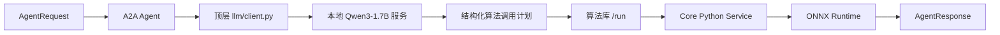
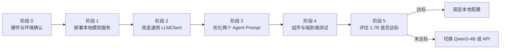

# Qwen3-1.7B 本地部署与 Agent 接入计划

日期：2026-07-14

## 实施状态（2026-07-14）

- [x] 在 `/home/dell/project_bupt/tools/ollama-runtime` 完成 Ollama 项目内安装。
- [x] 在 `/home/dell/project_bupt/local_models/ollama` 下载 `qwen3:1.7b` Q4 模型。
- [x] Ollama 识别 RTX 3060 Laptop 6GB，并以 CUDA、100% GPU 运行模型。
- [x] OpenAI-compatible `/v1/chat/completions` 返回合法 JSON。
- [x] `LLMClient` 增加 JSON mode、non-thinking、输出参数和有限重试。
- [x] 两个 Agent prompt 增加关键字段保留要求。
- [x] 算法库运行时强制使用验证后的 `AgentRequest` 作为算法输入，避免小模型丢字段。
- [x] 方案生成 Agent 完成本地 Qwen、算法库和 LR ONNX 端到端测试。
- [x] 规则授权 Agent 完成本地 Qwen、算法库和 Compliance LR ONNX 端到端测试。
- [x] 相关测试共 12 项通过。

实际运行命令见 [OLLAMA_QWEN3_LOCAL_RUNBOOK.md](./OLLAMA_QWEN3_LOCAL_RUNBOOK.md)。

## 1. 目标

在不改变两个 Agent 业务边界和算法库接口的前提下，将当前 Azure/OpenAI API 模型替换为可在 RTX 3060 Laptop 上运行的本地 `Qwen3-1.7B`，并继续保留 API 模型作为可切换的测试与回退方案。

目标调用链如下：



本轮不接入 RAG。LLM 只负责理解任务、整理结构化输入、选择算法和解释结果；候选方案评分、趋势预测、合规概率和规则结论仍由算法库负责。

## 2. 可行性结论

RTX 3060 Laptop 可以部署 `Qwen3-1.7B`。考虑到笔记本 3060 的显存空间和 WSL 运行开销，首选 4-bit 量化版本，并将上下文长度控制在 4096 或 8192。

推荐的首轮配置：

| 项目 | 建议值 |
| --- | --- |
| 模型 | `Qwen3-1.7B` 指令模型 |
| 量化 | 4-bit，例如 GGUF Q4 或服务框架支持的 4-bit 格式 |
| 上下文长度 | 首轮 4096，稳定后评估 8192 |
| 最大输出 | 1024 tokens 以内 |
| Thinking | 关闭 |
| API 形式 | OpenAI-compatible `/v1/chat/completions` |
| 温度 | 低温、稳定输出；具体值通过测试确定 |

不建议首轮直接使用 FP16/BF16 加载并开放长上下文，因为模型权重、KV Cache、CUDA 和推理框架会共同占用显存，容易出现显存不足或吞吐不稳定。

## 3. 总体实施阶段



## 4. 阶段 0：确认 WSL、GPU 与基线

### 工作内容

1. 在用户自己的 WSL 终端确认 NVIDIA GPU 可见。
2. 记录显存、Windows NVIDIA 驱动和 WSL CUDA 状态。
3. 保存当前 Azure API 下两个 Agent 的成功响应，作为本地模型对照基线。
4. 准备一组固定测试输入，覆盖正常输入、字段缺失、授权不足和非法 JSON 场景。

检查命令：

```bash
nvidia-smi
nvidia-smi --query-gpu=name,memory.total,driver_version --format=csv,noheader
```

### 验收条件

- WSL 能识别 RTX 3060 Laptop。
- CUDA 可用于推理服务。
- 已保存两个 Agent 使用 API 模型时的成功输出。

### 待补充测试材料

- [ ] `nvidia-smi` 输出或截图。
- [ ] 方案生成 Agent 的 Azure API 基线输出。
- [ ] 规则与授权 Agent 的 Azure API 基线输出。

## 5. 阶段 1：部署本地 Qwen3-1.7B 服务

### 工作内容

首轮选择支持 NVIDIA GPU、4-bit 模型和 OpenAI-compatible API 的本地服务。为了降低 6GB 显存环境的部署复杂度，优先采用轻量运行方案；如果后续需要更高并发，再评估 vLLM 或 SGLang。

部署服务必须满足：

- 提供 `POST /v1/chat/completions`。
- 模型名可由请求中的 `model` 字段指定。
- 可以关闭 Qwen3 thinking 模式。
- 返回格式与 OpenAI Chat Completions 兼容。
- 服务仅监听本机或受控网络地址。

预期 A2A 配置：

```bash
export ENABLE_LLM=true
export LLM_PROVIDER=openai_compatible
export TOOL_LLM_URL=http://127.0.0.1:8000/v1
export TOOL_LLM_NAME=Qwen3-1.7B
export API_KEY=EMPTY
export LLM_TIMEOUT_SECONDS=120
```

端口和模型名应以最终选定的本地服务为准。

### 验收条件

- `/v1/models` 或模型服务对应的模型查询接口可访问。
- `/v1/chat/completions` 能返回中文回答。
- GPU 显存稳定，无 OOM。
- 返回正文中没有 `<think>...</think>`。

### 待补充测试材料

- [ ] 模型下载完成记录。
- [ ] 本地模型服务启动日志。
- [ ] `nvidia-smi` 中模型显存占用截图。
- [ ] 本地 Chat Completions 接口调用结果。

## 6. 阶段 2：增强通用 LLMClient

### 工作内容

当前 `llm/client.py` 已支持 Azure 和 OpenAI-compatible API，基础 URL 切换无需重构。为了适应小模型，需要增加以下通用能力：

1. 增加生成参数配置：
   - `LLM_MAX_TOKENS`
   - `LLM_TEMPERATURE`
   - `LLM_JSON_MODE`
   - `LLM_STRIP_THINKING`
   - `LLM_JSON_RETRY_COUNT`
2. 在服务支持时发送 JSON 输出约束，例如 `response_format={"type":"json_object"}`。
3. 防御性清理 `<think>...</think>`，避免 thinking 内容破坏 `json.loads()`。
4. 当模型返回非法 JSON 时进行有限次数的格式修复重试。
5. 区分网络错误、模型服务错误、非法 JSON 和 schema 校验错误，保留明确 warning。
6. 保持 Azure API 兼容，不能因本地模型改造破坏现有 API 联调。

建议配置示例：

```bash
export LLM_MAX_TOKENS=1024
export LLM_TEMPERATURE=0.1
export LLM_JSON_MODE=true
export LLM_STRIP_THINKING=true
export LLM_JSON_RETRY_COUNT=1
```

### 验收条件

- 同一个 `LLMClient` 能通过环境变量切换 Azure 和本地 Qwen。
- JSON fence、空 `<think>` 和非空 `<think>` 都能被正确处理。
- 非法 JSON 不会导致 Agent 进程崩溃。
- 重试仍失败时返回明确的 `input_required` 或 warning。

### 待补充测试材料

- [ ] Azure 客户端回归测试输出。
- [ ] 本地 Qwen 客户端测试输出。
- [ ] `<think>` 清理单元测试输出。
- [ ] 非法 JSON 与重试测试输出。

## 7. 阶段 3：优化两个 Agent 的 Prompt

### 工作内容

1. 保留两个 Agent 各自独立的 prompt，不新增顶层 prompt 文件。
2. 缩短 prompt，减少 1.7B 模型的无关推理负担。
3. 明确要求只输出一个 JSON 对象，不输出 Markdown、思考过程或额外说明。
4. 要求算法调用中的 `inputs` 完整保留已经验证通过的 `AgentRequest` 字段。
5. 方案生成 Agent 重点保留：
   - `risk_assessments`
   - `scheduled_tasks`
   - `resources`
   - `target_histories`
   - `planning_objectives`
   - `constraints`
   - `authorization`
6. 规则与授权 Agent 重点保留：
   - `candidate_plans`
   - `constraints`
   - `authorization`
7. 不允许 LLM 生成算法的最终分数、推荐方案、违规项或合规结论。
8. 如果当前只有一个可用核心算法，优先确定性选择默认算法，降低小模型选择失败率。

### 验收条件

- `target_histories` 不再在 LLM 算法调用计划中丢失。
- `candidate_plans`、`authorization` 和 `constraints` 能原样传入算法包。
- LLM 不伪造算法执行结果。
- 两个 Agent 使用各自 prompt，但共用同一个 LLMClient。

### 待补充测试材料

- [ ] 方案生成 Prompt 的结构化输出样例。
- [ ] 规则与授权 Prompt 的结构化输出样例。
- [ ] 关键字段保留测试结果。
- [ ] 缺少必填信息时的 `missing_fields` 输出。

## 8. 阶段 4：测试计划

### 8.1 单元测试

增加或扩展以下测试：

- LLMClient OpenAI-compatible URL 构造。
- Azure URL 与 `api-key` 回归。
- JSON fence 清理。
- `<think>` 内容清理。
- JSON 模式参数开关。
- 非法 JSON 重试。
- 两个 Agent 使用不同 prompt。
- AgentRequest 关键字段完整传递。

### 8.2 固定样例测试

至少准备 20 到 30 条固定请求，包含：

- 完整方案生成请求。
- 缺少资源或风险评估的请求。
- 目标历史少于 12 步与达到 12 步的请求。
- 已授权、待审核、拒绝和过期授权状态。
- 单候选方案和多候选方案。
- 中文自然语言输入。
- 已结构化 JSON 输入。
- 非法字段类型和未知算法。

记录以下指标：

| 指标 | 首轮目标 |
| --- | --- |
| LLM 响应成功率 | 不低于 95% |
| JSON 可解析率 | 不低于 95% |
| 关键字段保留率 | 100% |
| 默认算法选择正确率 | 100% |
| Agent 进程异常退出 | 0 次 |
| 未授权方案错误放行 | 0 次 |

### 8.3 端到端测试

完整验证两条调用链：

```text
本地 Qwen
  -> decision_planning_agent
  -> decision_planning_core
  -> LR/LSTM ONNX
  -> 候选方案与推荐结果
```

```text
本地 Qwen
  -> compliance_authorization_agent
  -> compliance_authorization_core
  -> Compliance LR ONNX
  -> approved / blocked / review_required
```

端到端输出必须检查：

- `status.state=completed`，或在输入不足时按预期返回 `input-required`。
- `selected_algorithms` 包含正确的 core 算法。
- `algolib_result.algorithm_id` 正确。
- `model_runtime` 能说明 ONNX 或 fallback 状态。
- 方案结果包含具体方案内容，而不是只有方案 ID。

### 待补充测试材料

- [ ] 单元测试报告。
- [ ] 固定样例测试统计表。
- [ ] 方案生成端到端输出。
- [ ] 规则授权端到端输出。
- [ ] 算法库和 ONNX 运行状态截图。

## 9. 阶段 5：模型选型判定

完成测试后，根据结果决定最终模型：

| 测试结果 | 决策 |
| --- | --- |
| 1.7B 达到全部验收指标 | 保留 Qwen3-1.7B 作为默认本地模型 |
| JSON 偶发失败，但业务理解正确 | 保留 1.7B，增强 JSON 约束和重试 |
| 经常丢失关键字段 | 切换 Qwen3-4B 或对特定解析任务做微调 |
| 规则与授权理解明显不足 | 规则 Agent 使用 Qwen3-4B/API，方案 Agent 可继续使用 1.7B |
| 本地服务不可用 | 自动或人工切回 Azure API 配置 |

不建议只用“能否返回结果”判断模型是否合格。关键是字段完整性、合规安全性和重复测试的稳定性。

## 10. 配置切换目标

最终希望只通过环境变量切换模型服务。

本地 Qwen：

```bash
export LLM_PROVIDER=openai_compatible
export TOOL_LLM_URL=http://127.0.0.1:8000/v1
export TOOL_LLM_NAME=Qwen3-1.7B
export API_KEY=EMPTY
```

Azure API：

```bash
export LLM_PROVIDER=azure
export TOOL_LLM_URL=https://<resource>.openai.azure.com
export TOOL_LLM_NAME=gpt-4o-mini
export API_KEY=<azure-api-key>
export AZURE_OPENAI_API_VERSION=2024-12-01-preview
```

两个 Agent、算法库地址和算法包都不需要因模型切换而修改。

## 11. 建议实施顺序

1. 用户在 WSL 确认 GPU 与显存。
2. 部署 Qwen3-1.7B 4-bit OpenAI-compatible 服务。
3. 单独调用本地 `/v1/chat/completions`，确认中文和 JSON 输出。
4. 增强 `llm/client.py` 的 non-thinking、JSON 模式和重试能力。
5. 优化两个 Agent prompt 的字段保留要求。
6. 运行 LLMClient 与 Agent 单元测试。
7. 启动算法库和两个核心算法服务。
8. 分别联调方案生成 Agent 和规则授权 Agent。
9. 完成固定样例统计并判定 1.7B 是否达标。
10. 达标后提交代码和部署文档；未达标则测试 Qwen3-4B。

## 12. 本轮不包含的工作

- 不接入新的 RAG。
- 不修改算法库两个 core 算法包的职责边界。
- 不重新训练 LR/LSTM。
- 不把 Qwen 模型转换成 ONNX 并放入算法库。
- 不让 LLM 替代规则算法或最终人工授权。
