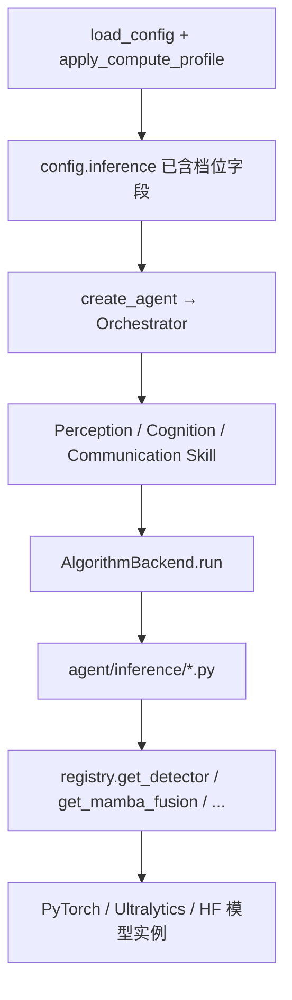

# S/M/L 算力档位配置与模型加载指南

本文说明战术情报 Agent（TIA）如何根据 **本机算力** 自动选择 **small / medium / large** 三档模型规模，以及选定档位后 **10 个算法** 如何加载对应权重与 HuggingFace 模型。

> 相关但独立主题：用 TensorBoard 对比三档参数量/显存，见 [`TENSORBOARD_COMPUTE_PROFILE_GUIDE.md`](TENSORBOARD_COMPUTE_PROFILE_GUIDE.md)。

---

## 1. 要解决什么问题

同一套 TIA 代码可能跑在不同机器上：

| 机器 | 若一律用 medium/large | 合理做法 |
|------|----------------------|----------|
| RTX 4060 8GB | 640 输入 + 1024 维嵌入 → 易 OOM | 用 **small**：RT-DETR-N、416 输入、256 维 |
| RTX 4070 12GB | 可跑 medium | **medium**：battlefield RT-DETR、640、1024 维 |
| RTX 4090 24GB | medium 浪费算力 | **large**：1280 输入、1536 维、更大 T5/Mask2Former |

**做法**：启动时读 GPU 总显存 → 映射到 S/M/L 之一 → 合并对应 YAML → 全程用合并后的 `config["inference"]` 加载模型。

**默认行为**：`compute_profile: auto`（无需手改配置）。

---

## 2. 概念与文件

### 2.1 三档是什么

| 档位 | 定位 | 典型显存 |
|------|------|----------|
| **small (S)** | 低延迟、低显存，边缘/笔记本 | ≤ 10 GB |
| **medium (M)** | 精度与速度平衡，战场默认 | 10–22 GB |
| **large (L)** | 优先精度，工作站 | > 22 GB |

档位本身只是名字；**真正决定加载什么模型**的是 `config/profiles/{small,medium,large}.yaml` 里的字段。

### 2.2 配置文件分工

```
config/default.yaml
  ├── inference.compute_profile: auto      # 选档模式
  ├── inference.compute_profile_auto_thresholds  # 显存阈值
  └── inference.*                          # 通用项（门限、地理、RAG 等）

config/profiles/small.yaml    ─┐
config/profiles/medium.yaml   ─┼─ 按档位覆盖 detection_model、embed_dim 等
config/profiles/large.yaml    ─┘

合并后 → config["inference"]  （运行时唯一真相源）
```

### 2.3 代码模块分工

| 模块 | 文件 | 作用 |
|------|------|------|
| 算力探测 | `agent/compute_detect.py` | 读 GPU 显存，映射 S/M/L |
| 配置合并 | `agent/config_profiles.py` | 读 profile YAML，写入 `inference` |
| 配置入口 | `agent/pipeline.py` | `load_config()` 启动时触发合并 |
| 模型加载 | `agent/inference/registry.py` | 按 `inference` 键懒加载权重 |
| 启动日志 | `tactical_intelligence_agent/bootstrap.py` | 打印最终档位 |

---

## 3. 按算力自动选档

### 3.1 选档规则

程序读取 **显卡物理总显存**（不是当前空闲显存），与阈值比较：

| 探测结果 | 选定档位 |
|----------|----------|
| `device: cpu` 或无 CUDA | **small** |
| CUDA 总显存 ≤ `small_max_gb`（默认 10） | **small** |
| CUDA 总显存 ≤ `medium_max_gb`（默认 22） | **medium** |
| CUDA 总显存 > `medium_max_gb` | **large** |
| Apple MPS（读不到显存） | **medium**（可用 `mps_profile` 改） |

**在干什么**：把连续变化的硬件能力离散成三档，每档对应一套已写好的模型参数，避免运行时动态改网络结构。

**配置**（`config/default.yaml`）

```yaml
inference:
  device: auto
  compute_profile: auto
  compute_profile_auto_thresholds:
    small_max_gb: 10
    medium_max_gb: 22
    mps_profile: medium
```

### 3.2 优先级：谁说了算

```
TIA_COMPUTE_PROFILE 环境变量
        ↓ 若无
inference.compute_profile（YAML）
        ↓ 若为 auto
probe_accelerator() + detect_compute_profile()
```

- 写 `compute_profile: medium` → **跳过探测**，固定 medium。
- 写 `compute_profile: auto` → **启动时探测一次**，进程内不再变。
- `$env:TIA_COMPUTE_PROFILE = "small"` → **覆盖 YAML**，适合容器注入。

**在干什么**：运维/开发可以用环境变量强制档位，而不改镜像里的 YAML。

**对应代码**（`agent/compute_detect.py`）

```python
def resolve_compute_profile_detail(cfg) -> tuple[str, str, str]:
    """返回 (resolved_profile, requested, reason)。"""
    raw = os.environ.get("TIA_COMPUTE_PROFILE", inf.get("compute_profile", "auto"))
    requested = str(raw).strip().lower()

    if requested in {"small", "medium", "large"}:
        return requested, requested, "manual"
    if requested in {"auto", "detect", "automatic"}:
        profile, reason = detect_compute_profile(cfg)
        return profile, "auto", reason
    ...
```

### 3.3 探测 GPU 显存

**在干什么**：用 PyTorch API 读指定 CUDA 设备的 `total_memory`，换算为 GB，供阈值比较。`device: cuda:1` 时探测第二块卡。

**对应代码**（`agent/compute_detect.py`）

```python
def probe_accelerator(cfg) -> tuple[float | None, str]:
    if want == "cpu":
        return None, "device=cpu"
    props = torch.cuda.get_device_properties(idx)
    gb = props.total_memory / (1024**3)
    return gb, f"cuda:{idx} {props.name} total={gb:.1f}GB"

def detect_compute_profile(cfg) -> tuple[str, str]:
    small_max = float(thresholds.get("small_max_gb", 10.0))
    medium_max = float(thresholds.get("medium_max_gb", 22.0))
    gb, probe = probe_accelerator(cfg)
    if gb is not None:
        if gb <= small_max:
            return "small", f"{probe} -> small (<={small_max:.0f}GB)"
        if gb <= medium_max:
            return "medium", f"{probe} -> medium (<={medium_max:.0f}GB)"
        return "large", f"{probe} -> large (>{medium_max:.0f}GB)"
    return "small", f"{probe} -> small (fallback)"
```

**示例**：RTX 4060 Laptop `total=8.0GB`，8 ≤ 10 → **small**。

### 3.4 合并 profile YAML

**在干什么**：选定 `small` 后，读取 `config/profiles/small.yaml`，将其 `inference` 字段 **覆盖** 到 `default.yaml` 的 `inference` 上。同时记录 `compute_profile_auto_reason` 便于排查。

**对应代码**（`agent/config_profiles.py`）

```python
def load_profile_overrides(profile: str) -> dict[str, Any]:
    path = PROFILE_DIR / f"{profile}.yaml"
    data = yaml.safe_load(path.read_text(encoding="utf-8")) or {}
    return dict(data.get("inference") or {})

def apply_compute_profile(cfg: dict[str, Any]) -> dict[str, Any]:
    profile, requested, reason = resolve_compute_profile_detail(out)
    base_inf = dict(out.get("inference") or {})
    overrides = load_profile_overrides(profile)
    merged = {
        **base_inf,
        **overrides,
        "compute_profile": profile,
        "compute_profile_requested": requested,
        "compute_profile_auto_reason": reason,  # auto 时
    }
    out["inference"] = merged
    return out
```

**在干什么（合并规则）**：`default.yaml` 里与档位无关的项（地理、RAG、门限默认值）保留；profile 里同名字段（如 `detection_model`）覆盖 default。

### 3.5 启动入口

**在干什么**：任意 TIA 启动路径最终都调用 `load_config()`；读 YAML 后立即 `apply_compute_profile()`，保证 Agent 创建前档位已确定。

**对应代码**（`agent/pipeline.py`）

```python
def load_config() -> dict[str, Any]:
    path = os.environ.get("TIA_CONFIG", "config/default.yaml")
    with open(path, encoding="utf-8") as f:
        cfg = yaml.safe_load(f) or {}
    return apply_compute_profile(cfg)
```

**对应代码**（`tactical_intelligence_agent/bootstrap.py`）

```python
def create_engine(config=None):
    config = load_config() if config is None else config
    inf = config.get("inference") or {}
    print(f"[TIA] compute profile: {inf['compute_profile']} "
          f"(requested={inf.get('compute_profile_requested')}, "
          f"{inf.get('compute_profile_auto_reason')})")
    return create_agent(config)
```

---

## 4. 三档模型映射表

合并 profile 后，各算法使用的关键配置如下。

| 配置键 | 影响的算法 | small | medium | large |
|--------|-----------|-------|--------|-------|
| `detection_model` | RT-DETR | `rtdetr-n.pt` | `battlefield_rtdetr.pt` | `battlefield_rtdetr.pt` |
| `detection_imgsz` | RT-DETR 输入边长 | 416 | 640 | 1280 |
| `odconv_crop_size` | ODConv 精炼 | 96 | 128 | 160 |
| `embed_dim` | Mamba、SupCon | 256 | 1024 | 1536 |
| `mamba_checkpoint` | Multimodal Mamba | `mamba_fusion_s.pt` | `mamba_fusion.pt` | `mamba_fusion_l.pt` |
| `supcon_checkpoint` | SupCon+Meta | `supcon_meta_s.pt` | `supcon_meta.pt` | `supcon_meta_l.pt` |
| `mask2former_model` | Siamese Mask2Former | swin-tiny | swin-tiny | swin-base |
| `semantic_comm_model` | 知识语义通信 T5 | flan-t5-small | flan-t5-small | flan-t5-base |
| `page_index_model` | Synapse RAG 编码 | MiniLM-L6 | MiniLM-L6 | MiniLM-L12 |
| `odconv/edl/motr/marl_checkpoint` | 辅助头 | 三档共用同一 `.pt` | 同左 | 同左 |

完整 YAML 见：

- `config/profiles/small.yaml`
- `config/profiles/medium.yaml`
- `config/profiles/large.yaml`

---

## 5. 模型加载：从 config 到权重

选档完成后 **不再重复探测**。每个 batch 推理时，Skill → AlgorithmBackend → `agent/inference/` → `registry.get_*()`，全程读同一份 `config["inference"]`。

### 5.1 整体数据流



### 5.2 inference 下发给三个 Skill

**在干什么**：Orchestrator 把全局 `inference` 与每个技能的子块合并，使各 Skill 都能读到 `detection_model`、`embed_dim` 等。

**对应代码**（`agent/orchestrator.py`）

```python
inference = cfg.get("inference") or {}

def _merge(skill_cfg):
    return {**inference, **(skill_cfg or {})}

self.perception = PerceptionSkill(config=_merge(cfg.get("perception")))
self.cognition = CognitionSkill(config=_merge(cfg.get("cognition")))
self.communication = CommunicationSkill(config=_merge(cfg.get("communication")))
```

### 5.3 子技能可选覆盖

**在干什么**：若只需改某一个算法的行为，在 `skills.perception.rt_detr_odconv` 下写覆盖项，不影响 Mamba 等其它算法。

**对应代码**（`agent/skills/base.py`）

```python
def subskill_config(parent, key):
    cfg = dict(parent or {})
    sub = dict(cfg.get(key) or {})
    base = {k: v for k, v in cfg.items() if k not in NESTED_SKILL_KEYS}
    return {**base, **sub}   # 子块字段优先
```

示例（`config/default.yaml`）：

```yaml
skills:
  perception:
    rt_detr_odconv:
      detection_imgsz: 512   # 仅覆盖检测输入，其余仍随档位
```

### 5.4 Skill 调用 inference 层

**在干什么**：`use_mock: false` 时，算法 backend 把 `self.config`（已含档位字段）传给 `detect_objects`、`fuse_embeddings` 等函数。**代码里没有 `if profile == "small"`**，全靠 config 键。

**对应代码**（`agent/skills/perception/rt_detr_odconv_detector.py`）

```python
def _infer(self, frames):
    from agent.inference.vision import detect_objects
    return detect_objects(frames, self.config)
```

**对应代码**（`agent/skills/cognition/multimodal_mamba.py`）

```python
def _infer(self, embeddings, tracks):
    from agent.inference.fusion import fuse_embeddings
    return fuse_embeddings(embeddings, tracks, self.config)
```

### 5.5 registry 懒加载与缓存

**在干什么**：

1. **第一次**调用某 `get_*()` 时，从 `config` 读路径/维度，构造模型并加载权重。
2. 结果放入 `_CACHE`，key 含 **权重路径 + compute_profile**，换档或换权重不会误用旧实例。
3. 辅助头通过 `*_checkpoint` 配置键指定 `.pt` 路径；Mamba/SupCon 还需 `embed_dim` 与 checkpoint 维度一致。

**对应代码**（`agent/inference/registry.py`）

```python
def get_detector(config):
    weights = _resolve_weights_path(config, "detection_model", "rtdetr-l.pt")
    key = f"detector:{weights}:{config.get('compute_profile', 'medium')}"
    if key in _CACHE:
        return _CACHE[key]
    model = RTDETR(weights)
    _CACHE[key] = model
    return model

def get_mamba_fusion(config):
    dim = int(config.get("embed_dim", 1024))
    model = MultimodalMambaBlock(max(dim, 8))
    path = _checkpoint_path(config, "mamba_checkpoint", "mamba_fusion.pt")
    if path.is_file():
        _load_state_dict(model, path)
    ...

def get_siamese_mask2former(config):
    model_id = config.get("mask2former_model", "facebook/mask2former-swin-tiny-ade-semantic")
    model = SiameseMask2Former(model_id).to_device(device)
    ...

def get_semantic_comm(config):
    model_id = config.get("semantic_comm_model", "google/flan-t5-small")
    ...
```

**各算法与 registry 函数对应关系**

| 算法 | registry 函数 | 主要 config 键 |
|------|--------------|----------------|
| RT-DETR | `get_detector` | `detection_model` |
| ODConv | `get_odconv_refiner` | `odconv_checkpoint` |
| Siamese Mask2Former | `get_siamese_mask2former` | `mask2former_model` |
| EDL | `get_edl_head` | `edl_checkpoint` |
| MOTR | `get_motr_tracker` | `motr_checkpoint` |
| ImageBind | `get_imagebind` | （暂无档位化，三档相同） |
| Mamba | `get_mamba_fusion` | `embed_dim`, `mamba_checkpoint` |
| SupCon | `get_supcon_meta` | `embed_dim`, `supcon_checkpoint` |
| 语义通信 T5 | `get_semantic_comm` | `semantic_comm_model` |
| RAG 编码 | `get_page_encoder` | `page_index_model` |
| MARL | `get_marl_policy` | `marl_checkpoint` |

### 5.6 检测链路使用档位中的尺寸参数

**在干什么**：profile 不仅换权重文件，还换 **推理输入尺寸**，否则小模型配大 `imgsz` 仍会爆显存。

**对应代码**（`agent/inference/vision.py`）

```python
def detect_objects(frames, config):
    model = get_detector(config)
    odconv = get_odconv_refiner(config)
    imgsz = int(config.get("detection_imgsz", 640))
    crop_size = int(config.get("odconv_crop_size", 128))

    results = model.predict(source=img, conf=conf_thr, imgsz=imgsz, ...)
    dets = odconv.refine_detections(img, dets, device=device, crop_size=crop_size)
```

---

## 6. 使用方式

### 6.1 默认：自动选档（推荐）

保持 `config/default.yaml`：

```yaml
inference:
  compute_profile: auto
```

直接启动 TIA 即可。

### 6.2 查看本机选了哪一档

**在干什么**：与 TIA 相同合并逻辑，不启动服务，用于验收。

```powershell
.\.venv\Scripts\python.exe scripts/show_compute_profile.py
```

输出示例：

```
Requested: auto
Resolved:  small
Auto reason: cuda:0 NVIDIA GeForce RTX 4060 Laptop GPU total=8.0GB -> small (<=10GB)
detection_model: rtdetr-n.pt
embed_dim: 256
```

### 6.3 手动固定档位

```yaml
inference:
  compute_profile: medium
```

或：

```powershell
$env:TIA_COMPUTE_PROFILE = "large"
```

### 6.4 调整显存阈值

若希望 8GB 卡也尝试 medium（需自行承担 OOM 风险），可放宽 `small_max_gb`：

```yaml
compute_profile_auto_thresholds:
  small_max_gb: 6    # 仅 ≤6GB 才 small
  medium_max_gb: 22
```

---

## 7. 权重准备

**在干什么**：各档需要的 checkpoint 需事先存在于 `models/checkpoints/`；`download_models.py` 会生成 S/L 专用 Mamba、SupCon 权重。

```powershell
.\.venv\Scripts\python.exe scripts/download_models.py
```

| 文件 | 档位 |
|------|------|
| `mamba_fusion_s.pt` | small |
| `mamba_fusion.pt` | medium |
| `mamba_fusion_l.pt` | large |
| `supcon_meta_s.pt` / `supcon_meta.pt` / `supcon_meta_l.pt` | S / M / L |
| `battlefield_rtdetr.pt` | medium（需 `train_battlefield_rtdetr.py` 训练） |

---

## 8. 常见问题

**Q：每个 batch 会重新探测 GPU 吗？**  
不会。仅在 `load_config()` → `apply_compute_profile()` 时探测一次。换档需改配置并 **重启进程**。

**Q：`use_mock: true` 时档位还有效吗？**  
配置仍会合并，但不会调用 `registry` 加载真实模型，走 mock 逻辑。

**Q：8GB 卡能否强行 medium？**  
可以设 `TIA_COMPUTE_PROFILE=medium`，但可能 OOM；auto 选 small 是为安全默认。

**Q：如何确认运行时真的用了 small 的 RT-DETR？**  
看启动日志 + `show_compute_profile.py` 的 `detection_model`；或在 registry 日志/断点看 `get_detector` 的 weights 参数。

**Q：换档后旧模型还在内存里吗？**  
同进程内若先 small 再改配置重启才会重新加载；进程内 `_CACHE` 按 profile 分 key。热切换可调用 `registry.clear_model_cache()`（测试用）。

---

## 9. 检查清单

- [ ] `config/default.yaml` → `compute_profile: auto`（或已明确选择 manual 档位）
- [ ] `show_compute_profile.py` → `Resolved` 与 GPU 显存、预期一致
- [ ] `download_models.py` 已执行，对应档位的 `mamba_fusion_*.pt` 存在
- [ ] medium 档：`battlefield_rtdetr.pt` 已训练或已放置
- [ ] 启动 TIA 控制台出现 `[TIA] compute profile: ...`
- [ ] `use_mock: false` 下跑一批数据，确认无 OOM

---

## 10. 相关文件索引

| 文件 | 职责 |
|------|------|
| `config/default.yaml` | `compute_profile: auto`、显存阈值、通用 inference |
| `config/profiles/small.yaml` | 小档模型/权重/尺寸 |
| `config/profiles/medium.yaml` | 中档 |
| `config/profiles/large.yaml` | 大档 |
| `agent/compute_detect.py` | GPU 探测、auto 映射 S/M/L |
| `agent/config_profiles.py` | 合并 profile YAML |
| `agent/pipeline.py` | `load_config()` |
| `agent/orchestrator.py` | inference 下发 Skill |
| `agent/skills/base.py` | 子技能 config 覆盖 |
| `agent/inference/registry.py` | 按 config 懒加载模型 |
| `agent/inference/vision.py` | RT-DETR imgsz、ODConv crop |
| `scripts/show_compute_profile.py` | 验证选档结果 |
| `scripts/download_models.py` | 生成各档 checkpoint |
| `tactical_intelligence_agent/bootstrap.py` | 启动日志、warmup |
| `tests/test_compute_profile.py` | 档位合并与 auto 逻辑测试 |

---

*文档版本：TIA S/M/L 算力档位 + auto 选档 + registry 模型加载。*
