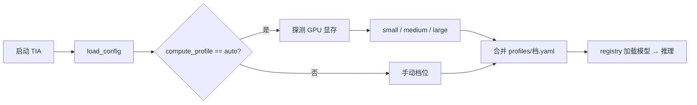
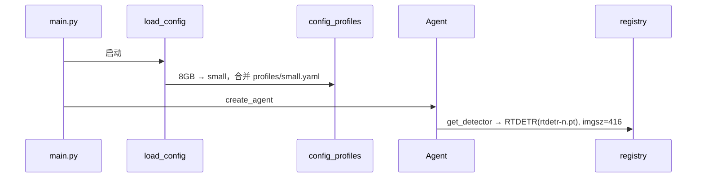

# TensorBoard 模型 Profiling 与按算力自动选档（S/M/L）指南

> **核心能力（默认开启）**：TIA 启动时 `compute_profile: auto`，自动探测 GPU 总显存，选择 **small / medium / large** 三档模型规模，再加载对应权重与 HuggingFace 模型。  
> 下文在各步骤说明 **在干什么**，并附上 **项目中的实际代码**。  
> **S/M/L 档位与按算力选档的完整说明**见 [`COMPUTE_PROFILE_GUIDE.md`](COMPUTE_PROFILE_GUIDE.md)。

---

## 0. 按算力自动选档（默认行为）

**一句话**：读 GPU 显存 → 选档位 → 合并 `profiles/{档}.yaml` → 10 个算法按该档加载模型。

| 探测结果 | 选定档位 | 典型设备 |
|----------|----------|----------|
| CPU / 无 CUDA | **small** | 无独显、纯 CPU |
| CUDA 总显存 ≤ 10 GB | **small** | RTX 4060 8GB |
| CUDA 总显存 ≤ 22 GB | **medium** | RTX 4070/4080 12–16GB |
| CUDA 总显存 > 22 GB | **large** | RTX 4090 / A100 |
| Apple MPS | **medium**（可改 `mps_profile`） | Mac |

**三步验证**

```powershell
.\.venv\Scripts\python.exe scripts/show_compute_profile.py
python tactical_intelligence_agent/main.py
# 强制覆盖：$env:TIA_COMPUTE_PROFILE = "medium"
```

---

## 1. 整体流程

| 阶段 | 何时用 | 做什么 |
|------|--------|--------|
| **按算力选档** | 每次启动 TIA（默认） | 探测显存 → 合并 profile YAML → 加载对应规模模型 |
| **TensorBoard profiling** | 部署前可选 | 对比三档参数量 / 延迟 / 显存，校准阈值 |



---

## 2. 按算力选档：逐步说明

### 2.1 在 YAML 里声明 auto 和显存阈值

**在干什么**：用 `auto` 让程序自己判断档位；`compute_profile_auto_thresholds` 定义小/中/大的显存分界线。若已知硬件，也可写死 `small` / `medium` / `large`。

**配置**（`config/default.yaml`）

```yaml
inference:
  device: auto
  compute_profile: auto
  compute_profile_auto_thresholds:
    small_max_gb: 10
    medium_max_gb: 22
    mps_profile: medium
```

---

### 2.2 启动时读取 YAML 并合并档位

**在干什么**：TIA 启动调用 `load_config()`，读入 YAML 后立刻执行 `apply_compute_profile()`，完成选档与 profile 合并。此后 `config["inference"]` 即为最终配置。

**对应代码**（`agent/pipeline.py`）

```python
def load_config() -> dict[str, Any]:
    path = os.environ.get("TIA_CONFIG", "config/default.yaml")
    if os.path.isfile(path):
        with open(path, encoding="utf-8") as f:
            cfg = yaml.safe_load(f) or {}
    else:
        cfg = {}
    return apply_compute_profile(cfg)
```

---

### 2.3 解析是 auto 还是手动固定

**在干什么**：先看环境变量 `TIA_COMPUTE_PROFILE`（优先级最高），再看 YAML。值为 `auto` 则进入 GPU 探测；值为 `small`/`medium`/`large` 则跳过探测，直接使用手动档位。

**对应代码**（`agent/compute_detect.py`）

```python
def resolve_compute_profile_detail(cfg: dict[str, Any]) -> tuple[str, str, str]:
    inf = _inference_section(cfg)
    raw = os.environ.get("TIA_COMPUTE_PROFILE", inf.get("compute_profile", "auto"))
    requested = str(raw).strip().lower()

    if requested in VALID_PROFILES:
        return requested, requested, "manual"
    if requested in AUTO_ALIASES:
        profile, reason = detect_compute_profile(cfg)
        return profile, "auto", reason
    ...
```

---

### 2.4 探测 GPU 总显存并映射档位

**在干什么**：通过 `torch.cuda.get_device_properties` 读取显卡**物理总显存**（非空闲显存），与阈值比较得到档位。无 CUDA 或 `device: cpu` 时 fallback 到 `small`。

**对应代码**（`agent/compute_detect.py`）

```python
def probe_accelerator(cfg: dict[str, Any]) -> tuple[float | None, str]:
    ...
    props = torch.cuda.get_device_properties(idx)
    gb = props.total_memory / (1024**3)
    return gb, f"cuda:{idx} {props.name} total={gb:.1f}GB"

def detect_compute_profile(cfg: dict[str, Any]) -> tuple[str, str]:
    small_max = float(thresholds.get("small_max_gb", 10.0))
    medium_max = float(thresholds.get("medium_max_gb", 22.0))
    gb, probe = probe_accelerator(cfg)
    if gb is not None:
        if gb <= small_max:
            return "small", f"{probe} -> small (<={small_max:.0f}GB)"
        if gb <= medium_max:
            return "medium", f"{probe} -> medium (<={medium_max:.0f}GB)"
        return "large", f"{probe} -> large (>{medium_max:.0f}GB)"
    return "small", f"{probe} -> small (fallback)"
```

---

### 2.5 合并 profile YAML，写入最终 inference

**在干什么**：档位名（如 `small`）对应 `config/profiles/small.yaml`。将其 `inference` 块覆盖进 `default.yaml`，从而改变 `detection_model`、`embed_dim` 等。同时写入 `compute_profile_auto_reason` 供日志使用。

**small 档示例**（`config/profiles/small.yaml`）

```yaml
inference:
  detection_model: rtdetr-n.pt
  detection_imgsz: 416
  embed_dim: 256
  mamba_checkpoint: models/checkpoints/mamba_fusion_s.pt
  supcon_checkpoint: models/checkpoints/supcon_meta_s.pt
```

**对应代码**（`agent/config_profiles.py`）

```python
def apply_compute_profile(cfg: dict[str, Any]) -> dict[str, Any]:
    profile, requested, reason = resolve_compute_profile_detail(out)
    base_inf = dict(out.get("inference") or {})
    overrides = load_profile_overrides(profile)
    merged = {
        **base_inf,
        **overrides,
        "compute_profile": profile,
        "compute_profile_requested": requested,
    }
    if requested in AUTO_ALIASES or reason != "manual":
        merged["compute_profile_auto_reason"] = reason
    out["inference"] = merged
    return out
```

**三档关键差异**

| 配置键 | small | medium | large |
|--------|-------|--------|-------|
| `detection_model` | `rtdetr-n.pt` | `battlefield_rtdetr.pt` | `battlefield_rtdetr.pt` |
| `detection_imgsz` | 416 | 640 | 1280 |
| `embed_dim` | 256 | 1024 | 1536 |
| `mamba_checkpoint` | `mamba_fusion_s.pt` | `mamba_fusion.pt` | `mamba_fusion_l.pt` |

---

### 2.6 验证选档结果

**在干什么**：不启动完整服务，用与 TIA 相同的合并逻辑打印 `Requested` / `Resolved` 及各算法模型路径。

```powershell
.\.venv\Scripts\python.exe scripts/show_compute_profile.py
```

**对应代码**（`scripts/show_compute_profile.py`）

```python
cfg = apply_compute_profile(cfg)
print(f"Requested: {inf.get('compute_profile_requested')}")
print(f"Resolved:  {inf.get('compute_profile')}")
print(f"Auto reason: {inf.get('compute_profile_auto_reason')}")
print(json.dumps(profile_summary(cfg), indent=2))
```

---

### 2.7 启动 TIA 并预加载模型

**在干什么**：`create_engine()` 打印选档日志；`warmup_inference()` 可选预加载 RT-DETR、ImageBind，避免首请求超时。

**对应代码**（`tactical_intelligence_agent/bootstrap.py`）

```python
def create_engine(config=None):
    config = load_config() if config is None else config
    inf = config.get("inference") or {}
    print(f"[TIA] compute profile: {inf['compute_profile']} "
          f"(requested={inf.get('compute_profile_requested')}, {inf.get('compute_profile_auto_reason')})")
    return create_agent(config)

def warmup_inference(...):
    get_detector(inference)
    get_imagebind(inference)
```

**优先级**：`TIA_COMPUTE_PROFILE` 环境变量 > YAML `compute_profile` > 默认 `auto`。

---

## 3. TensorBoard 测参数量与性能（可选）

### 3.1 运行命令

**在干什么**：分别对三档跑 benchmark，结果写入 `runs/model_profile/{small,medium,large}/`，用 TensorBoard 并排对比。`--skip-heavy` 跳过大模型加快首次跑通；`--runs 3` 取平均延迟。

```powershell
.\.venv\Scripts\python.exe scripts/log_model_params_tensorboard.py --profile small  --skip-heavy --runs 3
.\.venv\Scripts\python.exe scripts/log_model_params_tensorboard.py --profile medium --skip-heavy --runs 3
.\.venv\Scripts\python.exe scripts/log_model_params_tensorboard.py --profile large  --skip-heavy --runs 3
.\.venv\Scripts\tensorboard.exe --logdir runs/model_profile
# http://localhost:6006
```

### 3.2 TensorBoard 面板

| 路径 | 含义 |
|------|------|
| `params/millions/*` | 参数量（百万） |
| `perf/latency_ms/*` | 平均延迟（ms） |
| `perf/peak_gpu_mb/*` | 峰值显存（MB），可用于校准 auto 阈值 |
| `summary/profile_table` | Markdown 汇总表 |

### 3.3 脚本内：加载配置并合并档位

**在干什么**：与 TIA 相同，保证 profiling 用的 `detection_model`、`embed_dim` 与真实部署一致；日志按档位分子目录。

**对应代码**（`scripts/log_model_params_tensorboard.py`）

```python
config = apply_compute_profile(config)
profile = config["inference"]["compute_profile"]
logdir = logdir / profile
```

### 3.4 脚本内：统计参数量

**在干什么**：对每个算法 `sum(p.numel())`。RT-DETR 随 `detection_model` 变；Mamba/SupCon 随 `embed_dim` 变；ODConv/EDL/MOTR 结构固定。

**对应代码**（`scripts/log_model_params_tensorboard.py`）

```python
def _count_module(module):
    return sum(p.numel() for p in module.parameters())

embed_dim = int(inf.get("embed_dim", 1024))
det_path = _resolve_path(inf, "detection_model", "rtdetr-l.pt")
_count_module(MultimodalMambaBlock(embed_dim))
RTDETR(str(det_path)).model
```

### 3.5 脚本内：测延迟与峰值显存

**在干什么**：warmup 后多次推理取平均；`max_memory_allocated` 得峰值显存。测的是单算法单次 forward，非整 Pipeline。

**对应代码**（`scripts/log_model_params_tensorboard.py`）

```python
def _measure_perf(fn, *, device, warmup, runs, ...):
    torch.cuda.reset_peak_memory_stats(device)
    for _ in range(warmup):
        fn()
    t0 = time.perf_counter()
    for _ in range(runs):
        fn()
    latency_ms = (time.perf_counter() - t0) / runs * 1000.0
    peak_mb = torch.cuda.max_memory_allocated(device) / (1024 * 1024)
    return latency_ms, peak_mb
```

### 3.6 写入 TensorBoard

**在干什么**：把各算法指标写成 scalar，便于三档对比。

**对应代码**（`scripts/log_model_params_tensorboard.py`）

```python
writer.add_scalar(f"params/millions/{tag}", r.params_millions, 0)
writer.add_scalar(f"perf/latency_ms/{tag}", r.latency_ms, 0)
writer.add_scalar(f"perf/peak_gpu_mb/{tag}", r.peak_gpu_mb, 0)
writer.add_text("summary/profile_table", markdown_table, 0)
```

---

## 4. S/M/L 档位配置与模型加载

### 4.1 配置层次

```
config/default.yaml          → compute_profile: auto + 阈值
        ↓ 探测 + 合并
config/profiles/{档}.yaml    → 该档模型/权重/尺寸
        ↓
config["inference"]          → 运行时唯一真相源
        ↓
registry.get_*(config)       → 懒加载模型
```

### 4.2 Orchestrator 下发 inference 给各 Skill

**在干什么**：全局 `inference` 与技能子块合并，每个 Skill 拿到完整档位配置。

**对应代码**（`agent/orchestrator.py`）

```python
inference = cfg.get("inference") or {}
def _merge(skill_cfg):
    return {**inference, **(skill_cfg or {})}
self.perception = PerceptionSkill(config=_merge(cfg.get("perception")))
```

### 4.3 子技能 config 可选覆盖

**在干什么**：如 `rt_detr_odconv: { detection_imgsz: 512 }` 只影响检测，不影响 Mamba。

**对应代码**（`agent/skills/base.py`）

```python
def subskill_config(parent, key):
    base = {k: v for k, v in parent.items() if k not in NESTED_SKILL_KEYS}
    sub = dict(parent.get(key) or {})
    return {**base, **sub}
```

### 4.4 AlgorithmBackend 调用 inference 层

**在干什么**：`run()` 把 `self.config` 传给 `agent/inference/`，无 `if profile == small`，全靠 config 键。

**对应代码**（`agent/skills/perception/rt_detr_odconv_detector.py`）

```python
def _infer(self, frames):
    from agent.inference.vision import detect_objects
    return detect_objects(frames, self.config)
```

### 4.5 registry 按 config 加载并缓存

**在干什么**：首次调用时读 `detection_model`、`embed_dim`、`mamba_checkpoint` 等加载模型；缓存 key 含档位，避免换档后用旧模型。

**对应代码**（`agent/inference/registry.py`）

```python
def get_detector(config):
    weights = _resolve_weights_path(config, "detection_model", "rtdetr-l.pt")
    key = f"detector:{weights}:{_profile_tag(config)}"
    model = RTDETR(weights)
    _CACHE[key] = model

def get_mamba_fusion(config):
    dim = int(config.get("embed_dim", 1024))
    model = MultimodalMambaBlock(max(dim, 8))
    path = _checkpoint_path(config, "mamba_checkpoint", "mamba_fusion.pt")
    _load_state_dict(model, path)
```

### 4.6 检测链路使用档位参数

**在干什么**：profile 同时改模型权重与输入尺寸（`detection_imgsz`）、ODConv crop（`odconv_crop_size`）。

**对应代码**（`agent/inference/vision.py`）

```python
imgsz = int(config.get("detection_imgsz", 640))
crop_size = int(config.get("odconv_crop_size", 128))
results = model.predict(..., imgsz=imgsz)
dets = odconv.refine_detections(..., crop_size=crop_size)
```

### 4.7 端到端数据流（auto + 8GB）



---

## 5. 权重准备

**在干什么**：`download_models.py` 生成各档 checkpoint（含 `mamba_fusion_s/l.pt`）并预下载 HF 权重；`train_battlefield_rtdetr.py` 训练 medium 档检测权重。

```powershell
.\.venv\Scripts\python.exe scripts/download_models.py
python scripts/train_battlefield_rtdetr.py
```

---

## 6. 快速检查清单

- [ ] `config/default.yaml` → `compute_profile: auto`
- [ ] `show_compute_profile.py` → Resolved 与显存匹配
- [ ] `download_models.py` 已跑
- [ ] 启动见 `[TIA] compute profile: ...`
- [ ] （可选）TensorBoard 三档对比
- [ ] `use_mock: false` 真实推理验证

---

## 7. 相关文件索引

| 文件 | 职责 |
|------|------|
| `agent/compute_detect.py` | GPU 探测与 auto 选档 |
| `agent/config_profiles.py` | 合并 profiles YAML |
| `config/default.yaml` | auto 与显存阈值 |
| `config/profiles/*.yaml` | 三档模型映射 |
| `agent/pipeline.py` | `load_config()` |
| `scripts/show_compute_profile.py` | 验证选档 |
| `tactical_intelligence_agent/bootstrap.py` | 启动日志与 warmup |
| `scripts/log_model_params_tensorboard.py` | TensorBoard profiling |
| `agent/inference/registry.py` | 按 config 加载模型 |
| `agent/inference/vision.py` | 检测 imgsz / ODConv crop |
| `scripts/download_models.py` | 权重 bootstrap |

---

*文档版本：按算力 auto 选档 + TensorBoard S/M/L profiling。*
