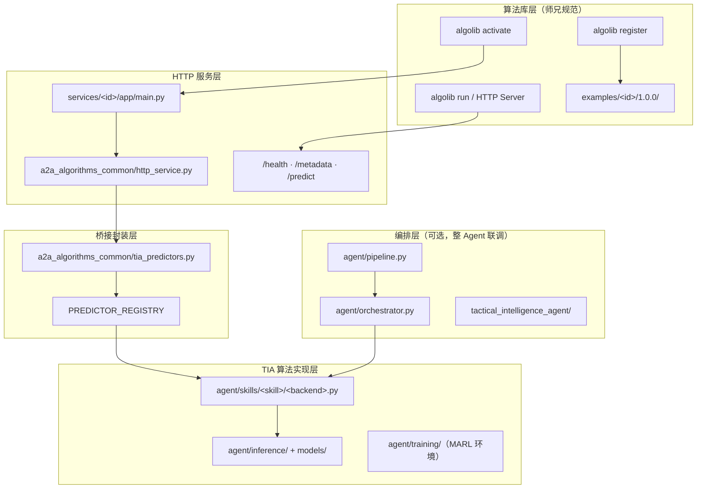

# TIA 算法包架构说明

本文档说明：**你的 11 个 TIA 算法包在师兄算法库（`zsl/algorithmrepo`）中的整体架构、分层职责、以及具体做了哪些事情**。

规范依据（师兄分支）：

- `algorithm_integration_guide_for_juniors.md` — 接入流程与交付物
- `algorithm_library_model_integration_SPEC.md` — 模型与 schema 规范
- `algorithm_library_flows.md` — register / activate / run 流程

当前代码已推送到：`origin/zsl/algorithmrepo`（分支 `feat/tia-algorithm-packages` 合并后推送）。

---

## 1. 一句话总结

你把 **TIA 战术情报 Agent 三技能流水线中的 11 个子算法**，按师兄规则包装成 **`python_http_service` 算法包**：

- 每个算法有独立的 **算法卡片 + JSON Schema + Golden Case + FastAPI 服务**
- 算法库（`algolib`）可通过 **register → activate → run** 统一注册和调用
- 底层推理仍复用 `agent/` 目录中的 TIA 原始实现，不重复写算法逻辑

---

## 2. 整体架构（四层 + 编排）



### 各层职责

| 层级 | 目录 | 做什么 |
|------|------|--------|
| **算法包规范层** | `examples/<algorithm_id>/1.0.0/` | 算法库能「认识」这个算法的全部元数据：卡片、输入输出 schema、golden case、README |
| **HTTP 服务层** | `services/<algorithm_id>/app/main.py` | 把算法暴露为独立微服务，监听固定端口，提供标准 REST 接口 |
| **公共 HTTP 工厂** | `services/a2a_algorithms_common/http_service.py` | 统一创建 FastAPI 应用：`/health`、`/metadata`、`/predict` |
| **TIA 推理桥接** | `services/a2a_algorithms_common/tia_predictors.py` | 把 HTTP 请求字段映射到 `agent/skills` 后端，管理 mock/real 模式与权重检查 |
| **算法实现** | `agent/` | 真正的模型、推理、训练环境；算法包**不复制算法代码**，只调用这里 |
| **整 Agent 编排** | `agent/orchestrator.py` 等 | 把多个子算法串成感知→认知→通信流水线（与单算法包并行存在） |

---

## 3. 单个算法包的标准目录结构

以 `marl_ppo_task_scheduler` 为例，每个包结构完全一致：

```text
examples/marl_ppo_task_scheduler/1.0.0/
├── algorithm_card.yaml          # 算法身份证（ID、端口、能力、资源、性能画像）
├── input.schema.json            # 输入 JSON Schema
├── output.schema.json           # 输出 JSON Schema
├── golden_cases/
│   ├── case_001_request.json    # 标准测试请求（algolib run 用）
│   └── case_001_response.json   # 期望输出样例
├── README.md                    # 包说明
└── service_contract.md          # HTTP 端点契约（/health /metadata /predict）

services/marl_ppo_task_scheduler/
├── README.md
└── app/
    └── main.py                  # FastAPI 入口，绑定端口 9024
```

### `algorithm_card.yaml` 里记录了什么

每个卡片包含师兄要求的完整字段，例如：

- `algorithm_id` / `version` / `display_name`
- `backend_type: python_http_service`
- `task_family`（detection / planning / classification 等）
- `capabilities` / `when_to_use` / `when_not_to_use`
- `machine_spec`（endpoint、health、timeout）
- `resource_requirements`（CPU、内存、显存）
- `model_profile`（参数量、FLOPs 画像）
- `performance`（延迟、主指标分数）
- `safety`（风险等级、是否需人工复核）

---

## 4. 11 个算法包清单

| # | algorithm_id | 端口 | TIA 技能 | 子模块 | M 编号 | 具体做什么 |
|---|--------------|-----:|----------|--------|--------|------------|
| 1 | `battlefield_rtdetr_detector` | 9020 | 感知 | RT-DETR + ODConv | M01 | 战场图像目标检测，输出检测框与类别 |
| 2 | `siamese_mask2former_damage` | 9021 | 感知 | Siamese Mask2Former | M02 | 前后帧/参考帧差分，输出毁伤掩膜与毁伤分数 |
| 3 | `edl_evidential_verifier` | 9022 | 感知 | EDL 证据深度学习 | M17 | 对检测候选做证据推理过滤，估计认知不确定性 |
| 4 | `motr_neural_kalman_tracker` | 9023 | 感知 | MOTR + Neural Kalman | M05 | 多目标跟踪与状态更新，输出轨迹与地理坐标 |
| 5 | `marl_ppo_task_scheduler` | 9024 | 规划 | MARL-PPO 调度 | M15 | 传感器任务分配 + 重攻击规划（基于战场态势） |
| 6 | `imagebind_multimodal_encoder` | 9025 | 认知 | ImageBind | M03/M04 | 多模态帧编码为统一嵌入向量 |
| 7 | `multimodal_mamba_fusion` | 9026 | 认知 | Multimodal Mamba | M03 | 融合多模态嵌入与时序轨迹特征 |
| 8 | `supcon_meta_classifier` | 9027 | 认知 | SupCon + Meta | M04 | 少样本敌我/属性分类 |
| 9 | `synapse_rag_retriever` | 9028 | 认知 | SynapseRAG | M13 | 基于分类结果与知识库做检索增强 |
| 10 | `knowledge_semantic_comm` | 9029 | 通信 | 知识驱动语义通信 | M12 | 将感知+认知结果压缩为语义情报摘要 |
| 11 | `marl_dynamic_router` | 9030 | 通信 | MARL 动态路由 | M15 | 抗干扰条件下选择情报包投递路由 |

### 与 TIA 三技能流水线的对应关系

```text
感知 PerceptionSkill（串行 4 步，算法包各拆为独立服务）
  RT-DETR+ODConv → Siamese Mask2Former → EDL → MOTR+Kalman

认知 CognitionSkill（串行 4 步）
  ImageBind → Multimodal Mamba → SupCon+Meta → SynapseRAG

通信 CommunicationSkill（串行 2 步）
  Knowledge Semantic Comm → MARL Dynamic Router

规划（独立算法包，可单独被 algolib 调用）
  MARL-PPO Task Scheduler
```

> **说明**：11 个算法包是**可独立注册/调用的微服务**；`agent/orchestrator.py` 中的三技能流水线是**整 Agent 联调路径**。两者共用同一套 `agent/skills` 实现。

---

## 5. 请求链路：从 algolib 到模型推理

以一次 `run` 为例：

```text
1. algolib run golden_cases/case_001_request.json
       ↓
2. 读取 algorithm_card.yaml → 找到 endpoint http://127.0.0.1:9024/predict
       ↓
3. POST /predict
   Body: { request_id, algorithm_id, version, inputs, params }
       ↓
4. services/marl_ppo_task_scheduler/app/main.py
       ↓
5. create_algorithm_app() 校验 algorithm_id / model_loaded
       ↓
6. tia_predictors.predict_marl_ppo_task_scheduler(inputs, params)
       ↓
7. _run_backend("agent.skills.perception.marl_ppo_scheduler", "MARLPPOScheduler", inputs)
       ↓
8. MARLPPOScheduler.run() → mock 启发式 或 marl_ppo_schedule() 加载权重推理
       ↓
9. 返回 { ok: true, outputs: {...}, usage: { latency_ms } }
```

### 三个标准 HTTP 端点

| 端点 | 对应师兄流程 | 返回内容 |
|------|-------------|----------|
| `GET /health` | **activate** 前置检查 | `ok`、`status: ready`、`model_loaded` |
| `GET /metadata` | **show-card** 补充信息 | `algorithm_id`、`version`、`backend_type`、`task_family` |
| `POST /predict` | **run** | 结构化 `outputs` + `latency_ms` |

---

## 6. `agent/` 目录：算法实现细节

算法包本身**不包含模型代码**，实现分布在：

### 6.1 技能后端（`agent/skills/`）

每个子算法一个 `AlgorithmBackend` 子类，统一接口 `run(inputs) -> outputs`：

```text
agent/skills/
├── perception/
│   ├── rt_detr_odconv_detector.py      → battlefield_rtdetr_detector
│   ├── siamese_mask2former_damage.py   → siamese_mask2former_damage
│   ├── edl.py                          → edl_evidential_verifier
│   ├── motr_neural_kalman_tracker.py   → motr_neural_kalman_tracker
│   └── marl_ppo_scheduler.py           → marl_ppo_task_scheduler
├── cognition/
│   ├── imagebind_encoder.py            → imagebind_multimodal_encoder
│   ├── multimodal_mamba.py             → multimodal_mamba_fusion
│   ├── supcon_meta_classifier.py       → supcon_meta_classifier
│   └── synapse_rag.py                  → synapse_rag_retriever
└── communication/
    ├── knowledge_semantic_comm.py      → knowledge_semantic_comm
    └── marl_dynamic_router.py          → marl_dynamic_router
```

每个后端支持：

- `use_mock=True` — 启发式逻辑，无需 GPU 权重（联调/验收默认）
- `use_mock=False` — 从 `models/checkpoints/` 加载 `.pt` 权重或 HuggingFace 本地快照

### 6.2 推理注册表（`agent/inference/registry.py`）

集中管理模型单例加载与缓存：

- `get_detector()` — RT-DETR
- `get_motr_tracker()` — MOTR
- `get_marl_ppo_scheduler()` — MARL-PPO
- `get_imagebind()` / `get_semantic_comm()` 等

### 6.3 模型定义（`agent/inference/models/`）

| 文件 | 算法 |
|------|------|
| `odconv.py` | ODConv 检测精修头 |
| `edl_head.py` | EDL 证据头 |
| `motr_kalman.py` | MOTR + Kalman 跟踪网络 |
| `marl_ppo_scheduler.py` | MARL-PPO Actor-Critic |
| `marl_policy.py` | MARL 路由策略网络 |
| `mamba_fusion.py` | 多模态 Mamba 融合块 |
| `supcon_meta.py` | SupCon 元学习分类器 |
| `imagebind_model.py` | ImageBind / CLIP 嵌入 |
| `semantic_comm_net.py` | 语义通信压缩网络 |
| `siamese_mask2former.py` | 毁伤分割 |

### 6.4 MARL 训练环境（`agent/training/`）

- `battlefield_scheduling_env.py` — 战场调度多智能体环境（传感器/目标/打击资产）
- `visdrone_mot.py` — MOT 训练数据工具

---

## 7. 桥接层：`tia_predictors.py` 具体做了什么

`services/a2a_algorithms_common/tia_predictors.py` 是整个算法包的**核心胶水**，负责：

| 功能 | 实现 |
|------|------|
| 读取 TIA 配置 | 合并 `config/default.yaml` 的 `inference` + `skills` 块 |
| Mock / Real 切换 | 环境变量 `TIA_USE_MOCK`（默认 `1`） |
| 后端懒加载 | `_backend()` 按模块路径实例化 `AlgorithmBackend` |
| 输入字段映射 | 每个 `predict_<id>()` 把 HTTP `inputs` 转成 `run()` 所需字段 |
| 健康检查 | `tia_model_loaded()` 检查关键 `.pt` 权重是否存在 |
| 注册表 | `PREDICTOR_REGISTRY` 映射 11 个 algorithm_id → predict 函数 |

---

## 8. 工具脚本：生成、启动、验收

| 脚本 | 作用 |
|------|------|
| `scripts/bootstrap_tia_algorithm_packages.py` | **生成/刷新** 11 个算法包目录（卡片、schema、golden case、service main.py） |
| `scripts/start_a2a_algorithm_services.ps1 -TiaOnly` | **启动** 11 个 HTTP 服务（端口 9020–9030） |
| `scripts/acceptance_tia_algorithm_packages.py` | **等价验收** register → activate → run（无需 algolib.exe） |
| `scripts/verify_tia_algorithms.py` | **Mock + Real** 双模式可用性验证 |
| `scripts/download_models.py` | 初始化 `models/checkpoints/` 辅助头权重 |
| `scripts/package_offline_models.py` | 有网机打包 HuggingFace/Ultralytics 到 `models/pretrained/` |
| `scripts/train_marl_ppo_scheduler.py` | 训练 MARL-PPO 调度策略 |
| `scripts/train_battlefield_rtdetr.py` | 训练战场检测器 |
| `scripts/train_motr_kalman.py` | 训练 MOTR 跟踪器 |

### 验收命令（已通过）

```powershell
# Mock 等价验收（11/11）
$env:TIA_USE_MOCK="1"
python scripts/acceptance_tia_algorithm_packages.py

# Real 模式验证（11/11，需 conda + numpy<2 + 权重）
$env:TIA_USE_MOCK="0"
python scripts/verify_tia_algorithms.py

# 单元测试
pytest tests/python/test_tia_algorithm_services.py -q
```

---

## 9. 环境变量与运行模式

| 变量 | 默认值 | 含义 |
|------|--------|------|
| `TIA_USE_MOCK` | `1` | `1`=启发式 mock；`0`=加载真实权重 |
| `TIA_OFFLINE` | 未设置 | `1` 时强制 `local_files_only`，不访问 HuggingFace |
| `TIA_COMPUTE_PROFILE` | — | `small` / `medium` / `large` / `offline` 算力档位 |
| `PORT` | 各服务默认端口 | HTTP 服务监听端口 |
| `HF_HUB_OFFLINE` | — | 内网离线时配合 `TIA_OFFLINE=1` |

配置文件：

- `config/default.yaml` — 主配置
- `config/profiles/{small,medium,large,offline}.yaml` — 算力档位覆盖

离线部署详见：`docs/OFFLINE_DEPLOYMENT.md`

---

## 10. 与师兄算法库的标准流程对齐

师兄要求的交付闭环，你的包已全部具备：

| 师兄要求 | 你的实现 | 验证方式 |
|----------|----------|----------|
| **register** | `examples/<id>/1.0.0/` 完整目录 + `algorithm_card.yaml` | `acceptance` 的 `check_register()` |
| **activate** | 服务 `/health` 返回 `ready` + `model_loaded` | `acceptance` 的 `check_activate_and_run()` |
| **show-card** | `algorithm_card.yaml` 含全部必填字段 | 卡片字段检查 |
| **run** | `POST /predict` + golden case 输入 | golden case 推理通过 |
| **input.schema.json** | 每个包均有 | JSON Schema 校验 |
| **output.schema.json** | 每个包均有 | JSON Schema 校验 |
| **golden case** | 每包至少 `case_001` | request + response 成对 |
| **python_http_service** | 全部 11 个包 | `backend_type` 字段 + FastAPI |

### algolib 原生调用（需编译 C++ 客户端）

```powershell
cmake -S . -B build
cmake --build build --config Release

.\build\Release\algolib.exe register .\examples\marl_ppo_task_scheduler\1.0.0
.\build\Release\algolib.exe activate marl_ppo_task_scheduler 1.0.0 python_http_service
.\build\Release\algolib.exe run .\examples\marl_ppo_task_scheduler\1.0.0\golden_cases\case_001_request.json
```

> 当前环境若无法访问 GitHub 拉取 CMake 依赖，`algolib.exe` 暂未能编译；已用 Python 脚本做等价验收。

---

## 11. 本次接入具体做了哪些事（工作清单）

### 11.1 算法包工程化（按师兄规范）

- [x] 将 TIA 11 个子算法拆分为独立 `python_http_service` 包
- [x] 为每个包生成 `algorithm_card.yaml`（含 `model_profile`、`resource_requirements`）
- [x] 定义 `input.schema.json` / `output.schema.json`
- [x] 编写 `golden_cases/case_001_request.json` + `case_001_response.json`
- [x] 创建 11 个 FastAPI 微服务（端口 9020–9030）
- [x] 编写 `service_contract.md` 与 README

### 11.2 代码桥接与复用

- [x] 实现 `tia_predictors.py` 统一推理入口与 `PREDICTOR_REGISTRY`
- [x] 复用 `agent/skills` 全部后端，避免重复实现算法
- [x] 实现 `http_service.py` 标准三端点工厂
- [x] 更新 `start_a2a_algorithm_services.ps1` 支持 `-TiaOnly` 一键启动

### 11.3 TIA 算法本体（`agent/`）

- [x] 三技能流水线：感知 4 算法 + 认知 4 算法 + 通信 2 算法
- [x] MARL-PPO 战场调度环境 + Actor-Critic 网络 + 训练脚本
- [x] 推理注册表 `registry.py`（含 `get_marl_ppo_scheduler` 等）
- [x] 数据契约 `agent/models/schemas.py`（SensorBatch → SemanticIntelligencePacket）

### 11.4 离线部署与验证

- [x] `agent/inference/offline.py` — 离线模式 `local_files_only`
- [x] `config/profiles/offline.yaml` — 内网本地模型路径
- [x] `scripts/package_offline_models.py` — 有网机打包脚本
- [x] `scripts/acceptance_tia_algorithm_packages.py` — 等价验收
- [x] `scripts/verify_tia_algorithms.py` — Mock/Real 双模式验证
- [x] `tests/python/test_tia_algorithm_services.py` — 23 项 HTTP 服务测试

### 11.5 Git 推送

- [x] 合并远程 `zsl/algorithmrepo` 最新提交（track-threat、decision-agent 等）
- [x] 推送到 `origin/zsl/algorithmrepo`
- [x] 模型权重**未入库**（`models/checkpoints/` 走外部存储，符合师兄规范）

---

## 12. 未纳入 Git 的本地产物

以下目录/文件在 `.gitignore` 或刻意不提交，部署时需自行准备：

```text
models/checkpoints/     # .pt 权重（battlefield_rtdetr.pt、marl_ppo_scheduler.pt 等）
models/pretrained/      # HuggingFace 本地快照（离线打包产物）
.checkpoints/           # ImageBind 等大模型运行时缓存
rtdetr-l.pt / yolo26n.pt
runs/                   # 训练日志
datasets/               # 训练数据集
```

权重初始化：

```powershell
python scripts/download_models.py --heads-only
# 内网完整部署：
python scripts/package_offline_models.py
```

---

## 13. 快速上手命令

```powershell
# 1. 安装依赖
pip install -r services/requirements.txt

# 2. Mock 模式启动 11 个服务
$env:TIA_USE_MOCK="1"
./scripts/start_a2a_algorithm_services.ps1 -TiaOnly

# 3. 验收
python scripts/acceptance_tia_algorithm_packages.py

# 4. Real 模式（需权重 + conda 环境 numpy<2）
$env:TIA_USE_MOCK="0"
python scripts/verify_tia_algorithms.py
```

---

## 14. 相关文档索引

| 文档 | 内容 |
|------|------|
| `docs/TIA_ALGORITHMS_INTEGRATION.md` | 接入快速参考（清单、命令） |
| `docs/TIA_ALGORITHM_PACKAGE_ARCHITECTURE.md` | **本文档** — 架构与职责详解 |
| `docs/OFFLINE_DEPLOYMENT.md` | 内网离线两阶段部署 |
| `algorithm_integration_guide_for_juniors.md` | 师兄原始接入规范 |
