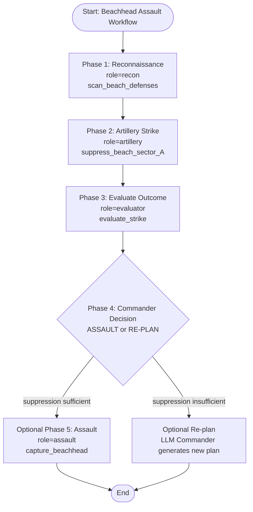
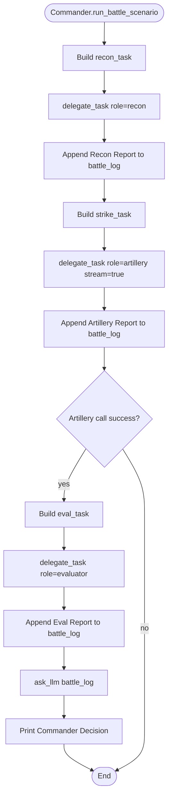
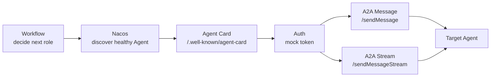
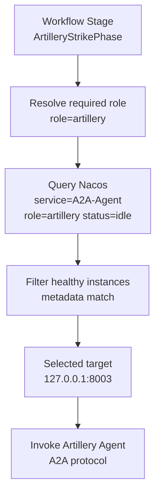
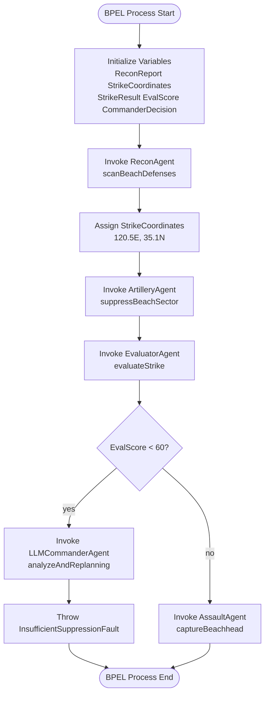
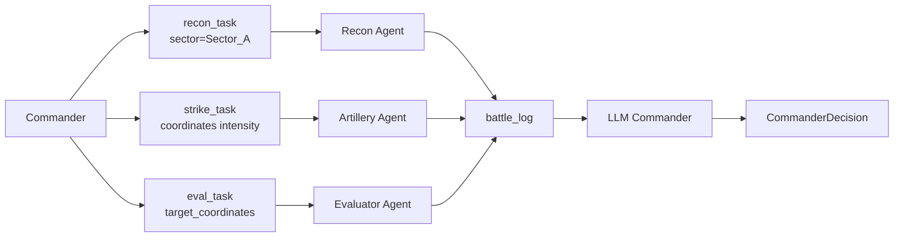
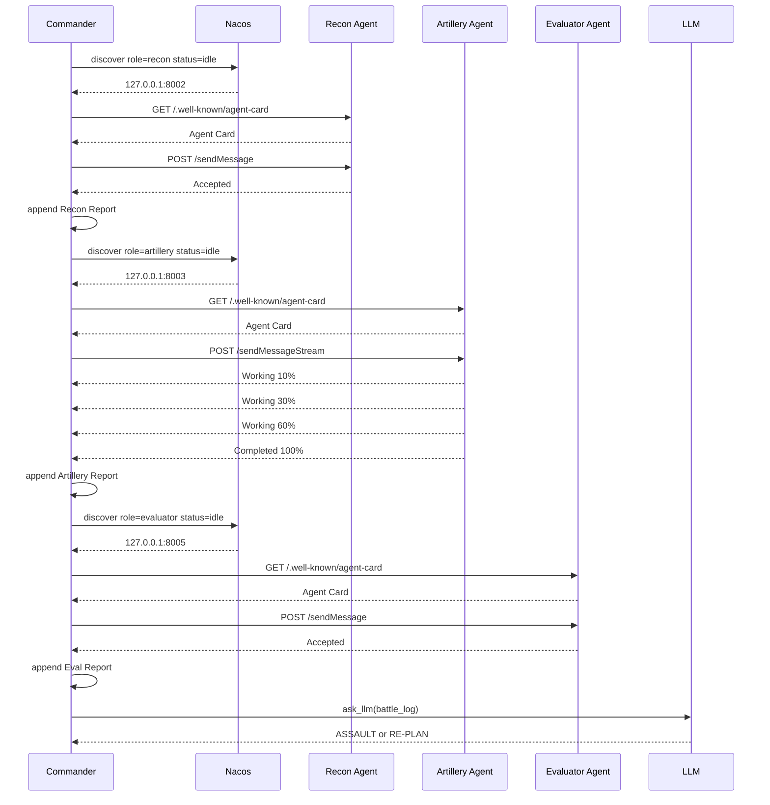
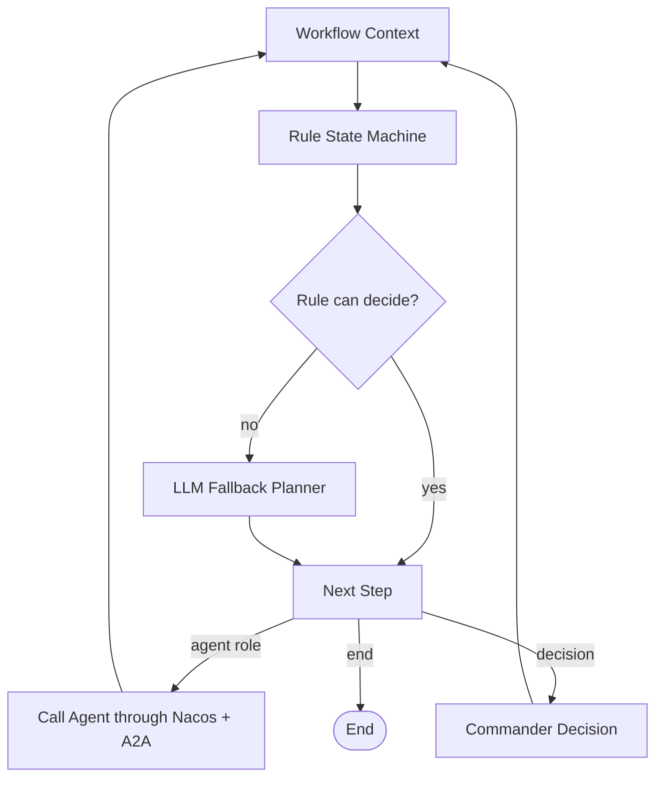
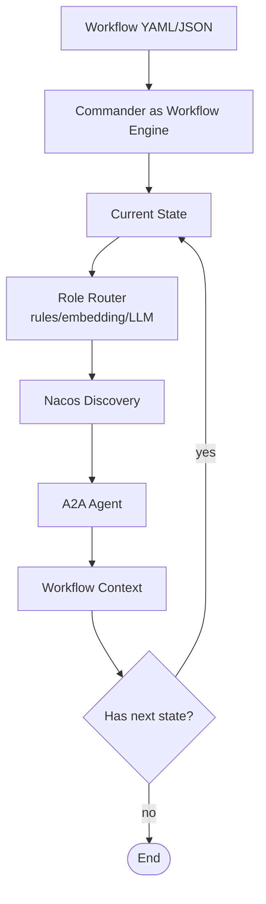

# A2A 项目 Workflow 说明

## 1. Workflow 是什么

Workflow 可以理解为一组任务的编排流程。它描述系统在完成一个目标时，应该按什么顺序调用哪些能力、每一步传递什么数据、遇到不同结果时如何分支。

在本项目中，Workflow 用来描述“抢滩登陆”这个多 Agent 协作过程。

它不是单个 Agent 的内部逻辑，而是 Commander 如何组织多个 Agent 共同完成任务。

简单来说：

```text
Workflow = 多个 Agent 的协作流程图
```

在 A2A 项目中，Workflow 主要回答这些问题：

- 第一阶段应该调用哪个 Agent？
- 上一个阶段的结果如何传递给下一个阶段？
- 哪些阶段需要同步执行，哪些阶段需要流式反馈？
- 评估结果不好时是否要重规划？
- Commander 在整个流程中负责什么？

## 2. 本项目的 Workflow 目标

本项目以“抢滩登陆”为业务场景，模拟多智能体协作完成作战流程。

整体目标是：

```text
侦察敌情 -> 火力压制 -> 战果评估 -> Commander 决策 -> 继续突击或重规划
```

对应到 Agent：

| 阶段 | 目标 | Agent |
|---|---|---|
| Phase 1 | 侦察滩头防御情况 | Recon Agent |
| Phase 2 | 对目标区域进行火力压制 | Artillery Agent |
| Phase 3 | 评估火力打击效果 | Evaluator Agent |
| Phase 4 | 根据日志和评估结果决策 | Commander / LLM |
| 可选 Phase 5 | 如果压制成功，执行突击 | Assault Agent |
| 可选重规划 | 如果效果不好，重新制定方案 | Commander / LLM |

当前代码中已经实现了前四个阶段：

```text
Recon -> Artillery -> Evaluator -> LLM Commander Decision
```

Assault 阶段已经有 Agent 和 BPEL 描述，但 Commander 当前主流程还没有真正调用 Assault Agent。

整体 Workflow 可以用 Mermaid 表示为：



## 3. 当前代码中的 Workflow

当前实际执行逻辑位于：

```text
commander_agent/main.py
```

核心方法是：

```python
run_battle_scenario()
```

它按顺序执行以下阶段。

### 3.1 Phase 1：侦察阶段

Commander 构造侦察任务：

```python
recon_task = {
    "command": "scan_beach_defenses",
    "sector": "Sector_A"
}
```

然后调用：

```python
self.delegate_task("recon", recon_task)
```

含义是：

```text
需要一个 role=recon 的 Agent 来执行侦察任务。
```

Commander 会通过 Nacos 查找 `role=recon` 且 `status=idle` 的 Agent，并调用 Recon Agent 的 A2A 接口。

执行完成后，Commander 将模拟侦察结果写入 `battle_log`：

```text
[Recon Report] Sector_A is heavily fortified with overlapping machine gun nests.
```

### 3.2 Phase 2：火力打击阶段

Commander 构造火力打击任务：

```python
strike_task = {
    "command": "suppress_beach_sector_A",
    "coordinates": "120.5E, 35.1N",
    "intensity": "high"
}
```

然后调用：

```python
self.delegate_task("artillery", strike_task, stream=True)
```

这里 `stream=True` 表示使用流式接口：

```text
POST /sendMessageStream
```

Artillery Agent 会返回多段 SSE 事件：

```text
Target locked -> Firing Volley 1 -> Impact confirmed -> Completed
```

该阶段体现了 Workflow 中的“长任务进度反馈”能力。

### 3.3 Phase 3：战果评估阶段

如果火力打击阶段成功，Commander 继续构造评估任务：

```python
eval_task = {
    "command": "evaluate_strike",
    "target_coordinates": "120.5E, 35.1N"
}
```

然后调用：

```python
self.delegate_task("evaluator", eval_task)
```

执行完成后，Commander 将模拟评估结果写入 `battle_log`：

```text
[Eval Report] Effectiveness matches 40% destruction rate. Defenses still operational.
```

当前 Evaluator Agent 仍然是基础 Agent，没有真正计算毁伤率，评估结果由 Commander 中的模拟文本表示。

### 3.4 Phase 4：Commander 决策阶段

Commander 将前面阶段积累的 `battle_log` 交给大模型：

```python
decision = self.ask_llm(battle_log)
```

大模型根据战场日志判断：

```text
ASSAULT
```

或者：

```text
RE-PLAN
```

如果没有配置 `OPENAI_API_KEY`，则返回 mock 决策。

当前代码只打印决策结果，还没有根据 `ASSAULT` 或 `RE-PLAN` 继续执行后续分支。

当前代码实际执行路径如下：



## 4. Workflow 与 A2A 协议的关系

Workflow 负责“决定先后顺序和调用对象”。

A2A 协议负责“Agent 之间如何通信”。

两者关系如下：

```text
Workflow 决定下一步调用哪个 role
  -> Nacos 根据 role 找到具体 Agent 实例
  -> A2AClient 获取 Agent Card
  -> A2AClient 鉴权
  -> A2AClient 调用 /sendMessage 或 /sendMessageStream
  -> Agent 返回任务响应或流式进度
```

因此，Workflow 不直接关心 Agent 的 IP 和端口。

它只关心：

```text
下一步需要什么能力？
```

例如：

```text
需要侦察能力 -> role=recon
需要火力能力 -> role=artillery
需要评估能力 -> role=evaluator
```

具体由哪个实例执行，则交给 Nacos 和 A2AClient 完成。

这一层关系可以表示为：



## 5. Workflow 与 Nacos 路由的关系

Workflow 中的每个阶段最终都会转化为一次 Nacos 路由查询。

例如火力阶段：

```text
Workflow 阶段：ArtilleryStrikePhase
目标能力：artillery
Nacos 查询：role=artillery, status=idle
返回实例：127.0.0.1:8003
调用对象：Artillery Agent
```

也就是说：

```text
Workflow 定义“要做什么”
Nacos 决定“谁来做”
A2A 协议负责“怎么调用”
```

三者分工如下：

| 模块 | 职责 |
|---|---|
| Workflow | 定义任务顺序、阶段依赖、分支逻辑 |
| Nacos | 根据 role/status 发现可用 Agent |
| A2A Protocol | 规范 Agent Card、消息发送、流式反馈 |
| Commander | 执行 Workflow，连接 Nacos、A2A 和 LLM |

火力阶段的 Nacos 路由过程可以用 Mermaid 表示为：



## 6. BPEL 文件的含义

项目中有一个 BPEL 风格的工作流文件：

```text
beachhead_workflow.bpel
```

BPEL 是一种早期用于业务流程编排的 XML 标准。在本项目中，它不是被运行时引擎直接执行的文件，而是一个“工作流设计说明”。

它用 XML 描述了抢滩登陆流程：

```xml
<process name="BeachheadAssaultWorkflow">
  <sequence>
    <invoke partnerLink="ReconAgent" />
    <invoke partnerLink="ArtilleryAgent" />
    <invoke partnerLink="EvaluatorAgent" />
    <switch>
      <case condition="EvalScore < 60">
        <invoke partnerLink="LLMCommanderAgent" />
        <throw faultName="InsufficientSuppressionFault"/>
      </case>
      <otherwise>
        <invoke partnerLink="AssaultAgent" />
      </otherwise>
    </switch>
  </sequence>
</process>
```

它对应的含义是：

| BPEL 元素 | 在本项目中的含义 |
|---|---|
| `<process>` | 整个抢滩登陆任务 |
| `<sequence>` | 按顺序执行多个阶段 |
| `<invoke>` | 调用某个 Agent |
| `<variables>` | 阶段间传递的上下文数据 |
| `<assign>` | 给变量赋值，例如设置打击坐标 |
| `<switch>` | 根据评估结果选择继续突击或重规划 |
| `<throw>` | 抛出流程异常，表示当前计划失败 |

BPEL 中描述的宏观分支可以用 Mermaid 表示为：



## 7. BPEL 与当前代码的对应关系

| BPEL 阶段 | 当前代码 | 当前状态 |
|---|---|---|
| `ReconAgent.scanBeachDefenses` | `delegate_task("recon", recon_task)` | 已实现 |
| `ArtilleryAgent.suppressBeachSector` | `delegate_task("artillery", strike_task, stream=True)` | 已实现 |
| `EvaluatorAgent.evaluateStrike` | `delegate_task("evaluator", eval_task)` | 已实现 |
| `LLMCommanderAgent.analyzeAndReplanning` | `ask_llm(battle_log)` | 已实现基础决策 |
| `AssaultAgent.captureBeachhead` | 尚未在 `run_battle_scenario()` 中调用 | 待完善 |
| `InsufficientSuppressionFault` | 当前只打印 LLM 决策，没有真正抛出异常 | 待完善 |

可以看出，当前代码已经实现了主干流程，但分支执行还没有完全闭环。

## 8. Workflow 中的数据流

Workflow 不只是调用顺序，还包含数据在阶段之间的流动。

本项目中的主要数据包括：

| 数据 | 来源 | 去向 | 当前实现方式 |
|---|---|---|---|
| `sector` | Commander | Recon Agent | payload 字段 |
| `coordinates` | Commander / 侦察结果 | Artillery Agent | payload 字段 |
| `battle_log` | Commander 汇总 | LLM Commander | Python list |
| `EvalScore` | Evaluator Agent | Commander 决策分支 | 当前用模拟文本代替 |
| `CommanderDecision` | LLM | 后续流程分支 | 当前只打印 |

当前实现中，很多结果还没有从 Agent 的真实响应中解析，而是在 Commander 中手动追加到 `battle_log`。

当前数据流可以用 Mermaid 表示为：



后续可以改成：

```text
Agent 返回结构化结果
  -> Commander 写入 workflow context
  -> 后续阶段从 context 中读取
```

例如：

```json
{
  "recon_report": {
    "enemy_positions": ["machine_gun_nest_A", "bunker_B"],
    "recommended_coordinates": "120.5E, 35.1N"
  },
  "eval_score": 40,
  "decision": "RE-PLAN"
}
```

## 9. 当前 Workflow 的执行时序

当前实际执行时序如下：

```text
启动 Agent
  -> Agent 注册到 Nacos
  -> Commander 启动
  -> Phase 1: 查询 recon Agent
  -> 调用 Recon Agent /sendMessage
  -> 写入 Recon Report
  -> Phase 2: 查询 artillery Agent
  -> 调用 Artillery Agent /sendMessageStream
  -> 接收流式打击进度
  -> 写入 Artillery Report
  -> Phase 3: 查询 evaluator Agent
  -> 调用 Evaluator Agent /sendMessage
  -> 写入 Eval Report
  -> Phase 4: 调用 LLM
  -> 输出 Commander Decision
```

用 Mermaid 时序图表示：



## 10. 当前 Workflow 的特点

当前 Workflow 具有以下特点：

| 特点 | 说明 |
|---|---|
| 顺序编排 | 当前按 Recon -> Artillery -> Evaluator -> LLM 顺序执行 |
| 动态寻址 | 每个阶段通过 Nacos 找 Agent，不写死 IP/端口 |
| 支持流式任务 | Artillery 阶段通过 `/sendMessageStream` 返回进度 |
| 支持大模型决策 | Commander 可调用 LLM 分析 battle log |
| 分支尚未闭环 | LLM 决策后还没有真正执行 Assault 或 Re-plan |
| 上下文较简单 | 当前主要用 `battle_log` 文本列表传递上下文 |

## 11. 当前已实现：规则状态机 + 大模型兜底

当前 Commander 已经从固定顺序流程扩展为“规则状态机 + 大模型兜底”的动态 Workflow。

实现位置：

```text
commander_agent/main.py
```

核心入口：

```python
run_dynamic_battle_scenario()
```

它不再直接固定执行：

```text
recon -> artillery -> evaluator -> decision
```

而是每一步都根据 `workflow_context` 判断下一步。

### 11.1 规则状态机

规则状态机的核心方法是：

```python
rule_next_step(context)
```

当前规则如下：

| 当前上下文状态 | 下一步动作 |
|---|---|
| 没有侦察报告 | 调用 `recon` |
| 有侦察报告，但没有火力打击结果 | 调用 `artillery` |
| 有火力打击结果，但没有评估分数 | 调用 `evaluator` |
| 有评估分数，但没有 Commander 决策 | 调用 Commander 决策 |
| 决策为 `ASSAULT`，且还未突击 | 调用 `assault` |
| 决策为 `RE-PLAN` 或 `ABORT` | 结束当前 Workflow |
| 突击已完成 | 结束当前 Workflow |

规则状态机的优点是：

- 不依赖大模型，速度快。
- 判断逻辑清晰，可解释。
- 适合当前这种阶段关系明确的任务。

### 11.2 大模型兜底

如果规则状态机无法判断下一步，则调用：

```python
llm_next_step(context)
```

大模型只能从以下动作中选择一个：

```text
recon
artillery
evaluator
assault
decision
end
```

因此，大模型不是每一步都调用，而是作为规则无法覆盖时的兜底 Planner。

整体逻辑如下：



### 11.3 当前验证结果

当前运行结果如下：

```text
STEP 1: planner=rule action=agent role=recon
STEP 2: planner=rule action=agent role=artillery
STEP 3: planner=rule action=agent role=evaluator
STEP 4: planner=rule action=decision
STEP 5: planner=rule action=end
```

由于当前模拟评估分数为：

```text
eval_score = 40
```

Commander 决策结果为：

```text
RE-PLAN
```

因此 Workflow 在第五步结束，没有继续调用 Assault Agent。

## 12. 后续可完善方向

### 12.1 引入更完整的 Workflow Context

建议引入统一上下文对象：

```python
workflow_context = {
    "sector": "Sector_A",
    "coordinates": None,
    "recon_report": None,
    "strike_result": None,
    "eval_score": None,
    "decision": None
}
```

这样每个阶段都从 context 读取输入，并将输出写回 context。

### 12.2 让 Agent 返回结构化结果

当前 Agent 多数只返回：

```json
{
  "status": "Accepted",
  "message": "Agent received task"
}
```

后续可以让 Agent 返回更具体的结构化结果：

```json
{
  "status": "Completed",
  "artifact": {
    "eval_score": 40,
    "damage_rate": 0.4,
    "recommendation": "RE-PLAN"
  }
}
```

### 12.3 完成 Assault / Re-plan 分支

当前 BPEL 中已经描述了分支：

```text
eval_score < 60 -> RE-PLAN
eval_score >= 60 -> Assault
```

但当前代码还没有真正执行：

```python
self.delegate_task("assault", assault_task)
```

后续可以根据 LLM 或 Evaluator 的输出决定：

```text
如果决策为 ASSAULT -> 调用 Assault Agent
如果决策为 RE-PLAN -> 重新选择 Agent 或生成新计划
```

### 12.4 支持可配置 Workflow

当前流程写在 Python 代码里。后续可以把 Workflow 抽成 YAML：

```yaml
states:
  - name: recon
    role: recon
    next: artillery
  - name: artillery
    role: artillery
    stream: true
    next: evaluator
  - name: evaluator
    role: evaluator
    next: decision
```

这样 Commander 就可以变成通用 Workflow Engine，而不是写死业务流程。

可配置 Workflow 的执行形态可以表示为：



### 12.5 增加异常处理

建议补充：

- Agent 找不到时的重试。
- Agent 调用失败后的替换。
- Evaluator 分数过低时的重规划。
- 大模型调用失败时的 fallback。
- Workflow 超时控制。

## 13. 总结

本项目的 Workflow 是一个多 Agent 编排流程。

它的核心思想是：

```text
Commander 负责流程编排
Nacos 负责动态发现 Agent
A2A 协议负责 Agent 间通信
LLM 负责复杂决策或重规划
```

当前已经实现了：

```text
Recon -> Artillery -> Evaluator -> LLM Decision
```

后续如果补齐 Assault 分支、Re-plan 分支和结构化上下文，就可以从当前 Demo 演进为更完整的 Agentic Workflow 系统。
