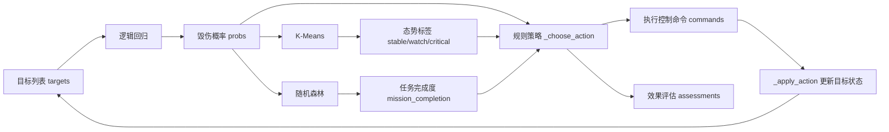

# 闭环优化算法说明

## 1. 文档范围

本文档描述 `closed_loop_agent` 模块中实现的机器学习算法与控制策略，包括：

- xBD 建筑级特征抽取（前置数据处理）
- 逻辑回归（Logistic Regression）：毁伤二分类
- K-Means：态势聚类
- 随机森林（Random Forest）：任务完成度回归
- 规则约束的闭环控制策略

实现位置：

| 模块 | 路径 |
|------|------|
| 算法核心 | `closed_loop_agent/closed_loop_core.py` |
| Agent 入口 | `closed_loop_agent/main.py` |
| xBD 特征抽取 | `scripts/extract_xbd_damage_features.py` |
| 端到端示例 | `scripts/run_xbd_closed_loop_demo.py` |

上述算法均为 **纯 Python 从零实现**，未依赖 `sklearn`、`numpy`、`PyTorch` 等第三方机器学习库。训练与推理逻辑可直接阅读源码验证。

---

## 2. 系统架构

闭环优化在一次调用中依次完成 **模型训练 → 多轮迭代推理 → 控制决策输出**。单轮迭代的数据流如下：



入口函数为 `_closed_loop_optimization(arguments)`。默认迭代 `cycles=3` 轮，每轮对全部目标重复执行评估与控制。

---

## 3. 前置处理：xBD 特征抽取

### 3.1 作用

将 xBD 灾前/灾后影像及建筑多边形标注转换为逻辑回归可用的数值特征表（CSV）。该步骤不属于机器学习模型本身，但决定了毁伤评估模型的输入质量。

### 3.2 方法

对每个 building 多边形：

1. 裁剪灾前/灾后 ROI，并生成多边形 mask；
2. 在 mask 区域内逐像素计算：
   - `spectral_delta`：RGB 通道绝对差均值；
   - `texture_delta`：灰度图 Sobel 近似梯度差；
   - `heat_signature`：灰度亮度变化；
   - `crater_density`：高光谱变化或显著变暗像素占比；
3. 派生 `pre_area`、`normalized_distance` 等几何与位置特征；
4. 由标注 `subtype` 映射二值标签 `damage_label`（`no-damage` → 0，其余 → 1）。

关键实现（`scripts/extract_xbd_damage_features.py`）：

```python
spectral = (abs(qr - pr) + abs(qg - pg) + abs(qb - pb)) / (3.0 * 255.0)
brightness_delta = abs(post_gray[y][x] - pre_gray[y][x])
texture_delta = abs(_gradient(post_gray, x, y) - _gradient(pre_gray, x, y)) / 2.0
if spectral > 0.18 or post_gray[y][x] < pre_gray[y][x] - 0.12:
    dark_or_changed += 1
```

输出文件默认写入 `data/xbd/processed/xbd_damage_features.csv`。

---

## 4. 逻辑回归（Logistic Regression）

### 4.1 类与作用

- **实现类**：`LogisticRegressionGD`
- **任务类型**：二分类（毁伤 / 非毁伤）
- **系统作用**：对每个目标的 8 维特征输出毁伤概率 `damage_probability`，作为后续态势聚类与闭环决策的基础量。

### 4.2 模型定义

设特征向量为 \(x\)，参数为 \(w, b\)，则：

\[
P(y=1 \mid x) = \sigma(w^\top x + b), \quad \sigma(z) = \frac{1}{1 + e^{-z}}
\]

### 4.3 训练算法

| 项目 | 配置 |
|------|------|
| 优化方法 | 批量梯度下降（Batch Gradient Descent） |
| 损失函数 | 二元交叉熵 |
| 正则化 | L2，系数 `l2=0.001` |
| 学习率 | `0.28` |
| 迭代次数 | `420` |
| 特征预处理 | Z-score 标准化（`StandardScaler`） |
| 参数初始化 | 权重与偏置均为 0 |

核心更新逻辑（`closed_loop_agent/closed_loop_core.py`）：

```python
for _ in range(self.iterations):
    grad_w = [0.0 for _ in range(width)]
    grad_b = 0.0
    for row, label in zip(x_rows, labels):
        pred = _sigmoid(sum(w * v for w, v in zip(self.weights, row)) + self.bias)
        err = pred - float(label)
        for i, value in enumerate(row):
            grad_w[i] += err * value
        grad_b += err
    for i in range(width):
        grad = (grad_w[i] / n) + self.l2 * self.weights[i]
        self.weights[i] -= self.learning_rate * grad
    self.bias -= self.learning_rate * (grad_b / n)
```

### 4.4 输入特征

| 序号 | 字段 | 含义 |
|------|------|------|
| 1 | `pre_area` | 灾前建筑面积（归一化） |
| 2 | `spectral_delta` | 光谱变化 |
| 3 | `texture_delta` | 纹理变化 |
| 4 | `heat_signature` | 亮度/热信号变化 |
| 5 | `crater_density` | 高变化或变暗像素密度 |
| 6 | `normalized_distance` | 目标距影像中心归一化距离 |
| 7 | `detection_confidence` | 检测置信度 |
| 8 | `threat_score` | 威胁评分 |

推理接口：`predict_proba(row) -> float`，取值区间 \([0, 1]\)。模型评估阶段以阈值 `0.5` 转为硬分类。

### 4.5 训练数据来源

`_train_models()` 中：

- 若提供 `xbd_damage_csv` 且样本数 \(\ge 8\)、标签至少两类 → 使用真实特征表；
- 否则 → 调用 `_generate_xbd_like_damage_data(780, seed)` 生成模拟样本。

---

## 5. K-Means 聚类

### 5.1 类与作用

- **实现类**：`KMeans`
- **任务类型**：无监督硬聚类
- **系统作用**：依据目标当前态势特征，将目标划分为 3 个簇，并映射为语义标签 `stable`、`watch`、`critical`，供控制策略引用。

### 5.2 算法定义

采用 **Lloyd K-Means**：

| 项目 | 配置 |
|------|------|
| 簇数 \(k\) | 3 |
| 距离度量 | 平方欧氏距离 |
| 质心初始化 | 从样本中随机抽取 \(k\) 个点 |
| 迭代次数 | 40（固定轮数，无收敛判据） |
| 空簇处理 | 随机替换为任一训练样本 |
| 特征预处理 | Z-score 标准化 |

迭代过程：

```python
for _ in range(self.iterations):
    buckets = [[] for _ in range(self.k)]
    for row in x_rows:
        label = self._closest(row)  # 分配到最近质心
        buckets[label].append(row)
    for idx, bucket in enumerate(buckets):
        self.centroids[idx] = [_mean([row[i] for row in bucket]) for i in range(width)]
```

### 5.3 输入特征

单目标 5 维态势向量（`_situation_features`）：

| 字段 | 含义 |
|------|------|
| `threat_score` | 威胁评分 |
| `velocity_norm` | 归一化速度 |
| `1 - damage_prob` | 毁伤概率补量 |
| `uncertainty` | 不确定性 |
| `ammo_need` | 弹药需求 |

### 5.4 簇标签映射

聚类编号本身无语义。系统根据各簇平均风险值排序后，依次赋予 `stable`、`watch`、`critical`（`_cluster_profiles`）。

K-Means 的训练数据由 xBD 特征表前 360 行派生 5 维向量构成，与在线推理使用的 `_situation_features` 维度一致但字段选取方式不同，属于 **离线预聚类 + 在线最近质心分配** 的组合用法。

---

## 6. 随机森林回归（Random Forest Regressor）

### 6.1 类与作用

- **实现类**：`RandomForestRegressor`（基学习器为 `RegressionTree`）
- **任务类型**：回归
- **系统作用**：预测当前态势下任务完成度 `mission_completion`（区间 \([0, 1]\)），作为闭环策略中是否需要协调压制的判据。

### 6.2 单棵回归树（CART）

`RegressionTree` 采用 **CART 回归树**，以 **SSE（残差平方和）最小化** 作为分裂准则：

| 项目 | 配置 |
|------|------|
| 分裂准则 | \(\mathrm{SSE}(L) + \mathrm{SSE}(R)\) 最小 |
| 叶节点预测 | 叶内目标均值 |
| 最大深度 | 6 |
| 最小叶样本数 | 8 |
| 候选阈值 | 唯一值 \(\le 12\) 时取相邻中点；否则取 7 个分位点 |
| 特征子采样 | 每节点随机考察 `sqrt(n_features)` 个特征 |

分裂选择逻辑：

```python
score = self._sse(left_y) + self._sse(right_y)
if score < best_score:
    best = (feature, threshold)
```

### 6.3 森林集成（Bagging）

| 项目 | 配置 |
|------|------|
| 基学习器数量 | 19 |
| 采样方式 | Bootstrap 有放回采样（样本量等于训练集大小） |
| 特征子采样 | `max_features = sqrt(特征维数)` |
| 回归预测 | 19 棵树输出算术平均，再 clip 至 \([0, 1]\) |

训练核心（`RandomForestRegressor.fit`）：

```python
for index in range(self.trees):
    sample_x, sample_y = [], []
    for _ in range(len(x_rows)):
        pos = rng.randrange(len(x_rows))
        sample_x.append(x_rows[pos])
        sample_y.append(targets[pos])
    tree = RegressionTree(self.max_depth, self.min_leaf, max_features=max_features, seed=self.seed + index)
    tree.fit(sample_x, sample_y)
    self.models.append(tree)
```

### 6.4 输入特征

7 维任务级特征（`_mission_features`，由当前目标群聚合得到）：

| 字段 | 构造方式 |
|------|----------|
| `damage_rate` | 全部目标毁伤概率均值 |
| `asset_readiness` | 由弹药需求均值派生 |
| `control_timeliness` | 由控制延迟派生 |
| `intel_confidence` | 检测置信度均值 |
| `threat_pressure` | 威胁评分与毁伤概率组合均值 |
| `ammo_pressure` | 弹药需求均值 |
| `comm_quality` | 固定常数 0.88 |

### 6.5 训练数据来源

- 若提供 `sc2le_task_csv` 且样本数 \(\ge 50\) → 使用真实任务特征表；
- 否则 → 调用 `_generate_sc2le_like_task_data(760, seed)` 生成模拟样本。

---

## 7. 闭环控制策略

### 7.1 性质说明

闭环控制部分 **不属于机器学习模型**，而是基于毁伤概率、态势标签与任务完成度的 **确定性规则引擎**。每轮迭代在模型输出基础上生成执行控制命令，并通过 `_apply_action` 更新目标状态，形成多轮反馈。

### 7.2 动作选择（`_choose_action`）

按优先级依次判定：

| 条件 | 动作 | 期望效果增量 |
|------|------|--------------|
| `damage_prob >= 0.84` | `confirm_effect_and_shift` | 0.02 |
| 态势为 `critical` 且 `threat_score >= 0.72` 且 `damage_prob < 0.72` | `re_attack` | 0.18 |
| `uncertainty > 0.34` 或 `damage_prob < 0.55` | `reallocate_sensor` | 0.08 |
| `mission_completion < 0.90` 且 `threat_score >= 0.62` | `coordinated_suppression` | 0.12 |
| 其余 | `continue_tracking` | 0.04 |

### 7.3 状态更新（`_apply_action`）

不同动作对目标特征施加确定性增量，例如打击类动作提升 `spectral_delta`、`texture_delta` 等毁伤相关特征，并降低 `velocity_norm`、`uncertainty`。该机制用于仿真闭环反馈，而非物理仿真引擎。

### 7.4 单轮主循环

```python
for cycle in range(1, cycles + 1):
    damage_rows = [_damage_features(target) for target in targets]
    probs = damage_model.predict_proba(damage_rows)
    situation_rows = [_situation_features(target, prob) for target, prob in zip(targets, probs)]
    cluster_labels = kmeans.predict(situation_rows)
    profiles = _cluster_profiles(targets, cluster_labels, probs)
    mission_features = _mission_features(targets, probs, control_latency_ms=0.0)
    mission_completion = mission_model.predict_one(mission_features)
    # 逐目标生成 commands / assessments，并调用 _apply_action
```

---

## 8. 超参数汇总

| 组件 | 参数 | 默认值 |
|------|------|--------|
| LogisticRegressionGD | `learning_rate` | 0.28 |
| LogisticRegressionGD | `iterations` | 420 |
| LogisticRegressionGD | `l2` | 0.001 |
| KMeans | `k` | 3 |
| KMeans | `iterations` | 40 |
| RandomForestRegressor | `trees` | 19 |
| RegressionTree | `max_depth` | 6 |
| RegressionTree | `min_leaf` | 8 |
| 闭环迭代 | `cycles` | 3（上限 8） |

---

## 9. 输出结构

`_closed_loop_optimization` 返回结构化结果，主要字段包括：

| 字段 | 内容 |
|------|------|
| `output_data.execution_control` | 各目标控制命令（动作、优先级、预期效果） |
| `output_data.effect_assessment` | 毁伤概率、毁伤确认、态势簇 |
| `output_data.closed_loop_optimization` | 各轮历史、任务完成度变化 |
| `output_data.algorithm` | 算法类型声明 |
| `output_data.datasets` | 各模型实际使用的数据来源（真实表 / 模拟） |
| `output_data.requirement_report` | 协议验收指标对照 |

---

## 10. 实现边界与适用场景

1. **算法完整性**：逻辑回归、K-Means、随机森林的核心训练与推理流程均已实现，可通过阅读 `closed_loop_agent/closed_loop_core.py` 完整追溯。
2. **工程精度**：实现为轻量级版本，未包含 k-means++ 初始化、L-BFGS 求解、OOB 评估等工业级优化。
3. **数据规模**：当前仓库 xBD 示例仅含 3 对影像、15 个建筑样本，适用于 **流程验证**；完整 benchmark 需扩充训练/测试划分。
4. **任务完成度模型**：在未提供 SC2LE 特征表时默认使用模拟数据训练，此时指标仅反映 pipeline 连通性。
5. **闭环反馈**：目标状态更新为参数化仿真，不代表真实战场物理过程。

---

## 11. 相关文档

- `docs/closed_loop_agent_adaptation.md`：闭环 Agent 与 A2A 框架的集成说明
- `scripts/run_xbd_closed_loop_demo.py`：xBD 特征抽取 + 闭环优化端到端示例
