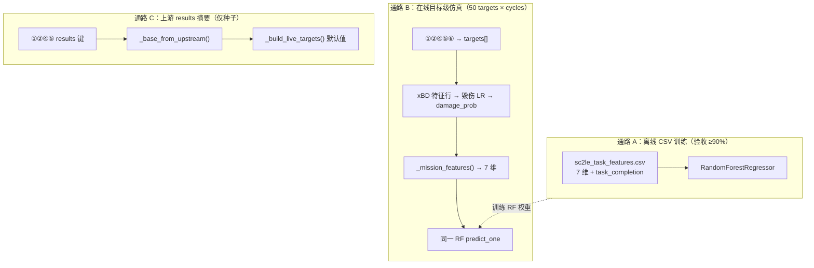

# zh 分支合并 main、闭环 Agent 适配与 SC2LE 数据集全流程说明

> 文档版本：2026-06-23（v3：十类 Agent 特征对接已落地）  
> 适用分支：`zh`  
> 适用仓库：`A2A`（`https://github.com/yishou1/A2A`）  
> 本文档汇总了从拉取 `main`、适配宕机恢复规范、合并冲突、SC2LE 数据集下载、replay 解析、特征 CSV 生成、闭环评估，到未来多 Agent 系统对接的完整操作与说明。

---

## 目录

1. [背景与目标](#1-背景与目标)
2. [环境与前置条件](#2-环境与前置条件)
3. [Git 网络与代理配置](#3-git-网络与代理配置)
4. [拉取 main 并合并到 zh](#4-拉取-main-并合并到-zh)
5. [合并 main 时的冲突处理](#5-合并-main-时的冲突处理)
6. [closed_loop Agent 适配 main 规范](#6-closed_loop-agent-适配-main-规范)
7. [自动化测试](#7-自动化测试)
8. [xBD 侧工作简述（与本流程并行）](#8-xbd-侧工作简述与本流程并行)
9. [SC2LE 数据集下载](#9-sc2le-数据集下载)
10. [Replay 文件本质与内部结构](#10-replay-文件本质与内部结构)
11. [Replay 转 CSV：脚本、流程与公式](#11-replay-转-csv脚本流程与公式)
12. [MMR 与 APM 的真实含义](#12-mmr-与-apm-的真实含义)
13. [闭环评估：如何运行与如何读结果](#13-闭环评估如何运行与如何读结果)
14. [解析样本文件说明](#14-解析样本文件说明)
15. [上游 Agent → 闭环特征：完整对接指南](#15-上游-agent--闭环特征完整对接指南)
16. [目录与脚本索引](#16-目录与脚本索引)
17. [Git 提交记录（本次相关）](#17-git-提交记录本次相关)
18. [后续待办与演进建议](#18-后续待办与演进建议)
19. [常见问题 FAQ](#19-常见问题-faq)
20. [参考文档](#20-参考文档)
21. [附录 A：Git 逐步操作手册](#附录-a-git-逐步操作手册)
22. [附录 B：合并冲突逐行对照](#附录-b-合并冲突逐行对照)
23. [附录 C：集合式 Context API 数据结构](#附录-c-集合式-context-api-数据结构)
24. [附录 D：closed_loop_core 调用链与算法参数](#附录-d-closed_loop_core-调用链与算法参数)
25. [附录 E：sample_01 特征手算完整算例](#附录-e-sample_01-特征手算完整算例)
26. [附录 F：CSV 列与 _load_sc2le 别名映射](#附录-f-csv-列与-_load_sc2le-别名映射)
27. [附录 G：_closed_loop_optimization 输入输出全字段](#附录-g-_closed_loop_optimization-输入输出全字段)
28. [附录 H：requirement_report 验收逻辑](#附录-h-requirement_report-验收逻辑)
29. [附录 I：集成测试逐步说明](#附录-i-集成测试逐步说明)
30. [附录 J：环境变量与 Commander 配置](#附录-j-环境变量与-commander-配置)
31. [附录 K：离线 CSV 训练 vs 在线闭环仿真](#附录-k-离线-csv-训练-vs-在线闭环仿真)
32. [附录 L：10 Agent 编号与 results 键对照](#附录-l-10-agent-编号与-results-键对照)
33. [附录 M：已知 Bug 与修复记录](#附录-m-已知-bug-与修复记录)
34. [附录 N：完整目录与文件树](#附录-n-完整目录与文件树)
35. [附录 O：从 replay 到验收的端到端检查清单](#附录-o-从-replay-到验收的端到端检查清单)
36. [附录 P：Agent 输出 → 特征向量转换公式与示例](#附录-p-agent-输出--特征向量转换公式与示例)

---

## 1. 背景与目标

### 1.1 背景

- 个人开发在 `zh` 分支上实现了 **closed_loop（效果评估与闭环优化）** 能力，包括 xBD 毁伤评估与 SC2LE 任务完成度回归。
- 远程 `main` 分支新增了 **Agent 宕机恢复、心跳 failover、集合式结果 API、BPEL DAG 调度** 等框架能力。
- 目标是在 **不丢失 zh 分支已有功能** 的前提下，把 `main` 的更新合并进来，并完成 SC2LE 真实 replay 数据的特征抽取与评估。

### 1.2 已完成的主要成果

| 类别 | 成果 |
|------|------|
| Git | `main` 合并进 `zh`；冲突已解决；相关 commit 已提交 |
| 框架适配 | `closed_loop` 对齐 A2A 接入规范、failover、集合式 context API |
| SC2LE 数据 | 下载 `3.16.1-Pack_1-fix`，解析 64396 个 replay，生成 128790 行 CSV |
| 评估 | 任务完成度准确率 **91.27%**（≥90% 协议要求） |
| 脚本 | `extract_sc2le_task_features.py`、`run_sc2le_closed_loop_demo.py` |
| 测试 | 新增 `tests/test_closed_loop_integration.py`，25 项相关测试通过 |
| 样本 | `data/sc2/processed/samples/` 保存真实解析样例 |

---

## 2. 环境与前置条件

### 2.1 软件环境

| 组件 | 说明 |
|------|------|
| Python | 3.13+（本机使用 `D:\tools\python\python.exe`） |
| PySC2 虚拟环境 | `temp_study/sc2le_env`（含 `pysc2`、`s2protocol`、`mpyq`） |
| Git | 用于拉取/合并/提交 |
| 依赖 | `pip install pytest redis`；完整依赖见 `requirements.txt` |

### 2.2 目录约定

```text
temp_study/
├── A2A/                          # 主项目（本文档所在仓库）
│   ├── closed_loop_agent/          # 闭环 Agent 与算法核心
│   ├── commander_agent/            # Commander 编排
│   ├── scripts/                    # 数据处理与 demo 脚本
│   ├── data/
│   │   ├── xbd/                    # xBD 数据与特征
│   │   └── sc2/                    # SC2LE replay 与 processed 输出
│   └── docs/                       # 说明文档（本文件）
└── sc2le_env/                      # PySC2 专用虚拟环境
```

### 2.3 分支状态（文档编写时）

- 当前分支：`zh`
- 相对 `origin/zh`：ahead 16 commits，behind 1 commit
- 大体积数据（replay 包、全量 CSV、xBD train 等）**未提交 Git**，仅保留在本地

---

## 3. Git 网络与代理配置

### 3.1 问题现象

在国内网络环境下，直接访问 GitHub 可能出现：

```text
Failed to connect to github.com port 443
```

本地能访问百度等站点，但 `git fetch` 失败。

### 3.2 原因

- Git **未配置代理**，流量直连 GitHub。
- 本机 `7890` 端口可能被 Cursor 占用，**不能**当作 Clash 代理使用。
- 用户实际可用代理端口为 **`7897`**。

### 3.3 配置方法（仅对 GitHub 生效）

```powershell
git config --global http.https://github.com.proxy http://127.0.0.1:7897
git config --global https.https://github.com.proxy http://127.0.0.1:7897
```

验证：

```powershell
cd A2A
git fetch origin
git ls-remote https://github.com/yishou1/A2A HEAD
```

取消代理（不再需要时）：

```powershell
git config --global --unset http.https://github.com.proxy
git config --global --unset https.https://github.com.proxy
```

---

## 4. 拉取 main 并合并到 zh

### 4.1 为什么要先 commit 或 stash

合并前若工作区有未保存改动，`git merge` 可能失败或产生混乱。

| 方式 | 含义 | 适用场景 |
|------|------|----------|
| **commit** | 提交到当前分支历史 | 改动是要保留的功能（推荐） |
| **stash** | 临时藏进栈，工作区变干净 | 改动未完成、不想写进历史 |

本次采用 **commit 到 zh**，未 push 到远程（除非另行执行 `git push`）。

### 4.2 合并前提交的内容

提交 `5adc0c7` 包含：

- `closed_loop_agent/closed_loop_core.py` 等代码迭代
- xBD 脚本与实验结果 JSON/CSV
- **未提交** 大文件：`train.zip`、`train/train/`、`test/`、826MB npz 等

### 4.3 合并命令

```powershell
cd A2A
git fetch origin
git merge origin/main -m "Merge origin/main into zh"
```

### 4.4 main 带入的主要更新（6 个 commit）

| Commit（从新到旧） | 内容 |
|-------------------|------|
| `d40ed8d` | resilient agent orchestration、heartbeat failover demos |
| `47261a5` | 异常捕获机制完善 |
| `8ded222` | DAG activity 调度与 result metadata |
| `58d8d24` | 拆分并发参数、BPEL 依赖检查 |
| `d9b5fca` | Agent 宕机恢复 + **接入规范**（必读 `AGENT_FAILOVER_RECOVERY_README.md`） |
| （更早） | BPEL 并发、Commander manager 等 |

合并后 `zh` 在 `main` 全部更新之上，并保留 closed_loop xBD 工作。

### 4.5 merge commit 之后本地新增的 3 个 commit

| Commit | 文件级变更摘要 |
|--------|----------------|
| `d37467e` | `commander_agent/main.py`：closed_loop payload 标准字段 + `_latest_context_value` |
| `497d9be` | `closed_loop_agent/main.py` 重构；`tests/test_closed_loop_integration.py` 新增 |
| `acaeda0` | `scripts/extract_sc2le_task_features.py`；`closed_loop_core.py` SC2-only 聚类修复 |

---

## 5. 合并 main 时的冲突处理

### 5.1 冲突文件

仅 **`commander_agent/main.py`** 存在内容冲突（3 处）。

### 5.2 解决策略

| 冲突点 | 处理方式 |
|--------|----------|
| context 初始字段 | 采用 main 的 `[]` 列表初始化 + 保留 `closed_loop_result: []` |
| `apply_agent_result` | assault 用 main 的 `_append_output_collection`；closed_loop 保留并改为同一 API |
| `rule_next_step` | 保留 assault→closed_loop→end 流程，判断改为 `_context_entries()` |
| `_result_collection_keys` | 增加 `closed_loop_result` |

### 5.3 合并后补充修复

1. **`build_task_payload("closed_loop")`**：原先用未定义的 `task_id`/`step_index`，已改为与 recon/assault 一致的 `work_item`、`activatity_index` 等标准字段（commit `d37467e`）。
2. **`build_task_payload` 上游结果**：closed_loop 的 `input.results` 改为 `_latest_context_value()` 读取集合式 context（commit `d37467e`）。

### 5.4 冲突 1：context 初始字段

**main 侧（合并前）**：`recon_report`、`strike_result` 等改为空列表 `[]`，每条 Agent 结果以「集合条目」追加。

**zh 侧**：多了 `closed_loop_result: []`。

**最终保留**（`initial_workflow_context()` 约 771–776 行）：

```python
"recon_report": [],
"strike_result": [],
"eval_score": [],
"commander_decision": [],
"assault_result": [],
"closed_loop_result": [],   # zh 独有，必须保留
```

若漏加 `closed_loop_result`，`apply_agent_result("closed_loop")` 无法写入闭环结果，`rule_next_step` 会反复调度 closed_loop。

### 5.5 冲突 2：`apply_agent_result`

**main 侧**：recon/artillery/evaluator/assault 统一走 `_append_output_collection()`，每条写入含 `value`、`work_item`、`activity_id`、`role`、`status`、`duration_ms`。

**zh 侧**：多了 `elif role == "closed_loop"` 分支。

**最终策略**：assault 与 closed_loop **都**用 `_append_output_collection()`；closed_loop 的 `target_key` 为 `closed_loop_result`（见 `_result_collection_keys()` 约 1627–1634 行）。

closed_loop 写入示例条目结构：

```json
{
  "value": { "task_type": "closed_loop_optimization", "output_data": { "...": "..." } },
  "activity_id": "activatity-005-closed-loop",
  "work_item": "wf-xxx:5:closed_loop",
  "role": "closed_loop",
  "status": "completed",
  "output": { "closed_loop_result": "..." },
  "created_at": "2026-04-12T08:00:00Z"
}
```

### 5.6 冲突 3：`rule_next_step` 工作流顺序

**zh 流程**（必须保留，约 1451–1476 行）：

```text
recon → artillery → evaluator → decision → assault → closed_loop → end
```

关键判断（均用 `_context_entries()`，不能用 `context.get("assault_result")` 直接判真）：

| 条件 | 下一动作 |
|------|----------|
| 无 `recon_report` 条目 | `role=recon` |
| 有 recon、无 `strike_result` | `role=artillery` |
| 有 strike、无 `eval_score` | `role=evaluator` |
| 有 eval、无 `commander_decision` | `type=decision` |
| decision 含 ASSAULT 且无 assault | `role=assault` |
| decision 含 RE-PLAN/ABORT | `type=end` |
| 有 assault、无 `closed_loop_result` | **`role=closed_loop`** |
| 有 assault 且已有 closed_loop | `type=end` |

### 5.7 merge 后 bug：`build_task_payload("closed_loop")` 修复前后

**修复前（错误）**：payload 里出现未定义变量 `task_id`、`step_index`，Python 运行到 closed_loop 步骤会 `NameError`。

**修复后（commit `d37467e`，约 1182–1218 行）**：

```python
if role == "closed_loop":
    work_item = f"{self.workflow_id}:{activatity_index}:{role}"  # 与其他 role 一致
    input_data = {
        "target_count": int(os.environ.get("CLOSED_LOOP_TARGET_COUNT", "50")),
        "cycles": int(os.environ.get("CLOSED_LOOP_CYCLES", "3")),
        "results": {
            "recon": {"output_data": {"report": self._latest_context_value(context, "recon_report")}},
            "artillery": {"output_data": {"result": self._latest_context_value(context, "strike_result")}},
            "evaluator": {"output_data": {"eval_score": self._latest_context_value(context, "eval_score")}},
            "assault": {"output_data": {"result": self._latest_context_value(context, "assault_result")}},
        },
    }
    # dataset_paths 来自环境变量 CLOSED_LOOP_XBD_DAMAGE_CSV / CLOSED_LOOP_SC2LE_TASK_CSV
    return {
        "workflow_id": self.workflow_id,
        "work_item": work_item,
        "parent_work_item": context.get("last_work_item"),
        "activatity_index": activatity_index,
        "activatity_role": "closed_loop",
        "command": "closed_loop_optimization",
        "input": input_data,
        "output_hint": "closed_loop_result",
        ...
    }, False
```

注意：Commander 传给 closed_loop 的 `results` 键名仍是 **`recon` / `artillery` / `evaluator` / `assault`**（简化别名），**不是** 10 Agent 标准键；闭环 core 里 `_extract_upstream_results()` 会读 `results`，但 `_base_from_upstream()` 目前只解析 `perception_detection` 等键，对 recon/assault 会退回默认 `det_conf=0.82` 等（见附录 K）。

---

## 6. closed_loop Agent 适配 main 规范

### 6.1 main 框架要求摘要

详见仓库根目录 **`AGENT_FAILOVER_RECOVERY_README.md`**（第 9 节「统一接入规范」）。

核心要求：

| 项目 | 要求 |
|------|------|
| 服务名 | Nacos 注册 `A2A-Agent` |
| metadata | `role` + `status=idle` |
| 心跳 | `A2A_HEARTBEAT_INTERVAL=5` 等 |
| 继承 | `A2ABaseAgent`，业务在 `execute_task` |
| 响应 | 统一信封：`workflow_id`、`work_item`、`output`、`metrics`、`status` |
| 幂等 | 同一 `work_item` 可缓存 |
| failover | 系统错误触发切换；业务错误 `AGENT_BUSINESS_ERROR` 不切换 |

### 6.2 本次对 `closed_loop_agent/main.py` 的改动

| 改动 | 说明 |
|------|------|
| 提取 `build_closed_loop_arguments()` | 统一从 A2A payload 解析 input |
| 删除非标准 `handle_message` 覆写 | 避免与 `/sendMessage` 信封不一致 |
| `execute_stream` 使用 `asyncio.to_thread` | 避免阻塞事件循环 |
| Nacos 注册 | `role=closed_loop`, `status=idle`, 心跳 |

### 6.3 Commander 侧 closed_loop payload 标准格式

```json
{
  "workflow_id": "wf-xxx",
  "work_item": "wf-xxx:5:closed_loop",
  "parent_work_item": "wf-xxx:4:assault",
  "activatity_index": 5,
  "activatity_role": "closed_loop",
  "command": "closed_loop_optimization",
  "input": {
    "target_count": 50,
    "cycles": 3,
    "dataset_paths": {
      "sc2le_task_csv": "data/sc2/processed/sc2le_task_features.csv",
      "xbd_damage_csv": "data/xbd/processed/xbd_damage_features_train.csv"
    },
    "results": {
      "perception_detection": { "output_data": { "detections": [...] } },
      "threat_evaluation": { "output_data": { "priority_score": 0.76 } },
      "execution_control": { "output_data": { "latency_ms": 150 } },
      "communication": { "output_data": { "delivery_rate": 0.93 } },
      "resource_allocation": { "output_data": { "readiness": 0.81 } },
      "recon": { "output_data": { "report": "..." } }
    }
  },
  "output_hint": "closed_loop_result",
  "work_list": []
}
```

### 6.4 集合式结果 API（main 新增）

main 将 `recon_report`、`strike_result` 等从单值改为 **条目列表**，每条含 `value`、`work_item`、`activity_id` 等（完整 schema 见 [附录 C](#附录-c-集合式-context-api-数据结构)）。

closed_loop 侧必须：

- 写入：`_append_output_collection()`
- 读取：`_context_entries()` / `_latest_context_value()`
- `_result_collection_keys()` 包含 `closed_loop_result`

### 6.5 A2A `/sendMessage` 响应信封（closed_loop 成功时）

`ClosedLoopAgent` 继承 `A2ABaseAgent`，成功响应结构（测试 3 验证）：

```json
{
  "workflow_id": "wf-1",
  "work_item": "wf-1:5:closed_loop",
  "role": "closed_loop",
  "status": "completed",
  "output": {
    "closed_loop_result": {
      "task_type": "closed_loop_optimization",
      "input_data": { "...": "..." },
      "output_data": { "meets_requirements": true, "...": "..." },
      "accuracy": 0.9,
      "latency": 0.01
    }
  },
  "metrics": {
    "duration_ms": 123,
    "latency_ms": 123
  },
  "cached": false
}
```

失败（不支持 command）：

```json
{
  "status": "failed",
  "error_code": "AGENT_BUSINESS_ERROR",
  "error": "Unsupported command: invalid_command"
}
```

业务错误 **不** 触发 failover；连接错误才切换备用实例（测试 6）。

### 6.6 `build_closed_loop_arguments` 字段透传

`closed_loop_agent/main.py` 中 `PASSTHROUGH_INPUT_KEYS`：

```python
("targets", "results", "previous_results", "dataset_paths",
 "cycles", "seed", "target_count")
```

### 6.7 Agent 结果映射模块（已实现）

| 文件 | 作用 |
|------|------|
| `closed_loop_agent/agent_results_mapping.py` | `mission_vector_from_results()`、`build_standard_results_from_context()` |
| `commander_agent/main.py` | `build_closed_loop_results_from_context()` → 标准 `results` 键 |
| `scripts/build_mission_vector_from_agent_results.py` | CLI：JSON → 七维向量 / 可选 append CSV |

Commander 调用链：

```text
build_task_payload("closed_loop")
  → build_closed_loop_results_from_context(context)
  → input.results 含 perception_detection / threat_evaluation / execution_control / communication 等
closed_loop_core._closed_loop_optimization()
  → _mission_features(targets, probs, upstream_results)
  → mission_vector_from_results(...)
```

---

## 7. 自动化测试

### 7.1 新增测试

**文件**：`tests/test_closed_loop_integration.py`（9 项，含 `AgentResultsMappingTest`）

| 测试 | 验证内容 |
|------|----------|
| 参数解析 | `build_closed_loop_arguments` |
| Commander payload | 标准 `results` 键 + 兼容别名 |
| `/sendMessage` | 统一响应信封 |
| work_item 幂等缓存 | 同 work_item 第二次 `cached: true` |
| 不支持 command | `AGENT_BUSINESS_ERROR` |
| failover | closed_loop 角色主实例 down 后切换备用 |
| LocalAgentRuntime | 本地 closed_loop 路径 |
| mission_vector 手算 | 文档例题七维 `[0.75, 0.75, 0.85, ...]` |
| comm + latency 接线 | `_mission_features` 读 ③⑨ |

### 7.2 一并运行的 main 自带测试（18 项）

- `tests/test_local_runtime.py`
- `tests/test_error_classification.py`
- `tests/test_agent_heartbeat.py`
- `tests/test_agent_leases.py`

### 7.3 运行命令

```powershell
cd A2A
pip install pytest redis
python -m pytest tests/test_closed_loop_integration.py -v
python -m pytest tests/test_local_runtime.py tests/test_error_classification.py tests/test_agent_heartbeat.py tests/test_agent_leases.py -q
```

**结果**：closed_loop 集成 9 passed；与 main 自带测试合计 **27 passed**。

### 7.4 测试 deliberately 未覆盖的内容

- 未跑完整 xBD CNN 训练（太慢）
- 未跑端到端 Nacos + HTTP 全栈
- 未跑 SC2LE 全量 replay 抽取（在脚本层单独验证）

---

## 8. xBD 侧工作简述（与本流程并行）

zh 分支上 parallel 存在的 xBD 能力（与 SC2LE 独立但共用 closed_loop 框架）：

| 脚本 | 作用 |
|------|------|
| `scripts/extract_xbd_damage_features.py` | 从 xBD images/labels 抽建筑级特征 |
| `scripts/extract_xbd_cnn_embeddings.py` | ResNet18 ROI embedding |
| `scripts/run_xbd_closed_loop_demo.py` | xBD 小样本端到端 demo |
| `scripts/run_full_train_test.py` | 全量 xBD 特征 + CNN + 闭环 |

xBD 毁伤模型验收：`xbd_damage_accuracy >= 0.92`（详见 `docs/xbd_damage_model_iteration_log.md`）。

闭环 Agent **同时**支持：

- `dataset_paths.xbd_damage_csv` → 毁伤 LR + K-Means
- `dataset_paths.sc2le_task_csv` → 任务完成度 RF

---

## 9. SC2LE 数据集下载

### 9.1 官方来源

Blizzard **Replay Packs**（SC2LE 研究常用）：

- 文档：<https://github.com/Blizzard/s2client-proto#downloads>
- Pack 1：<https://blzdistsc2-a.akamaihd.net/ReplayPacks/3.16.1-Pack_1-fix.zip>
- Pack 2：<https://blzdistsc2-a.akamaihd.net/ReplayPacks/3.16.1-Pack_2.zip>

### 9.2 许可与密码

- 需同意 [AI and Machine Learning License](http://blzdistsc2-a.akamaihd.net/AI_AND_MACHINE_LEARNING_LICENSE.html)
- 解压密码：**`iagreetotheeula`**

### 9.3 本地存放路径（本次使用）

下载后解压（密码 `iagreetotheeula`）：

```powershell
# 假设 zip 在 Downloads
Expand-Archive -Path "$env:USERPROFILE\Downloads\3.16.1-Pack_1-fix.zip" `
  -DestinationPath "c:\Users\14350\Desktop\文档+代码\zhangheng\temp_study\A2A\data\sc2" -Force
# 7-Zip 若需密码：7z x 3.16.1-Pack_1-fix.zip -piagreetotheeula -odata/sc2/
```

```text
A2A/data/sc2/3.16.1-Pack_1-fix/
├── Replays/          # 64396 个 .SC2Replay
├── Battle.net/       # 地图缓存等
└── ...
```

磁盘占用：Pack 1 解压后约 **数十 GB**（视地图缓存而定），**勿提交 Git**。

### 9.4 版本注意事项

- replay **版本必须与 SC2 客户端一致**（3.16.1 replay 需 3.16.1 客户端才能完整重放）。
- 本次特征抽取 **不需要启动游戏**，仅用 `mpyq` + `s2protocol` 读 metadata。

### 9.5 可选：API 批量下载

```powershell
# 需 Blizzard Developer API Key
python download_replays.py --key=KEY --secret=SECRET --version=3.16.1 --replays_dir=D:\sc2_replays --extract
```

脚本位置：`s2client-proto/samples/replay-api/download_replays.py`

### 9.6 PySC2 环境

项目旁已有：

```text
temp_study/sc2le_env/     # Python 虚拟环境，含 pysc2、s2protocol、mpyq
temp_study/run_pysc2_smoke.ps1   # 验证 SC2 + PySC2 是否可用
```

---

## 10. Replay 文件本质与内部结构

### 10.1 本质

`.SC2Replay` 是 **MPQ 压缩归档**，记录一整局 SC2 对战，可用于客户端或 PySC2 重放。

### 10.2 常见内部文件（3.16.1 Pack 实测）

| 内部路径 | 含义 |
|----------|------|
| `replay.gamemetadata.json` | **对局摘要**（地图、时长、MMR、APM、胜负）← 当前 CSV 主要来源 |
| `replay.details.backup` | 对局详情（种族、结果枚举等） |
| `replay.game.events` | 游戏事件流（操作、建造等，数量可达 1 万+） |
| `replay.initData.backup` | 初始化数据 |
| `replay.attributes.events` | 属性事件 |
| `replay.load.info` | 加载信息 |

**注意**：本 Pack 中 **无** `replay.tracker.events`，但有 `replay.game.events`。

### 10.3 metadata 示例

见：`data/sc2/processed/samples/sample_01_0000e057beef/replay.gamemetadata.json`

```json
{
  "Title": "Mech Depot LE",
  "GameVersion": "3.16.1.55958",
  "Duration": 1305,
  "Players": [
    {"PlayerID": 1, "MMR": 5402, "APM": 386.0, "Result": "Loss", "SelectedRace": "Prot"},
    {"PlayerID": 2, "MMR": 5564, "APM": 384.0, "Result": "Win", "SelectedRace": "Zerg"}
  ]
}
```

---

## 11. Replay 转 CSV：脚本、流程与公式

### 11.1 脚本

**`scripts/extract_sc2le_task_features.py`**

```powershell
cd A2A
..\sc2le_env\Scripts\python.exe scripts/extract_sc2le_task_features.py `
  --replay-root "data/sc2/3.16.1-Pack_1-fix/Replays" `
  --output-csv "data/sc2/processed/sc2le_task_features.csv" `
  --report-json "data/sc2/processed/sc2le_task_features_report.json" `
  --limit 0
```

| 参数 | 说明 |
|------|------|
| `--replay-root` | replay 目录 |
| `--output-csv` | 输出 CSV 路径 |
| `--limit 0` | 0 表示处理全部 replay |
| `--limit 2000` | 仅处理前 2000 个（试点） |

### 11.2 处理流程

```text
遍历 *.SC2Replay
  → mpyq.MPQArchive 解压
  → 读取 replay.gamemetadata.json
  → 每个 Player 生成 CSV 1 行
  → 写入 sc2le_task_features.csv
```

### 11.3 本次全量抽取结果

| 指标 | 数值 |
|------|------|
| replay 文件数 | 64,396 |
| CSV 行数 | 128,790（约 2 行/局） |
| 失败 replay | 1 |
| 耗时 | 约 2.7 分钟 |

报告：`data/sc2/processed/sc2le_task_features_report.json`

### 11.4 CSV 列说明

| 列名 | 来源 | 说明 |
|------|------|------|
| `replay_id` | 文件名 stem | 对局 ID |
| `player_id` | metadata | 玩家位 |
| `map_title` | metadata | 地图名 |
| `game_version` | metadata | 如 3.16.1.55958 |
| `duration_sec` | metadata | 对局时长（秒） |
| `mmr` | metadata | 天梯分（可能为 0） |
| `apm` | metadata | 每分钟操作数 |
| `result` | metadata | Win / Loss |
| `race` | metadata | Prot / Terr / Zerg 等 |
| `damage_rate` | **公式** | 见 11.5 |
| `asset_readiness` | **公式** | MMR 归一化 |
| `control_timeliness` | **公式** | APM 归一化 |
| `intel_confidence` | **公式** | MMR+APM |
| `threat_pressure` | **公式** | 对手 MMR+时长 |
| `ammo_pressure` | **公式** | 时长归一化 |
| `comm_quality` | **公式** | APM+MMR |
| `task_completion` | **标签** | Win=1.0, Loss=0.0 |

### 11.5 特征计算公式（当前实现）

先定义中间量（均 `_clamp` 到 [0,1]）：

```text
mmr_norm      = MMR / 6000          （缺省 MMR=3000）
apm_norm      = APM / 400           （缺省 APM=120）
duration_norm = Duration / 1800
opponent_norm = 对手MMR / 6000
relative_mmr  = (MMR - 对手MMR + 1500) / 3000
completion    = Win→1.0, Loss→0.0, 平局→0.5
```

七维特征：

```text
damage_rate        = 0.25 + 0.55*completion + 0.20*relative_mmr
asset_readiness    = mmr_norm
control_timeliness = apm_norm
intel_confidence   = 0.45 + 0.40*mmr_norm + 0.15*apm_norm
threat_pressure    = 0.35 + 0.40*opponent_norm + 0.25*duration_norm
ammo_pressure      = duration_norm
comm_quality       = 0.50 + 0.30*apm_norm + 0.20*mmr_norm
task_completion    = completion
```

**重要说明**：上述七维 **不是** 从 replay 事件统计的真实击杀/视野/资源，而是 **metadata 的代理映射**。协议 CSV 读取器支持真实列名（如 `enemy_destroyed_rate`、`visibility_ratio`），将来 Agent 产出真实值可直接写入 CSV。

### 11.6 手算验证：sample_01 Player 1（Loss）

原始 metadata（`sample_01_0000e057beef/replay.gamemetadata.json`）：

| 字段 | 值 |
|------|-----|
| Duration | 1305 秒 |
| Player MMR | 5402 |
| Player APM | 386 |
| Result | Loss |
| 对手 MMR | 5564 |

中间量（`_clamp` 到 [0,1]）：

```text
mmr_norm      = 5402 / 6000           = 0.900333 → 0.9003
apm_norm      = 386 / 400             = 0.965
duration_norm = 1305 / 1800           = 0.725
opponent_norm = 5564 / 6000           = 0.927333
relative_mmr  = (5402-5564+1500)/3000 = 1338/3000 = 0.446
completion    = Loss → 0.0
```

七维：

```text
damage_rate        = 0.25 + 0.55×0 + 0.20×0.446 = 0.3392
asset_readiness    = 0.9003
control_timeliness = 0.965
intel_confidence   = 0.45 + 0.40×0.9003 + 0.15×0.965 = 0.9549
threat_pressure    = 0.35 + 0.40×0.9273 + 0.25×0.725 = 0.9022
ammo_pressure      = 0.725
comm_quality       = 0.50 + 0.30×0.965 + 0.20×0.9003 = 0.9696
task_completion    = 0.0
```

与 `sc2le_task_features_sample30.csv` 第 2 行完全一致：

```text
0000e057beef...,1,...,5402.0,386.0,Loss,Prot,0.3392,0.9003,0.965,0.9549,0.9022,0.725,0.9696,0.0
```

**Player 2（Win）**：`relative_mmr=(5564-5402+1500)/3000=0.554`，`damage_rate=0.25+0.55+0.20×0.554=0.9108`，`task_completion=1.0`（CSV 第 3 行）。

**缺省值**：若 metadata 无 MMR，代码用 3000；无 APM 用 120；无 Duration 用 0。

### 11.7 `closed_loop_core.py` 如何消费 CSV

`_load_sc2le_feature_rows()` 读取 7 列 + `task_completion` 标签，训练 **RandomForestRegressor**，并计算：

```text
task_completion_accuracy = 1 - MAE
task_completion_mae
task_completion_r2
```

样本数 ≥ 50 时标记为 `mission_evaluation.kind = "real_feature_table"`。

训练细节（`_train_models()`，约 1903–1916 行）：

| 步骤 | 说明 |
|------|------|
| 划分 | `_split_shuffled(sc2_x, sc2_y, test_ratio=len//5, seed+2)`，约 80% 训 / 20% 测 |
| 模型 | 自实现 `RandomForestRegressor(trees=19, max_depth=6, min_leaf=8, seed=seed+3)` |
| 指标 | `MAE = mean(|pred-truth|)`；`accuracy = 1 - MAE`；`R² = 1 - SS_res/SS_tot` |

**注意**：这里的 `task_completion_accuracy` 是 **RF 在 CSV  hold-out 测试集上的 1-MAE**，与在线闭环里 `mission_completion`（对 50 个模拟 target 的 RF 单点预测）是 **两个不同数值**（见附录 K）。

### 11.8 SC2-only 模式 bug 修复

仅提供 `sc2le_task_csv`、无 xBD 时，K-Means 聚类曾用 xBD 8 维向量导致 IndexError。已在 commit `acaeda0` 修复：无 xBD 时改用 SC2LE 特征前 5 维做聚类。

---

## 12. MMR 与 APM 的真实含义

| 字段 | 全称 | 含义 |
|------|------|------|
| **MMR** | Matchmaking Rating | 暴雪 replay metadata 中的天梯匹配分，反映玩家实力估计 |
| **APM** | Actions Per Minute | 该玩家在本局平均每分钟操作次数 |

二者均为 **replay 内真实字段**，不是项目编造。  
但在 CSV 中，`damage_rate`、`intel_confidence` 等 **不是** replay 直接提供，而是由 MMR/APM/胜负/时长 **公式推导** 的代理特征。

---

## 13. 闭环评估：如何运行与如何读结果

### 13.1 一键：抽取 + 评估

**`scripts/run_sc2le_closed_loop_demo.py`**

```powershell
cd A2A
..\sc2le_env\Scripts\python.exe scripts/run_sc2le_closed_loop_demo.py
```

| 参数 | 说明 |
|------|------|
| `--skip-extract` | 跳过抽取，直接用已有 CSV |
| `--feature-csv` | 指定 CSV 路径 |
| `--result-json` | 输出 JSON 路径 |
| `--cycles 3` | 闭环轮数 |

### 13.2 分步执行

```powershell
# 步骤 1：replay → CSV
..\sc2le_env\Scripts\python.exe scripts/extract_sc2le_task_features.py

# 步骤 2：闭环评估
..\sc2le_env\Scripts\python.exe scripts/run_sc2le_closed_loop_demo.py --skip-extract
```

### 13.3 输出文件

**`data/sc2/processed/sc2le_closed_loop_result.json`**

### 13.4 关键结果字段（全量 128790 行 CSV 评估）

**顶层结构**（`sc2le_closed_loop_result.json`）：

```json
{
  "task_type": "closed_loop_optimization",
  "input_data": { "target_count": 50, "cycles": 3, "seed": 20260412, "dataset_paths": {...} },
  "output_data": { "...见附录 G..." },
  "accuracy": 0.9126780960898921,
  "latency": 65.138606
}
```

**mission_evaluation**（真实 CSV 已生效）：

```json
{
  "kind": "real_feature_table",
  "path": "data\\sc2\\processed\\sc2le_task_features.csv",
  "samples": 128790
}
```

**requirement_report**（四项全 true 则 `meets_requirements: true`）：

```json
{
  "xbd_damage_accuracy_requirement": 0.92,
  "xbd_damage_accuracy_actual": 0.9444,
  "meets_xbd_damage_accuracy": true,
  "situation_update_frequency_requirement_seconds": 1.0,
  "situation_update_latency_actual_seconds": 0.00096,
  "meets_situation_update_frequency": true,
  "target_count_requirement": 50,
  "target_count_actual": 50,
  "meets_target_count": true,
  "sc2le_task_completion_accuracy_requirement": 0.9,
  "sc2le_task_completion_accuracy_actual": 0.9127,
  "meets_sc2le_task_completion_accuracy": true
}
```

**performance_report**（RF 离线指标 + 闭环耗时）：

```json
{
  "task_completion_accuracy": 0.9127,
  "task_completion_mae": 0.0873,
  "task_completion_r2": 0.9626,
  "max_update_latency_seconds": 0.00096,
  "total_agent_latency_seconds": 65.138606
}
```

**在线闭环三轮 history 摘要**（50 目标 × 3 cycles，毁伤模型用 **模拟 xBD** 因为未传 xbd CSV）：

| cycle | mission_completion | mean_damage_prob | 主要 action |
|-------|-------------------|------------------|-------------|
| 1 | 0.3717 | 0.7686 | reallocate_sensor×15, confirm_effect×30 |
| 2 | 0.5822 | 0.8229 | confirm_effect×35 |
| 3 | 0.8882 | 0.8583 | confirm_effect×40 |

`mission_completion` 从 0.37 → 0.89 是 **闭环策略对模拟 target 状态迭代** 的结果，不是 CSV 准确率本身。

### 13.5 「模型」是什么：重要概念

当前 **没有** 单独持久化的 `.pkl` 模型文件。  
每次调用 `_closed_loop_optimization()` 会：

1. 从 CSV **重新训练** LR（毁伤）、K-Means（态势）、RF（任务完成度）
2. 运行闭环仿真（默认 50 目标 × 3 轮）
3. 输出 JSON 结果

### 13.6 在线 A2A 调用（Commander 工作流）

```powershell
$env:CLOSED_LOOP_SC2LE_TASK_CSV = "data/sc2/processed/sc2le_task_features.csv"
python closed_loop_agent/main.py
```

Commander 在 assault 完成后调度 `role=closed_loop`，下发 `closed_loop_optimization` 命令。

### 13.7 评估单个新 replay

```powershell
..\sc2le_env\Scripts\python.exe scripts/extract_sc2le_task_features.py `
  --replay-root "data/sc2/new_replays" `
  --output-csv "data/sc2/processed/new_task_features.csv"

..\sc2le_env\Scripts\python.exe scripts/run_sc2le_closed_loop_demo.py `
  --feature-csv "data/sc2/processed/new_task_features.csv" `
  --skip-extract
```

---

## 14. 解析样本文件说明

便于人工查看 replay 真实解析内容（**不参与**当前全量 CSV 公式，除非改用 event 统计）。

### 14.1 目录结构

```text
A2A/data/sc2/processed/samples/
├── README.txt
├── manifest.json                     # 5 个样本元数据 + event 计数
├── sc2le_task_features_sample30.csv  # 全量 CSV 前 30 行
├── sample_01_0000e057beef/
│   ├── replay.gamemetadata.json      # 原始 metadata（CSV 来源）
│   ├── replay.details.json           # s2protocol 解析详情
│   ├── replay_header.json            # build/版本
│   ├── archive_file_list.txt         # MPQ 内 6 个文件
│   └── game_events_first20.json      # 16421 条中的前 20 条
├── sample_02_0002b71a9262/
├── sample_03_0002c4f2d94b/
├── sample_04_000309f32db5/
└── sample_05_000484de77e4/
```

### 14.2 sample_01 的 MPQ 内容

`archive_file_list.txt` 列出的 6 个文件：

```text
replay.attributes.events
replay.details.backup
replay.game.events
replay.gamemetadata.json
replay.initData.backup
replay.load.info
```

**无** `replay.tracker.events`（与 Pack 说明一致）；`tracker_events_total=0`，`game_events_total=16421`。

### 14.3 manifest.json 用途

每条记录含：`sample_id`、`replay_file`（完整 hash 文件名）、`map_title`、`players[]`、`archive_files[]`、event 计数、`saved_files[]`。可用于脚本批量定位「有/无 MMR」「event 规模」等边界 case。

### 14.4 sample30 CSV 与全量关系

`sc2le_task_features_sample30.csv` 列名与全量 `sc2le_task_features.csv` 相同（17 列），仅行数 30。验证公式时优先对照 sample_01 两行（Loss/Win 各一）。

---

## 15. 上游 Agent → 闭环特征：完整对接指南

本章是 **如何把 10 类 Agent 的输出，转成 closed_loop 现在能吃的特征** 的实操说明。读完应能回答：

1. 闭环里到底有几套特征、各自从哪来？
2. 每个上游 Agent 的 JSON 字段应对到哪一列/哪一个 `targets[]` 字段？
3. Commander 现在传了什么、还缺什么、你要改哪几处代码？

---

### 15.0 三条数据通路（必须先分清）

closed_loop **不是**只有一个「七维向量」。实际上有三条独立通路：



| 通路 | 入口 | 产出 | 用途 |
|------|------|------|------|
| **A 离线 CSV** | `dataset_paths.sc2le_task_csv` | `task_completion_accuracy`（0.9127） | **协议验收** |
| **B 在线 target** | `input.targets[]` + 毁伤模型 | `mission_completion` 0.37→0.89 | 闭环策略演示 |
| **C 上游 results** | `input.results{}` | 仅影响 target **默认值** | 部分接入 |

**关键结论**：

- 要让 **验收指标** 反映真实 Agent，需要把 Agent 输出写入 **通路 A 的 CSV 行**（或保证在线七维与 CSV 同语义）。
- 要让 **在线闭环** 反映真实 Agent，需要填满 **`targets[]`**（通路 B）并改 `_mission_features()` 读 ③⑨（见 15.7）。
- 当前 Commander 传的 `recon/artillery/assault` **不在** `_base_from_upstream()` 解析列表里（见 15.5）。

---

### 15.1 十类 Agent 架构总表

| 编号 | 智能算法服务 | 规划 `results` 键 | 现有仓库 Agent | Nacos `role` | 接入状态 |
|------|-------------|-------------------|----------------|--------------|----------|
| ① | 感知探测 | `perception_detection` | `recon_agent`（占位） | `recon` | 代码已读键名；demo 未产出结构化 detections |
| ② | 目标识别 | `recognition` | （未独立实现） | — | 代码已读 `confidence` |
| ③ | 信息共享与通信 | `communication` | （未独立 Agent） | — | ✅ 读 `delivery_rate`（context `comm_delivery_rate`） |
| ④ | 数据融合 / 航迹跟踪 | `data_fusion` | （未独立实现） | — | 代码已读 `fused_track` |
| ⑤ | 威胁评估与排序 | `threat_evaluation` | `evaluator_agent`（占位） | `evaluator` | ✅ `eval_score` → `priority_score` |
| ⑥ | 任务调度与资源分配 | `resource_allocation` | （未独立 Agent） | — | ✅ `resource_readiness` / `supply_pressure` |
| ⑦ | 作战方案辅助决策 | `plan_decision` | Commander `decision` | `commander` | ✅ `commander_decision` → `mission_kpi` |
| ⑧ | 规则推理 | `rule_engine` | BPEL / `rule_next_step` | — | 约束动作，不进七维 |
| ⑨ | 执行控制 | `execution_control` | `artillery_agent` / `assault_agent` | `artillery` / `assault` | ✅ `last_strike_latency_ms` → `control_timeliness` |
| ⑩ | 效果评估与闭环优化 | `closed_loop` | `closed_loop_agent` | `closed_loop` | 消费上游；`damage_rate` 在线=mean(毁伤概率) |

---

### 15.2 两套特征体系对照

#### 15.2.1 SC2LE 七维（任务完成度 RF）

| 维度 | 字段名 | 取值范围 | 离线 CSV 当前算法 | 在线 `_mission_features()` 当前算法 |
|------|--------|----------|-------------------|-----------------------------------|
| 毁伤率 | `damage_rate` | [0,1] | MMR/胜负公式（见 §11.5） | `mean(damage_prob)`，prob 来自 xBD LR |
| 资产就绪 | `asset_readiness` | [0,1] | `MMR/6000` | `0.92 - 0.18×mean(ammo_need)` |
| 控制及时性 | `control_timeliness` | [0,1] | `APM/400` | `1.0 - control_latency_ms/1000`（**现恒为 1.0**） |
| 情报置信 | `intel_confidence` | [0,1] | MMR+APM 公式 | `mean(detection_confidence)` |
| 威胁压力 | `threat_pressure` | [0,1] | 对手 MMR+时长 | `mean(threat_score×(1-prob))` |
| 补给压力 | `ammo_pressure` | [0,1] | `Duration/1800` | `mean(ammo_need)` |
| 协同质量 | `comm_quality` | [0,1] | APM+MMR 公式 | **常量 0.88** |
| 标签 | `task_completion` | [0,1] | Win=1/Loss=0 | RF 预测输出 `mission_completion` |

#### 15.2.2 xBD 毁伤特征（目标级 LR，每 target 一行）

由 `_build_xbd_model_features(target_dict)` 构造，约 30+ 维，核心输入字段：

| target 字段 | 建议来源 Agent | 含义 |
|-------------|----------------|------|
| `spectral_delta`, `texture_delta`, `heat_signature`, `crater_density` | ① 感知变化检测 | 毁伤征候 |
| `pre_area` | ① 或 GIS | 目标面积 |
| `normalized_distance` | ④ 航迹 | 归一化距离 |
| `detection_confidence` | ① 感知 | 检测置信度 |
| `threat_score` | ⑤ 威胁 | 威胁分 |
| `sample_id` / `target_id` | ④ 融合 | 轨迹/建筑 ID |

在线每轮：`damage_rows = [_build_damage_feature_row(t) for t in targets]` → `damage_model.predict_proba(...)`。

---

### 15.3 七维指标 ← 上游 Agent：逐维转换规则

下面给出 **目标态公式**（应用 Agent 真实输出）。`clamp(x)` 表示限制到 [0,1]。

#### ① `damage_rate` — 毁伤/击杀比例

| 项目 | 说明 |
|------|------|
| **语义** | 已压制/摧毁目标占交战目标比例 |
| **主责 Agent** | ① 感知（发现）+ ⑩ 闭环毁伤确认（LR `damage_prob`） |
| **离线 CSV 列** | `damage_rate` / `enemy_destroyed_rate` / `combat_efficiency` |
| **推荐公式** | `clamp( confirmed_destroyed / max(1, engaged_targets) )` |
| **在线（现有代码）** | `mean(damage_prob)`，prob 由 target 的 xBD 特征经 LR 得出 |
| **Agent JSON 来源示例** | `damage_confirmation.output_data.confirmed_count`、`perception_detection.output_data.detections[].destroyed` |

```python
# 目标态（写入 CSV 或直喂 RF）
damage_rate = clamp(
    results["damage_confirmation"]["output_data"]["confirmed_destroyed"]
    / max(1, results["damage_confirmation"]["output_data"]["engaged_targets"])
)
```

#### ② `asset_readiness` — 资源/兵力可用度

| 项目 | 说明 |
|------|------|
| **主责 Agent** | ⑥ `resource_allocation` |
| **离线列** | `asset_readiness` / `friendly_readiness` / `unit_health_ratio` |
| **推荐公式** | `clamp( ready_units / total_units )` 或 `mean(readiness_per_sector)` |
| **在线（现有代码）** | `0.92 - 0.18 * mean(target.ammo_need)`（间接） |
| **Agent JSON** | `resource_allocation.output_data.readiness` 或 `sectors[].readiness` |

```python
ra = results["resource_allocation"]["output_data"]
asset_readiness = clamp(
    ra.get("readiness")
    or mean([s["readiness"] for s in ra.get("sectors", [])])
)
```

#### ③ `control_timeliness` — 控制及时性

| 项目 | 说明 |
|------|------|
| **主责 Agent** | ⑨ `execution_control` |
| **离线列** | `control_timeliness` / `action_timeliness` / `apm_norm` |
| **推荐公式** | `clamp(1.0 - median_latency_ms / SLA_ms)`，如 SLA=2000ms |
| **在线（现有代码）** | `clamp(1.0 - latency_ms/2000)`，从 `execution_control` 读取 |
| **Agent JSON** | `execution_control.output_data.latency_ms` 或 `commands[].latency_ms` |

```python
latency_ms = results["execution_control"]["output_data"]["latency_ms"]
control_timeliness = clamp(1.0 - latency_ms / 2000.0)
```

**必改代码位**：`closed_loop_core.py` 约 2124 行 `_mission_features(..., control_latency_ms=0.0)` → 从 results 读取。

#### ④ `intel_confidence` — 情报置信度

| 项目 | 说明 |
|------|------|
| **主责 Agent** | ① `perception_detection` + ④ `data_fusion` |
| **离线列** | `intel_confidence` / `visibility_ratio` / `observation_confidence` |
| **推荐公式** | `mean(det.conf for det in detections)` 或与融合航迹置信加权 |
| **在线（现有代码）** | `mean(target.detection_confidence)` |
| **Agent JSON** | `perception_detection.output_data.detections[].conf`；`data_fusion.output_data.fused_track.det_conf` |

`_base_from_upstream()` **已解析**（约 1969–1974 行）：

```python
det_conf = first_det.get("conf") or fused_track.get("det_conf") or 0.82  # 默认
```

#### ⑤ `threat_pressure` — 威胁压力

| 项目 | 说明 |
|------|------|
| **主责 Agent** | ⑤ `threat_evaluation` |
| **离线列** | `threat_pressure` / `enemy_pressure` / `risk` |
| **推荐公式** | `clamp( mean(priority_score) )` 或加权高风险目标占比 |
| **在线（现有代码）** | `mean(threat_score * (1 - damage_prob))` |
| **Agent JSON** | `threat_evaluation.output_data.priority_score`；`ranked_targets[].score` |

```python
threat_pressure = clamp(
    mean([t["score"] for t in results["threat_evaluation"]["output_data"]["ranked_targets"]])
)
```

#### ⑥ `ammo_pressure` — 资源/补给压力

| 项目 | 说明 |
|------|------|
| **主责 Agent** | ⑥ `resource_allocation` |
| **离线列** | `ammo_pressure` / `resource_pressure` / `supply_pressure` |
| **推荐公式** | `clamp( ammo_consumed / ammo_budget )` |
| **在线（现有代码）** | `mean(target.ammo_need)` |
| **Agent JSON** | `resource_allocation.output_data.supply_pressure` |

#### ⑦ `comm_quality` — 协同通信质量

| 项目 | 说明 |
|------|------|
| **主责 Agent** | ③ `communication` |
| **离线列** | `comm_quality` / `coordination_score` / `team_sync` |
| **推荐公式** | `clamp( delivered / sent )` 或 `mean(delivery_rate)` |
| **在线（现有代码）** | `comm_quality_from_results(results)`，默认 0.88 |
| **Agent JSON** | `communication.output_data.delivery_rate` |

```python
# 建议在 _mission_features 中替换 0.88
comm_quality = clamp(
    results["communication"]["output_data"]["delivery_rate"]
)
```

#### ⑧ `task_completion` — 任务完成度标签（仅训练/评估）

| 项目 | 说明 |
|------|------|
| **主责 Agent** | ⑦ `plan_decision` + ⑧ `rule_engine` + 真值 |
| **离线列** | `task_completion` / `completion` / `win_score` |
| **推荐公式** | 方案 KPI 达成率，或演习真值 Win/Loss |
| **在线** | RF 的 **预测目标**，不是输入 |

---

### 15.4 目标级 `targets[]`：从多 Agent 拼一条 target

`_build_live_targets()` 为每个目标生成如下 dict（约 2000–2014 行）。若 `input.targets` 已提供，**显式字段优先**，否则用 `_base_from_upstream()` 默认值加随机扰动。

| `targets[]` 字段 | 类型 | 优先读取 | 无则默认来源 |
|------------------|------|----------|--------------|
| `target_id` | str | ④ `fused_track.track_id` | `{track_id}-{index:03d}` |
| `target_class` | str | ② `recognition.target_class` | `"Unknown"` |
| `detection_confidence` | float | ① `detections[].conf` | `base.det_conf`±噪声 |
| `threat_score` | float | ⑤ `priority_score` | `base.threat_score`±噪声 |
| `normalized_distance` | float | ④ 航迹距离 | 随机 |
| `spectral_delta` … `crater_density` | float | ① 变化检测 | 随机+`initial_effect` |
| `uncertainty` | float | ② `1-confidence` | `0.42-0.25*det_conf+…` |
| `ammo_need` | float | ⑥ 资源压力 | `0.25+0.55*threat+…` |
| `velocity_norm` | float | ④ 航迹速度 | 随机 |

**最小可用 target 示例**（调用 closed_loop 时可直接放入 `input.targets`）：

```json
{
  "target_id": "bldg-00042:3",
  "target_class": "command_post",
  "detection_confidence": 0.91,
  "threat_score": 0.78,
  "normalized_distance": 0.35,
  "spectral_delta": 0.62,
  "texture_delta": 0.55,
  "heat_signature": 0.48,
  "crater_density": 0.40,
  "uncertainty": 0.22,
  "ammo_need": 0.61,
  "velocity_norm": 0.15
}
```

---

### 15.5 代码今天实际读了哪些 `results` 键？

#### 15.5.1 `_extract_upstream_results()`（约 1944–1956 行）

按顺序取：`arguments.results` → `arguments.result` → `previous_results` → `blackboard.memory.results_by_task`。

#### 15.5.2 `_base_from_upstream()` — 标准键 + 旧键回退

```python
perception = results["perception_detection"] or results["recon"]       # ①
recognition = results["recognition"]                                   # ②
fusion = results["data_fusion"]                                        # ④
threat = results["threat_evaluation"] or results["evaluator"]          # ⑤
```

另从 `resource_allocation` 读取 `supply_pressure` 作为 `default_ammo_need`。

#### 15.5.3 Commander 传给 closed_loop 的键（**已实现标准映射**）

`commander_agent/main.py` 中 `build_closed_loop_results_from_context()` 会生成：

| 标准键 | 来源 context / 字段 |
|--------|----------------------|
| `perception_detection` | `recon_report` → `detections`（无结构化时单条 conf=0.82） |
| `threat_evaluation` | `eval_score` → `priority_score`（>1 时除以 100） |
| `execution_control` | `last_strike_latency_ms`（默认 150）+ strike/assault 摘要 |
| `communication` | `comm_delivery_rate`（默认 0.88） |
| `resource_allocation` | `resource_readiness`（0.81）、`supply_pressure`（0.5） |
| `plan_decision` | `commander_decision` → `mission_kpi` |
| `recon` / `artillery` / `evaluator` / `assault` | **兼容别名**，保留原文 |

可在 context 中预先写入结构化字段以提升精度：

```python
context["structured_detections"] = [{"track_id": "t-001", "conf": 0.93}]
context["last_strike_latency_ms"] = 120
context["comm_delivery_rate"] = 0.95
context["resource_readiness"] = 0.84
```

---

### 15.6 推荐的标准 `input.results` 载荷（目标形态）

```json
{
  "workflow_id": "wf-beachhead-001",
  "work_item": "wf-beachhead-001:6:closed_loop",
  "command": "closed_loop_optimization",
  "input": {
    "target_count": 50,
    "cycles": 3,
    "targets": [],
    "results": {
      "perception_detection": {
        "output_data": {
          "frame_id": "frame-1024",
          "detections": [
            {"track_id": "t-001", "conf": 0.93, "bbox": [120, 80, 40, 30]},
            {"track_id": "t-002", "conf": 0.87, "bbox": [300, 200, 50, 45]}
          ]
        }
      },
      "recognition": {
        "output_data": {
          "target_class": "artillery_battery",
          "confidence": 0.88
        }
      },
      "data_fusion": {
        "output_data": {
          "fused_track": {
            "track_id": "t-001",
            "det_conf": 0.91,
            "class_confidence": 0.88,
            "velocity_norm": 0.12
          }
        }
      },
      "threat_evaluation": {
        "output_data": {
          "priority_score": 0.76,
          "ranked_targets": [
            {"target_id": "t-001", "score": 0.82},
            {"target_id": "t-002", "score": 0.71}
          ]
        }
      },
      "resource_allocation": {
        "output_data": {
          "readiness": 0.81,
          "supply_pressure": 0.44,
          "sectors": [{"id": "A", "readiness": 0.85}]
        }
      },
      "execution_control": {
        "output_data": {
          "latency_ms": 120,
          "commands_executed": 48,
          "commands_total": 50
        }
      },
      "communication": {
        "output_data": {
          "delivery_rate": 0.93,
          "messages_sent": 100,
          "messages_delivered": 93
        }
      },
      "plan_decision": {
        "output_data": {
          "mission_kpi": 0.88,
          "decision": "CONTINUE_ASSAULT"
        }
      },
      "damage_confirmation": {
        "output_data": {
          "engaged_targets": 50,
          "confirmed_destroyed": 38
        }
      }
    },
    "dataset_paths": {
      "sc2le_task_csv": "data/sc2/processed/sc2le_task_features.csv",
      "xbd_damage_csv": "data/xbd/processed/xbd_damage_features_train.csv"
    }
  },
  "output_hint": "closed_loop_result"
}
```

---

### 15.7 从 Agent JSON 聚合七维：已实现模块与脚本

核心实现：`closed_loop_agent/agent_results_mapping.py`

| 函数 | 作用 |
|------|------|
| `mission_vector_from_results(results, damage_probs=..., targets=...)` | 输出 7 维向量 |
| `build_standard_results_from_context(context, latest_value=...)` | context → 标准 results |
| `control_latency_ms_from_results` / `comm_quality_from_results` | ⑨③ 单维提取 |

CLI 脚本：

```powershell
cd A2A
# 从 JSON 文件计算七维
python scripts/build_mission_vector_from_agent_results.py `
  --results-json path/to/payload.json `
  --task-completion 0.88

# 追加一行到 CSV（供 RF 继续训练）
python scripts/build_mission_vector_from_agent_results.py `
  --results-json path/to/payload.json `
  --task-completion 0.88 `
  --mission-id mission-20260412-001 `
  --output-csv data/sc2/processed/sc2le_task_features_live.csv
```

**已落地**：

1. **Commander**：`build_task_payload("closed_loop")` → `build_closed_loop_results_from_context()`
2. **closed_loop_core**：`_mission_features(targets, probs, results)` → `mission_vector_from_results()`
3. **离线 CSV**：通过脚本 `--output-csv` append（任务结束 hook 仍待接 Commander）

---

### 15.8 抢滩登陆 Demo Agent → 十类标准键过渡映射

现有 BPEL 流程 Agent 与十类架构 **名称不一致**，对接时需加 **适配层**：

| Demo `role` / context 键 | 过渡映射到标准键 | 可提取的结构化字段（需 Agent 改造产出） |
|--------------------------|------------------|----------------------------------------|
| `recon` / `recon_report` | `perception_detection` | `detections[]`, `frame_id`, 变化检测 deltas |
| `evaluator` / `eval_score` | `threat_evaluation` + `plan_decision` | `priority_score`, `mission_kpi` |
| `artillery` / `strike_result` | `execution_control` + `damage_confirmation` | `latency_ms`, `strikes[]`, 毁伤计数 |
| `assault` / `assault_result` | `execution_control` + `damage_confirmation` | 突击进度、目标夺取率 |
| Commander `commander_decision` | `plan_decision` + `rule_engine` | ASSAULT/RE-PLAN → KPI 约束 |
| （缺失） | `communication` | 需新建 Agent 或从消息总线统计 delivery_rate |
| （缺失） | `resource_allocation` | 需新建或从后勤系统读 readiness |
| `data_fusion` / `recognition` | 独立 Agent 未实现 | 可先由 recon 输出合并字段 |

**context 集合 → results**（已实现：`CommanderAgent.build_closed_loop_results_from_context`，内部调用 `build_standard_results_from_context`）。

---

### 15.9 离线写 CSV：把一次任务快照变成训练行

除在线闭环外，应把每次作战结束时的 Agent 快照写成 CSV 行，供 RF **继续训练**：

```csv
replay_id,player_id,map_title,game_version,duration_sec,mmr,apm,result,race,damage_rate,asset_readiness,control_timeliness,intel_confidence,threat_pressure,ammo_pressure,comm_quality,task_completion
mission-20260412-001,0,Sector_A,live,1800,0,0,Win,NA,0.76,0.81,0.94,0.89,0.62,0.44,0.93,1.0
```

- `replay_id`：可用 `workflow_id` 或任务 ID。
- `player_id`：固定 0 或编组 ID。
- `mmr/apm/result/race`：直播任务可填 0 / NA；**七维必须用 Agent 公式**，不要再用 MMR 占位。
- `task_completion`：来自 ⑦⑧ 或演习裁决（Win=1）。

`_load_sc2le_feature_rows()` **只读七维+标签列**，不依赖 mmr/apm。

---

### 15.10 数据流总览（端到端）

```text
[① perception]──detections/conf──┐
[② recognition]──class/conf──────┤
[④ data_fusion]──track_id────────┼──► targets[] ──► xBD 特征 ──► damage_prob ──┐
[⑤ threat]──────priority_score───┤                                              │
[⑥ resource]────readiness/ammo───┘                                              │
                                                                                 ▼
[⑨ execution]──latency_ms──────────────► control_timeliness ──► _mission_features() ──► RF ──► mission_completion
[③ communication]──delivery_rate───────► comm_quality ────────►      ▲
[⑩ damage_confirm]──destroyed/engaged──► damage_rate (离线)          │
                                                                      │
                     sc2le_task_features.csv (七维+标签) ──────────────┘ 训练 RF 权重
```

---

### 15.11 验收指标与 Agent 依赖（复查）

| requirement_report 字段 | 阈值 | 依赖哪些 Agent 特征 |
|-------------------------|------|---------------------|
| `sc2le_task_completion_accuracy` | ≥ 0.90 | 七维均需真实语义；RF 在 CSV hold-out 上 1-MAE |
| `xbd_damage_accuracy` | ≥ 0.92 | ① xBD 特征 + 标签；真数据需 `xbd_damage_csv` |
| `situation_update_frequency` | ≤ 1s | ⑨ 执行延迟 + ⑩ 闭环计算耗时 |
| `target_count` | ≥ 50 | ① 目标列表或 `target_count` 参数 |

---

### 15.12 实施状态（2026-06-23 更新）

| 优先级 | 工作项 | 状态 | 文件 |
|--------|--------|------|------|
| P0 | Commander `results` 改标准键名 | ✅ 已完成 | `commander_agent/main.py` |
| P0 | `_mission_features` 接 ③⑨ | ✅ 已完成 | `closed_loop_core.py` + `agent_results_mapping.py` |
| P1 | `build_mission_vector_from_agent_results.py` | ✅ 已完成 | `scripts/` |
| P1 | recon/evaluator 产出结构化 `output_data` | ⏳ 待做 | 各 `*_agent/main.py` 仍多为占位 |
| P2 | 任务结束自动 append CSV | ⏳ 待做 | 可调用脚本 `--output-csv` |
| P2 | 用 Agent 七维替换 replay MMR 公式行 | ⏳ 待做 | 数据流水线 |

---

## 16. 目录与脚本索引

### 16.1 核心代码

| 路径 | 说明 |
|------|------|
| `closed_loop_agent/main.py` | A2A Agent 入口 |
| `closed_loop_agent/closed_loop_core.py` | LR + K-Means + RF + 闭环策略 |
| `closed_loop_agent/agent_results_mapping.py` | Agent results → 七维向量 / context 适配 |
| `commander_agent/main.py` | 编排、build_task_payload、failover |
| `local_runtime.py` | 本地调试 runtime |
| `AGENT_FAILOVER_RECOVERY_README.md` | 宕机恢复与接入规范 |

### 16.2 脚本

| 脚本 | 作用 |
|------|------|
| `scripts/extract_sc2le_task_features.py` | replay metadata → CSV |
| `scripts/run_sc2le_closed_loop_demo.py` | 抽取 + SC2LE 闭环评估 |
| `scripts/build_mission_vector_from_agent_results.py` | Agent JSON → 七维 / append CSV |
| `scripts/extract_xbd_damage_features.py` | xBD 特征 |
| `scripts/run_xbd_closed_loop_demo.py` | xBD demo |
| `scripts/run_full_train_test.py` | xBD 全量 + CNN |
| `scripts/demo_agent_failover_reassignment.py` | failover 演示 |

### 16.3 数据路径

| 路径 | 说明 |
|------|------|
| `data/sc2/3.16.1-Pack_1-fix/Replays/` | 原始 replay（本地，未入 Git） |
| `data/sc2/processed/sc2le_task_features.csv` | 全量特征表 |
| `data/sc2/processed/sc2le_closed_loop_result.json` | 评估结果 |
| `data/sc2/processed/samples/` | 解析样例 |

### 16.4 测试

| 路径 | 说明 |
|------|------|
| `tests/test_closed_loop_integration.py` | closed_loop 集成与 failover |
| `tests/test_agent_heartbeat.py` | 心跳（main 自带） |
| `tests/test_bpel_workflow.py` | BPEL failover（main 自带） |

---

## 17. Git 提交记录（本次相关）

| Commit | 说明 |
|--------|------|
| `c2ca512` | Merge origin/main into zh |
| `5adc0c7` | xBD closed loop CNN + 全量 train pipeline |
| `d37467e` | closed_loop payload 对齐集合式 API |
| `497d9be` | closed_loop 对齐 failover + A2A 规范 + 集成测试 |
| `acaeda0` | SC2LE replay 抽取脚本 + SC2-only 训练修复 |

推送远程（可选，与 origin/zh 有分叉时需协商）：

```powershell
git push origin zh
# 或谨慎使用：git push --force-with-lease origin zh
```

---

## 18. 后续待办与演进建议

### 18.1 短期

- [x] 将 `comm_quality` 从写死 0.88 改为读取 ③ 通信 Agent（`agent_results_mapping.py`）
- [x] 扩展 Commander `build_task_payload("closed_loop")` 的 `results` 为 10 Agent 标准键
- [x] 编写 `build_mission_vector_from_agent_results.py` 聚合七维
- [ ] 各 demo Agent 产出真实结构化 `output_data`（非纯文本）
- [ ] 任务结束自动 append Agent 七维到 CSV
- [ ] 同步远程 `origin/zh`（ahead 16 / behind 1）

### 18.2 中期

- [ ] 从 `replay.game.events` 统计真实 `damage_rate`、资源、视野等（event-level 抽取）
- [ ] 模型持久化：`train_sc2le_mission_model.py` → `mission_model.pkl`；`infer_sc2le_task.py` 单任务推理
- [ ] 下载 **Pack 2** 扩充数据
- [ ] closed_loop 心跳 failover 真实双实例演示（两端口 closed_loop Agent）

### 18.3 长期

- [ ] 10 Agent 全部落地后，离线 Agent 日志 → CSV 流水线自动化
- [ ] 与 xBD 毁伤、SC2LE 任务完成度统一验收看板
- [ ] 生产环境持久化 work_item 级结果缓存（长任务 failover 不重算）

---

## 19. 常见问题 FAQ

### Q1：`git fetch` 失败怎么办？

配置 GitHub 代理（见第 3 节），确认代理客户端已启动且端口正确（本机为 7897，非 7890）。

### Q2：commit 和 stash 有什么区别？

commit 写入分支历史；stash 临时保存改动。合并前两者均可，推荐 commit。

### Q3：CSV 是真实 replay 数据吗？

**metadata（MMR/APM/胜负/时长）是真实的**；七维特征目前是 **基于 metadata 的公式映射**，不是 event 级统计。

### Q4：为什么 `mission_source.kind` 必须是 `real_feature_table`？

若为 `simulated`，表示 CSV 行数 < 50 或未提供路径，退回模拟 SC2LE 数据，不能代表真实 replay 评估。

### Q5：评估很慢怎么办？

全量 128790 行 RF 训练 + 50 目标 × 3 轮闭环约 1 分钟级。试点可用 `--limit 2000` 抽特征。

### Q6：docs 目录会被 Git 跟踪吗？

`.gitignore` 含 `docs/`，默认 **不提交**。若需入库，需 `git add -f docs/xxx.md` 或调整 gitignore。

### Q7：replay 需要 StarCraft II 客户端吗？

**metadata 抽取不需要**；完整重放或 event 级深度解析需要对应版本 SC2。

### Q8：为什么 xBD 准确率也显示 0.9444 通过，但我只跑了 SC2LE？

未传 `xbd_damage_csv` 时，`_train_models()` 用 `_generate_xbd_like_damage_data(780, seed)` **模拟毁伤样本**训练 LR，并在模拟测试集上算准确率。看 `datasets.damage_assessment.kind`：应为 **`simulated`**，不是 `real_feature_table`。

### Q9：`task_completion_accuracy` 和 `mission_completion` 为何差很多？

前者是 **CSV 上 RF 回归 1-MAE（0.91）**；后者是 **在线 50 目标仿真**里 RF 对聚合七维的单点预测（初值可低至 0.37）。见 [附录 K](#附录-k-离线-csv-训练-vs-在线闭环仿真)。

### Q10：抽取脚本报错 `No module named mpyq`？

使用 PySC2 环境：`..\sc2le_env\Scripts\python.exe scripts/extract_sc2le_task_features.py`，不要用系统 Python。

### Q11：如何确认用的是真实 replay 而不是模拟 SC2LE？

检查 JSON：`output_data.datasets.mission_evaluation.kind == "real_feature_table"` 且 `samples >= 50`。若为 `simulated`，说明 CSV 路径空或行数不足 50。

### Q12：如何把其他 Agent 结果变成闭环七维特征？

见 **[§15](#15-上游-agent--闭环特征完整对接指南)**。**已实现**：`agent_results_mapping.py`、Commander `build_closed_loop_results_from_context()`、`_mission_features(..., results)`。离线可用 `scripts/build_mission_vector_from_agent_results.py`。

---

## 附录 A：Git 逐步操作手册

### A.1 合并前检查

```powershell
Set-Location "c:\Users\14350\Desktop\文档+代码\zhangheng\temp_study\A2A"
git status
git branch -vv
```

期望：在 `zh` 分支；若有未提交改动，先 commit 或 stash。

### A.2 配置 GitHub 代理（仅 GitHub）

```powershell
git config --global http.https://github.com.proxy http://127.0.0.1:7897
git config --global https.https://github.com.proxy http://127.0.0.1:7897
git fetch origin
```

| 现象 | 原因 | 处理 |
|------|------|------|
| `Failed to connect to github.com port 443` | 未走代理 | 配置 7897 |
| 7890 连不上 | Cursor 占用 | **不要用 7890** |
| `git fetch` 成功但 merge 冲突 | 正常 | 见附录 B |

### A.3 提交本地 zh 改动（合并前）

```powershell
git add closed_loop_agent/ commander_agent/ scripts/ tests/ ...
git commit -m "Enhance xBD closed loop with CNN embeddings and full train pipeline"
# 得到 5adc0c7；大文件 train.zip / npz 不要 add
```

### A.4 合并 main

```powershell
git fetch origin
git merge origin/main -m "Merge origin/main into zh"
# 冲突时编辑 commander_agent/main.py，然后：
git add commander_agent/main.py
git commit -m "Merge origin/main into zh"
# 合并 commit：c2ca512
```

### A.5 合并后 follow-up commits（按时间顺序）

| Commit | 命令/说明 |
|--------|-----------|
| `d37467e` | 修复 `build_task_payload("closed_loop")` + 集合式 context 读取 |
| `497d9be` | `closed_loop_agent/main.py` A2A 规范 + `tests/test_closed_loop_integration.py` |
| `acaeda0` | `scripts/extract_sc2le_task_features.py` + SC2-only K-Means 修复 |

### A.6 与 origin/zh 分叉

文档编写时：`ahead 16, behind 1`。推送前建议：

```powershell
git fetch origin
git log --oneline origin/zh..HEAD    # 本地多出的 16 个
git log --oneline HEAD..origin/zh    # 远程多出的 1 个
# 协商后再 push；勿随意 force push
```

### A.7 docs 不入 Git

`.gitignore` 含 `docs/`。强制提交文档：

```powershell
git add -f docs/zh_branch_main_merge_and_sc2le_workflow.md
```

---

## 附录 B：合并冲突逐行对照

冲突文件：**仅** `commander_agent/main.py`（3 处 `<<<<<<<` 块）。

| # | 函数/区域 | main 意图 | zh 意图 | 合并结果 |
|---|-----------|-----------|---------|----------|
| 1 | `initial_workflow_context` | 结果字段改 `[]` | 有 `closed_loop_result` | 两者都要 |
| 2 | `apply_agent_result` | `_append_output_collection` | closed_loop 分支 | assault + closed_loop 都用 collection API |
| 3 | `rule_next_step` | `_context_entries` 判断 | assault→**closed_loop**→end | 保留 zh 顺序 + main 的 entries API |

额外手动修改（非冲突标记内）：

- `_result_collection_keys()` 增加 `"closed_loop_result"`
- `build_task_payload("closed_loop")` 整段重写（附录 5.7）

---

## 附录 C：集合式 Context API 数据结构

main 引入的 context 结果不再是字符串/单 dict，而是 **条目列表**。

### C.1 单条条目（`_make_context_entry`）

```json
{
  "value": "Assault unit captured the beachhead.",
  "activity_id": "activatity-004-assault",
  "work_item": "wf-closed-loop:4:assault",
  "role": "assault",
  "status": "completed",
  "output": { "assault_result": "..." },
  "created_at": "2026-04-12T08:00:00Z",
  "duration_ms": 1200,
  "error": null
}
```

### C.2 读取 API

| 方法 | 作用 | 返回 |
|------|------|------|
| `_context_entries(context, key)` | 取 key 下全部条目 | `List[dict]` |
| `_context_values(context, key)` | 只要 value | `List[Any]` |
| `_latest_context_value(context, key)` | **最后一条**的 value | 任意类型 |
| `_append_output_collection(...)` | 追加一条 | 修改 context 原地 |

### C.3 `_result_collection_keys()` 完整列表

```python
("recon_report", "strike_result", "eval_score", "commander_decision",
 "assault_result", "closed_loop_result", "replan_result")
```

凡在此列表中的 key，BPEL/快照/持久化均按 **列表** 处理；旧代码 `if context.get("recon_report")` 对空列表 `[]` 为假，对 `[{...}]` 为真——但 **不能** 区分「有条目」与「非列表脏数据」，故统一用 `_context_entries`。

---

## 附录 D：closed_loop_core 调用链与算法参数

### D.1 入口调用链

```text
ClosedLoopAgent.execute_task(payload)
  → build_closed_loop_arguments(payload)
  → _closed_loop_optimization(arguments)
       → _dataset_paths(arguments)
       → _train_models(seed, paths)
            → _load_sc2le_feature_rows(sc2_path)   # CSV → 7 维 X, task_completion Y
            → _load_xbd_feature_rows(xbd_path)     # 可选
            → KMeans(k=3).fit(cluster_x)
            → RandomForestRegressor.fit(sc_train_x, sc_train_y)
       → _build_live_targets(arguments, seed)     # 50 个 target dict
       → for cycle in 1..cycles:
            damage_model.predict_proba(...)
            kmeans.predict(situation_rows)
            mission_model.predict_one(_mission_features(...))
            _choose_action / _apply_action
       → requirement_report + output envelope
```

### D.2 自实现算法默认超参

| 类 | 关键参数 | 用途 |
|----|----------|------|
| `LogisticRegressionGD` | lr=0.28, iter=420, l2=0.001 | 毁伤二分类（xBD 或模拟） |
| `KMeans` | k=3, iter=40 | 态势聚类 → stable/watch/critical |
| `RandomForestRegressor` | trees=19, max_depth=6, min_leaf=8 | SC2LE 七维 → task_completion |
| `RegressionTree` | max_depth=6, min_leaf=8 | RF 基学习器 |

### D.3 K-Means 聚类特征来源（commit acaeda0 修复点）

```python
if xbd_x and len(xbd_x[0]) > 14:
    cluster_x = [[row[14], 1.0-row[12], row[13], row[1], row[8]] for row in xbd_x[:360]]
elif sc2_x:
    cluster_x = [row[:5] for row in sc2_x[:360]]   # SC2-only：前 5 维
else:
    cluster_x = [[0.5]*5 for _ in range(30)]
```

**修复前 bug**：SC2-only 仍走 xBD 的 `row[14]` 索引 → `IndexError`。

### D.4 闭环动作规则（`_choose_action`）

| 条件 | action | effect_delta |
|------|--------|--------------|
| damage_prob ≥ 0.84 | confirm_effect_and_shift | 0.02 |
| situation=critical 且 threat≥0.72 且 prob<0.72 | re_attack | 0.18 |
| uncertainty>0.34 或 prob<0.55 | reallocate_sensor | 0.08 |
| mission_completion<0.90 且 threat≥0.62 | coordinated_suppression | 0.12 |
| 其他 | continue_tracking | 0.04 |

### D.5 在线七维聚合（`_mission_features`，与 CSV 公式不同）

```python
damage_rate        = mean(damage_probs)                    # 毁伤 LR 输出
asset_readiness    = 0.92 - 0.18 * mean(ammo_need)
control_timeliness = 1.0 - control_latency_ms/1000
intel_confidence   = mean(detection_confidence)
threat_pressure    = mean(threat_score * (1 - prob))
ammo_pressure      = mean(ammo_need)
comm_quality       = comm_quality_from_results(results)  # ③ communication
```

---

## 附录 E：sample_01 特征手算完整算例

见正文 [11.6](#116-手算验证sample_01-player-1loss)。补充 **5 个样本 replay**（`manifest.json`）：

| sample | 地图 | game_events 条数 | 备注 |
|--------|------|------------------|------|
| sample_01 | Mech Depot LE | 16421 | 含 `game_events_first20.json` |
| sample_02 | Ascension to Aiur LE | 2721 | Terr vs Terr |
| sample_03 | Catallena LE | 4186 | Player1 无 MMR 字段 |
| sample_04 | 飞升艾尔 | 7226 | 中文地图名 |
| sample_05 | Mech Depot LE | 5093 | Zerg vs Zerg |

**sample_03 Player1 无 MMR**：代码用默认 3000 → `mmr_norm=0.5`，仍写出 CSV 行。

---

## 附录 F：CSV 列与 _load_sc2le 别名映射

`_load_sc2le_feature_rows()` 每行读 7 个特征 + 1 个标签，**列名有别名**（第一个匹配到的列生效）：

| 序号 | 训练用字段 | CSV 主列名 | 可接受别名 |
|------|-----------|-----------|-----------|
| Y | 标签 | `task_completion` | `completion`, `completion_score`, `win_score`, `score` |
| 1 | damage_rate | `damage_rate` | `enemy_destroyed_rate`, `combat_efficiency` |
| 2 | asset_readiness | `asset_readiness` | `friendly_readiness`, `unit_health_ratio` |
| 3 | control_timeliness | `control_timeliness` | `action_timeliness`, `apm_norm` |
| 4 | intel_confidence | `intel_confidence` | `visibility_ratio`, `observation_confidence` |
| 5 | threat_pressure | `threat_pressure` | `enemy_pressure`, `risk` |
| 6 | ammo_pressure | `ammo_pressure` | `resource_pressure`, `supply_pressure` |
| 7 | comm_quality | `comm_quality` | `coordination_score`, `team_sync` |

缺列时默认值：damage 0.0，asset/control/intel 0.7，threat/ammo 0.5，comm 0.8。

---

## 附录 G：_closed_loop_optimization 输入输出全字段

### G.1 典型 input（`run_sc2le_closed_loop_demo.py`）

```json
{
  "target_count": 50,
  "cycles": 3,
  "seed": 20260412,
  "enforce_min_target_count": true,
  "dataset_paths": {
    "sc2le_task_csv": "data/sc2/processed/sc2le_task_features.csv"
  }
}
```

可选扩展键：`targets[]`、`results{}`、`dataset_paths.xbd_damage_csv`、`dataset_paths.xbd_cnn_npz`。

### G.2 output_data 顶层块

| 块 | 内容 |
|----|------|
| `algorithm` | 四类算法文字描述 |
| `datasets` | damage/mission 数据源 kind/path/samples + expected 列名 |
| `source_info` | `source_results_present`, `upstream_summary` |
| `execution_control` | `commands[]`：target_id, action, priority, situation_cluster |
| `effect_assessment` | 毁伤 prob、confirmed 计数、per-target assessments |
| `closed_loop_optimization` | mission_completion 初/末/增量、history[] |
| `performance_report` | RF 指标 + latency |
| `requirement_report` | 四项验收 |
| `meets_requirements` | bool |

### G.3 返回信封（Agent 层）

```json
{
  "task_type": "closed_loop_optimization",
  "input_data": { "...回显 arguments..." },
  "output_data": { "...上表..." },
  "accuracy": 0.9126780960898921,
  "latency": 65.138606
}
```

`accuracy = min(damage_accuracy, task_completion_accuracy)`；若 `meets_requirements=false` 则 capped 到 0.89。

---

## 附录 H：requirement_report 验收逻辑

| 字段 | 阈值 | 实际值来源 | SC2LE-only demo 说明 |
|------|------|-----------|---------------------|
| `meets_xbd_damage_accuracy` | actual ≥ **0.92** | 毁伤 LR 测试集 | **模拟 xBD 780 样本**，非真实 xBD CSV |
| `meets_situation_update_frequency` | latency ≤ **1.0s** | 每 cycle wall time | 通常 ~0.001s |
| `meets_target_count` | actual ≥ **50** | `len(targets)` | `enforce_min_target_count=true` 强制下限 |
| `meets_sc2le_task_completion_accuracy` | actual ≥ **0.90** | RF `1-MAE` on CSV hold-out | **128790 行真实 CSV**，0.9127 |

`meets_requirements = 以上四项 AND`。  
**解读**：仅跑 SC2LE demo 时，xBD 项也会显示 `0.9444` 通过，但 `datasets.damage_assessment.kind` 仍是 **`simulated`**，不能误认为已用 xBD 真数据。

---

## 附录 I：集成测试逐步说明

文件：`tests/test_closed_loop_integration.py`（7 tests）

| # | 测试函数 | 断言要点 |
|---|----------|----------|
| 1 | `test_build_closed_loop_arguments_reads_input_and_passthrough` | cycles/target_count/seed/results 从 payload 解析 |
| 2 | `test_commander_build_task_payload_matches_standard_envelope` | work_item=`wf-closed-loop:5:closed_loop`，assault result 进 input.results |
| 3 | `test_closed_loop_agent_send_message_returns_standard_response` | HTTP 200，`is_success_response`，含 metrics.duration_ms |
| 4 | `test_closed_loop_agent_reuses_work_item_cache` | 同 work_item 第二次 `cached:true`，mock 只调 1 次 |
| 5 | `test_closed_loop_agent_unsupported_command_returns_business_error` | error_code=`AGENT_BUSINESS_ERROR`，**不触发 failover** |
| 6 | `test_closed_loop_failover_reassigns_to_backup_agent` | 10.0.0.21 失败后切 10.0.0.22，主实例 status=unavailable |
| 7 | `test_local_runtime_closed_loop_returns_standard_response` | LocalAgentRuntime role=closed_loop |

运行：

```powershell
Set-Location "c:\Users\14350\Desktop\文档+代码\zhangheng\temp_study\A2A"
pip install pytest redis
python -m pytest tests/test_closed_loop_integration.py -v
python -m pytest tests/test_local_runtime.py tests/test_error_classification.py tests/test_agent_heartbeat.py tests/test_agent_leases.py -q
```

main 自带 18 项 + closed_loop 9 项 = **27 passed**。

---

## 附录 J：环境变量与 Commander 配置

| 环境变量 | 默认 | 作用 |
|----------|------|------|
| `CLOSED_LOOP_AGENT_PORT` | 8016 | Agent HTTP 端口 |
| `A2A_HEARTBEAT_INTERVAL` | 5 | Nacos 心跳秒数 |
| `CLOSED_LOOP_TARGET_COUNT` | 50 | payload input.target_count |
| `CLOSED_LOOP_CYCLES` | 3 | payload input.cycles |
| `CLOSED_LOOP_XBD_DAMAGE_CSV` | 无 | 注入 dataset_paths.xbd_damage_csv |
| `CLOSED_LOOP_SC2LE_TASK_CSV` | 无 | 注入 dataset_paths.sc2le_task_csv |

启动 closed_loop Agent：

```powershell
$env:CLOSED_LOOP_SC2LE_TASK_CSV = "data/sc2/processed/sc2le_task_features.csv"
python closed_loop_agent/main.py
```

Nacos 注册：`service_name=A2A-Agent`，`metadata={role: closed_loop, status: idle}`。

---

## 附录 K：离线 CSV 训练 vs 在线闭环仿真

| 维度 | 离线（CSV + RF） | 在线（50 targets × cycles） |
|------|------------------|----------------------------|
| 数据来源 | 128790 replay 行 | `_build_live_targets()` 随机生成 |
| 七维含义 | metadata 公式 | target 字段 + 毁伤 prob 聚合 |
| 输出指标 | `task_completion_accuracy=0.9127` | `mission_completion` 0.37→0.89 |
| 用途 | **协议验收 ≥90%** | 演示闭环策略迭代 |
| comm_quality | CSV 列（公式） | 读 `communication.delivery_rate`（context 默认 0.88） |

Commander 经 `build_closed_loop_results_from_context()` 组装标准键；`_base_from_upstream()` 同时支持 `recon`/`evaluator` 旧键回退。精度取决于 context 是否含 `structured_detections`、`last_strike_latency_ms` 等结构化字段。

---

## 附录 L：10 Agent 编号与 results 键对照

| 编号 | 角色 | 建议 results 键 | closed_loop 消费点 |
|------|------|-----------------|-------------------|
| ① | 感知探测 | `perception_detection` | `_base_from_upstream` → det_conf |
| ② | 目标识别 | `recognition` | class_conf |
| ③ | 信息共享通信 | `communication` | `comm_quality_from_results` |
| ④ | 数据融合/航迹 | `data_fusion` | track_id, fused_track |
| ⑤ | 威胁评估 | `threat_evaluation` | `threat_score` / `priority_score` |
| ⑥ | 任务调度资源 | `resource_allocation` | `asset_readiness` / `ammo_pressure` |
| ⑦ | 方案决策 | `plan_decision` | `task_completion` 标签 |
| ⑧ | 规则推理 | `rule_engine` | 约束/policy |
| ⑨ | 执行控制 | `execution_control` | `control_timeliness`（`latency_ms`） |
| ⑩ | 毁伤确认 | `damage_confirmation` | `damage_rate`（离线）/ mean(prob)（在线） |

Commander 通过 `build_closed_loop_results_from_context()` 输出标准键，并保留 `recon/artillery/evaluator/assault` 兼容别名。

---

## 附录 P：Agent 输出 → 特征向量转换公式与示例

本附录是 §15 的 **速查表 + 数值例题**。实现代码：`closed_loop_agent/agent_results_mapping.py`。

### P.1 七维顺序（与代码严格一致）

`_load_sc2le_feature_rows()` 与 `_mission_features()` 返回顺序：

```text
[0] damage_rate
[1] asset_readiness
[2] control_timeliness
[3] intel_confidence
[4] threat_pressure
[5] ammo_pressure
[6] comm_quality
```

标签 `task_completion` 单独作为 RF 的 y，不在七维向量内。

### P.2 逐维：Agent 字段 → 公式 → 代码落点

| 维度 | 从 `results` 取值 | 聚合公式 | 写入 CSV 列名 | 在线消费函数 |
|------|-------------------|----------|---------------|--------------|
| damage_rate | `damage_confirmation.confirmed_destroyed/engaged` 或 mean(prob) | `clamp(ratio)` | `damage_rate` | `_mission_features` 用 prob |
| asset_readiness | `resource_allocation.readiness` | `clamp(x)` | `asset_readiness` | `0.92-0.18*mean(ammo_need)` |
| control_timeliness | `execution_control.latency_ms` | `clamp(1-lat/2000)` | `control_timeliness` | `mission_vector_from_results` |
| intel_confidence | `perception_detection.detections[].conf` | `mean(conf)` | `intel_confidence` | `mean(detection_confidence)` |
| threat_pressure | `threat_evaluation.ranked_targets[].score` | `mean(score)` | `threat_pressure` | `mean(threat*(1-prob))` |
| ammo_pressure | `resource_allocation.supply_pressure` | `clamp(x)` | `ammo_pressure` | `mean(ammo_need)` |
| comm_quality | `communication.delivery_rate` | `clamp(x)` | `comm_quality` | `comm_quality_from_results` |

### P.3 数值例题：用假 Agent 输出手算七维

假设某次任务 `results` 为：

```json
{
  "perception_detection": {"output_data": {"detections": [{"conf": 0.9}, {"conf": 0.8}]}},
  "resource_allocation": {"output_data": {"readiness": 0.75, "supply_pressure": 0.55}},
  "execution_control": {"output_data": {"latency_ms": 300}},
  "threat_evaluation": {"output_data": {"ranked_targets": [{"score": 0.7}, {"score": 0.6}]}},
  "communication": {"output_data": {"delivery_rate": 0.92}},
  "damage_confirmation": {"output_data": {"engaged_targets": 40, "confirmed_destroyed": 30}}
}
```

手算：

```text
damage_rate        = 30/40 = 0.75
asset_readiness    = 0.75
control_timeliness = 1 - 300/2000 = 0.85
intel_confidence   = mean(0.9, 0.8) = 0.85
threat_pressure    = mean(0.7, 0.6) = 0.65
ammo_pressure      = 0.55
comm_quality       = 0.92

七维向量 = [0.75, 0.75, 0.85, 0.85, 0.65, 0.55, 0.92]
```

若 `task_completion` 真值（⑦ 裁决）= 0.88，则 CSV 一行：

```text
mission-demo-001,0,Sector_A,live,0,0,0,NA,0.75,0.75,0.85,0.85,0.65,0.55,0.92,0.88
```

### P.4 目标级：单 detection 如何变成 `targets[]` 一行

```json
{
  "target_id": "t-001",
  "target_class": "artillery_battery",
  "detection_confidence": 0.9,
  "threat_score": 0.82,
  "normalized_distance": 0.4,
  "spectral_delta": 0.15,
  "texture_delta": 0.12,
  "heat_signature": 0.10,
  "crater_density": 0.05,
  "uncertainty": 0.18,
  "ammo_need": 0.5,
  "velocity_norm": 0.2
}
```

字段来源对照：

| target 字段 | Agent | JSON 路径 |
|-------------|-------|-----------|
| `detection_confidence` | ① | `detections[i].conf` |
| `target_class` | ② | `recognition.output_data.target_class` |
| `threat_score` | ⑤ | `ranked_targets` 中匹配 `target_id` 的 `score` |
| `normalized_distance` | ④ | `fused_track.distance_norm` |
| `spectral_delta`… | ① | 变化检测模块输出 |
| `uncertainty` | ② | `1 - recognition.confidence` |
| `ammo_need` | ⑥ | `supply_pressure` 或 sector 级弹药比 |

### P.5 xBD 行：target dict → LR 输入（节选）

`_build_xbd_model_features()` 从 target 读（约 1268–1317 行）：

```text
pre_area          ← target.pre_area
spectral_delta    ← target.spectral_delta  (别名 delta_spectral, change_score)
texture_delta     ← target.texture_delta
heat_signature    ← target.heat_signature
crater_density    ← target.crater_density
normalized_distance ← target.normalized_distance
detection_confidence ← target.detection_confidence
threat_score      ← target.threat_score
+ 派生 damage_score, change_peak 等
+ disaster_bucket one-hot( sample_id )
```

① 感知 Agent 应至少能输出 `spectral_delta` 等 4 个 delta，才能喂真实毁伤 LR；否则在线仍靠随机初始化 target。

### P.6 Commander 与标准键映射（已实现）

| context / 旧键 | 标准 `results` 键 | 闭环是否消费 |
|----------------|-------------------|--------------|
| `recon_report` | `perception_detection` + `recon` | 是（detections / report_text） |
| `eval_score` | `threat_evaluation` + `evaluator` | 是（priority_score） |
| `strike_result` / `assault_result` | `execution_control` | 是（摘要 + latency_ms） |
| `comm_delivery_rate` | `communication` | 是（delivery_rate） |
| `resource_readiness` | `resource_allocation` | 是（readiness / supply_pressure） |
| `commander_decision` | `plan_decision` | 是（mission_kpi） |

### P.7 改代码检查清单

- [x] `commander_agent/main.py`：`results` 使用标准键 + 兼容别名
- [x] `closed_loop_core._mission_features`：读 `communication`、`execution_control`
- [x] `closed_loop_core._closed_loop_optimization`：把 `results` 传入 `_mission_features`
- [ ] 各 Agent：`execute_task` 返回结构化 `output_data`（非纯文本）
- [x] `scripts/build_mission_vector_from_agent_results.py`：离线聚合 + 写 CSV
- [x] 回归：`pytest` 9 项（含 `AgentResultsMappingTest`）

---

## 附录 M：已知 Bug 与修复记录

| 问题 | 现象 | 修复 commit |
|------|------|-------------|
| merge 后 closed_loop payload | `NameError: task_id` | `d37467e` |
| SC2-only K-Means | `IndexError` on row[14] | `acaeda0` |
| GitHub 443 | fetch 失败 | 代理 7897 |
| pytest 缺失 | `No module named pytest` | `pip install pytest redis` |
| 7890 误作代理 | 连接被拒 | 改用 7897 |
| 全量抽取 interrupt | 脚本中途 killed | 重跑或 `--skip-extract` |

失败 replay：**1/64396**（抽取脚本 catch 后 `failed_replays+=1`，不中断）。

---

## 附录 N：完整目录与文件树

```text
temp_study/
├── sc2le_env/                          # PySC2 venv
│   └── Scripts/python.exe
├── run_pysc2_smoke.ps1
└── A2A/
    ├── AGENT_FAILOVER_RECOVERY_README.md
    ├── closed_loop_agent/
    │   ├── main.py                     # A2A Agent 入口
    │   └── closed_loop_core.py         # 算法核心 ~2300 行
    ├── commander_agent/main.py         # 编排 + build_task_payload
    ├── local_runtime.py
    ├── scripts/
    │   ├── extract_sc2le_task_features.py
    │   ├── run_sc2le_closed_loop_demo.py
    │   ├── extract_xbd_damage_features.py
    │   ├── run_xbd_closed_loop_demo.py
    │   └── run_full_train_test.py
    ├── tests/test_closed_loop_integration.py
    ├── data/
    │   ├── xbd/                        # 未全量入 Git
    │   └── sc2/
    │       ├── 3.16.1-Pack_1-fix/Replays/   # 64396 *.SC2Replay（本地）
    │       └── processed/
    │           ├── sc2le_task_features.csv       # 128790 行
    │           ├── sc2le_task_features_report.json
    │           ├── sc2le_closed_loop_result.json
    │           └── samples/                      # 5 个 replay 样例
    └── docs/                           # .gitignore，本文档
```

---

## 附录 O：从 replay 到验收的端到端检查清单

- [ ] **1. 数据**：`3.16.1-Pack_1-fix/Replays` 存在，约 64396 文件
- [ ] **2. 环境**：`sc2le_env` 可 `import mpyq`
- [ ] **3. 抽取**：运行 `extract_sc2le_task_features.py --limit 0`，报告 `feature_rows_written=128790`，`failed_replays=1`
- [ ] **4. CSV 抽查**：打开 `samples/sc2le_task_features_sample30.csv`，Player1 Loss 行 damage_rate=0.3392
- [ ] **5. 评估**：`run_sc2le_closed_loop_demo.py --skip-extract`
- [ ] **6. kind 检查**：`mission_evaluation.kind == "real_feature_table"`
- [ ] **7. 准确率**：`sc2le_task_completion_accuracy_actual >= 0.90`（实测 0.9127）
- [ ] **8. 测试**：`pytest` closed_loop 9 passed（全量 27 passed）
- [ ] **9. Agent（可选）**：Commander 工作流 assault 后能调度 closed_loop，`output_hint=closed_loop_result`
- [ ] **10. 推送（可选）**：与 origin/zh 协商后 `git push origin zh`

---

## 20. 参考文档

| 文档 | 路径 |
|------|------|
| 宕机恢复与接入规范 | `AGENT_FAILOVER_RECOVERY_README.md` |
| 闭环算法说明 | `docs/closed_loop_algorithms.md` |
| 闭环 Agent 适配说明 | `docs/closed_loop_agent_adaptation.md` |
| xBD 模型迭代日志 | `docs/xbd_damage_model_iteration_log.md` |
| Blizzard s2client-proto | <https://github.com/Blizzard/s2client-proto> |
| PySC2 | <https://github.com/deepmind/pysc2> |

---

*文档维护：随 zh 分支 SC2LE / closed_loop 迭代更新。若流程或脚本有变更，请同步修订本文档对应章节。*
