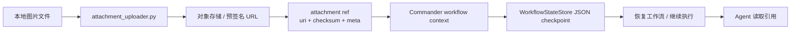

# 图片上传到读取流程说明

这份文档专门梳理 A2A 项目里“图片从本地文件上传，到进入工作流 checkpoint，再到恢复后继续读取”的完整链路。

核心结论先说在前面：

- 图片本体不会直接写进 checkpoint。
- checkpoint 里保存的是图片的引用信息，也就是 attachment ref。
- 恢复工作流时，系统恢复的是这些引用和上下文，不是把图片二进制重新塞回状态里。

---

## 1. 整体链路

整个过程可以拆成 4 步：

1. 本地图片文件被上传到对象存储或预签名 URL。
2. 上传完成后，图片被包装成 attachment ref。
3. attachment ref 被写入 workflow context，并落盘到 checkpoint JSON。
4. 工作流恢复或继续执行时，系统从 checkpoint 读回这些引用，再带到后续任务里。



---

## 2. 上传阶段：本地图片如何变成引用

上传逻辑在 [attachment_uploader.py](../attachment_uploader.py) 里。最关键的入口是 `upload_attachment_file`。

### 2.1 关键代码

```python
def upload_attachment_file(
    source_path: str | Path,
    object_uri: str,
    *,
    upload_url: str | None = None,
    uploader: AttachmentUploader | None = None,
    upload_headers: Optional[Mapping[str, str]] = None,
    timeout: float = 30.0,
    checksum_algorithm: str = "sha256",
    kind: str | None = None,
    mime_type: str | None = None,
    name: str | None = None,
    attachment_id: str | None = None,
    meta: Mapping[str, Any] | None = None,
    **extra_meta: Any,
) -> Dict[str, Any]:
    path = Path(source_path)
    if not path.exists():
        raise FileNotFoundError(f"attachment source not found: {path}")
    if not path.is_file():
        raise ValueError(f"attachment source must be a regular file: {path}")

    resolved_mime_type = mime_type or guess_mime_type(path)
    resolved_kind = kind or infer_attachment_kind(resolved_mime_type)
    resolved_name = name or path.name
    size_bytes = path.stat().st_size
    checksum_value = sha256_file(path)

    if uploader is not None:
        uploader(...)
    else:
        target_url = _default_upload_target(object_uri, upload_url)
        with path.open("rb") as file_handle:
            response = requests.put(target_url, data=file_handle, headers=headers, timeout=timeout)
        response.raise_for_status()

    return build_attachment_ref(...)
```

### 2.2 这段代码做了什么

- 先检查本地文件是否存在。
- 再计算 `sha256`，推断 MIME 类型，判断文件类别。
- 如果传了 `uploader`，就把上传动作交给外部适配器。
- 如果没传 `uploader`，就直接向 `upload_url` 或 `http(s)` 对象 URI 发 `PUT`。
- 上传完成后，返回一个标准化的 attachment ref，而不是返回文件本体。

### 2.3 图像类型是怎么识别的

```python
def infer_attachment_kind(mime_type: str) -> str:
    if mime_type.startswith("image/"):
        return "image"
    if mime_type.startswith("video/"):
        return "video"
    if mime_type.startswith("audio/"):
        return "audio"
    if mime_type in {"application/pdf", "text/plain"}:
        return "document"
    return "file"
```

像 `image/png`、`image/jpeg`、`image/svg+xml` 这类 MIME 类型，都会被标记成 `image`。这样后面的工作流就知道这是图片附件，而不是普通文件。

---

## 3. 引用阶段：图片上传后长什么样

附件引用的定义在 [workflow_payloads.py](../workflow_payloads.py) 里。这里的核心思想是：只保存“位置 + 校验信息 + 少量元数据”，不保存图片二进制。

### 3.1 关键代码

```python
def build_attachment_ref(
    uri: str,
    *,
    checksum: Any = None,
    sha256: Any = None,
    kind: str = "other",
    mime_type: str | None = None,
    size_bytes: int | None = None,
    name: str | None = None,
    attachment_id: str | None = None,
    meta: Mapping[str, Any] | None = None,
    **extra_meta: Any,
) -> Dict[str, Any]:
    payload: Dict[str, Any] = {
        "uri": _ensure_object_storage_uri(uri),
        "kind": kind,
        "checksum": _ensure_checksum(checksum, sha256),
    }

    if attachment_id is not None:
        payload["id"] = str(attachment_id)
    if mime_type is not None:
        payload["mime_type"] = mime_type
    if size_bytes is not None:
        payload["size_bytes"] = int(size_bytes)
    if name is not None:
        payload["name"] = name

    merged_meta = dict(meta or {})
    merged_meta.update(extra_meta)
    if merged_meta:
        payload["meta"] = merged_meta

    return normalize_attachment_ref(payload)
```

### 3.2 归一化和校验

```python
def normalize_attachment_ref(attachment: Any) -> Dict[str, Any]:
    attachment_mapping = dict(_ensure_mapping(attachment, "attachment"))

    inline_fields = [field for field in INLINE_ATTACHMENT_FIELDS if field in attachment_mapping and attachment_mapping[field] not in (None, "", [], {}, b"")]
    if inline_fields:
        raise ValueError(
            "attachments must reference object storage only; inline payload fields are not allowed: "
            + ", ".join(sorted(inline_fields))
        )

    uri = _ensure_object_storage_uri(attachment_mapping.get("uri"))
    checksum = _ensure_checksum(attachment_mapping.get("checksum"), attachment_mapping.get("sha256"))
```

这段逻辑表示：

- `uri` 必须是对象存储 URI 或签名 URL。
- 必须带 `checksum` 或 `sha256`。
- 只允许引用，不允许 `data`、`base64`、`bytes`、`content` 这类内联内容。

### 3.3 一个 attachment ref 的样子

大致会像这样：

```json
{
  "uri": "s3://a2a-demo/examples/sample-attachment.svg",
  "kind": "image",
  "checksum": {
    "algorithm": "sha256",
    "value": "98bd4ef5a7dc6137d3cefcea74c99dc3f322e14523c52bc5492d7712dab8b115"
  },
  "mime_type": "image/svg+xml",
  "size_bytes": 514,
  "name": "sample-attachment.svg",
  "meta": {
    "source": "demo",
    "note": "workflow attachments recovery test"
  }
}
```

---

## 4. 进入 checkpoint：图片引用如何保存下来

Commander 在 [commander_agent/main.py](../commander_agent/main.py) 里负责把 attachments 合并进工作流上下文，再持久化成 checkpoint。

### 4.1 初始上下文

```python
def initial_workflow_context(self):
    return {
        "workflow_id": self.workflow_id,
        "workflow_mode": self.mode,
        "workflow_name": self.workflow,
        "workflow_status": "running",
        "workflow_step": 0,
        "current_step": None,
        "last_task_id": None,
        "last_role": None,
        "last_error": None,
        ...
        "attachments": [],
    }
```

### 4.2 合并外部附件

```python
def merge_external_attachments(self, attachments: list[dict] | None):
    if not attachments:
        return self.workflow_context["attachments"]

    merged = merge_attachments(self.workflow_context.get("attachments", []), attachments)
    self.workflow_context["attachments"] = merged
    self._save_workflow_checkpoint(
        self.workflow_context,
        status=self.workflow_context.get("workflow_status", "running"),
        current_step=self.workflow_context.get("current_step"),
        last_error=self.workflow_context.get("last_error"),
    )
    return merged
```

### 4.3 checkpoint 写盘

```python
def _save_workflow_checkpoint(self, context: dict, status: str = None, current_step: dict = None, last_error: str = None):
    normalized = self._normalize_context(context)
    if status is not None:
        normalized["workflow_status"] = status
    if current_step is not None:
        normalized["current_step"] = current_step
    if last_error is not None:
        normalized["last_error"] = last_error

    state = {
        "workflow_id": self.workflow_id,
        "workflow": self.workflow,
        "mode": self.mode,
        "status": normalized["workflow_status"],
        "created_at": self.workflow_state.get("created_at", utc_now_iso()),
        "updated_at": utc_now_iso(),
        "current_step": normalized.get("current_step"),
        "last_error": normalized.get("last_error"),
        "context": normalized,
    }
    self.workflow_state = state
    self.workflow_context = normalized
    self.state_store.save(self.workflow_id, state)
```

也就是说，图片引用最后是被放进 `workflow_context["attachments"]`，再写到 `WorkflowStateStore` 对应的 JSON 文件里。

---

## 5. 读取阶段：恢复后如何继续拿到图片引用

恢复入口在 [commander_agent/recovery_api.py](../commander_agent/recovery_api.py) 里。恢复时系统做的不是“重新上传图片”，而是“重新加载 checkpoint 里的引用”。

### 5.1 恢复接口

```python
def takeover_workflow(workflow_id: str, request: RecoveryRequest) -> Dict[str, Any]:
    store = get_state_store(request.state_dir)
    if request.strict and not store.exists(workflow_id):
        raise FileNotFoundError(f"Workflow checkpoint not found: {workflow_id}")

    commander = CommanderAgent(
        mode=request.mode,
        workflow=request.workflow,
        workflow_id=workflow_id,
        state_dir=request.state_dir,
        resume=request.resume,
        mock_eval_score=request.mock_eval_score,
        mock_decision=request.mock_decision,
    )

    attachments = normalize_attachments(request.attachments)
    if attachments:
        commander.merge_external_attachments(attachments)

    result_context = commander.run_dynamic_battle_scenario(max_steps=request.max_steps)
```

### 5.2 恢复时上下文怎么还原

```python
def _load_or_initialize_workflow_state(self):
    if self.resume and self.state_store.exists(self.workflow_id):
        state = self.state_store.load(self.workflow_id)
        context = self._normalize_context(state.get("context", {}))
        ...
        state["context"] = context
        self.state_store.save(self.workflow_id, state)
        return state
```

这里的关键是 `_normalize_context`：它会把 checkpoint 里的 `attachments` 再走一次 `normalize_attachments`，确保恢复出来的还是标准引用列表。

### 5.3 为什么恢复后还能继续读图

因为工作流恢复的是引用，不是图片本体。只要对象存储里的图片还在，`uri` 还有效，后续 Agent 就可以根据引用继续读取那张图。

---

## 6. 任务执行阶段：图片引用如何传给 Agent

Commander 在构造任务时，会把 attachments 一起放进任务信封。

```python
def _context_snapshot(context: dict):
    return {
        ...
        "attachments": attachment_snapshot(context.get("attachments", [])),
    }

def build_task_payload(self, role: str, context: dict, step_index: int):
    task_id = self._task_id_for_step(role, step_index)
    context_snapshot = self._context_snapshot(context)

    return {
        "workflow_id": self.workflow_id,
        "task_id": task_id,
        "parent_task_id": context.get("last_task_id"),
        "step_index": step_index,
        "step_role": role,
        "context": context_snapshot,
        "attachments": attachment_snapshot(context.get("attachments", [])),
        ...
    }
```

这意味着 Agent 收到的 payload 里，已经包含了图片引用；它不需要知道本地图片在哪个磁盘路径上，只需要按 `uri` 去读。

---

## 7. 这条链路里最重要的几个原则

### 7.1 不把图片本体放进状态

状态文件里只保存引用，不保存二进制。这样 checkpoint 才轻量，也方便恢复。

### 7.2 先上传，后引用

图片必须先变成对象存储里的文件，再变成 attachment ref。

### 7.3 通过 checkpoint 传递，而不是通过临时变量传递

工作流重启之后，临时变量没了，但 checkpoint 还在。

### 7.4 attachments 是引用列表，不是内容列表

它的本质是“文件索引”，不是“文件正文”。

---

## 8. 一句话总结

图片上传到读取的本质就是：

**本地图片文件 -> 上传到对象存储 -> 生成 attachment ref -> 写入 checkpoint -> 恢复时读回引用 -> Agent 根据 uri 继续使用图片。**
