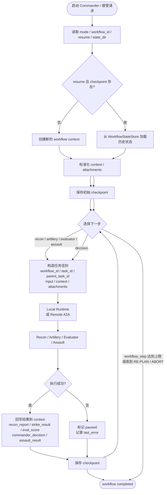
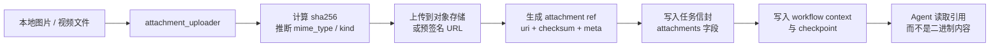

# A2A 工作流恢复与附件传递流程图

下面这张图概括了当前 A2A 项目中“工作流状态可恢复、任务可接管、附件以对象存储引用传递”的完整链路。



## 附件传递子流程

图片、视频等大文件不直接进任务体，只传对象存储引用和校验信息。



## 恢复接口入口

如果要外部接管某个工作流，可以通过恢复 API 直接按 workflow_id 续跑：

```mermaid
flowchart TD
    Client[外部 command / 运维入口]
    API[POST /workflows/{workflow_id}/resume]
    Store[WorkflowStateStore]
    Commander[CommanderAgent
resume=True]
    Continue[继续执行未完成步骤]

    Client --> API --> Store --> Commander --> Continue
```