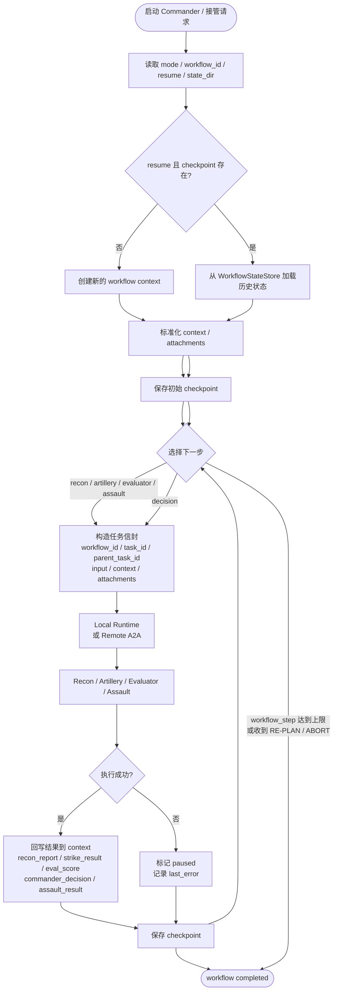
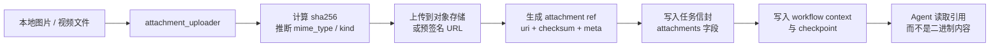

# A2A 最近改动详细说明

本文用于系统性说明 A2A 项目最近一轮改动的内容、原因、关键代码、核心功能、流程结构与逻辑梳理。重点不只是“做了什么”，还包括“为什么这么做”、“数据怎么流转”、“状态怎么恢复”、“附件怎么传递”，以及这些能力如何组合成一个更完整的工作流系统。

---

## 一、改动背景

原始版本的 A2A 项目更偏向一次性流程演示：Commander 在一个进程里维护工作流上下文，执行完一次任务后，状态主要存在内存中。如果进程重启、终端关闭、服务中断，当前执行到哪一步、已经完成了哪些角色、后续应该如何继续，都很难恢复。

同时，项目中开始出现图片、视频、文档等复杂参数的传递需求。对于这类大体积内容，如果直接放进消息体，不仅会放大任务负载，还会让恢复、重试、审计变得很困难。

因此，这轮改动的目标可以概括为三件事：

1. 把工作流状态从“内存态”升级为“可落盘、可恢复”的状态。
2. 把复杂附件从“内联内容”升级为“对象存储引用”。
3. 把执行链路从“单点一次性调用”升级为“支持接管、恢复、幂等”的工作流链路。

---

## 二、改动总览

### 1. 工作流状态持久化

新增了工作流状态存储层 [workflow_state_store.py](../workflow_state_store.py)，专门负责工作流状态的保存、读取和删除。现在工作流不再只依赖 Commander 进程内的变量，而是会落盘到本地 JSON 文件中。

### 2. Commander 支持 resume 与 workflow_id

[commander_agent/main.py](../commander_agent/main.py) 增强了 workflow_id、state_dir、resume 等参数，Commander 启动时可以决定：

- 新建一个工作流；
- 读取已有 checkpoint 并恢复；
- 继续执行尚未完成的步骤。

### 3. 外部接管恢复 API

新增 [commander_agent/recovery_api.py](../commander_agent/recovery_api.py)，提供按 workflow_id 查询状态、恢复执行、接管执行的 HTTP 接口。

### 4. 任务信封与附件协议

新增 [workflow_payloads.py](../workflow_payloads.py)，把附件正式规范为对象存储引用，不允许直接传内联二进制；同时升级任务参数结构，让 task_id、parent_task_id、step_index、context、attachments 都成为显式字段。

### 5. 附件上传工具

新增 [attachment_uploader.py](../attachment_uploader.py)，支持将本地图片、视频文件上传到预签名地址或自定义对象存储后端，再生成标准化的 attachment ref。

### 6. Agent 与本地运行时幂等化

[a2a_protocol/server.py](../a2a_protocol/server.py) 和 [local_runtime.py](../local_runtime.py) 都增加了基于 task_id 的缓存逻辑，避免恢复后或重复提交时再次执行同一个任务。

### 7. 回归测试

[tests/test_workflow_resume.py](../tests/test_workflow_resume.py) 增加了状态持久化、恢复接管、附件协议和上传助手的测试，保证这次改动可验证、可回归。

---

## 三、核心代码说明

### 3.1 Commander：工作流控制中枢

文件：[commander_agent/main.py](../commander_agent/main.py)

这是本轮改动最核心的文件，负责工作流初始化、上下文恢复、步骤推进、任务分发、结果回写和 checkpoint 持久化。

这部分代码最重要的阅读顺序是：先看状态如何加载，再看任务如何构造，然后看一步工作流如何推进，最后看结果如何写回 checkpoint。

#### 代码展开

```python
def _load_or_initialize_workflow_state(self):
    if self.resume and self.state_store.exists(self.workflow_id):
        state = self.state_store.load(self.workflow_id)
        context = self._normalize_context(state.get("context", {}))
        state["workflow_id"] = self.workflow_id
        state["workflow"] = self.workflow
        state["mode"] = self.mode
        state["status"] = state.get("status") or context["workflow_status"]
        state["current_step"] = state.get("current_step") or context.get("current_step")
        state["last_error"] = state.get("last_error") or context.get("last_error")
        state["context"] = context
        self.state_store.save(self.workflow_id, state)
        return state

    state = self._default_workflow_state()
    self.state_store.save(self.workflow_id, state)
    return state


def _save_workflow_checkpoint(self, context: dict, status: str = None, current_step: dict = None, last_error: str = None):
    normalized = self._normalize_context(context)
    if status is not None:
        normalized["workflow_status"] = status
    if current_step is not None:
        normalized["current_step"] = current_step
    if last_error is not None:
        normalized["last_error"] = last_error

    state = {
        "workflow_id": self.workflow_id,
        "workflow": self.workflow,
        "mode": self.mode,
        "status": normalized["workflow_status"],
        "created_at": self.workflow_state.get("created_at", utc_now_iso()),
        "updated_at": utc_now_iso(),
        "current_step": normalized.get("current_step"),
        "last_error": normalized.get("last_error"),
        "context": normalized,
    }
    self.workflow_state = state
    self.workflow_context = normalized
    self.state_store.save(self.workflow_id, state)
```

这两段代码对应“恢复”和“落盘”两个关键动作：

- `_load_or_initialize_workflow_state` 先判断是否能从 checkpoint 恢复，能恢复就把历史状态重新标准化后写回去。
- `_save_workflow_checkpoint` 每次都把当前 context 重新压成统一结构，再保存到 `WorkflowStateStore`。

```python
def build_task_payload(self, role: str, context: dict, step_index: int):
    task_id = self._task_id_for_step(role, step_index)
    context_snapshot = self._context_snapshot(context)

    if role == "artillery":
        return {
            "workflow_id": self.workflow_id,
            "workflow": self.workflow,
            "workflow_mode": self.mode,
            "task_id": task_id,
            "parent_task_id": context.get("last_task_id"),
            "step_index": step_index,
            "step_role": role,
            "command": "suppress_beach_sector_A",
            "input": {
                "coordinates": context["coordinates"],
                "intensity": "high",
            },
            "context": context_snapshot,
            "attachments": attachment_snapshot(context.get("attachments", [])),
            "output_hint": "strike_result",
        }, True
```

这个 payload 的结构可以直接当成任务信封来理解，核心字段有：

- `workflow_id`：把子任务绑定到整个工作流。
- `task_id`：任务幂等键，恢复和重放时都靠它识别同一个任务。
- `parent_task_id`：串起上下游步骤，方便追踪。
- `step_index` 和 `step_role`：标明当前处于哪一轮、由哪个角色执行。
- `context` 和 `attachments`：把当前上下文快照和附件引用一起传给 Agent。

不同角色的差异主要体现在这几个地方：

- `recon`：`command=scan_beach_defenses`，输入是 `sector`，输出提示是 `recon_report`。
- `artillery`：`command=suppress_beach_sector_A`，输入是 `coordinates + intensity`，输出提示是 `strike_result`，并且走流式执行。
- `evaluator`：`command=evaluate_strike`，输入是 `target_coordinates`，输出提示是 `eval_score`。
- `assault`：`command=capture_beachhead`，输入是 `coordinates`，输出提示是 `assault_result`。

```python
def run_dynamic_battle_scenario(self, max_steps: int = 10):
    context = self.workflow_context

    if context.get("workflow_status") == "completed":
        return context

    start_step = int(context.get("workflow_step", 0) or 0) + 1
    for step_index in range(start_step, start_step + max_steps):
        step = self.get_next_step(context)
        current_step = {
            "index": step_index,
            "planner": step.get("planner"),
            "type": step.get("type"),
            "role": step.get("role"),
            "reason": step.get("reason"),
        }
        context["workflow_step"] = step_index
        context["current_step"] = current_step
        context["workflow_status"] = "running"
        self._save_workflow_checkpoint(context, status="running", current_step=current_step)

        if step["type"] == "agent":
            role = step["role"]
            payload, stream = self.build_task_payload(role, context, step_index)
            context["last_task_id"] = payload["task_id"]
            context["last_role"] = role
            success = self.delegate_task(role, payload, stream=stream)
            if not success:
                context["workflow_status"] = "paused"
                self._save_workflow_checkpoint(context, status="paused", current_step=current_step)
                break
            self.apply_agent_result(role, success, context)
            self._save_workflow_checkpoint(context, status="running", current_step=current_step)
            continue

        if step["type"] == "decision":
            context["last_role"] = "commander"
            context["last_task_id"] = f"{self.workflow_id}:{step_index}:decision"
            decision = self.ask_llm(context["battle_log"])
            context["commander_decision"] = self.parse_commander_decision(decision)
            context["battle_log"].append(f"[Commander Decision] {decision}")
            self._save_workflow_checkpoint(context, status="running", current_step=current_step)
            continue

        if step["type"] == "end":
            reason = (step.get("reason") or "").lower()
            final_status = "paused" if ("re-plan" in reason or "abort" in reason) else "completed"
            context["workflow_status"] = final_status
            self._save_workflow_checkpoint(context, status=final_status, current_step=current_step)
            break
```

这段循环可以理解为一个状态机执行器，逻辑非常明确：

- 先把当前 step 写进 checkpoint，保证“执行前状态”可恢复。
- 如果是 agent 步骤，就构造 payload、调用 Agent、再把结果写回 context。
- 如果是 decision 步骤，就让 Commander 自己分析 battle_log 并生成新决策。
- 如果是 end 步骤，就根据原因把工作流标记为 `paused` 或 `completed`。

```python
def rule_next_step(self, context: dict):
    if not context["recon_report"]:
        return {"type": "agent", "role": "recon", "reason": "No recon report is available."}

    if not context["strike_result"]:
        return {"type": "agent", "role": "artillery", "reason": "Recon is done but suppression has not run."}

    if context["eval_score"] is None:
        return {"type": "agent", "role": "evaluator", "reason": "Strike result needs evaluation."}

    if not context["commander_decision"]:
        return {"type": "decision", "reason": "Evaluation is available; commander must decide."}
```

`rule_next_step` 是整个工作流的主判断器，它不依赖 LLM，直接按照 context 的完成情况推进步骤，所以它决定了：

- 先 recon，再 artillery，再 evaluator，再 decision。
- 只有在规则判断不出下一步时，才会调用 `llm_next_step` 兜底。

#### 关键函数

- `__init__`：接收 `mode`、`workflow`、`workflow_id`、`state_dir`、`resume` 等参数，决定启动模式与恢复策略。
- `_load_or_initialize_workflow_state`：读取已有状态或创建新状态。
- `_save_workflow_checkpoint`：把当前工作流上下文写入存储。
- `build_task_payload`：构造统一任务信封。
- `run_dynamic_battle_scenario`：动态工作流主循环，负责恢复后继续执行。
- `merge_external_attachments`：把外部接管时补充的附件合并到当前工作流上下文。

#### 核心变化

原来 Commander 只是在内存里持有一个 context 字典；现在它把 context 规范化后交给 WorkflowStateStore 管理，并且在每一步执行前后都写入 checkpoint。

也就是说，Commander 不再只是“执行器”，而是具备了“工作流调度器 + 状态机 + 恢复点管理器”的职责。

---

### 3.2 WorkflowStateStore：状态持久化层

文件：[workflow_state_store.py](../workflow_state_store.py)

这是一个很轻量但非常关键的状态仓库，负责把工作流状态写成 JSON 文件。

#### 代码展开

```python
class WorkflowStateStore:
    def __init__(self, base_dir: str):
        self.base_dir = Path(base_dir)
        self.base_dir.mkdir(parents=True, exist_ok=True)

    def state_path(self, workflow_id: str) -> Path:
        return self.base_dir / f"{workflow_id}.json"

    def exists(self, workflow_id: str) -> bool:
        return self.state_path(workflow_id).exists()

    def load(self, workflow_id: str) -> Dict[str, Any]:
        path = self.state_path(workflow_id)
        with path.open("r", encoding="utf-8") as state_file:
            return json.load(state_file)

    def save(self, workflow_id: str, state: Dict[str, Any]) -> None:
        path = self.state_path(workflow_id)
        payload = dict(state)
        payload["workflow_id"] = workflow_id
        payload.setdefault("created_at", utc_now_iso())
        payload["updated_at"] = utc_now_iso()

        tmp_path = path.with_suffix(path.suffix + ".tmp")
        with tmp_path.open("w", encoding="utf-8") as tmp_file:
            json.dump(payload, tmp_file, ensure_ascii=False, indent=2)
        os.replace(tmp_path, path)

    def delete(self, workflow_id: str) -> None:
        path = self.state_path(workflow_id)
        if path.exists():
            path.unlink()
```

这段实现虽然短，但它提供的是整个恢复能力的底座：

- `state_path` 决定每个 workflow_id 对应一个独立 JSON 文件。
- `save` 先写 `.tmp` 再原子替换，避免 checkpoint 被写坏。
- `load` 和 `exists` 让 Commander 和恢复 API 都可以只围绕 workflow_id 工作。

#### 关键函数

- `save(workflow_id, state)`：保存状态，采用临时文件 + 原子替换的方式，避免文件写半截损坏。
- `load(workflow_id)`：读取某个 workflow_id 的状态。
- `exists(workflow_id)`：检查 checkpoint 是否存在。
- `delete(workflow_id)`：删除对应状态文件。

#### 设计要点

1. 状态按 workflow_id 隔离，避免不同流程互相覆盖。
2. 状态写盘采用原子替换，降低文件损坏概率。
3. 文件化存储便于调试、回放、审计和外部接管。

---

### 3.3 Recovery API：外部接管入口

文件：[commander_agent/recovery_api.py](../commander_agent/recovery_api.py)

这部分把“恢复”从代码内部逻辑变成了一个可调用的服务接口。

#### 代码展开

```python
class RecoveryRequest(BaseModel):
    mode: Literal["local", "remote"] = "local"
    workflow: Literal["dynamic"] = "dynamic"
    state_dir: Optional[str] = None
    max_steps: int = Field(default=10, ge=1)
    resume: bool = True
    strict: bool = True
    mock_eval_score: Optional[int] = None
    mock_decision: Optional[Literal["ASSAULT", "RE-PLAN"]] = None
    attachments: list[Dict[str, Any]] = Field(default_factory=list)


def takeover_workflow(workflow_id: str, request: RecoveryRequest) -> Dict[str, Any]:
    store = get_state_store(request.state_dir)
    if request.strict and not store.exists(workflow_id):
        raise FileNotFoundError(f"Workflow checkpoint not found: {workflow_id}")

    commander = CommanderAgent(
        mode=request.mode,
        workflow=request.workflow,
        workflow_id=workflow_id,
        state_dir=request.state_dir,
        resume=request.resume,
        mock_eval_score=request.mock_eval_score,
        mock_decision=request.mock_decision,
    )

    attachments = normalize_attachments(request.attachments)
    if attachments:
        commander.merge_external_attachments(attachments)

    result_context = commander.run_dynamic_battle_scenario(max_steps=request.max_steps)
    return {
        "workflow_id": workflow_id,
        "workflow": request.workflow,
        "mode": request.mode,
        "state_path": str(commander.state_store.state_path(workflow_id)),
        "context": result_context,
        "workflow_status": result_context.get("workflow_status"),
    }
```

```python
def build_recovery_app(
    *,
    default_mode: str = "local",
    default_workflow: str = "dynamic",
    default_state_dir: Optional[str] = None,
) -> FastAPI:
    app = FastAPI(title="A2A Commander Recovery API")

    @app.get("/health")
    async def health():
        return {"status": "ok"}

    @app.get("/workflows/{workflow_id}")
    async def get_workflow_state(workflow_id: str):
        ...

    @app.post("/workflows/{workflow_id}/resume")
    @app.post("/workflows/{workflow_id}/takeover")
    async def resume_workflow(workflow_id: str, request: RecoveryRequest):
        ...

    return app
```

这段代码把恢复能力拆成了三个阶段：

- 先确认 checkpoint 是否存在。
- 再按同一个 workflow_id 初始化 Commander。
- 最后把外部 attachments 并入当前上下文，并继续执行未完成步骤。

#### 关键对象与函数

- `RecoveryRequest`：定义恢复请求体，包含 mode、workflow、state_dir、max_steps、resume、strict、mock_eval_score、mock_decision、attachments。
- `load_workflow_state(workflow_id)`：读取工作流状态。
- `takeover_workflow(workflow_id, request)`：按 workflow_id 接管并继续执行。
- `build_recovery_app()`：构建 FastAPI 服务，提供 health、状态查询、resume、takeover 路由。

#### 作用

这个 API 解决的是“新 command 直接接续旧任务”的问题。只要知道 workflow_id，就可以查询当前状态并恢复执行，不需要人工把上下文从命令行里重新拼一遍。

---

### 3.4 WorkflowPayloads：任务信封与附件协议

文件：[workflow_payloads.py](../workflow_payloads.py)

这个模块负责两件事：

1. 统一任务中的附件表示方式；
2. 对附件做严格校验，保证只能传对象存储引用。

#### 代码展开

```python
def build_attachment_ref(
    uri: str,
    *,
    checksum: Any = None,
    sha256: Any = None,
    kind: str = "other",
    mime_type: str | None = None,
    size_bytes: int | None = None,
    name: str | None = None,
    attachment_id: str | None = None,
    meta: Mapping[str, Any] | None = None,
    **extra_meta: Any,
) -> Dict[str, Any]:
    payload: Dict[str, Any] = {
        "uri": _ensure_object_storage_uri(uri),
        "kind": kind,
        "checksum": _ensure_checksum(checksum, sha256),
    }

    if attachment_id is not None:
        payload["id"] = str(attachment_id)
    if mime_type is not None:
        payload["mime_type"] = mime_type
    if size_bytes is not None:
        payload["size_bytes"] = int(size_bytes)
    if name is not None:
        payload["name"] = name

    merged_meta = dict(meta or {})
    merged_meta.update(extra_meta)
    if merged_meta:
        payload["meta"] = merged_meta

    return normalize_attachment_ref(payload)


def normalize_attachment_ref(attachment: Any) -> Dict[str, Any]:
    attachment_mapping = dict(_ensure_mapping(attachment, "attachment"))

    inline_fields = [field for field in INLINE_ATTACHMENT_FIELDS if field in attachment_mapping and attachment_mapping[field] not in (None, "", [], {}, b"")]
    if inline_fields:
        raise ValueError(
            "attachments must reference object storage only; inline payload fields are not allowed: "
            + ", ".join(sorted(inline_fields))
        )

    uri = _ensure_object_storage_uri(attachment_mapping.get("uri"))
    checksum = _ensure_checksum(attachment_mapping.get("checksum"), attachment_mapping.get("sha256"))
    normalized: Dict[str, Any] = {
        "uri": uri,
        "kind": str(attachment_mapping.get("kind", "other")),
        "checksum": checksum,
    }
```

```python
def merge_attachments(existing: Sequence[Any] | None, incoming: Sequence[Any] | None) -> list[Dict[str, Any]]:
    merged: list[Dict[str, Any]] = []
    seen_keys = set()

    for item in list(existing or []) + list(incoming or []):
        normalized = normalize_attachment_ref(item)
        dedupe_key = normalized.get("id") or normalized["uri"]
        if dedupe_key in seen_keys:
            continue
        seen_keys.add(dedupe_key)
        merged.append(normalized)

    return merged


def attachment_snapshot(attachments: Iterable[Any] | None) -> list[Dict[str, Any]]:
    return [deepcopy(item) for item in normalize_attachments(attachments)]
```

`workflow_payloads.py` 里最重要的规则就是“附件只能传引用”。这段代码直接体现了三层约束：

- `uri` 必须是对象存储地址或签名 URL，不能是本地文件路径。
- `checksum` 必须存在，这样恢复、去重、审计才有一致标识。
- 只要检测到 `data`、`base64`、`bytes`、`content` 这类内联字段，就直接拒绝。

后面的 `normalize_attachments` 和 `merge_attachments` 负责把多个引用统一成标准格式，并按 `id` 或 `uri` 去重。

#### 关键函数

- `build_attachment_ref`：根据 URI、checksum 和元数据构造附件引用。
- `normalize_attachment_ref`：把任意附件对象归一成标准格式。
- `normalize_attachments`：批量归一化附件列表。
- `merge_attachments`：合并旧附件与新附件，并去重。
- `attachment_snapshot`：用于写入 context 时生成安全快照。

#### 规则

附件必须满足以下条件：

- 必须包含 uri；
- 必须包含 checksum 或 sha256；
- 允许 kind、mime_type、size_bytes、name、meta 等扩展字段；
- 不允许 data、base64、bytes、content 等内联内容字段。

这意味着任务消息体只保存“引用”，不保存“内容本体”。

---

### 3.5 AttachmentUploader：本地文件到引用的转换器

文件：[attachment_uploader.py](../attachment_uploader.py)

这个模块把“本地文件”转换成“符合协议的附件引用”。它解决的是附件生产侧的问题。

#### 代码展开

```python
def upload_attachment_file(
    source_path: str | Path,
    object_uri: str,
    *,
    upload_url: str | None = None,
    uploader: AttachmentUploader | None = None,
    upload_headers: Optional[Mapping[str, str]] = None,
    timeout: float = 30.0,
    checksum_algorithm: str = "sha256",
    kind: str | None = None,
    mime_type: str | None = None,
    name: str | None = None,
    attachment_id: str | None = None,
    meta: Mapping[str, Any] | None = None,
    **extra_meta: Any,
) -> Dict[str, Any]:
    path = Path(source_path)
    if not path.exists():
        raise FileNotFoundError(f"attachment source not found: {path}")

    resolved_mime_type = mime_type or guess_mime_type(path)
    resolved_kind = kind or infer_attachment_kind(resolved_mime_type)
    resolved_name = name or path.name
    size_bytes = path.stat().st_size
    checksum_value = sha256_file(path)

    if uploader is not None:
        uploader(...)
    else:
        target_url = _default_upload_target(object_uri, upload_url)
        headers = dict(upload_headers or {})
        headers.setdefault("Content-Type", resolved_mime_type)
        headers.setdefault("Content-Length", str(size_bytes))

        with path.open("rb") as file_handle:
            response = requests.put(target_url, data=file_handle, headers=headers, timeout=timeout)
        response.raise_for_status()

    return build_attachment_ref(...)
```

这段代码把“本地文件”变成“对象存储引用”的步骤拆得很清楚：

- 先做文件存在性检查，避免上传无效路径。
- 再计算 sha256、推断 MIME 类型、确定附件 kind。
- 如果传入自定义 uploader，就把对象存储细节交给外部实现。
- 如果没有 uploader，就直接向预签名 URL 发 HTTP PUT。
- 最后返回标准附件引用，而不是返回原始文件内容。

`upload_attachment_files` 只是把这个过程批量化，所以批量上传和单文件上传的语义是一致的。

#### 关键函数

- `sha256_file`：计算文件 sha256。
- `guess_mime_type`：推断文件 MIME 类型。
- `infer_attachment_kind`：根据 MIME 类型推断 image、video、audio、document 等类别。
- `upload_attachment_file`：上传单个文件并返回 attachment ref。
- `upload_attachment_files`：批量上传。

#### 支持的上传方式

1. 直接向 HTTP 预签名 URL 发送 PUT。
2. 交给自定义 uploader 回调，适配不同对象存储实现。

#### 这个工具的价值

它把“上传”和“引用生成”做成了标准化流程，方便后续给 Commander 或外部系统直接复用。

---

### 3.6 A2A Protocol Server：幂等与鉴权基址配置

文件：[a2a_protocol/server.py](../a2a_protocol/server.py)

这部分是 Agent HTTP 服务的通用壳。

#### 代码展开

```python
def get_agent_card(self):
    auth_server_base = os.environ.get("A2A_AUTH_SERVER_BASE", "http://127.0.0.1:8080")
    auth_server_base = auth_server_base.rstrip("/") + "/"
    return {
        "name": self.name,
        "description": self.description,
        "role": self.role,
        "securitySchemes": {
            "openIdConnect": {
                "type": "openIdConnect",
                "authorizationUrl": urljoin(auth_server_base, "auth"),
                "tokenUrl": urljoin(auth_server_base, "post")
            }
        },
        "sendMessageEndpoint": "/sendMessage",
        "sendMessageStreamEndpoint": "/sendMessageStream"
    }


async def _cached_stream(self, payload):
    task_id = self._task_id_from_payload(payload)
    cached_events = self._stream_response_cache.get(task_id)
    if cached_events is not None:
        async for event in self._replay_stream(cached_events):
            yield event
        return

    buffered_events = []
    async for event in self.execute_stream(payload):
        buffered_events.append(event)
        yield event
    self._stream_response_cache[task_id] = buffered_events
```

```python
@self.app.post("/sendMessage")
async def send_message(payload: dict, token: str = Depends(verify_token)):
    task_id = self._task_id_from_payload(payload)
    if task_id in self._task_response_cache:
        return self._task_response_cache[task_id]

    response = {
        "task_id": task_id,
        "status": "Accepted",
        "message": f"{self.name} received task {payload.get('command')}"
    }
    self._task_response_cache[task_id] = response
    return response


@self.app.post("/sendMessageStream")
async def send_message_stream(payload: dict, token: str = Depends(verify_token)):
    return StreamingResponse(self._cached_stream(payload), media_type="text/event-stream")
```

这部分代码解决了两个问题：

- Agent Card 不再依赖写死的 8080 auth server 地址，而是支持环境变量覆盖。
- 流式任务按 `task_id` 缓存事件，恢复后重放同一个任务时不会再次执行副作用。

#### 关键变化

- Agent Card 里的 auth server 地址不再硬编码死在 127.0.0.1:8080，而是支持通过 `A2A_AUTH_SERVER_BASE` 配置。
- `/sendMessage` 按 task_id 做响应缓存。
- `/sendMessageStream` 按 task_id 缓存流式事件，重复请求会复用旧结果。

#### 价值

这保证了恢复后的重复请求、网络重放、或外部接管后再次提交同一任务，不会引发副作用重复执行。

---

### 3.7 Local Runtime：本地模式幂等模拟

文件：[local_runtime.py](../local_runtime.py)

本地模式用于不启动 Nacos 和真实 Agent 服务时，在 Commander 进程内模拟完整工作流。

#### 代码展开

```python
def send_message(self, role: str, payload: dict) -> dict:
    self.discover(role)
    task_id = self._task_id_from_payload(payload)
    if task_id in self._task_response_cache:
        return self._task_response_cache[task_id]

    response = {
        "task_id": task_id,
        "status": "Accepted",
        "mode": "local",
        "role": role,
        "message": self._message_for(role, payload),
    }
    self._task_response_cache[task_id] = response
    return response


def send_message_stream(self, role: str, payload: dict) -> Iterable[dict]:
    self.discover(role)
    task_id = self._task_id_from_payload(payload)
    cached_events = self._stream_response_cache.get(task_id)
    if cached_events is not None:
        for event in cached_events:
            yield event
        return
```

本地运行时和远程 Agent 的关键语义保持一致：

- 同一个 `task_id` 只会被处理一次。
- 同步调用和流式调用都有缓存。
- 这样 Commander 在本地调试时看到的行为，和远程部署时基本一致。

#### 关键变化

- 同样按 task_id 缓存同步响应与流式事件；
- 与远程模式保持一致的幂等行为；
- 适合调试恢复、重试和流程分支。

---

### 3.8 测试：把改动变成可验证行为

文件：[tests/test_workflow_resume.py](../tests/test_workflow_resume.py)

测试主要覆盖以下几类场景：

- 状态仓库能正常保存和读取；
- Commander 能从 checkpoint 恢复；
- 本地运行时重复 task_id 会复用结果；
- 附件协议拒绝内联内容，只允许对象存储引用；
- 恢复 API 能按 workflow_id 接管并继续执行；
- 上传助手能把本地文件转成标准 attachment ref。

#### 测试清单

| 测试函数 | 关注点 |
| --- | --- |
| `test_state_store_round_trip` | 校验 workflow state 保存和读取是否一致 |
| `test_commander_resume_loads_checkpoint` | 校验 Commander 是否能从 checkpoint 恢复 |
| `test_local_runtime_replays_cached_results` | 校验同一 task_id 是否会复用缓存结果 |
| `test_attachment_protocol_requires_object_storage_references` | 校验附件协议是否拒绝内联内容 |
| `test_recovery_api_resumes_workflow_by_id` | 校验恢复 API 是否能按 workflow_id 接管 |
| `test_upload_attachment_file_http_put_path` | 校验 HTTP PUT 上传路径是否可用 |
| `test_upload_attachment_file_custom_object_storage_uploader` | 校验自定义 uploader 分支是否可用 |

这些测试把本次改动最容易出错的地方都覆盖到了：状态恢复、幂等、附件协议、外部接管、上传路径。

---

## 四、整体流程图

### 4.1 工作流恢复主流程



### 4.2 附件传递流程



### 4.3 恢复接口流程

```mermaid
flowchart TD
    Client[外部 command / 运维入口]
    API[POST /workflows/{workflow_id}/resume]
    Store[WorkflowStateStore]
    Commander[CommanderAgent\nresume=True]
    Continue[继续执行未完成步骤]

    Client --> API --> Store --> Commander --> Continue
```

---

## 五、流程介绍

### 5.1 启动与恢复流程

1. Commander 启动时先读取 `mode`、`workflow_id`、`resume`、`state_dir`。
2. 如果 `resume=True` 且存在对应 checkpoint，就直接加载旧状态。
3. 如果没有旧状态，就创建新的 workflow context。
4. 进入动态工作流主循环后，根据 `workflow_step` 决定从哪一步继续。
5. 每个步骤执行前先保存 checkpoint，执行后再保存一次，保证状态可追溯。

### 5.2 任务分发流程

1. Commander 根据当前状态决定下一步是 recon、artillery、evaluator、assault 还是 decision。
2. 调用 `build_task_payload` 生成统一任务信封。
3. 如果是 local 模式，就走 `LocalAgentRuntime`。
4. 如果是 remote 模式，就通过 Nacos 发现 Agent，再通过 A2A 协议调用 Agent。
5. Agent 完成后，Commander 通过 `apply_agent_result` 回写业务结果。

### 5.3 恢复接管流程

1. 外部系统拿到 workflow_id 后调用恢复 API。
2. API 从状态仓库读取 checkpoint。
3. Commander 重新构建工作流上下文。
4. 继续执行未完成步骤。
5. 如果已经完成，则直接返回 completed 状态，不重复运行。

### 5.4 附件处理流程

1. 图片或视频先通过 `attachment_uploader` 上传。
2. 计算 sha256，推断 MIME 类型，生成 metadata。
3. 把对象存储 URI 和校验信息封装成 attachment ref。
4. 附件 ref 进入任务信封和工作流上下文。
5. 恢复时只恢复引用，不恢复二进制本体。

---

## 六、逻辑梳理

这轮改动的逻辑可以归纳为四个层次：

### 6.1 状态层

把 workflow context、completed_roles、battle_log、attachments 等信息从内存迁移到持久化文件。

### 6.2 调度层

Commander 不再只是顺序脚本，而是通过状态机决定下一步、判断是否恢复、是否继续、是否结束。

### 6.3 通信层

远程模式通过 Nacos + Agent Card + A2A 协议进行服务发现、鉴权与任务调用；本地模式通过 LocalRuntime 模拟同样的语义。

### 6.4 资源层

附件不再直接进入消息体，而是通过对象存储引用在不同步骤之间流转，降低传输成本和恢复复杂度。

---

## 七、功能效果

这轮改动完成后，项目具备了以下能力：

- 工作流可持久化保存；
- 进程重启后可继续执行；
- 新 command 可根据 workflow_id 接管旧任务；
- 附件支持对象存储引用和校验信息；
- 重复任务提交具备幂等特性；
- 本地模式与远程模式行为保持一致；
- 测试可验证改动是否回归。

---

## 八、验证方式

当前测试文件已经覆盖了核心场景，建议使用项目自带的虚拟环境运行：

```bash
cd /home/yl/yl/jzz/A2A
./venv/bin/python -m unittest discover -s tests
```

如果想看恢复接口是否可用，可以先启动恢复服务，再访问 health 接口：

```bash
cd /home/yl/yl/jzz/A2A
./venv/bin/python -u commander_agent/main.py --mode local --workflow dynamic --serve-recovery-api --recovery-host 127.0.0.1 --recovery-port 8020
curl -s http://127.0.0.1:8020/health
```

---

## 九、总结

本轮改动把 A2A 项目从“单次运行、内存状态”的流程，推进到了“可恢复、可接管、可审计、可处理复杂附件”的工作流体系。

它的核心不是单纯增加了几个文件，而是把几个关键概念补齐了：

- 工作流状态可持久化；
- 任务参数可结构化；
- 附件可引用化；
- 执行过程可幂等；
- 外部接管可标准化。

这些能力合在一起，才让这个项目从演示级脚本更接近一个真正可演化的多智能体工作流系统。