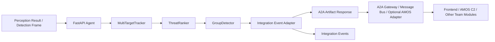

# 技术说明

本文说明 `amos-track-threat-demo` 当前版本做了什么、内部怎么流转数据，以及如何和 AMOS / A2A / Nacos 对接。

## 项目定位

`amos-track-threat-demo` 是一个仿真态势 Agent。它接收感知检测结果，维护多目标航迹，预测未来短时航线，识别疑似编队/编组，并输出单体和群体的态势关注优先级。

当前版本是独立后端 Agent，不包含前端，也不依赖 AMOS 源码。其他同学可以直接通过 HTTP/A2A 调用。AMOS 只作为可选展示平台，可由 AMOS adapter 或 A2A Gateway 消费本 Agent 的 `artifact.events[]`。

安全边界：所有 `threat` / `risk` 只表示 Demo 中的态势关注优先级，不表示打击目标、交战决策、攻击建议、制导或火控。

## 数据流



## 演示场景

当前 sample data 和自动模拟器使用一个虚构海岸防区联合态势演练，目的是让数据更接近真实态势系统会收到的信息流，但不绑定真实作战目标。

场景包含：

- 3 架空中巡逻目标，保持 loose wedge 队形，可形成 `air_formation`。
- 2 艘海上目标，保持相近航向和速度，可形成 `surface_group`。
- 1 个低空 UAV，由被动 RF 和短时雷达命中融合形成 track。
- 1 个身份未解的 intermittent unknown track，在连续帧或自动演示第 45 帧后出现航向/速度突变。
- 4 个己方保护资产，包括指挥节点、岸基雷达、补给码头和医疗集结点。

样例文件：

- `backend/sample_data/frame_1.json`：第一帧态势。
- `backend/sample_data/frame_2.json`：10 秒后的连续帧，用于验证原航迹更新和 anomaly。
- `backend/sample_data/group_scene.json`：快速展示空中编队、海上编组和低置信度 unknown。

这些场景只用于态势感知演示。metadata 中的 `scenario_role`、`sensor_mode`、`ais_status`、`sea_state`、`sensor_note` 是仿真信息，不是实装传感器能力声明，也不是交战依据。

自动演示现在是 90 帧，分为初始发现、航迹稳定、保护资产监控、异常升级、持续监视五个阶段。第 35 帧后低空 UAV 会改变航向，第 45 帧后 unknown 会触发异常机动，用于展示 anomaly、资产影响评估和统一排序变化。

## 后端模块

`backend/app/models.py`

定义 Pydantic 数据模型：

- `Detection`：一条感知输入。
- `TrackState`：航迹当前状态、历史点、预测点、质量和元数据。
- `ThreatAssessment`：单体态势关注评分、等级、排序、证据和因子。
- `TrackGroup`：疑似编队/编组的成员、中心、包络、预测路径、凝聚度和群体评分。
- `ProtectedAsset`：己方保护资产，包含位置、保护半径和重要度。
- `AssetImpactAssessment`：目标对保护资产的仿真影响关注评分。

`backend/app/tracker.py`

实现 `MultiTargetTracker`：

- 用内存 `Dict[str, TrackState]` 保存活动航迹。
- 支持 `aircraft`、`ship`、`uav`、`unknown`。
- 最近邻关联输入 detection 和已有 track。
- `small` 使用 alpha-beta 风格平滑。
- `medium` 使用简化 Kalman-like 更新。
- `large` 是接口占位，当前回退到 `medium` 并写入 `metadata.large_mock=true`。
- 为每条 track 预测未来 10/20/30 秒位置。
- 检测航向突变、速度突变、低置信度，并写入 `metadata["anomaly"]`。
- `history_path` 最多保留 50 个点。
- 超过 300 秒未更新的 track 会被清理。

`backend/app/threat_ranker.py`

实现 `ThreatRanker`，对单体目标计算关注优先级：

```text
score =
  0.28 * distance_factor
+ 0.24 * closing_factor
+ 0.18 * type_factor
+ 0.18 * anomaly_factor
+ 0.12 * quality_factor
```

等级规则：

- `high`: score >= 0.72
- `medium`: score >= 0.45
- `low`: 其他

输出中包含 `evidence`，用于解释分数来自距离、接近趋势、异常、类型和航迹质量等因素。

`backend/app/group_detector.py`

实现 `GroupDetector`：

- 将 track 看成图节点。
- 两个 track 如果距离近、航向差小、速度差小，则连边。
- 连通分量中成员数大于等于 2 的形成 `TrackGroup`。
- 计算成员、中心点、中心预测线、当前包络、预测包络、凝聚度、编组类型和群体评分。

群体评分：

```text
group_score =
  0.30 * max_member_score
+ 0.20 * size_factor
+ 0.20 * closing_factor
+ 0.20 * cohesion_factor
+ 0.10 * type_mix_factor
```

`backend/app/asset_impact_analyzer.py`

实现 `AssetImpactAnalyzer`。它分析每条 track 对每个 `ProtectedAsset` 的仿真影响关注优先级，使用当前距离、预测最近距离、接近趋势、资产重要度、目标关注分和异常因子计算 `asset_impacts`。这不是损伤评估，也不是处置建议，只是让 AMOS 地图能看到“哪些己方资产需要关注”。

`backend/app/amos_adapter.py`

把内部 artifact 转成 AMOS 风格事件：

- `asset.updated`
- `asset.relationship.updated`
- `protected.asset.updated`
- `asset.impact.updated`
- `track.updated`
- `threat.updated`
- `track.group.updated`
- `threat.group.updated`
- `threat.ranking.updated`

其中 `threat.updated` 保留 `threat_id`、`threat_type`、`lat`、`lon`、`alt`、`heading`、`speed`、`confidence`、`source`、`timestamp`、`metadata` 等字段，方便映射到 AMOS 中类似 `ThreatReport` 的结构。

`backend/app/nacos_register.py`

提供可选 Nacos 注册：

- 默认 `NACOS_ENABLED=false`，不注册。
- 启用后尝试注册服务和 metadata。
- SDK 缺失或连接失败只打印 warning，不影响 Agent 启动。

`backend/app/main.py`

FastAPI 入口：

- `GET /health`
- `GET /agent-card`
- `GET /.well-known/agent-card.json`
- `POST /a2a/perception-result`
- `POST /demo/frame`
- `POST /demo/start`
- `POST /demo/stop`
- `POST /demo/reset`
- `GET /demo/state`
- `WebSocket /ws`

`GET /` 现在只返回服务说明和接口地址，不再返回前端页面。

## 可选 AMOS 桥接建议

本项目不包含 AMOS 源码，也不要求同学本地安装 AMOS。若团队最终需要接入 AMOS，建议由 AMOS 负责同学在 AMOS 仓库或 A2A Gateway 中实现一个轻量 adapter。

adapter 的职责通常是：

- 调用本 Agent 的 `/a2a/perception-result`、`/demo/frame` 或 `/demo/start`。
- 读取返回的 `artifact.tracks`、`artifact.threats`、`artifact.groups`、`artifact.protected_assets`、`artifact.asset_impacts` 和 `artifact.unified_threat_ranking`。
- 将这些结果映射到 AMOS 的资产、威胁、编组、保护资产或事件总线模型。
- 如果 AMOS 前端要展示航迹和编组，还需要读取 `history_path`、`predicted_path`、`envelope`、`centroid_prediction` 等字段。

推荐映射关系：

```text
TrackState             -> AMOS track/asset
ThreatAssessment       -> AMOS threat/risk report
TrackGroup             -> AMOS group/formation overlay
ProtectedAsset         -> AMOS protected asset
AssetImpactAssessment  -> AMOS protected-asset impact list/line
artifact.events[]      -> AMOS Event Bus events
```

如果 AMOS 前端已经有地图和右侧列表，可以直接消费本 Agent 返回的 `events` 或 `artifact`；如果 AMOS 前端暂时不支持预测线和编组包络，则需要在 AMOS 前端新增对应图层。

## A2A 输出结构

`POST /a2a/perception-result` 返回：

```json
{
  "task_id": "task-001",
  "message_type": "track_threat_group_artifact",
  "status": "completed",
  "artifact": {
    "tracks": [],
    "threats": [],
    "groups": [],
    "unified_threat_ranking": [],
    "events": [],
    "summary": {}
  }
}
```

其中 `events` 可由 AMOS plugin 或 A2A Gateway 回写到 AMOS Event Bus。

## 内存控制

- `history_path` 最多 50 点。
- track TTL 为 300 秒。
- group 每帧重算，不无限存历史。
- `/demo/state` 只保留最新 artifact。
- AMOS bridge 只管理 `TTG-*` 资产和威胁，`RESET` 不影响 AMOS 原有资产。

## 当前限制

- 算法是演示级简化实现，不是生产级融合算法。
- `large` 档只是接口占位。
- 没有数据库持久化。
- Group 识别使用固定阈值，后续应由场景配置或策略服务控制。
- AMOS 接入当前是在本地克隆仓库中打 bridge patch，后续需要平台同学合并到主仓库或改成插件。
- Nacos Python 注册是 best-effort；如果团队使用 Nacos Agent Registry/A2A Registry 的严格形态，建议用 sidecar 或统一注册服务发布同一份 AgentCard。
