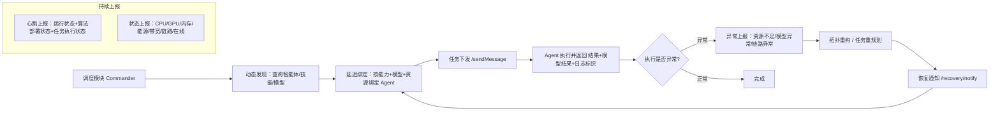

# 分布式智能体接口实现说明

## 1. 需求背景

最新对接的要求是：面向分布式智能体调度模块与 Agent 之间的协同，补齐一整套标准接口，
支撑任务协同、状态监控、能力发现和异常恢复。

```text
分布式智能体接口应支撑调度模块与 Agent 之间的：
任务协同、状态监控、能力发现、异常恢复。
```

本次在原有 A2A 框架（Commander 调度 + 四类 Agent + Nacos 注册中心）基础上，
补齐了 10 类接口能力，全部在 Agent Runtime 层统一实现，并保持对原有功能完全向后兼容。

一句话：

```text
本次工作把“调度骨架”补齐为“完整的分布式智能体接口”，
每类能力都说明了怎么实现、有什么作用，并补充了单元测试。
```

## 2. 系统角色与总体架构

在讲每个接口之前，先明确三个角色：

```text
调度模块（Commander）：负责发现 Agent、绑定 Agent、下发任务、处理异常与恢复。
Agent Runtime：每个业务 Agent 共用的运行框架（a2a_protocol/server.py 的 A2ABaseAgent）。
Nacos 注册中心：保存所有 Agent 的注册信息与心跳 metadata，是发现与绑定的数据来源。
```

调度模块与 Agent 之间通过两条通道协同：

| 通道 | 作用 | 承载接口 |
| --- | --- | --- |
| Nacos 注册中心 | 存放静态注册信息与周期心跳，供调度侧查询 | 注册、心跳、状态上报、动态发现、延迟绑定 |
| HTTP 直连（A2A 协议） | 调度侧直接调用 Agent 端点执行任务 | 任务下发、结果返回、异常上报、恢复通知 |

为便于调用方使用，本次还在这两条通道之上封装了一层轻量 SDK（见第 14 节），
把 10 类接口聚合为 Agent 侧与调度侧两个统一入口。

## 3. 实现总览

| 接口名称 | 实现结果 | 核心实现位置 |
| --- | --- | --- |
| 智能体注册接口 | ✅ 完成 | `registry/nacos_manager.py` + 各 Agent `main.py` |
| 心跳上报接口 | ✅ 完成 | `AgentHeartbeatSupervisor` + `server.py` |
| 状态上报接口 | ✅ 完成 | `resource_monitor.py` + `/resources` |
| 技能注册接口 | ✅ 完成 | `skill_catalog.py` + `server.py` |
| 动态发现接口 | ✅ 完成 | `nacos_manager.discover_service` + `/models` |
| 延迟绑定接口 | ✅ 完成 | `commander_agent/agent_leases.py` |
| 任务下发接口 | ✅ 完成 | `client.py` + `/sendMessage` |
| 任务结果返回接口 | ✅ 完成 | `a2a_protocol/messages.py` + `/sendMessage` |
| 异常上报接口 | ✅ 完成 | `error_classification.py` + `messages.py` |
| 恢复通知接口 | ✅ 完成 | `/recovery/notify` + `client.notify_recovery` |

---

# 各接口详细实现说明

## 4. 智能体注册接口

### 4.1 作用与功能

让每个 Agent 启动时把“我是谁、在哪里、能干什么、部署了哪些模型、资源如何、是否在线”
一次性登记到注册中心，作为调度模块发现与绑定的基础。

### 4.2 实现原理

Agent 在 `main.py` 启动时调用 `NacosRegistry.register_service`，
把一份 metadata 写入 Nacos。metadata 由四部分拼装而成：

| 上报维度 | 来源 | 字段 |
| --- | --- | --- |
| 自身标识 | Agent 名称与角色 | `role`、服务名 `A2A-Agent`、`name` |
| 部署位置 | 主机 IP + 端口 | `ip`、`port` |
| 可用能力 | `skills_metadata(agent.skills)` | `skills` |
| 算法模型 | `model_registry.metadata()` | `models`、`models_ready`、`algorithm_deployment_status` |
| 资源状态 | `resource_monitor.heartbeat_metadata()` | CPU/GPU/内存/能源/带宽/链路等 |
| 在线状态 | Nacos 临时实例 + `status` | `status=idle`、`node_online`、健康态 |

以侦察 Agent 为例，注册代码逻辑：

```python
agent = A2ABaseAgent(name="Recon_Agent", role="recon", port=port,
                     models=[build_model("recon_detector_v1", ...)])
registry.register_service(
    service_name="A2A-Agent", ip=ip, port=port,
    metadata={
        "role": "recon", "status": "idle",
        **skills_metadata(agent.skills),      # 可用能力
        **agent.heartbeat_metadata(),         # 资源+模型+在线状态
    },
    metadata_provider=agent.heartbeat_metadata,  # 心跳时动态刷新
)
```

### 4.3 关键点

```text
注册用临时实例（ephemeral=True），Agent 掉线后 Nacos 会自动摘除，天然反映在线状态；
metadata_provider 保证心跳每次都用最新的资源/模型快照刷新注册信息；
SDK 注册失败会自动降级到 HTTP 接口注册（双通道容错）。
```

## 5. 心跳上报接口

### 5.1 作用与功能

让 Agent 周期性地告诉注册中心“我还活着，而且现在的运行状态、算法部署状态、
任务执行状态是什么”，供调度侧判断可用性与负载。

### 5.2 实现原理

`AgentHeartbeatSupervisor` 是一个后台守护线程，按 `A2A_HEARTBEAT_INTERVAL`（默认 5 秒）
循环执行。每次心跳时，它调用 `metadata_provider`（即 `agent.heartbeat_metadata()`）
拿到最新快照并写入 Nacos。

本次在 `heartbeat_metadata()` 中新增了三类“状态”字段：

```python
def heartbeat_metadata(self):
    metadata = dict(self.resource_monitor.heartbeat_metadata())  # 资源快照
    metadata.update(self.model_registry.metadata())             # 算法部署状态
    active_tasks = self._metrics["active_tasks"]
    metadata["agent_run_state"] = "ready" if self.ready else "not_ready"   # 运行状态
    metadata["task_execution_status"] = "busy" if active_tasks > 0 else "idle"  # 任务执行状态
    metadata["active_tasks"] = str(active_tasks)
    return metadata
```

### 5.3 上报的状态字段

| 字段 | 含义 | 取值 |
| --- | --- | --- |
| `agent_run_state` | 运行状态 | ready / not_ready |
| `algorithm_deployment_status` | 算法部署状态 | ready / partial / loading / none |
| `task_execution_status` | 任务执行状态 | idle / busy |
| `active_tasks` | 当前活跃任务数 | 整数 |
| `heartbeat_ts` / `heartbeat_at` | 心跳时间戳 | 由注册中心自动补充 |

### 5.4 关键点

```text
心跳线程与业务线程解耦，互不阻塞；
心跳每次都会重新采集资源和模型状态，保证注册中心看到的是实时数据；
心跳失败有异常兜底，不会导致 Agent 崩溃。
```

## 6. 状态上报接口

### 6.1 作用与功能

对外提供 Agent 所在节点的完整资源画像：CPU、GPU、内存、能源、通信带宽、
链路稳定性、节点在线状态，供前端展示、日志分析或调度侧做资源感知决策。

### 6.2 实现原理

核心是 `resource_monitor.py` 的 `ResourceMonitor`，只负责“采集与上报原始数值”，
不做健康判定。采集分为多个子采样器，每个都带优雅降级：

| 采样器 | 采集内容 | 数据来源 | 降级策略 |
| --- | --- | --- | --- |
| `_sample_with_psutil` | CPU、内存、磁盘、进程 | psutil / shutil | psutil 缺失时整体标记不可用 |
| `_sample_gpu` | GPU 使用率、显存、多卡明细 | 可选 pynvml | 无 GPU/无驱动时 `available=false` |
| `_sample_energy` | 电量、供电状态 | psutil 电池传感器 | 服务器无电池时 `available=false` |
| `_sample_network` | 上/下行速率、总带宽、链路稳定度、链路在线 | psutil 网卡计数器 | 无网卡计数时 `available=false` |

其中**带宽**是通过两次采样的字节差除以时间间隔计算得到；
**链路稳定性**由网卡错误/丢包计数推导：

```python
# 带宽：相邻两次采样的字节增量换算为 kbps
send_kbps = (sent - prev_sent) * 8 / 1000 / elapsed
# 链路稳定度：1 - 错误丢包率，范围 0~1
link_stability = max(0.0, 1.0 - total_errors / total_packets)
```

### 6.3 对外接口与返回结构

`GET /resources` 返回完整快照：

```text
{
  monitor_available, node_online, sampled_at,
  system:  { cpu_percent, memory_percent, disk_percent, ... },
  process: { pid, cpu_percent, memory_rss_mb, ... },
  gpu:     { available, gpu_percent, memory_percent, devices[] },
  energy:  { available, percent, power_plugged },
  network: { available, send_kbps, recv_kbps, bandwidth_mbps, link_stability, link_up }
}
```

心跳上报时会把这些指标扁平化为 `resource_gpu_percent`、`resource_bandwidth_mbps`、
`resource_link_stability`、`node_online` 等字段写入 Nacos。

### 6.4 关键点

```text
无 GPU / 无电池 / 无 psutil 的环境不会报错，只会标记对应维度不可用；
支持环境变量注入模拟值（A2A_RESOURCE_GPU_PERCENT 等），便于演示；
采样有 TTL 缓存（默认 1 秒），避免频繁请求造成性能开销。
```

## 7. 技能注册接口

### 7.1 作用与功能

把 Agent 具备的专业作战能力（检测、定位、跟踪、识别、威胁评估、目标分配、
航路规划、打击效果评估）声明出来，供调度侧按能力发现与绑定。

### 7.2 实现原理

新增 `skill_catalog.py` 定义 8 类专业能力，每个能力是一个自描述的 A2A skill
（含 id、名称、描述、标签），并按角色映射默认能力：

```python
PROFESSIONAL_SKILLS = {
    "detect": {id, name:"Target Detection", tags:[...], ...},
    "locate": {...}, "track": {...}, "identify": {...},
    "threat_evaluation": {...}, "target_assignment": {...},
    "route_planning": {...}, "strike_effect_evaluation": {...},
}
ROLE_CAPABILITIES = {
    "recon": ["detect", "locate", "track", "identify"],
    "artillery": ["target_assignment", "route_planning"],
    "assault": ["route_planning", "target_assignment"],
    "evaluator": ["threat_evaluation", "strike_effect_evaluation"],
}
```

Runtime 的 `default_skills_for_role` 在原有演示技能基础上，自动合并该角色的专业技能：

```python
def default_skills_for_role(role):
    skills = deepcopy(DEFAULT_ROLE_SKILLS.get(role, []))   # 保留原有演示技能
    for professional in professional_skills_for_role(role):  # 追加专业技能
        if professional["id"] not in known_ids:
            skills.append(professional)
    return skills
```

注册时 `skills_metadata(agent.skills)` 会把所有技能的 id/名称/标签拼成 `skills`
字段写入 Nacos，供后续按技能过滤。

### 7.3 8 类专业能力

| 能力标识 | 名称 | 含义 |
| --- | --- | --- |
| `detect` | 检测 | 发现战场环境中的目标与威胁信号 |
| `locate` | 定位 | 解算目标的地理/相对坐标位置 |
| `track` | 跟踪 | 对目标进行持续航迹跟踪 |
| `identify` | 识别 | 判定目标类型、属性与敌我属性 |
| `threat_evaluation` | 威胁评估 | 评估目标威胁等级与优先级 |
| `target_assignment` | 目标分配 | 将火力/资源分配到具体目标 |
| `route_planning` | 航路规划 | 规划平台/兵力的机动与突击航路 |
| `strike_effect_evaluation` | 打击效果评估 | 评估打击行动的毁伤与作战效果 |

## 8. 动态发现接口

### 8.1 作用与功能

让调度模块在任务到来时，能查询当前“有哪些可用智能体、有哪些可用技能、
有哪些可用算法模型”，是延迟绑定的前置步骤。

### 8.2 实现原理

发现基于 Nacos 的实例列表 + metadata 过滤，分三个层次：

| 发现维度 | 实现方式 |
| --- | --- |
| 可用智能体 | `discover_service("A2A-Agent", {"role":..., "status":"idle"})`，只返回健康且新鲜的实例 |
| 可用技能 | 在实例 metadata 的 `skills` 字段中做归一化匹配 |
| 可用算法模型 | `models_from_metadata` 解析实例的 `models` 字段；Agent 也提供 `GET /models` 直接查询 |

实例“可用”的判定链路（`_filter_instances` + `_is_instance_fresh`）：

```text
enabled（启用） -> healthy（健康）-> fresh（心跳未超时）-> 满足所需 tag
```

`GET /models` 返回某个 Agent 已部署的模型与部署状态：

```text
{ agent, role, models:[{id, name, version, model_type, status}], deployment_status, count }
```

### 8.3 关键点

```text
发现只返回“新鲜”的实例，超过心跳宽限期的实例会被过滤，避免绑定到已掉线的 Agent；
技能与模型匹配都做了大小写/分隔符归一化，容错性强。
```

## 9. 延迟绑定接口

### 9.1 作用与功能

任务到达后，不预先固定 Agent，而是根据任务需要的能力、算法模型和资源状态，
动态发现并“锁定”一个具体 Agent 实例，执行期间独占，执行完释放。

### 9.2 实现原理

核心是 `commander_agent/agent_leases.py` 的 `AgentLeaseManager`。
`acquire_one` / `acquire_all` 通过 `_discover_idle` 发现候选，再对候选做过滤与排序，
最后加锁绑定（写入 `status=busy` 并占用分布式锁）。

本次在候选筛选中新增了两层能力：

```python
def _apply_selection_filters(self, candidates, required_model=None):
    result = candidates
    # 1) 按算法模型过滤：只保留部署了指定模型的实例
    if required_model:
        result = [c for c in result if instance_has_model(c["metadata"], required_model)]
    # 2) 资源感知（默认关闭，需 resource_aware=True 开启）
    if self.resource_aware:
        if self.resource_limits:  # 超过阈值的实例直接过滤
            result = [c for c in result if self._resource_allows(c)]
        result = sorted(result, key=self._resource_score)  # 负载低者优先
    return result
```

资源阈值支持 CPU/内存/GPU/磁盘上限与链路稳定度下限：

```python
resource_limits = {"cpu_percent": 90, "gpu_percent": 95, "min_link_stability": 0.9}
```

### 9.3 绑定维度对照

| 绑定维度 | 参数 | 说明 |
| --- | --- | --- |
| 按角色 | `role` | 原有能力，绑定指定角色的空闲 Agent |
| 按能力 | `required_skill(s)` | 原有能力，绑定具备指定技能的 Agent |
| 按算法模型 | `required_model` | 新增，绑定部署了指定模型的 Agent |
| 资源感知 | `resource_aware` + `resource_limits` | 新增，过滤过载实例并按负载择优 |

### 9.4 关键点

```text
资源感知选择默认关闭，默认行为与原有逻辑完全一致，保证向后兼容；
绑定通过分布式锁保证同一 Agent 不会被两个工作流同时占用；
释放时会清理 lease 相关 metadata，把 Agent 状态改回 idle。
```

## 10. 任务下发接口

### 10.1 作用与功能

调度模块向绑定到的 Agent 下发子任务、任务参数和执行约束，触发 Agent 执行。

### 10.2 实现原理

由 `A2AClient.send_message` 发起，先完成发现与鉴权，再向 Agent 的
`/sendMessage` 端点 POST 任务载荷：

```python
def send_message(self, task_payload):
    if not self.jwt_token: self.authenticate()      # OIDC 鉴权拿 token
    url = base_url + agent_card["sendMessageEndpoint"]
    res = self.http.post(url, json=task_payload, headers={"Authorization": f"Bearer {token}"})
    ...
```

任务载荷承载三类内容：

| 内容 | 字段 |
| --- | --- |
| 子任务标识 | `workflow_id`、`work_item`、`command` |
| 任务参数 | `input`、`output_hint`、`work_list` |
| 执行约束 | 通过载荷透传（如目标、坐标等业务约束） |

Agent 侧 `/sendMessage` 收到后先做准入判断（`can_accept_task`），
再执行 `execute_task` 并返回标准结果；相同 `work_item` 的重复下发会命中幂等缓存。

### 10.3 关键点

```text
下发前必须完成鉴权（Bearer Token），未就绪的 Agent 会返回 AGENT_NOT_READY；
支持同步（/sendMessage）和流式（/sendMessageStream，SSE）两种下发方式；
幂等缓存避免同一子任务重复执行。
```

## 11. 任务结果返回接口

### 11.1 作用与功能

Agent 执行完任务后，向调度模块返回统一结构的结果，包括执行结果、
模型调用结果、执行状态和日志标识。

### 11.2 实现原理

结果由 `a2a_protocol/messages.py` 的 `build_task_response` 统一构造。
本次新增 `model_result`（模型调用结果）和 `log_id`（日志标识）两个可选字段：

```python
def build_task_response(..., model_result=None, log_id=None, ...):
    payload = {
        "workflow_id", "work_item", "agent", "role", "command",
        "status",   # 执行状态：completed / failed / ...
        "output",   # 执行结果
        "metrics", "error", "message", "attempts", "cached",
    }
    if model_result is not None: payload["model_result"] = model_result  # 模型调用结果
    if log_id is not None:       payload["log_id"] = log_id              # 日志标识
    return payload
```

### 11.3 返回字段说明

| 字段 | 含义 |
| --- | --- |
| `status` | 执行状态（completed/failed 等） |
| `output` | 任务执行结果（业务产物） |
| `model_result` | 模型调用结果（模型名、置信度、推理输出等） |
| `log_id` | 日志/链路追踪标识，便于关联排查 |
| `metrics` | 执行指标（耗时等） |
| `work_item` / `workflow_id` | 任务定位标识 |

### 11.4 关键点

```text
可选字段仅在提供时出现，不影响原有响应结构（向后兼容）；
成功/失败通过 status 归一化判定，调度侧统一处理。
```

## 12. 异常上报接口

### 12.1 作用与功能

Agent 或调度侧在执行失败、资源不足、链路异常、模型调用异常时，
上报带分类的错误信息，供调度侧决定重试、改派或告警。

### 12.2 实现原理

由 `commander_agent/error_classification.py` 的 `classify_agent_error` 统一分类。
本次新增两类错误码，并接入原有的错误码体系：

```python
class AgentErrorCode(str, Enum):
    ...
    AGENT_RESOURCE_EXHAUSTED = "AGENT_RESOURCE_EXHAUSTED"   # 新增：资源不足
    MODEL_INVOCATION_ERROR   = "MODEL_INVOCATION_ERROR"     # 新增：模型调用异常

# 通过关键字识别（中英文均支持）
if any(k in text for k in ("resource exhausted","out of memory","资源不足","内存不足")):
    return AGENT_RESOURCE_EXHAUSTED   # failover=True，可改派
if any(k in text for k in ("model invocation","inference failed","模型调用","推理失败")):
    return MODEL_INVOCATION_ERROR     # 业务侧异常，不自动改派
```

### 12.3 错误分类全景

| 错误码 | 分类 | 是否可故障转移 | 场景 |
| --- | --- | --- | --- |
| `AGENT_UNAVAILABLE` / `AGENT_TIMEOUT` | system | 是 | 链路异常、连接超时 |
| `AGENT_HEARTBEAT_LOST` / `AGENT_HTTP_5XX` | system | 是 | 心跳丢失、服务端错误 |
| `AGENT_RESOURCE_EXHAUSTED` | resource | 是 | 资源/内存不足（新增） |
| `MODEL_INVOCATION_ERROR` | model | 否 | 模型调用/推理失败（新增） |
| `AGENT_BUSINESS_ERROR` | business | 否 | 业务逻辑错误 |

### 12.4 关键点

```text
资源不足归类为可故障转移，调度可自动改派其它 Agent；
模型调用异常归类为业务侧，不自动改派，避免无意义重试；
错误码同时写入任务结果的 error_code 与日志事件，便于统一排查。
```

## 13. 恢复通知接口

### 13.1 作用与功能

系统在拓扑重构（如某 Agent 掉线后换绑）或任务重规划后，
主动通知相关 Agent “计划已更新，请继续执行”。

### 13.2 实现原理

Runtime 新增 `POST /recovery/notify` 端点，由 `A2ABaseAgent.notify_recovery` 处理：

```python
def notify_recovery(self, notice):
    record = {received_at, workflow_id, action, reason, detail}
    self._recovery_notices.append(record)      # 记录通知
    if notice.get("reset_cache"):              # 按需清理指定工作流的幂等缓存
        清理该 workflow_id 的任务缓存
    self.ready = True                          # 恢复为就绪，可继续执行
    log_event("agent_recovery_notified", ...)  # 落日志
    return {acknowledged: True, ready, recovery: record}
```

调度侧通过 `A2AClient.notify_recovery(notice)` 发起通知；
`GET /recovery/status` 可查询某 Agent 收到的历史恢复通知。

### 13.3 通知参数

| 参数 | 含义 |
| --- | --- |
| `workflow_id` | 需要恢复的工作流 |
| `action` | 动作：resume（继续）/ reassign（改派） |
| `reason` | 恢复原因（如“拓扑重构”） |
| `detail` | 重规划后的补充信息 |
| `reset_cache` | 是否清理该工作流的旧缓存以便重跑 |

### 13.4 关键点

```text
恢复通知会把 Agent 恢复为就绪状态，确保能继续执行重规划后的任务；
可选清理指定工作流的幂等缓存，支持重跑；
所有通知都会留痕，可通过 /recovery/status 审计。
```

---

## 14. 调用形态：轻量 SDK 封装

### 14.1 为什么要 SDK

改造前，接口是“HTTP 协议接口 + 可导入的 Python 类”混合形态：调用方需要分别
import 多个底层模块（`A2AClient`、`NacosRegistry`、`AgentLeaseManager` 等），
没有统一入口，也不能作为独立包交付。

本次在**不改动任何底层实现**的前提下，增加一层轻量 SDK 封装，达到三个目的：

```text
把 10 类接口聚合为“两个统一入口”，降低调用方接入成本；
支持 pip 安装、版本化，可对外交付给其它团队/项目复用；
保持底层协议与类不变，向后兼容，老代码无需修改。
```

### 14.2 两个门面（Facade）

新增 `a2a_sdk` 包，提供两个门面类：

| 门面 | 面向对象 | 封装的接口 |
| --- | --- | --- |
| `AgentRuntimeSDK` | 业务 Agent | 智能体注册、心跳上报、状态上报、技能注册、模型注册、恢复通知 |
| `SchedulerSDK` | 调度模块 | 动态发现、延迟绑定、任务下发、结果返回、异常上报、恢复通知 |

### 14.3 Agent 侧用法

一个业务 Agent 只需几行即可对外提供全部接口：

```python
from a2a_sdk import AgentRuntimeSDK, build_model

sdk = AgentRuntimeSDK(
    name="Recon_Agent", description="侦察", role="recon", port=8002,
    models=[build_model("recon_detector_v1", tags=["detect", "identify"])],
)
sdk.serve()   # 注册到 Nacos（含技能+模型+资源） + 启动 HTTP 服务
```

运行期还可动态管理能力与恢复：

```python
sdk.register_model(build_model("tracker_v2"))   # 运行时部署新模型
sdk.set_model_status("tracker_v2", "loading")   # 更新算法部署状态
sdk.notify_recovery({"workflow_id": "wf-1", "action": "resume"})
```

### 14.4 调度侧用法

调度模块用一个入口完成“发现→绑定→下发→收结果→异常→恢复”的闭环：

```python
from a2a_sdk import SchedulerSDK

sdk = SchedulerSDK(resource_aware=True, resource_limits={"cpu_percent": 90})

# 1) 动态发现
agents = sdk.discover_agents(role="recon", required_skill="detect")
models = sdk.discover_models()

# 2) 延迟绑定（按能力/模型/资源择优）
lease = sdk.bind_agent("recon", "wf-1", "wf-1:1", required_model="recon_detector_v1")

# 3) 任务下发 + 结果返回
result = sdk.dispatch_to_lease(lease, {"command": "scan", "input": {...}})

# 4) 异常分类
info = sdk.classify_error(result.get("error"))

# 5) 恢复通知 + 释放
sdk.notify_recovery(lease.target, {"workflow_id": "wf-1", "action": "resume"})
sdk.release(lease)
```

### 14.5 接口到 SDK 方法映射

| 接口 | SDK 方法 |
| --- | --- |
| 智能体注册 | `AgentRuntimeSDK.register()` / `serve()` |
| 心跳上报 | 由 `register()` 自动启动（`heartbeat_metadata()` 可查询） |
| 状态上报 | `AgentRuntimeSDK.resource_snapshot()` |
| 技能/模型注册 | `AgentRuntimeSDK.register_model()` / `set_model_status()` |
| 动态发现 | `SchedulerSDK.discover_agents/discover_skills/discover_models()` |
| 延迟绑定 | `SchedulerSDK.bind_agent/bind_agents()` |
| 任务下发 | `SchedulerSDK.dispatch_task/dispatch_to_lease()` |
| 任务结果返回 | 下发方法的返回值（含 `model_result`、`log_id`） |
| 异常上报 | `SchedulerSDK.classify_error()` |
| 恢复通知 | 两侧均有 `notify_recovery()` |

### 14.6 打包与安装

新增 `pyproject.toml`，项目已可作为标准包安装：

```bash
pip install -e .          # 开发态安装
python -c "import a2a_sdk" # 统一入口可用
```

### 14.7 设计原则

```text
零侵入：底层协议端点与类完全不变，SDK 只做聚合与简化；
懒加载：Nacos/Redis/HTTP 等重依赖在真正调用时才导入，import SDK 无副作用；
可注入：registry、client_factory 可注入，便于本地测试与替换实现；
向后兼容：老代码继续直接 import 底层模块也能正常工作。
```

## 15. 运行流程总览



## 16. 新增与改动清单

| 内容 | 文件 | 作用 |
| --- | --- | --- |
| 状态采集扩展 | `resource_monitor.py` | 新增 GPU/能源/带宽/链路/在线状态采集 |
| 专业技能目录 | `skill_catalog.py`（新增） | 定义 8 类专业能力技能 |
| 算法模型注册中心 | `model_registry.py`（新增） | 模型注册、部署状态、发现与元数据上报 |
| 任务结果字段 | `a2a_protocol/messages.py` | 新增 `model_result`、`log_id` |
| 异常分类扩展 | `commander_agent/error_classification.py` | 新增资源不足、模型调用异常错误码 |
| 资源感知绑定 | `commander_agent/agent_leases.py` | 延迟绑定支持模型过滤与资源感知选择 |
| Runtime 接入 | `a2a_protocol/server.py` | 合并技能、接入模型、丰富心跳、恢复通知端点 |
| 客户端接入 | `a2a_protocol/client.py` | 新增资源查询、模型查询、恢复通知方法 |
| 四类 Agent 接入 | `*_agent/main.py` | 部署代表性算法模型并上报 |
| 轻量 SDK 封装 | `a2a_sdk/`（新增） | `AgentRuntimeSDK` / `SchedulerSDK` 两个统一入口 |
| 包化配置 | `pyproject.toml`、各目录 `__init__.py`（新增） | 可 pip 安装、版本化交付 |
| 测试补充 | `tests/test_distributed_agent_interfaces.py`、`tests/test_a2a_sdk.py`（新增） | 覆盖全部新接口与 SDK 门面 |

## 17. 新增配置与依赖

| 配置 | 作用 |
| --- | --- |
| `A2A_RESOURCE_GPU_PERCENT` / `A2A_RESOURCE_GPU_MEMORY_PERCENT` | 模拟 GPU 使用率 / 显存 |
| `A2A_RESOURCE_ENERGY_PERCENT` / `A2A_RESOURCE_POWER_PLUGGED` | 模拟电量 / 供电状态 |
| `A2A_RESOURCE_BANDWIDTH_MBPS` / `A2A_RESOURCE_LINK_STABILITY` | 模拟带宽 / 链路稳定度 |

新增可选依赖：

```text
nvidia-ml-py（pynvml）：用于真实 GPU 采集，未安装时自动降级，不影响运行。
```

## 18. 验证方式

测试命令：

```bash
python -m unittest tests.test_distributed_agent_interfaces
```

测试覆盖：

| 测试类 | 覆盖内容 |
| --- | --- |
| `StateReportingTest` | GPU/能源/带宽/链路/在线状态采集与心跳扁平化 |
| `SkillRegistrationTest` | 8 类专业能力目录与角色默认技能 |
| `ModelRegistryTest` | 模型注册、部署状态、发现与匹配 |
| `TaskResultTest` | 任务结果的模型调用结果与日志标识 |
| `ExceptionReportingTest` | 资源不足、模型调用异常错误码 |
| `DelayedBindingTest` | 资源感知绑定与按模型绑定 |
| `RecoveryNotificationTest` | 恢复通知、agent card、心跳元数据 |
| `AgentRuntimeSDKTest` | Agent 侧 SDK：注册元数据、模型注册、恢复 |
| `SchedulerSDKTest` | 调度侧 SDK：发现、绑定、下发、异常、恢复闭环 |

验证结果：

```text
新增用例共 31 个（接口 22 + SDK 9）全部通过；
全量 98 个用例中，除改动前就已存在的 BPEL 工作流遗留问题外全部通过；
本次新增的 __init__.py 与 SDK 未破坏任何现有功能（向后兼容）。
```

## 19. 汇报话术

可以这样向领导说明：

```text
本次按最新需求，把分布式智能体接口补齐为完整的 10 类标准接口。

注册接口让 Agent 上报标识、部署位置、能力、模型、资源和在线状态；
心跳接口周期上报运行状态、算法部署状态和任务执行状态；
状态上报接口在 CPU、内存基础上新增了 GPU、能源、通信带宽、
链路稳定性和节点在线状态；
技能注册接口补齐了检测、定位、跟踪、识别、威胁评估、目标分配、
航路规划、打击效果评估 8 类专业能力；
动态发现接口支持查询可用智能体、技能和算法模型；
延迟绑定接口支持按能力、模型和资源状态择优绑定 Agent；
任务下发和结果返回接口支持下发子任务并返回模型调用结果与日志标识；
异常上报接口补充了资源不足和模型调用异常两类错误码；
恢复通知接口支持在拓扑重构和任务重规划后通知 Agent 继续执行。

所有能力均在 Runtime 层统一实现、向后兼容，并封装了一层轻量 SDK（Agent 侧与调度侧
两个统一入口，可 pip 安装），方便后续交付与复用；同时补充了单元测试，
新增 31 个用例（接口 22 + SDK 9）全部通过，未破坏任何现有功能。
```
