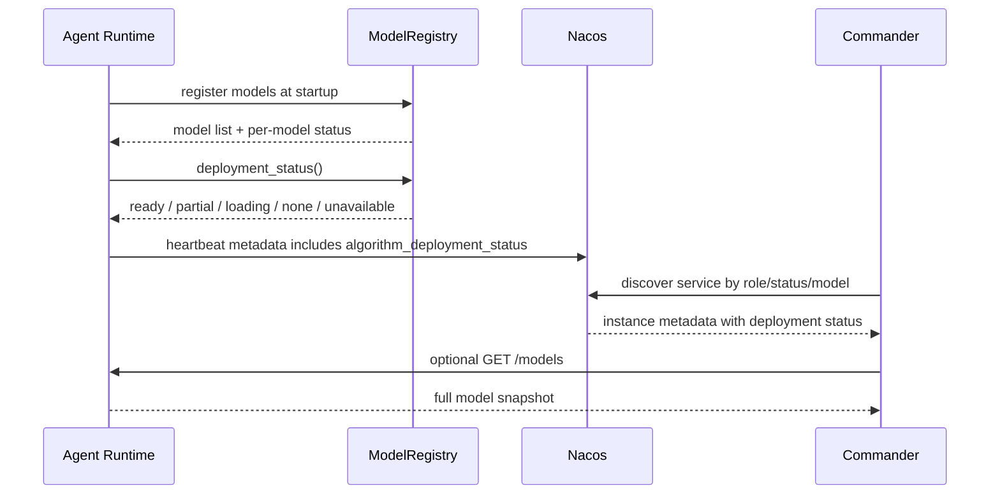
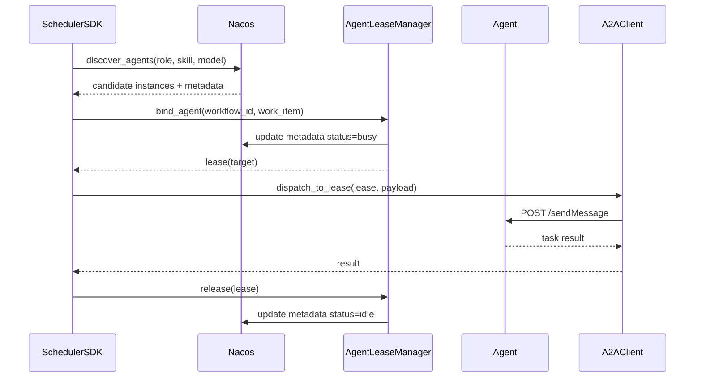

# 分布式智能体接口实现说明

## 1. 需求背景

最新对接的要求是：面向分布式智能体调度模块与 Agent 之间的协同，补齐一整套标准接口，支撑任务协同、状态监控、能力发现和异常恢复。

```text
分布式智能体接口应支撑调度模块与 Agent 之间的：
任务协同、状态监控、能力发现、异常恢复。
```

本次在原有 A2A 框架（Commander 调度 + 四类 Agent + Nacos 注册中心）基础上，补齐了 10 类接口能力，全部在 Agent Runtime 层统一实现，并保持对原有功能完全向后兼容。

## 2. 系统角色与总体架构

在讲每个接口之前，先明确三个角色：

```text
调度模块（Commander）：负责发现 Agent、绑定 Agent、下发任务、处理异常与恢复。
Agent Runtime：每个业务 Agent 共用的运行框架（a2a_protocol/server.py 的 A2ABaseAgent）。
Nacos 注册中心：保存所有 Agent 的注册信息与心跳 metadata，是发现与绑定的数据来源。
```

调度模块与 Agent 之间通过两条通道协同：

| 通道 | 作用 | 承载接口 |
| --- | --- | --- |
| Nacos 注册中心 | 存放静态注册信息与周期心跳，供调度侧查询 | 注册、心跳、状态上报、动态发现、延迟绑定 |
| HTTP 直连（A2A 协议） | 调度侧直接调用 Agent 端点执行任务 | 任务下发、结果返回、异常上报、恢复通知 |

为便于调用方使用，本次还在这两条通道之上封装了一层轻量 SDK（见第 14 节），
把 10 类接口聚合为 Agent 侧与调度侧两个统一入口。

## 3. 实现要求


---

# 各接口详细实现说明

## 4. 智能体注册接口（已满足）

### 4.1 作用与功能

让每个 Agent 启动时把“我是谁、在哪里、能干什么、部署了哪些模型、资源如何、是否在线”
一次性登记到注册中心，作为调度模块发现与绑定的基础。

### 4.2 实现原理

Agent 在 `main.py` 启动时调用 `NacosRegistry.register_service`，把一份 metadata 写入 Nacos。metadata 由四部分拼装而成：

| 上报维度 | 来源 | 字段 |
| --- | --- | --- |
| 自身标识 | Agent 名称与角色 | `role`、服务名 `A2A-Agent`、`name` |
| 部署位置 | 主机 IP + 端口 | `ip`、`port` |
| 可用能力 | `skills_metadata(agent.skills)` | `skills` |
| 算法模型 | `model_registry.metadata()` | `models`、`models_ready`、`algorithm_deployment_status` |
| 资源数值 | `resource_monitor.heartbeat_metadata()` | CPU/GPU/内存/能源/带宽/链路等原始指标 |
| 在线状态 | Nacos 临时实例 + `status` | `status=idle`、`node_online`、健康态 |

以侦察 Agent 为例，注册代码逻辑：

```python
agent = A2ABaseAgent(name="Recon_Agent", role="recon", port=port,
                     models=[build_model("recon_detector_v1", ...)])
registry.register_service(
    service_name="A2A-Agent", ip=ip, port=port,
    metadata={
        "role": "recon", "status": "idle",
        **skills_metadata(agent.skills),      # 可用能力
        **agent.heartbeat_metadata(),         # 资源+模型+在线状态
    },
    metadata_provider=agent.heartbeat_metadata,  # 心跳时动态刷新
)
```

### 4.3 关键点

```text
注册用临时实例（ephemeral=True），Agent 掉线后 Nacos 会自动摘除，天然反映在线状态；
metadata_provider 保证心跳每次都用最新的资源/模型快照刷新注册信息；
SDK 注册失败会自动降级到 HTTP 接口注册（双通道容错）。
```

## 5. 心跳上报接口（补：算法部署状态）

### 5.1 作用与功能

让 Agent 周期性地告诉注册中心“我还活着，而且现在的运行状态、算法部署状态、任务执行状态是什么”，供调度侧判断可用性与负载。

### 5.2 实现原理

`AgentHeartbeatSupervisor` 是一个后台守护线程，按 `A2A_HEARTBEAT_INTERVAL`（默认 5 秒）循环执行。每次心跳时，它调用 `metadata_provider`（即 `agent.heartbeat_metadata()`）拿到最新快照并写入 Nacos。

本次在 `heartbeat_metadata()` 中新增了“状态”字段：

```python
def heartbeat_metadata(self):
    metadata = dict(self.resource_monitor.heartbeat_metadata())  # 资源快照
    metadata.update(self.model_registry.metadata())             # 算法部署状态
    active_tasks = self._metrics["active_tasks"]
    metadata["agent_run_state"] = "ready" if self.ready else "not_ready"   # 运行状态
    metadata["task_execution_status"] = "busy" if active_tasks > 0 else "idle"  # 任务执行状态
    metadata["active_tasks"] = str(active_tasks)
    return metadata
```

### 5.3 上报的状态字段

| 字段 | 含义 | 取值 |
| --- | --- | --- |
| `agent_run_state` | 运行状态 | ready / not_ready |
| `algorithm_deployment_status` | 算法部署状态 | ready / partial / loading / none |
| `task_execution_status` | 任务执行状态 | idle / busy |
| `active_tasks` | 当前活跃任务数 | 整数 |
| `heartbeat_ts` / `heartbeat_at` | 心跳时间戳 | 由注册中心自动补充 |

### 5.4 算法部署状态怎么获取

算法部署状态不是 Commander 人工填写的，也不是从日志里猜出来的，而是由每个 Agent Runtime内部的 `ModelRegistry` 自动汇总得到。

获取链路分为四步：

| 步骤 | 位置 | 说明 |
| --- | --- | --- |
| 1. 启动时注册模型 | 各 Agent `main.py` | 通过 `models=[build_model(...)]` 声明当前 Agent 已部署的算法模型 |
| 2. Runtime 保存模型状态 | `model_registry.py` | 每个模型都有 `id/name/version/model_type/status/tags` |
| 3. 汇总部署状态 | `ModelRegistry.deployment_status()` | 根据所有模型的 `status` 计算整体`algorithm_deployment_status` |
| 4. 对外暴露状态 | `/models` + Nacos 心跳 metadata | HTTP 查询返回完整模型列表；心跳把汇总状态写入 Nacos |

汇总规则如下：

| 模型情况 | `algorithm_deployment_status` |
| --- | --- |
| 没有注册任何模型 | `none` |
| 所有模型都是 `ready` | `ready` |
| 至少一个模型 `ready`，但不是全部 ready | `partial` |
| 没有 ready，但存在 `loading` | `loading` |
| 其它情况，例如全部不可用 | `unavailable` |

因此，调度侧有两种读取方式：

```text
1. 快速发现：从 Nacos metadata 读取 models、models_ready、algorithm_deployment_status；
2. 精确查询：直接调用某个 Agent 的 GET /models，查看每个模型的详细状态。
```

对应流程：



关键点

```text
心跳线程与业务线程解耦，互不阻塞；
心跳每次都会重新采集资源和模型状态，保证注册中心看到的是实时数据；
心跳失败有异常兜底，不会导致 Agent 崩溃。
```

## 6. 状态上报接口

### 6.1 作用与功能

对外提供 Agent 所在节点的完整资源画像：CPU、GPU、内存、能源、通信带宽、链路稳定性、节点在线状态，供前端展示、日志分析或上层调度算法参考。

### 6.2 实现原理

核心是 `resource_monitor.py` 的 `ResourceMonitor`，只负责“采集与上报原始数值”，
不做健康判定。采集分为多个子采样器，每个都带优雅降级：

| 采样器 | 采集内容 | 数据来源 | 降级策略 |
| --- | --- | --- | --- |
| `_sample_with_psutil` | CPU、内存、磁盘、进程 | psutil / shutil | psutil 缺失时整体标记不可用 |
| `_sample_gpu` | GPU 使用率、显存、多卡明细 | 可选 pynvml | 无 GPU/无驱动时 `available=false` |
| _sample_network`      | 上/下行速率、总带宽、链路稳定度、链路在线 | psutil 网卡计数器 | 无网卡计数时 `available=false`    |

其中**带宽**是通过两次采样的字节差除以时间间隔计算得到；
**链路稳定性**由网卡错误/丢包计数推导：

```python
# 带宽：相邻两次采样的字节增量换算为 kbps
send_kbps = (sent - prev_sent) * 8 / 1000 / elapsed
# 链路稳定度：1 - 错误丢包率，范围 0~1
link_stability = max(0.0, 1.0 - total_errors / total_packets)
```

### 6.3 对外接口与返回结构

`GET /resources` 返回完整快照：

```text
{
  monitor_available, node_online, sampled_at,
  system:  { cpu_percent, memory_percent, disk_percent, ... },
  process: { pid, cpu_percent, memory_rss_mb, ... },
  gpu:     { available, gpu_percent, memory_percent, devices[] },
  energy:  { available, percent, power_plugged },
  network: { available, send_kbps, recv_kbps, bandwidth_mbps, link_stability, link_up }
}
```

心跳上报时会把这些指标扁平化为 `resource_gpu_percent`、`resource_bandwidth_mbps`、
`resource_link_stability`、`node_online` 等字段写入 Nacos。

## 7. 动态发现接口（补：可用算法模型）

### 7.1 作用与功能

让调度模块在任务到来时，能查询当前“有哪些可用智能体、有哪些可用技能、有哪些可用算法模型”。

### 7.2 实现原理

发现基于 Nacos 的实例列表 + metadata 过滤，分三个层次：

| 发现维度 | 实现方式 |
| --- | --- |
| 可用智能体 | `discover_service("A2A-Agent", {"role":..., "status":"idle"})`，只返回健康且新鲜的实例 |
| 可用技能 | 在实例 metadata 的 `skills` 字段中做归一化匹配 |
| 可用算法模型 | `models_from_metadata` 解析实例的 `models` 字段；Agent 也提供 `GET /models` 直接查询 |

实例“可用”的判定链路（`_filter_instances` + `_is_instance_fresh`）：

```text
enabled（启用） -> healthy（健康）-> fresh（心跳未超时）-> 满足所需 tag
```

`GET /models` 返回某个 Agent 已部署的模型与部署状态：

```text
{ agent, role, models:[{id, name, version, model_type, status}], deployment_status, count }
```

## 8. 异常上报接口

### 8.1 作用与功能

Agent 或调度侧在执行失败、资源不足、链路异常、模型调用异常时，上报带分类的错误信息，供调度侧决定重试、改派或告警。

### 8.2 实现原理

由 `commander_agent/error_classification.py` 的 `classify_agent_error` 统一分类。
本次新增两类错误码，并接入原有的错误码体系：

```python
class AgentErrorCode(str, Enum):
    ...
    AGENT_RESOURCE_EXHAUSTED = "AGENT_RESOURCE_EXHAUSTED"   # 新增：资源不足
    MODEL_INVOCATION_ERROR   = "MODEL_INVOCATION_ERROR"     # 新增：模型调用异常

# 通过关键字识别（中英文均支持）
if any(k in text for k in ("resource exhausted","out of memory","资源不足","内存不足")):
    return AGENT_RESOURCE_EXHAUSTED   # failover=True，可改派
if any(k in text for k in ("model invocation","inference failed","模型调用","推理失败")):
    return MODEL_INVOCATION_ERROR     # 业务侧异常，不自动改派
```

### 8.3 错误分类全景

| 错误码 | 分类 | 是否可故障转移 | 场景 |
| --- | --- | --- | --- |
| `AGENT_UNAVAILABLE` / `AGENT_TIMEOUT` | system | 是 | 链路异常、连接超时 |
| `AGENT_HEARTBEAT_LOST` / `AGENT_HTTP_5XX` | system | 是 | 心跳丢失、服务端错误 |
| `AGENT_RESOURCE_EXHAUSTED` | resource | 是 | 资源/内存不足（新增） |
| `MODEL_INVOCATION_ERROR` | model | 否 | 模型调用/推理失败（新增） |
| `AGENT_BUSINESS_ERROR` | business | 否 | 业务逻辑错误 |

关键点

```text
资源不足归类为可故障转移，调度可自动改派其它 Agent；
模型调用异常归类为业务侧，不自动改派，避免无意义重试；
错误码同时写入任务结果的 error_code 与日志事件，便于统一排查。
```

---

## 9. 调用形态：轻量 SDK 封装

### 9.1 为什么要 SDK

改造前，接口是“HTTP 协议接口 + 可导入的 Python 类”混合形态：
调用方需要分别 import 多个底层模块，例如 `A2AClient`、`NacosRegistry`、`AgentLeaseManager`、`ModelRegistry` 等。

这样会带来三个问题：

```text
1. 接入成本高：业务 Agent 要自己拼注册 metadata、心跳 metadata、模型 metadata。
2. 调用链分散：调度模块要分别处理发现、租约、下发、异常分类和恢复通知。
3. 不利于交付：虽然底层功能已经具备，但缺少一个对外稳定的统一入口。
```

本次在**不改动任何底层实现**的前提下，增加一层轻量 SDK 封装，达到三个目的：

```text
把 10 类接口聚合为“两个统一入口”，降低调用方接入成本；
支持 pip 安装、版本化，可对外交付复用；
保持底层协议与类不变，向后兼容，老代码无需修改。
```

也就是说，SDK 不是重新实现一套协议，而是把现有 Runtime、Nacos、Client、LeaseManager和 ModelRegistry 组合起来，对外提供更清晰的调用方式。

### 9.2 两个门面（Facade）

新增 `a2a_sdk` 包，提供两个门面类：

| 门面 | 面向对象 | 封装的接口 |
| --- | --- | --- |
| `AgentRuntimeSDK` | 业务 Agent | 智能体注册、心跳上报、状态上报、技能注册、模型注册、恢复通知 |
| `SchedulerSDK` | 调度模块 | 动态发现、延迟绑定、任务下发、结果返回、异常上报、恢复通知 |

代码位置：

| 文件 | 作用 |
| --- | --- |
| `a2a_sdk/__init__.py` | SDK 统一导出入口，外部只需 `from a2a_sdk import ...` |
| `a2a_sdk/agent_sdk.py` | Agent 侧封装，核心类是 `AgentRuntimeSDK` |
| `a2a_sdk/scheduler_sdk.py` | 调度侧封装，核心类是 `SchedulerSDK` |

封装关系可以理解为：

```text
业务 Agent -> AgentRuntimeSDK -> A2ABaseAgent + NacosRegistry + ModelRegistry
调度模块   -> SchedulerSDK     -> NacosRegistry + AgentLeaseManager + A2AClient
```

### 9.3 Agent 侧 SDK 封装了什么

`AgentRuntimeSDK` 面向每一个业务 Agent。它内部创建 `A2ABaseAgent`，并把 Agent 的身份、技能、模型、资源数值和恢复能力统一接入 Runtime。

主要封装内容：

| 能力 | SDK 方法 | 底层实现 |
| --- | --- | --- |
| 创建 Agent Runtime | `AgentRuntimeSDK(...)` | `A2ABaseAgent(...)` |
| 注册到 Nacos | `register()` | `NacosRegistry.register_service(...)` |
| 启动 HTTP 服务 | `serve()` | 先注册，再调用 `agent.start()` |
| 生成注册 metadata | `build_registration_metadata()` | `skills_metadata` + `heartbeat_metadata` |
| 资源状态快照 | `resource_snapshot()` | `ResourceMonitor.snapshot()` |
| 心跳 metadata | `heartbeat_metadata()` | 资源数值 + 模型状态 + 运行状态 + 任务状态 |
| 注册算法模型 | `register_model()` | `ModelRegistry.register(...)` |
| 更新模型状态 | `set_model_status()` | `ModelRegistry.set_status(...)` |
| 设置 ready 状态 | `set_ready()` | 修改 Runtime 的 `ready` 标志 |
| 恢复通知处理 | `notify_recovery()` | `A2ABaseAgent.notify_recovery(...)` |

Agent 侧最重要的是 `register()` 这一步。它会自动拼出 Nacos metadata：

```python
metadata = {
    "role": self.agent.role,
    "status": "idle",
    **skills_metadata(self.agent.skills),
    **self.agent.heartbeat_metadata(),
}
```

其中 `heartbeat_metadata()` 会把下面几类状态合并进去：

```text
资源数值：resource_cpu_percent、resource_memory_percent、resource_disk_percent ...
算法状态：models、models_ready、algorithm_deployment_status
运行状态：agent_run_state=ready/not_ready
任务状态：task_execution_status=idle/busy、active_tasks
```

### 9.4 Agent 侧用法

之前四个 Agent 还主要是这种写法：

```
from a2a_protocol.server import A2ABaseAgent, skills_metadata
from registry.nacos_manager import NacosRegistry, get_host_ip
from model_registry import build_model
```

也就是手动做三件事：

```
1. 创建 A2ABaseAgent
2. 自己拼 Nacos metadata
3. 自己调用 registry.register_service(...)
```

现在一个业务 Agent 只需几行即可对外提供全部接口：

```python
from a2a_sdk import AgentRuntimeSDK, build_model

sdk = AgentRuntimeSDK(
    name="Recon_Agent", description="侦察", role="recon", port=8002,
    models=[build_model("recon_detector_v1", tags=["detect", "identify"])],
)
sdk.serve()   # 注册到 Nacos（含技能+模型+资源） + 启动 HTTP 服务
```

这段代码背后实际完成了下面的动作：

```text
1. 创建 A2ABaseAgent，挂载 /sendMessage、/resources、/models、/recovery/notify 等端点；
2. 注册 recon_detector_v1 算法模型；
3. 采集资源数值，生成心跳 metadata；
4. 把 role、skills、models、resources、status 写入 Nacos；
5. 启动心跳线程，周期刷新 Nacos metadata；
6. 启动 FastAPI 服务，等待 Commander 下发任务。
```

运行期还可动态管理能力与恢复：

```python
sdk.register_model(build_model("tracker_v2"))   # 运行时部署新模型
sdk.set_model_status("tracker_v2", "loading")   # 更新算法部署状态
sdk.notify_recovery({"workflow_id": "wf-1", "action": "resume"})
```

### 9.5 调度侧 SDK 封装了什么

`SchedulerSDK` 面向 Commander 或其它调度模块。它把“发现 Agent、绑定 Agent、下发任务、处理异常、恢复通知、释放租约”串成一个统一入口。

主要封装内容：

| 能力 | SDK 方法 | 底层实现 |
| --- | --- | --- |
| 查询可用 Agent | `discover_agents()` | `NacosRegistry.discover_service(...)` |
| 查询技能集合 | `discover_skills()` | 解析 Nacos metadata 中的 `skills` |
| 查询算法模型 | `discover_models()` | 解析 Nacos metadata 中的 `models/models_ready` |
| 绑定单个 Agent | `bind_agent()` | `AgentLeaseManager.acquire_one(...)` |
| 绑定多个 Agent | `bind_agents()` | `AgentLeaseManager.acquire_all(...)` |
| 释放租约 | `release()` / `release_workflow()` | `AgentLeaseManager.release(...)` |
| 下发任务 | `dispatch_task()` | `A2AClient.send_message(...)` |
| 向租约目标下发任务 | `dispatch_to_lease()` | 使用 lease 中的 `target` 调用 Agent |
| 异常分类 | `classify_error()` | `classify_agent_error(...)` |
| 恢复通知 | `notify_recovery()` / `notify_recovery_all()` | `A2AClient.notify_recovery(...)` |

调度侧的典型闭环是：

```text
discover_agents -> bind_agent -> dispatch_to_lease -> classify_error -> notify_recovery -> release
```

注意：资源监控模块现在只返回原始数值，SDK 和 LeaseManager 不再根据资源阈值自动过滤 Agent。如果后续要按 CPU/GPU/内存做调度策略，可以在上层调度算法读取 `/resources`或 Nacos metadata 后自行计算。

### 9.6 调度侧用法

调度模块用一个入口完成“发现→绑定→下发→收结果→异常→恢复”的闭环：

```python
from a2a_sdk import SchedulerSDK

sdk = SchedulerSDK()

# 1) 动态发现
agents = sdk.discover_agents(role="recon", required_skill="detect")
models = sdk.discover_models()

# 2) 延迟绑定（按能力/模型绑定）
lease = sdk.bind_agent("recon", "wf-1", "wf-1:1", required_model="recon_detector_v1")

# 3) 任务下发 + 结果返回
result = sdk.dispatch_to_lease(lease, {"command": "scan", "input": {...}})

# 4) 异常分类
info = sdk.classify_error(result.get("error"))

# 5) 恢复通知 + 释放
sdk.notify_recovery(lease.target, {"workflow_id": "wf-1", "action": "resume"})
sdk.release(lease)
```

对应时序图：



### 9.7 接口到 SDK 方法映射

| 接口 | SDK 方法 |
| --- | --- |
| 智能体注册 | `AgentRuntimeSDK.register()` / `serve()` |
| 心跳上报 | 由 `register()` 自动启动（`heartbeat_metadata()` 可查询） |
| 状态上报 | `AgentRuntimeSDK.resource_snapshot()` |
| 技能/模型注册 | `AgentRuntimeSDK.register_model()` / `set_model_status()` |
| 动态发现 | `SchedulerSDK.discover_agents/discover_skills/discover_models()` |
| 延迟绑定 | `SchedulerSDK.bind_agent/bind_agents()` |
| 任务下发 | `SchedulerSDK.dispatch_task/dispatch_to_lease()` |
| 任务结果返回 | 下发方法的返回值（含 `model_result`、`log_id`） |
| 异常上报 | `SchedulerSDK.classify_error()` |
| 恢复通知 | 两侧均有 `notify_recovery()` |

### 9.8 打包与安装

新增 `pyproject.toml`，项目已可作为标准包安装：

```bash
pip install -e .          # 开发态安装
python -c "import a2a_sdk" # 统一入口可用
```

安装后可以直接从统一入口导入：

```python
from a2a_sdk import AgentRuntimeSDK, SchedulerSDK, build_model
```

### 9.9 重点

```text
轻量 SDK 的作用不是替代底层协议，而是把分布式智能体接口封装成两个稳定入口。

AgentRuntimeSDK 面向业务 Agent，把注册、心跳、状态上报、模型注册、恢复通知统一起来；
SchedulerSDK 面向调度模块，把动态发现、租约绑定、任务下发、异常分类和恢复通知统一起来。

这样业务 Agent 不需要了解 Nacos metadata 怎么拼，调度模块也不需要分别操作 Registry、
LeaseManager 和 A2AClient。底层协议仍然保持不变，因此老代码可以继续使用，新代码可以通过
SDK 更快接入。
```

## 10. 验证方式

测试命令：

```bash
python -m unittest tests.test_distributed_agent_interfaces
```

测试覆盖：

| 测试类 | 覆盖内容 |
| --- | --- |
| `StateReportingTest` | GPU/能源/带宽/链路/在线状态采集与心跳扁平化 |
| `SkillRegistrationTest` | 8 类专业能力目录与角色默认技能 |
| `ModelRegistryTest` | 模型注册、部署状态、发现与匹配 |
| `TaskResultTest` | 任务结果的模型调用结果与日志标识 |
| `ExceptionReportingTest` | 资源不足、模型调用异常错误码 |
| `DelayedBindingTest` | 按模型绑定与租约状态更新 |
| `RecoveryNotificationTest` | 恢复通知、agent card、心跳元数据 |
| `AgentRuntimeSDKTest` | Agent 侧 SDK：注册元数据、模型注册、恢复 |
| `SchedulerSDKTest` | 调度侧 SDK：发现、绑定、下发、异常、恢复闭环 |

验证结果：

```text
新增用例共 31 个（接口 22 + SDK 9）全部通过；
全量 98 个用例中，除改动前就已存在的 BPEL 工作流遗留问题外全部通过；
本次新增的 __init__.py 与 SDK 未破坏任何现有功能（向后兼容）。
```

## 11. 说明

```text
本次按最新需求，把分布式智能体接口补齐为完整的 10 类标准接口。

注册接口让 Agent 上报标识、部署位置、能力、模型、资源和在线状态；
心跳接口周期上报运行状态、算法部署状态和任务执行状态；
状态上报接口在 CPU、内存基础上新增了 GPU、能源、通信带宽、
链路稳定性和节点在线状态；
技能注册接口补齐了检测、定位、跟踪、识别、威胁评估、目标分配、
航路规划、打击效果评估 8 类专业能力；
动态发现接口支持查询可用智能体、技能和算法模型；
延迟绑定接口支持按能力和模型绑定 Agent，资源指标作为观测数据提供给上层策略；
任务下发和结果返回接口支持下发子任务并返回模型调用结果与日志标识；
异常上报接口补充了资源不足和模型调用异常两类错误码；
恢复通知接口支持在拓扑重构和任务重规划后通知 Agent 继续执行。

所有能力均在 Runtime 层统一实现、向后兼容，并封装了一层轻量 SDK（Agent 侧与调度侧两个统一入口，可 pip 安装），方便后续交付与复用；同时补充了单元测试，新增 31 个用例（接口 22 + SDK 9）全部通过，未破坏任何现有功能。
```
