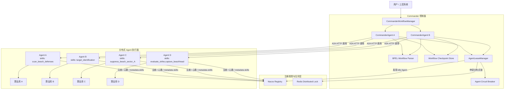
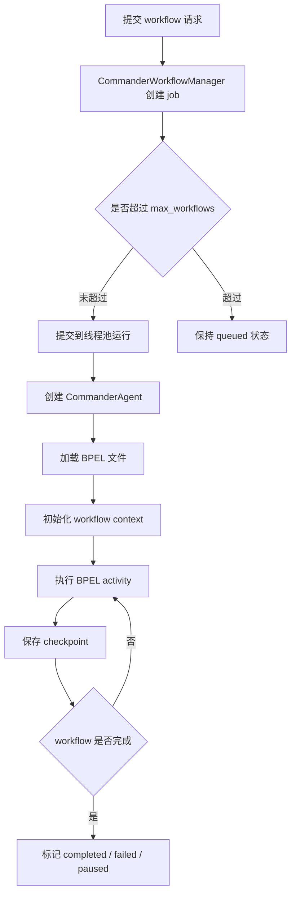
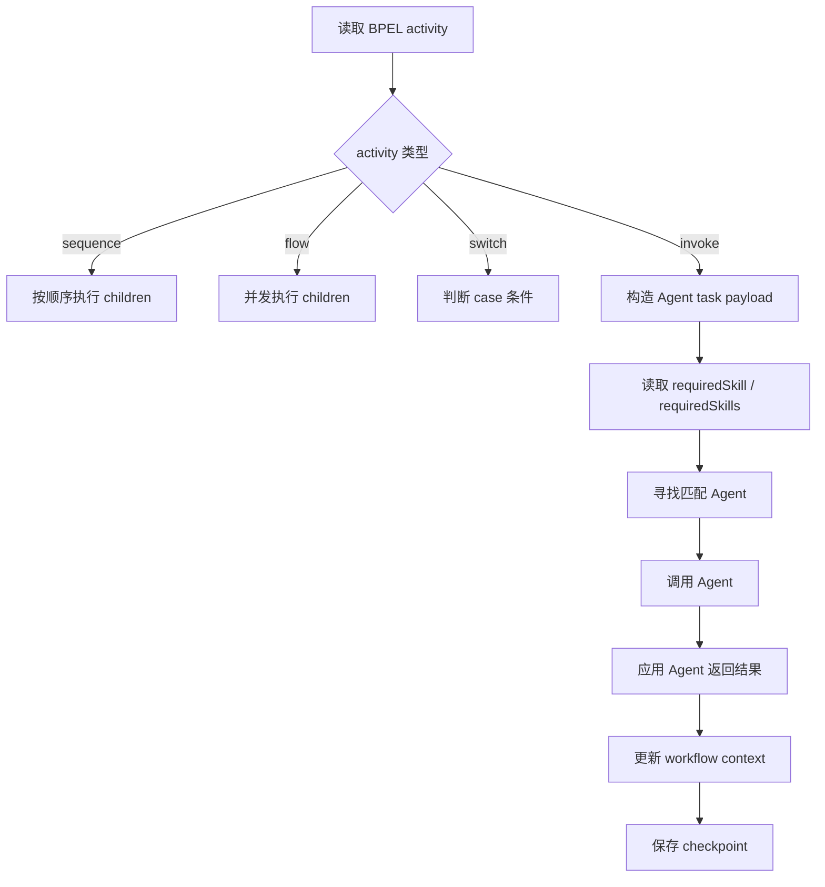
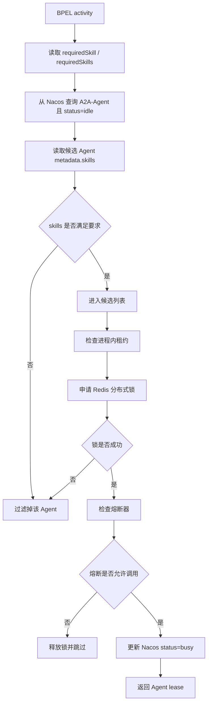
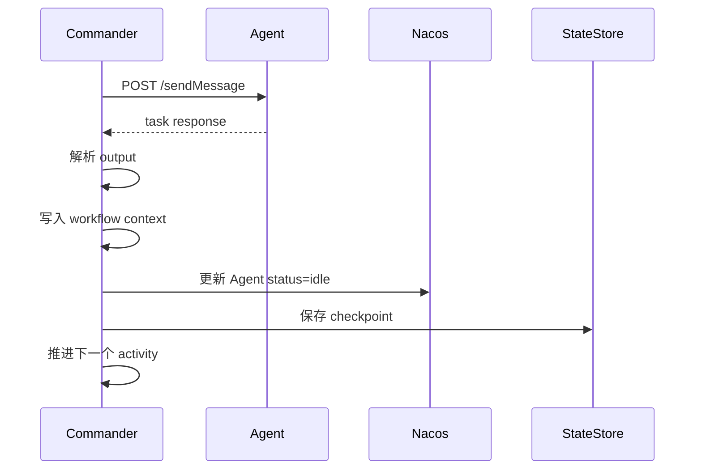
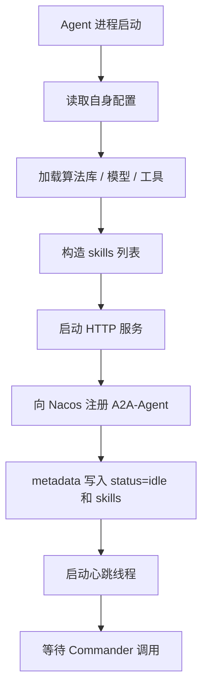
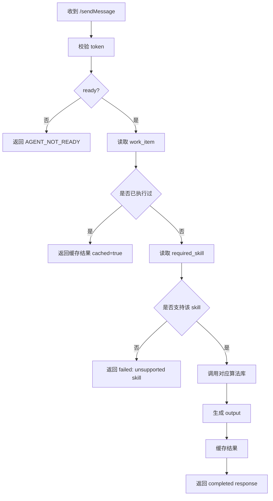
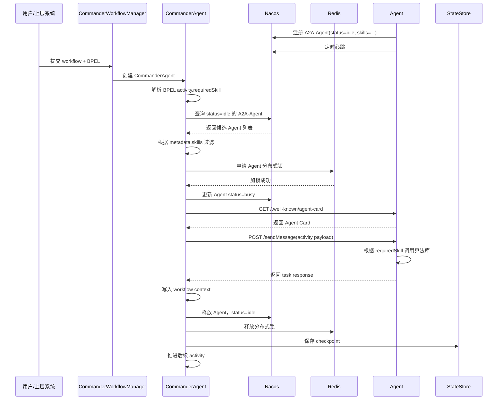

# 分布式智能体架构与运行机制说明

## 1. 总体说明

本项目采用 **Commander 控制面 + 分布式 Agent 执行面 + Nacos 注册发现 + Redis 分布式锁 + BPEL 工作流编排** 的架构。

其中：

- Commander 负责编排、调度、状态管理、故障恢复和结果汇总。
- Agent 负责根据自身 skills 调用算法库完成具体任务。
- Nacos 负责 Agent 注册、发现、metadata 状态同步和心跳。
- Redis 负责多 Commander 场景下的分布式互斥锁。
- BPEL 负责描述工作流结构、任务顺序、并行关系、条件分支和每个 activity 需要的 skill。

当前系统已经从“按固定 role 调 Agent”调整为“按 `requiredSkill` 动态发现 Agent”。因此真实 Agent 接入时，不需要叫 ReconAgent、ArtilleryAgent 等固定名称，只要声明自身 `skills`，并注册到 Nacos，就可以被 Commander 调度。

## 2. 分布式智能体架构图



## 3. 核心运行机制

### 3.1 BPEL 驱动流程编排

BPEL 文件定义 workflow 的结构。它描述：

- 哪些 activity 需要执行。
- activity 是顺序执行还是并行执行。
- 每个 activity 需要什么 skill。
- activity 的输入变量和输出变量。
- 条件分支如何判断。
- 失败时如何处理。

示例：

```xml
<invoke name="SkillOnlyRecon"
        requiredSkill="scan_beach_defenses"
        operation="scanBeachDefenses"
        inputVariable="Sector_A"
        outputVariable="ReconReport"/>
```

含义是：

```text
当前 activity 不指定某个固定 Agent，
只声明需要 scan_beach_defenses 技能。
Commander 会寻找具备该 skill 的 idle Agent 执行。
```

多技能 activity 示例：

```xml
<invoke name="ComplexRecon"
        requiredSkills="scan_beach_defenses,target_identification"
        operation="complexRecon"
        inputVariable="Sector_A"
        outputVariable="ReconReport"/>
```

含义是：

```text
该 activity 要求 Agent 同时具备 scan_beach_defenses 和 target_identification 两个技能。
```

### 3.2 Agent 通过 skills 声明能力

真实 Agent 启动时，会根据自身配置和算法库声明 skills。

Agent Card 示例：

```json
{
  "name": "TerrainAnalysisAgent",
  "description": "真实地形分析 Agent",
  "role": "generalist",
  "skills": [
    {
      "id": "scan_beach_defenses",
      "name": "Beach Defense Scan",
      "description": "探测滩头防御和敌方阵地。",
      "tags": ["scan", "detect", "探测", "侦察"]
    },
    {
      "id": "target_identification",
      "name": "Target Identification",
      "description": "识别目标类型和威胁等级。",
      "tags": ["target", "identify", "目标识别"]
    }
  ]
}
```

注册到 Nacos metadata 时，skills 会压缩成便于 Commander 快速筛选的字符串：

```json
{
  "status": "idle",
  "role": "generalist",
  "skills": "scan_beach_defenses,Beach Defense Scan,探测,侦察,target_identification,Target Identification,目标识别"
}
```

当前调度严格按 skills 匹配，不再按 role 兜底。也就是说：

```text
Agent 有 role=recon 但没有 skills，不会被 Commander 选中。
Agent role=generalist 但 skills 包含 scan_beach_defenses，可以被 Commander 选中。
```

### 3.3 Nacos 负责服务发现和状态同步

Agent 注册到 Nacos 后，Commander 从 Nacos 查询候选 Agent。

当前发现逻辑是：

```text
Commander 查询 serviceName=A2A-Agent 且 status=idle 的实例
-> 读取每个实例 metadata.skills
-> 按 BPEL requiredSkill / requiredSkills 做本地技能过滤
```

Nacos 主要负责：

- Agent 注册。
- Agent 心跳。
- metadata 保存。
- status 状态同步。
- Agent 是否 healthy / enabled。

常见 metadata：

```json
{
  "status": "idle",
  "skills": "scan_beach_defenses,target_identification",
  "heartbeat_ts": 1783044011,
  "heartbeat_at": "2026-07-03T02:00:11Z",
  "lease_workflow_id": "workflow-xxx",
  "lease_work_item": "workflow-xxx:activity-002",
  "lease_lock_backend": "redis"
}
```

### 3.4 租约和分布式锁避免资源抢占

当多个 workflow 或多个 Commander 同时运行时，可能会争抢同一个 Agent。系统通过两层机制避免冲突。

第一层是进程内租约：

```text
AgentLeaseManager 在当前 Commander 进程内维护 _leases
防止同一个 Manager 内多个 workflow 抢同一个 Agent
```

第二层是 Redis 分布式锁：

```text
多个 Commander 进程同时争抢同一个 Agent 时，
只有拿到 Redis SET NX 锁的 Commander 可以租用该 Agent。
```

租约成功后，Commander 会把 Agent metadata 更新为：

```json
{
  "status": "busy",
  "lease_workflow_id": "workflow-abc123",
  "lease_work_item": "workflow-abc123:activity-002",
  "lease_acquired_at": "2026-07-03T02:00:11Z",
  "lease_lock_backend": "redis",
  "lease_lock_key": "a2a:agent-lease:A2A-Agent%3A10.0.0.10%3A8002"
}
```

### 3.5 熔断和故障转移

如果 Agent 调用失败，Commander 会判断错误类型。

系统级故障包括：

- 连接失败。
- 请求超时。
- Agent not ready。
- HTTP 5xx。
- 心跳丢失。

这些故障会触发：

```text
释放当前租约
记录失败次数
必要时打开熔断器
跳过异常 Agent
重新寻找具备相同 skill 的其他 Agent
```

业务失败不会被当成 Agent 宕机。例如：

```text
Evaluator 正常返回评估不通过
Assault 正常返回突击条件不足
```

这种情况说明 Agent 正常工作，只是业务结果失败，Commander 会按 workflow 规则继续处理。

## 4. Commander 运行流程

### 4.1 CommanderWorkflowManager 启动

CommanderWorkflowManager 是常驻管理器，负责多个 workflow 的并发执行。

它的职责包括：

- 接收 workflow 提交。
- 动态加载不同 BPEL。
- 控制最大并发 workflow 数。
- 为每个 workflow 创建 CommanderAgent。
- 管理 workflow 状态。
- 查询 checkpoint、trace、leases 和 agents。

运行流程：



### 4.2 Commander 执行 BPEL

CommanderAgent 执行 BPEL 时，会逐个推进 activity。

对于每个 activity：

1. 读取 activity 类型。
2. 如果是 `sequence`，按顺序执行子节点。
3. 如果是 `flow`，并发执行子节点。
4. 如果是 `switch`，根据条件选择分支。
5. 如果是 `invoke`，构造任务 payload 并调用 Agent。



### 4.3 Commander 寻找 Agent

Commander 当前只按 skill 匹配 Agent。

详细流程：



如果没有任何 Agent 匹配：

```text
当前 activity 失败
workflow 按 failure_policy 处理
默认进入 paused 或 failed 状态
```

### 4.4 Commander 调用 Agent

选中 Agent 后，Commander 会通过 A2A HTTP 协议调用：

```text
GET /.well-known/agent-card
POST tokenUrl 获取 token
POST /sendMessage 或 /sendMessageStream
```

调用 payload 示例：

```json
{
  "workflow_id": "workflow-abc123",
  "work_item": "workflow-abc123:activatity-002-skillonlyrecon",
  "command": "scan_beach_defenses",
  "required_skill": "scan_beach_defenses",
  "required_skills": ["scan_beach_defenses"],
  "input": {
    "sector": "Sector_A"
  },
  "output_hint": "recon_report",
  "context": {
    "workflow_id": "workflow-abc123",
    "workflow_status": "running"
  },
  "retry_policy": {
    "max_retries": 1,
    "timeout_seconds": 5.0,
    "failure_policy": "pause"
  }
}
```

Commander 要求 Agent 返回标准结果：

```json
{
  "workflow_id": "workflow-abc123",
  "work_item": "workflow-abc123:activatity-002-skillonlyrecon",
  "agent": "TerrainAnalysisAgent",
  "role": "scan_beach_defenses",
  "command": "scan_beach_defenses",
  "status": "completed",
  "output": {
    "recon_report": "目标区域发现三处防御工事。"
  },
  "metrics": {
    "duration_ms": 1200
  },
  "error": null,
  "message": "scan_beach_defenses completed",
  "attempts": 1,
  "cached": false
}
```

### 4.5 Commander 处理返回结果

Agent 返回成功后，Commander 会：

1. 校验 response status。
2. 根据 `work_item` 找到对应 activity。
3. 读取 response.output。
4. 按 `output_hint` 写入 workflow context。
5. 更新 work_list 中 activity 状态。
6. 释放 Agent 租约。
7. 把 Agent metadata 更新回 `idle`。
8. 保存 checkpoint。
9. 继续推进后续 activity。



## 5. Agent 运行流程

### 5.1 Agent 启动流程

真实 Agent 启动时，应完成以下步骤：



### 5.2 Agent 接收任务流程

Agent 收到 `/sendMessage` 后：

1. 校验 Authorization。
2. 检查自身 ready 状态。
3. 读取 `work_item`。
4. 检查该 `work_item` 是否已经执行过。
5. 读取 `required_skill`。
6. 根据 skill 选择本地算法。
7. 执行算法。
8. 按 `output_hint` 组织 output。
9. 返回标准 task response。



### 5.3 Agent 幂等要求

Agent 必须把 `work_item` 当成幂等键。

原因是 Commander 可能因为：

- 网络抖动。
- 请求超时。
- Commander 重试。
- Agent failover。
- workflow resume。

重复发送同一个任务。

Agent 应保证：

```text
同一个 work_item 重复请求，不重复产生不可逆副作用。
如果任务已经完成，返回缓存结果。
```

### 5.4 Agent 状态要求

Agent 自身应该维护：

```text
ready: 是否可以接收任务
active_tasks: 当前执行任务数
last_work_item: 最近执行任务
last_error: 最近错误
```

Agent 注册到 Nacos 后，status 主要由 Commander 维护：

```text
idle：可调度
busy：已被某个 workflow 租用
unavailable：不可用或被熔断
```

Agent 不应随意覆盖 Commander 写入的租约字段：

```text
lease_workflow_id
lease_work_item
lease_acquired_at
lease_lock_backend
lease_lock_key
```

## 6. Commander 与 Agent 完整协作时序



## 7. 异常场景处理

### 7.1 找不到匹配 skill 的 Agent

如果没有任何 `idle` Agent 的 `metadata.skills` 满足 `requiredSkill`：

```text
当前 activity 执行失败
workflow 按 failure_policy 处理
默认暂停或失败
```

此时需要：

- 启动具备该 skill 的真实 Agent。
- 确认 Agent 已注册到 Nacos。
- 确认 metadata.skills 包含 requiredSkill。
- 确认 Agent status=idle。

### 7.2 Agent 调用失败

如果 Agent 连接失败、超时、not ready 或心跳丢失：

```text
Commander 释放租约
记录失败
必要时打开熔断器
重新寻找具备相同 skill 的其他 Agent
```

### 7.3 Agent 业务失败

如果 Agent 正常返回业务失败：

```text
Commander 不会把该 Agent 当成宕机
而是按 BPEL failure_policy 或业务流程继续处理
```

例如：

```text
evaluate_strike 正常返回评分不足
这属于业务结果，不属于 Agent 系统故障
```

## 8. 当前能力总结

当前项目支持：

- 多 workflow 并发运行。
- 动态加载不同 BPEL。
- BPEL activity 按 `requiredSkill` 声明能力需求。
- Commander 按 Agent `metadata.skills` 动态选择 Agent。
- 真实 Agent 通过 Nacos 注册和心跳接入。
- 多 Agent 分布式协同执行。
- Agent 租约和 Redis 分布式锁。
- Agent 熔断、failover、心跳丢失检测。
- checkpoint 和 resume。

当前项目定位：

```text
Commander 是核心编排控制面。
现有 demo Agent 用于验证协议和流程。
真实 Agent 后续按照接入规范声明 skills、注册 Nacos、等待 Commander 调用即可。
```

```text
BPEL 定义任务流程，
requiredSkill 定义每一步需要的能力，
真实 Agent 通过 skills 声明自身算法能力并注册到 Nacos，
Commander 根据 skills 动态发现、租用、调用 Agent，
并通过分布式锁、熔断、checkpoint 和 failover 保证多 workflow、多 Agent 场景下的稳定协同执行。
```
