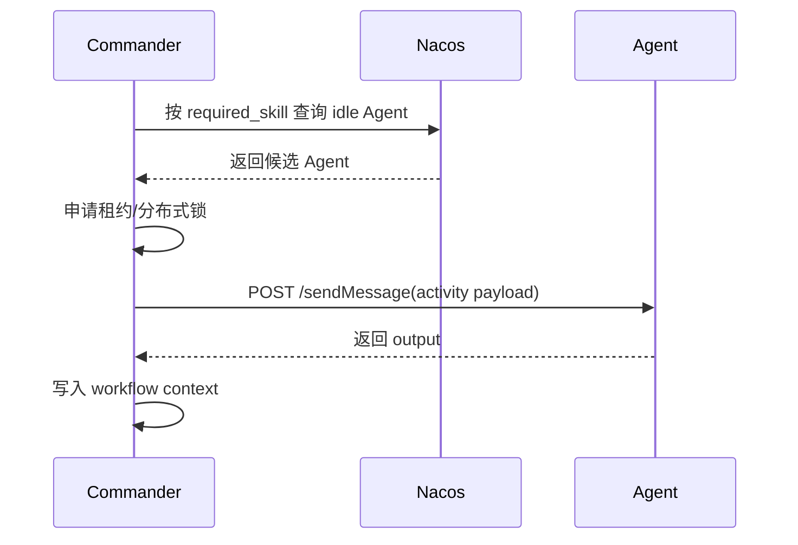
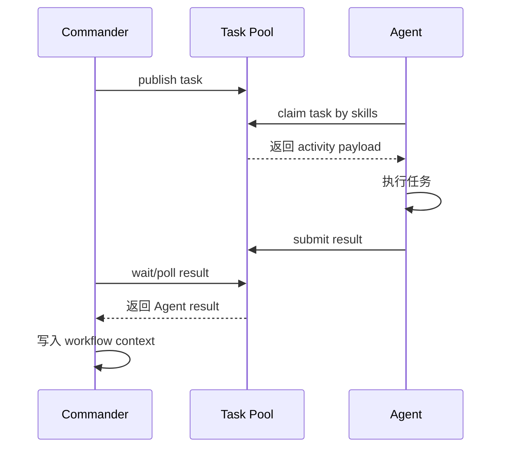
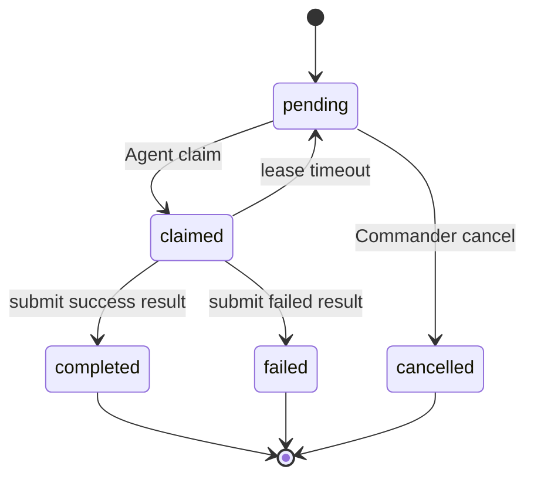

# Commander-Agent 双模式调度设计与实现说明

## 1. 目标

当前项目支持两种 Agent 调度模式：

```text
direct：Commander 主动发现 Agent，并直接调用 Agent /sendMessage。
crowd：Commander 把 activity 发布到任务池，Agent 主动领取、执行、提交结果。
```

默认仍然是 `direct`，不会影响现有流程。需要众包任务池时再切到 `crowd`。

## 2. direct 模式

direct 模式链路：



适合：

```text
1. Commander 需要强控制实时调用。
2. Agent 数量较少。
3. 调试和 demo 阶段。
4. 不希望新增中间任务池。
```

## 3. crowd 模式

crowd 模式链路：



适合：

```text
1. Agent 动态上下线。
2. 多个 Agent 按技能自主接任务。
3. 需要任务池审计、领取、租约、结果记录。
4. 真实 Agent 接入后不希望 Commander 直接绑定具体 Agent。
```

## 4. 配置方式

全局使用 direct：

```powershell
python -m commander_agent.main --workflow bpel --agent-dispatch-mode direct
```

全局使用 crowd：

```powershell
python -m commander_agent.main --workflow bpel --agent-dispatch-mode crowd
```

也可以使用环境变量：

```powershell
$env:A2A_AGENT_DISPATCH_MODE="crowd"
$env:A2A_TASK_POOL_PATH="D:\A2A\.a2a_state\task_pool.json"
$env:A2A_CROWD_TIMEOUT="30"
$env:A2A_CROWD_POLL_INTERVAL="0.5"
```

## 5. BPEL 单 activity 覆盖

可以在 BPEL 的 `invoke` 上单独指定：

```xml
<invoke name="ScanBeach"
        requiredSkill="scan_beach_defenses"
        assignmentMode="crowd"
        dispatchMode="single"
        inputVariable="Sector_A"
        outputVariable="ReconReport"/>
```

也可以保持 direct：

```xml
<invoke name="EvaluateStrike"
        requiredSkill="evaluate_strike"
        assignmentMode="direct"
        dispatchMode="single"
        inputVariable="StrikeCoordinates"
        outputVariable="EvalScore"/>
```

字段含义：

| 字段 | 说明 |
| --- | --- |
| `assignmentMode` | Agent 分配方式，支持 `direct` / `crowd` |
| `dispatchMode` | activity 执行形态，继续表示 `single` / `parallel` |
| `requiredSkill` | 当前任务需要的技能 |
| `inputVariable` | 当前任务输入变量 |
| `outputVariable` | 当前任务输出变量 |

## 6. Task Pool 任务格式

Commander 发布到任务池的 task 会保留原始 activity payload，并抽取关键字段：

```json
{
  "task_id": "task-5b2af191a2b5",
  "workflow_id": "workflow-abc123",
  "work_item": "workflow-abc123:activity-002-scanbeachdefenses",
  "activity_id": "activity-002-scanbeachdefenses",
  "activity_index": 2,
  "activity_skill": "scan_beach_defenses",
  "required_skill": "scan_beach_defenses",
  "required_skills": ["scan_beach_defenses"],
  "input": {
    "sector": "Sector_A"
  },
  "output_hint": "recon_report",
  "status": "pending"
}
```

## 7. Agent 主动领取

Agent 基类新增：

```text
POST /crowd/claim-next
GET  /work-list
```

Agent 调用：

```http
POST /crowd/claim-next
```

请求体：

```json
{
  "workflow_id": "workflow-abc123"
}
```

Agent 会自动：

```text
1. 使用自己的 skills 去任务池查可领取任务。
2. 原子 claim 一个任务。
3. 执行 execute_task(payload)。
4. 按 output_hint 返回 output。
5. submit result 到任务池。
6. 更新 Agent 自己的 work_list。
```

## 8. Commander 和 Agent 的 work_list

Commander 的 `work_list` 是全局 workflow activity 清单：

```text
workflow 中有哪些 activity、每个 activity 当前是什么状态。
```

Agent 的 `work_list` 是本 Agent 已领取/执行过的任务清单：

```text
这个 Agent 接过哪些 work_item、执行状态是什么、返回了什么 response。
```

两者通过 `work_item` 和 `activity_id` 关联。

## 9. 状态流转



## 10. 当前实现位置

| 文件 | 作用 |
| --- | --- |
| `task_pool.py` | 文件型众包任务池，支持发布、按技能领取、租约、提交结果、等待结果 |
| `commander_agent/main.py` | Commander 支持 `direct` / `crowd` 双模式 |
| `bpel_workflow.py` | BPEL 解析支持 `assignmentMode` |
| `a2a_protocol/server.py` | Agent 基类支持主动领取任务和本地 Agent work_list |

## 11. 后续可扩展

当前是最小可用版本，任务池使用 JSON 文件落盘。后续可以平滑替换成：

```text
1. 独立 FastAPI 众包平台。
2. Redis / PostgreSQL 作为任务状态存储。
3. WebSocket / SSE 推送任务。
4. 人工接单和人工审核页面。
5. 多结果聚合和评分机制。
6. 任务优先级、取消、重派、租约续期。
```

核心 schema 不需要大改，仍然围绕：

```text
work_item
activity_id
activity_skill
required_skills
input
output_hint
```
