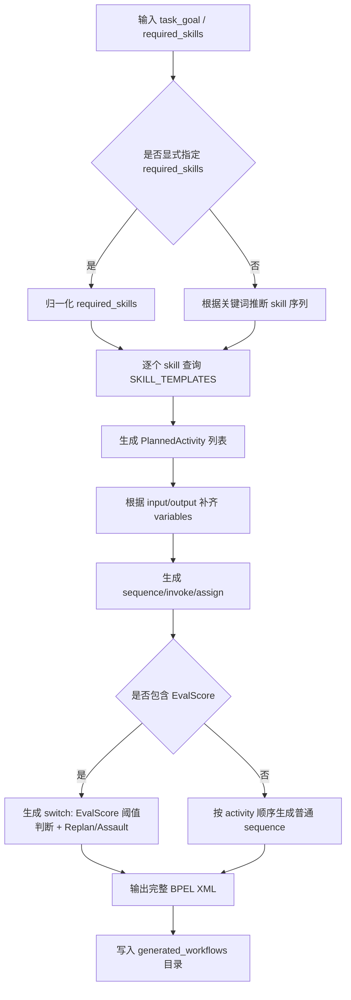
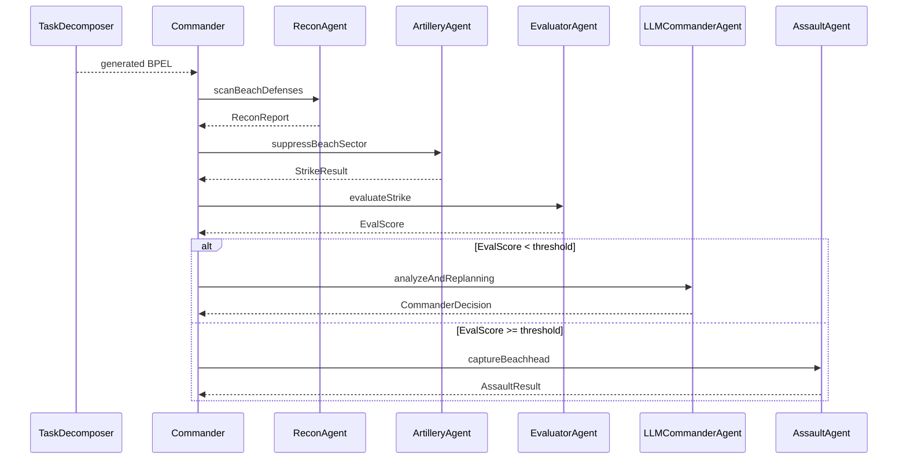
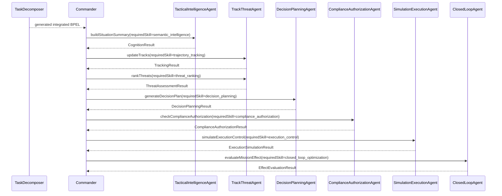
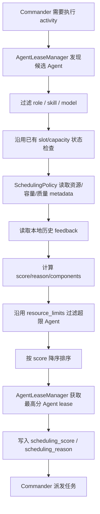
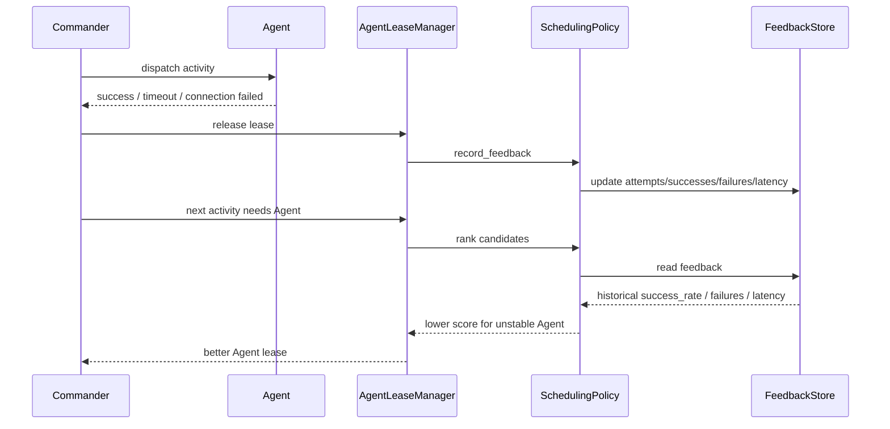
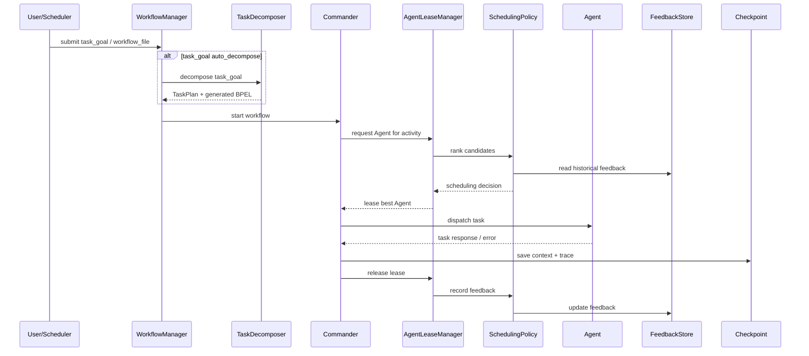

# 多智能体编排调度能力补齐周报

## 1. 本周工作概述

本周围绕 A2A 项目中“多智能体任务编排、协同执行、资源调度、执行状态跟踪和反馈闭环”的完整性进行了补齐。

原系统已经具备较完整的执行底座，包括：

| 原有能力 | 已有实现 |
| --- | --- |
| workflow 执行 | 支持 BPEL `sequence`、`flow`、`switch`、`invoke` |
| Agent 发现与调用 | 支持按 `role`、`skill`、`model` 发现 Agent |
| 并发执行 | 支持多 workflow、activity 并发、同 role Agent 并发 |
| 执行可靠性 | 支持 lease、分布式锁、heartbeat、熔断、重试、failover |
| 状态恢复 | 支持 checkpoint 保存和 resume |
| 资源监控 | Agent Runtime 可采集 CPU、内存、磁盘、进程等资源数值 |

但进一步对照“多智能体协同任务系统”的要求后，仍存在三个关键缺口：

| 缺口 | 具体问题 |
| --- | --- |
| 缺少高层任务分解入口 | 只能执行人工提前写好的 BPEL 文件，不能直接从任务目标生成 workflow |
| 调度决策不够独立可解释 | 资源排序逻辑混在 lease 管理中，不方便说明“为什么选择这个 Agent” |
| 缺少持续反馈闭环 | Agent 成功、失败、延迟等执行结果没有沉淀为后续调度依据 |

因此本周重点补齐了三层能力：

```text
任务分解层：task_goal -> TaskPlan -> BPEL
调度决策层：候选 Agent -> 资源/容量/质量/反馈评分 -> 最优 Agent
反馈闭环层：执行结果 -> 调度反馈存储 -> 影响后续调度
```

一句话总结：

```text
系统从“执行预定义 workflow 的多 Agent 框架”，补齐为“可接收高层任务、自动生成 workflow、按资源和历史表现调度 Agent、并把执行结果反馈给后续调度”的协同编排系统。
```

## 2. 为什么需要这次补齐

项目目标是实现：

```text
任务分解
任务分配
协同调用
资源负载感知
调度决策
执行控制
执行状态跟踪
反馈闭环
```

之前系统更偏“执行引擎”，也就是：

```text
用户提供 BPEL
-> Commander 解析 workflow
-> 按 activity 找 Agent
-> Agent 执行
-> 保存 checkpoint 和 trace
```

这个链路可以证明系统能跑 workflow，但不能完整回答以下问题：

```text
任务目标如何变成多个 activity？
Commander 选择 Agent 的依据是什么？
如果某个 Agent 历史上经常失败，系统后续是否会降低对它的调度优先级？
调度策略是否能独立扩展，而不是写死在租约逻辑里？
外部 Scheduler 是否能通过 SDK/API 使用这些能力？
```

因此本周修改的目标不是替换原有 BPEL 执行逻辑，而是在其上补齐计划、调度、反馈三层能力，使系统更符合“多智能体协同调度框架”的定位。

## 3. 新增功能一：高层任务自动分解为 BPEL

### 3.1 修改前的问题

原来执行流程时，需要人工指定已有 BPEL：

```powershell
python commander_agent/main.py --mode local --workflow bpel --workflow-file beachhead_workflow
```

这种方式的问题是：

```text
1. 用户必须提前知道应该运行哪个 BPEL 文件。
2. 系统没有体现“任务目标 -> 子任务 -> workflow”的任务分解过程。
3. 如果要新增一个流程，需要人工编写 XML，演示时不够直观。
```

### 3.2 本次新增的实现

新增文件：

```text
commander_agent/task_decomposer.py
```

新增核心对象：

| 对象 | 作用 |
| --- | --- |
| `TaskDecomposer` | 任务分解器，负责把 `task_goal` 转成 BPEL |
| `TaskPlan` | 分解后的任务计划，包含变量、activity、阈值和 BPEL 文本 |
| `PlannedActivity` | 单个子任务，描述 partnerLink、operation、skill、输入输出变量 |

当前实现方式是**规则型任务分解器**，不是 LLM Planner。也就是说，它通过关键词和模板规则生成 BPEL，优点是稳定、可解释、可测试。

### 3.3 模板结构和生成逻辑

当前自动分解不是从已有 BPEL 文件中挑一个执行，也不是 LLM 自由规划，而是使用 `SKILL_TEMPLATES` 做规则模板生成。模板的作用是：把一个抽象 skill 映射成 BPEL 里可以执行的 `invoke` activity。

每个模板主要包含以下字段：

| 字段 | 含义 | BPEL 中对应内容 |
| --- | --- | --- |
| `name` | 自动生成的 activity 名称 | `<invoke name="...">` |
| `partner_link` | 调用哪类 Agent | `<invoke partnerLink="...">` |
| `operation` | 调用 Agent 的哪个操作 | `<invoke operation="...">` |
| `required_skill` | Agent 发现时要求匹配的 skill | `<invoke requiredSkill="...">` |
| `input_variable` | activity 输入变量 | `<invoke inputVariable="...">` |
| `output_variable` | activity 输出变量 | `<invoke outputVariable="...">` |
| `dispatch_mode` | 是否并发派发 | `<invoke dispatchMode="parallel">` |

例如 beachhead 任务中的两个模板可以理解为：

```python
"scan_beach_defenses": {
    "name": "AutoRecon",
    "partner_link": "ReconAgent",
    "operation": "scanBeachDefenses",
    "input_variable": "Sector_A",
    "output_variable": "ReconReport",
}

"suppress_beach_sector_A": {
    "name": "AutoStrike",
    "partner_link": "ArtilleryAgent",
    "operation": "suppressBeachSector",
    "input_variable": "StrikeCoordinates",
    "output_variable": "StrikeResult",
    "dispatch_mode": "parallel",
}
```

集成智能化任务中的模板可以理解为：

```python
"semantic_intelligence": {
    "name": "AutoCognition",
    "partner_link": "TacticalIntelligenceAgent",
    "operation": "buildSituationSummary",
    "required_skill": "semantic_intelligence",
    "input_variable": "MissionInput",
    "output_variable": "CognitionResult",
}

"decision_planning": {
    "name": "AutoDecisionPlanning",
    "partner_link": "DecisionPlanningAgent",
    "operation": "generateDecisionPlan",
    "required_skill": "decision_planning",
    "input_variable": "ThreatAssessmentResult",
    "output_variable": "DecisionPlanningResult",
}
```

完整生成流程如下：

| 步骤 | 代码逻辑 | 说明 |
| --- | --- | --- |
| 1. 读取输入 | `decompose(objective, required_skills=...)` | 输入 `task_goal`，也可以显式传入 `required_skills` |
| 2. 归一化 skill | `_normalize_skills(required_skills)` | 如果外部传入 skill，先去重、去空值 |
| 3. 推断 skill 序列 | `_infer_skills(objective)` | 如果没有显式 skill，则根据关键词判断任务类型 |
| 4. 生成 activity | `_activities_from_skills(skills, objective)` | 逐个 skill 查询 `SKILL_TEMPLATES`，生成 `PlannedActivity` |
| 5. 补齐变量 | `_variables_for_activities(activities)` | 根据 input/output 自动生成 BPEL `<variables>` |
| 6. 生成流程体 | `_body_xml(plan)` | 生成 `<sequence>`、`<invoke>`、`<assign>`、`<switch>` |
| 7. 写出 BPEL | `to_bpel(plan)` / `write_bpel(...)` | 输出完整 XML，并写入 `generated_workflows/<workflow_id>.bpel` |

关键词规则示例：

| 任务描述 | 识别结果 | 生成流程 |
| --- | --- | --- |
| `快速突击` / `quick` | 快速任务 | Recon -> Artillery -> Assault |
| `侦察探测` / `recon` / `detect` | 侦察评估任务 | Recon -> Evaluator |
| `强化协同任务` / `reinforced` | 强化任务 | Recon -> Artillery -> Evaluator -> Switch -> Assault / Replan |
| `集成智能化` / `情报` / `跟踪` / `威胁` / `决策` / `合规` / `闭环` | 集成智能化任务 | TacticalIntelligence -> TrackThreat -> DecisionPlanning -> ComplianceAuthorization -> SimulationExecution -> ClosedLoop |
| 默认任务 | 标准流程 | Recon -> Artillery -> Evaluator -> Switch -> Assault / Replan |

对应流程图：



### 3.4 自动生成的 BPEL 做了什么

本次自动分解不仅支持原来的 `ReconAgent`、`ArtilleryAgent`、`EvaluatorAgent`、`AssaultAgent`、`LLMCommanderAgent`，也补齐了新增的集成智能化 Agent。核心做法是把“任务语义、skill、BPEL partnerLink、Agent role、输入输出变量”统一成模板。

新增支持的 Agent 映射如下：

| 任务阶段 | BPEL partnerLink | Commander role | requiredSkill | 输入变量 | 输出变量 |
| --- | --- | --- | --- | --- | --- |
| 情报认知 / 态势摘要 | `TacticalIntelligenceAgent` | `tactical_intelligence` | `semantic_intelligence` | `MissionInput` | `CognitionResult` |
| 航迹更新 / 目标跟踪 | `TrackThreatAgent` | `track_threat` | `trajectory_tracking` | `CognitionResult` | `TrackingResult` |
| 威胁排序 / 威胁评估 | `TrackThreatAgent` | `track_threat` | `threat_ranking` | `TrackingResult` | `ThreatAssessmentResult` |
| 决策规划 | `DecisionPlanningAgent` | `decision_planning` | `decision_planning` | `ThreatAssessmentResult` | `DecisionPlanningResult` |
| 合规授权 | `ComplianceAuthorizationAgent` | `compliance_authorization` | `compliance_authorization` | `DecisionPlanningResult` | `ComplianceAuthorizationResult` |
| 执行仿真 / 执行控制 | `SimulationExecutionAgent` | `simulation_execution` | `execution_control` | `ComplianceAuthorizationResult` | `ExecutionSimulationResult` |
| 效果评估 / 闭环优化 | `ClosedLoopAgent` | `closed_loop` | `closed_loop_optimization` | `ExecutionSimulationResult` | `EffectEvaluationResult` |

以标准 beachhead 任务为例，会生成如下逻辑：

```text
1. ReconAgent 执行 scanBeachDefenses，输出 ReconReport
2. 自动 assign StrikeCoordinates
3. ArtilleryAgent 执行 suppressBeachSector，输出 StrikeResult
4. EvaluatorAgent 执行 evaluateStrike，输出 EvalScore
5. switch 判断 EvalScore 是否低于阈值
6. 如果低于阈值，调用 LLMCommanderAgent analyzeAndReplanning 并 throw fault
7. 如果达到阈值，调用 AssaultAgent captureBeachhead
```

实际生成的核心 BPEL 片段类似：

```xml
<sequence name="AutoRootSequence">
    <invoke name="AutoRecon" partnerLink="ReconAgent"
            operation="scanBeachDefenses"
            requiredSkill="scan_beach_defenses"
            inputVariable="Sector_A"
            outputVariable="ReconReport"/>

    <assign name="AutoAssignStrikeCoordinates">
        <copy>
            <from>120.5E, 35.1N</from>
            <to variable="StrikeCoordinates"/>
        </copy>
    </assign>

    <invoke name="AutoStrike" partnerLink="ArtilleryAgent"
            operation="suppressBeachSector"
            requiredSkill="suppress_beach_sector_A"
            dispatchMode="parallel"
            inputVariable="StrikeCoordinates"
            outputVariable="StrikeResult"/>

    <invoke name="AutoEvaluate" partnerLink="EvaluatorAgent"
            operation="evaluateStrike"
            requiredSkill="evaluate_strike"
            inputVariable="StrikeCoordinates"
            outputVariable="EvalScore"/>

    <switch name="AutoEvaluationDecision">
        <case condition="bpws:getVariableData('EvalScore') &lt; 60">
            <sequence name="AutoReplanSequence">
                <invoke name="AutoReplan" partnerLink="LLMCommanderAgent"
                        operation="analyzeAndReplanning"
                        requiredSkill="analyze_and_replanning"
                        inputVariables="ReconReport,StrikeResult"
                        outputVariable="CommanderDecision"/>
                <throw faultName="AutoReplanningRequired"/>
            </sequence>
        </case>
        <otherwise name="AutoContinue">
            <invoke name="AutoAssault" partnerLink="AssaultAgent"
                    operation="captureBeachhead"
                    requiredSkill="capture_beachhead"
                    inputVariable="StrikeCoordinates"
                    outputVariable="AssaultResult"/>
        </otherwise>
    </switch>
</sequence>
```

这段 BPEL 体现了三个自动生成点：

| 自动生成点 | 说明 |
| --- | --- |
| `<invoke>` | 根据模板把 skill 转成 Agent 调用 |
| `<assign>` | 当后续 activity 需要 `StrikeCoordinates` 时，自动写入坐标变量 |
| `<switch>` | 当流程包含 `EvalScore` 时，自动生成低评分重规划、高评分继续突击的分支 |

对应时序图：



以集成智能化任务为例，如果输入：

```powershell
python commander_agent/main.py --mode remote --task-goal "集成智能化任务：情报认知、跟踪、威胁评估、决策规划、合规授权和闭环评估" --auto-decompose
```

系统会自动生成如下 BPEL 执行链：

```text
1. TacticalIntelligenceAgent 读取 MissionInput，生成 CognitionResult
2. TrackThreatAgent 读取 CognitionResult，生成 TrackingResult
3. TrackThreatAgent 读取 TrackingResult，生成 ThreatAssessmentResult
4. DecisionPlanningAgent 读取 ThreatAssessmentResult，生成 DecisionPlanningResult
5. ComplianceAuthorizationAgent 读取 DecisionPlanningResult，生成 ComplianceAuthorizationResult
6. SimulationExecutionAgent 读取 ComplianceAuthorizationResult，生成 ExecutionSimulationResult
7. ClosedLoopAgent 读取 ExecutionSimulationResult，生成 EffectEvaluationResult
```

对应时序图：



这部分改动保证了自动分解生成的新 BPEL 可以被现有 BPEL 解析器继续识别：`partnerLink` 会映射到 Commander 内部 `role`，`operation` 会映射到标准命令名，`requiredSkill` 会继续进入 Agent 发现和租约筛选逻辑。

### 3.5 新增使用方式

命令行新增参数：

```powershell
python commander_agent/main.py --mode local --task-goal "强化协同任务" --auto-decompose
```

系统会自动生成：

```text
.a2a_state/workflows/generated_workflows/<workflow_id>.bpel
```

然后按普通 BPEL workflow 执行。

Manager 也支持：

```python
manager.submit_workflow(
    workflow_id="wf-auto-plan",
    task_goal="coordinate recon strike evaluation and assault",
    auto_decompose=True,
)
```

如果要明确指定同事新增 Agent 对应的 skill，也可以直接传 `required_skills`，例如：

```python
manager.submit_workflow(
    workflow_id="wf-integrated-plan",
    task_goal="integrated intelligent mission",
    required_skills=[
        "semantic_intelligence",
        "trajectory_tracking",
        "threat_ranking",
        "decision_planning",
        "compliance_authorization",
        "execution_control",
        "closed_loop_optimization",
    ],
    auto_decompose=True,
)
```

### 3.6 实现后的能力

新增能力可以概括为：

```text
用户不再必须手写 BPEL；
系统可以从任务目标生成 workflow；
自动分解同时支持原 beachhead Agent 和新增集成智能化 Agent；
生成结果仍然复用原 BPEL 引擎，不破坏原有流程；
任务分解过程是可解释、可测试、可展示的。
```

需要强调的是：

```text
当前不是 LLM 自动分解，而是规则型任务分解。
后续如果要升级为 LLM Planner，只需要替换 TaskDecomposer 内部逻辑，输出仍保持 TaskPlan + BPEL。
```

## 4. 新增功能二：调度策略模块化、可解释决策与反馈闭环

### 4.1 背景和边界

项目已有能力中已经包括 Agent 并发 slot、资源 metadata 上报、resource_limits 过滤和基础资源排序。因此本次不是重复实现“资源调度”，而是在已有基础上补齐**调度策略层**。

原来的调度相关逻辑主要集中在 `AgentLeaseManager` 中，它既要负责申请 slot、加锁、标记 busy、释放 lease，又要负责计算候选 Agent 的资源排序。这样虽然可以运行，但存在一个问题：**执行控制逻辑和策略决策逻辑耦合在一起**。

本次修改解决的核心问题是：

| 问题 | 修改前表现 | 本次解决方式 |
| --- | --- | --- |
| 职责耦合 | `AgentLeaseManager` 同时管理 lease 和排序公式 | 拆出 `SchedulingPolicy`，让 lease 管理和调度策略分离 |
| 决策不可解释 | 只能看到最终选中哪个 Agent | 新增 `SchedulingDecision`，输出 score、reasons、components |
| 历史表现未参与调度 | Agent 失败后只影响当前熔断，不会长期影响排序 | 新增 `SchedulerFeedbackStore`，记录成功率、延迟、失败次数 |
| 后续扩展成本高 | 加低延迟优先、可靠性优先等策略要继续改 lease 代码 | 策略集中在 `SchedulingPolicy` 中演进 |

概括：

```text
已有能力解决“Agent 有没有空、资源负载如何”；
本次新增解决“多个可用 Agent 中为什么选这个，以及历史表现如何影响下次选择”。
```

### 4.2 新增模块和具体例子

新增文件：

```text
commander_agent/scheduling_policy.py
```

| 模块 | 例子 | 在流程中的作用 |
| --- | --- | --- |
| `AgentLeaseManager` | Commander 需要执行 `role=recon`、`skill=scan_beach_defenses` 的 activity，`AgentLeaseManager` 先从注册中心找可用 Recon Agent，并检查 slot 是否还有空位 | 负责“安全占用”：谁有空、哪个 slot 可用、如何标记 busy、如何释放 |
| `SchedulingPolicy` | 候选 Recon Agent 有 A/B/C 三个，A 资源最低但历史失败多，B 资源稍高但成功率高，C 已经满载；`SchedulingPolicy` 对 A/B/C 打分排序 | 负责“选择更合适的 Agent”：综合资源、容量、质量和历史反馈 |
| `SchedulingDecision` | `SchedulingPolicy` 对 Agent B 算分后生成的结果对象，里面保存 `score=78.5`、`reason=ranked_by_resource_capacity_quality_feedback`、`components={resource_score, feedback_score, failure_penalty}` | 负责“保存解释结果”：它本身不计算分数、不选择 Agent，只记录本次评分和排序依据 |
| `SchedulerFeedbackStore` | Agent A 最近 3 次失败、平均延迟 1500ms；Agent B 最近 10 次成功、平均延迟 120ms | 负责“记住历史表现”：让后续调度避开不稳定 Agent |

### 4.3 一次完整调度例子

假设 Commander 要执行一个侦察 activity：

```text
workflow_id = wf-001
work_item = wf-001:scan-001
role = recon
required_skill = scan_beach_defenses
```

注册中心返回三个候选 Agent：

| Agent | 当前资源 | slot 状态 | 历史反馈 | 调度结果 |
| --- | --- | --- | --- | --- |
| Recon_A | CPU 20%，内存 30% | 空闲 | 最近失败 3 次，平均延迟 1500ms | 资源好，但有 failure_penalty，排序降低 |
| Recon_B | CPU 35%，内存 40% | 空闲 | 最近成功率高，平均延迟 120ms | 综合更稳定，最终优先选择 |
| Recon_C | CPU 15%，内存 25% | slot 已满 | 历史表现正常 | 被容量过滤，不能派发 |

内部执行过程如下：

| 步骤 | 执行模块 | 具体动作 |
| --- | --- | --- |
| 1 | `AgentLeaseManager` | 根据 role/skill 找到 Recon_A、Recon_B、Recon_C |
| 2 | `AgentLeaseManager` | 沿用已有 slot 机制，过滤掉 slot 已满的 Recon_C |
| 3 | `SchedulingPolicy` | 分别读取 Recon_A、Recon_B 的资源、容量、质量和历史 feedback |
| 4 | `SchedulingPolicy.evaluate` | 计算每个候选的 score、reason、components，并封装成 `SchedulingDecision` 结果对象 |
| 5 | `SchedulingPolicy.rank` | 读取各候选的 `SchedulingDecision.score`，按 score 降序排序，Recon_B 排在 Recon_A 前面 |
| 6 | `AgentLeaseManager` | 给 Recon_B 申请 slot lease，并写入 `scheduling_score`、`scheduling_reason` |
| 7 | `Commander` | 调用 Recon_B 执行任务 |
| 8 | `SchedulerFeedbackStore` | 任务结束后记录成功/失败、延迟和错误码，影响下次调度 |

这个例子可以直观说明本次改进：

```text
如果只看当前资源，Recon_A 可能更优；
但加入历史反馈后，系统会发现 Recon_A 最近不稳定；
因此最终选择资源稍高但更可靠的 Recon_B。
```

### 4.4 调度评分 解释

`SchedulingPolicy` 会为每个候选 Agent 生成一个 `SchedulingDecision`。需要注意：`SchedulingDecision` 不是计算器，而是结果对象；真正计算分数的是 `SchedulingPolicy.evaluate()`。它不是只保存一个总分，而是把总分拆成多个组成部分：

```json
{
  "instance_key": "10.0.0.12:8012",
  "score": 78.5,
  "accepted": true,
  "reasons": ["ranked_by_resource_capacity_quality_feedback"],
  "components": {
    "resource_score": 19.2,
    "capacity_score": 10.0,
    "metadata_quality_score": 29.0,
    "feedback_score": 20.0,
    "latency_penalty": 0.2,
    "failure_penalty": 0.0,
    "load_penalty": 0.0
  }
}
```

字段解释：

| 字段 | 说明 |
| --- | --- |
| `resource_score` | 来自已有资源监控数据，CPU/内存/GPU 越低越高 |
| `capacity_score` | 来自已有 slot 机制，可用 slot 越多越高 |
| `metadata_quality_score` | 来自 Agent 上报的质量指标，成功率越高越高 |
| `feedback_score` | 本次新增，来自本地历史反馈，历史成功率越高越高 |
| `latency_penalty` | 延迟越高扣分越多 |
| `failure_penalty` | 本次新增，历史失败越多扣分越多 |
| `load_penalty` | 当前 active_tasks 越多扣分越多 |

这样调度结果不再是黑盒：

```text
Recon_B 虽然 CPU 比 Recon_A 高一些，但它有可用 slot、历史成功率高、平均延迟低；
Recon_A 最近失败多，被 failure_penalty 降权；
因此 SchedulingPolicy 最终把 Recon_B 排在前面。
```

### 4.5 调度流程



### 4.6 写回 metadata 的信息

当某个 Agent 被 lease 后，会写入：

```text
scheduling_score
scheduling_reason
```

这样在 Nacos metadata、调试输出或测试中能看到：

```text
这个 Agent 为什么被选中
它当时的调度分数是多少
调度策略使用了哪些依据
```

### 4.7 反馈如何写入和保存

修改位置：

```text
commander_agent/main.py
CommanderAgent._release_agent_lease()
```

当 Commander 调用 Agent 结束并释放 lease 时，会同步记录本次执行反馈：

```python
lease_manager.record_feedback(
    lease,
    success=True / False,
    latency_ms=...,
    error_code=...
)
```

反馈记录包括两类情况：

| 执行结果 | 记录内容 |
| --- | --- |
| 成功 | `attempts +1`、`successes +1`、更新 `avg_latency_ms`、清空 `last_error_code` |
| 失败 | `attempts +1`、`failures +1`、记录 `last_error_code`、更新 `avg_latency_ms` |

反馈数据有两种存储方式：

| 存储 | 作用 |
| --- | --- |
| `SchedulerFeedbackStore` | 内存存储，适合单进程测试和普通运行 |
| `JsonSchedulerFeedbackStore` | JSON 持久化，适合 WorkflowManager 常驻运行 |

WorkflowManager 使用的是 `JsonSchedulerFeedbackStore`，保存路径在 workflow state 目录下：

```text
<state_dir>/scheduling_feedback.json
```

反馈闭环完整链路如下：



这里还需要区分反馈闭环和熔断机制：

| 机制 | 作用范围 | 目的 |
| --- | --- | --- |
| 熔断机制 | 当前故障恢复 | 避免短时间反复调用故障 Agent |
| 调度反馈 | 后续调度优化 | 让历史表现影响未来选择 |

例如 Agent A 连续失败两次：

```text
熔断机制会短时间阻止继续调用 A；
调度反馈会降低 A 在未来调度中的评分。
```

所以二者不是重复功能：熔断偏“当前故障隔离”，反馈闭环偏“后续调度优化”。

### 4.8 实现后的能力

修改后，系统从：

```text
基于 slot 和资源 metadata 选择 Agent
```

增强为：

```text
找出所有可用候选 Agent
-> 沿用已有 slot 容量和资源排序基础
-> 新增 SchedulingPolicy 统一计算 score / reason / components
-> 新增执行反馈，让历史失败和延迟影响后续调度
-> 输出可解释调度结果，方便 trace、Nacos metadata 和组会汇报
```

## 5. 新增功能三：Manager API 和 SDK 接入

### 5.1 为什么要补 API 和 SDK

如果能力只写在内部类里，外部系统很难使用。为了让任务分解和调度能力成为框架能力，本次同步补齐了：

```text
命令行入口
WorkflowManager 参数
HTTP API
SchedulerSDK
```

### 5.2 命令行入口

修改位置：

```text
commander_agent/main.py
```

新增参数：

```text
--task-goal
--required-skill
--auto-decompose
```

示例：

```powershell
python commander_agent/main.py --mode local --task-goal "强化协同任务" --auto-decompose
```

### 5.3 WorkflowManager 接入

修改位置：

```text
commander_agent/workflow_manager.py
```

新增参数：

```text
task_goal
required_skills
auto_decompose
```

执行逻辑：

```text
submit_workflow 收到 task_goal
-> 调用 TaskDecomposer.write_bpel()
-> 写入 generated_workflows 目录
-> workflow 强制切换为 bpel
-> 复用原有 Commander BPEL 执行链路
```

### 5.4 HTTP API 接入

修改位置：

```text
commander_agent/manager_api.py
```

新增接口：

| 接口 | 作用 |
| --- | --- |
| `POST /planning/decompose` | 输入 task_goal，返回 TaskPlan 和 BPEL |
| `GET /scheduling/feedback` | 查看调度反馈数据 |
| `POST /workflows` | 支持 task_goal / auto_decompose 提交 |

### 5.5 SchedulerSDK 接入

修改位置：

```text
a2a_sdk/scheduler_sdk.py
```

新增方法：

```python
sdk.decompose_task(...)
sdk.rank_candidates(...)
sdk.scheduling_feedback()
sdk.record_feedback(...)
```

这使外部调度器可以直接使用：

```text
任务分解
候选 Agent 排序
反馈查看
反馈记录
```

不用直接依赖 Commander 内部实现。

## 6. 新增功能四：集成演示降级路径补强

### 6.1 修改前的问题

项目中存在集成演示流程，会调用多个分支算法模块，例如 cognition、tracking、decision planning、compliance、execution、evaluation 等。

这些分支算法可能依赖额外环境。如果依赖未安装，系统会 fallback 到本地模拟逻辑。

原来的 fallback 决策规划只返回：

```text
recommended_plan
alternatives
```

但报告展示层期望：

```text
candidate_plans
recommended_plan_id
```

因此如果分支算法不可用，报告中的“候选方案卡片”可能为空，影响组会演示。

### 6.2 本次怎么修改

修改位置：

```text
integrated_system/orchestrator.py
```

在本地 fallback 的 `decision_planning` 中补齐三类候选方案：

| 方案 ID | 方案含义 |
| --- | --- |
| `PLAN-PRIORITY-MONITOR` | 优先关注最高威胁目标 |
| `PLAN-BROAD-SURVEILLANCE` | 广域覆盖多个目标 |
| `PLAN-RESOURCE-SPARING` | 节约资源，保留后续调度余量 |

每个方案都包含：

```text
id
name
status
target_ids
assigned_resources
actions
expected_effects
score
rationale
assumptions
risk_notes
```

### 6.3 实现效果

修改后，即使部分分支算法暂时不可用，集成演示仍然可以完整输出：

```text
tracking 结果
threat assessment 结果
decision planning 三张候选方案卡
compliance 结果
execution control 结果
effect evaluation 结果
```

这样演示更稳定，不会因为某个分支算法依赖没有安装而导致报告结构断掉。

## 7. 本次调度策略与已有资源/Slot机制的关系

这一节只保留边界说明，避免和第 4 节重复。

| 能力 | 负责模块 | 是否本次新增 | 说明 |
| --- | --- | --- | --- |
| 资源采集 | `ResourceMonitor` / Agent Runtime | 否 | 采集 CPU、内存、GPU 等资源数值，并通过 heartbeat metadata 上报 |
| 并发容量保护 | slot / lease 机制 | 否 | 维护 `active_tasks`、`max_concurrent_tasks`、`available_task_slots`，防止超过 Agent 并发能力 |
| 资源阈值过滤 | `resource_limits` | 否 | CPU、内存、GPU 超过限制时过滤候选 Agent |
| 策略解耦 | `SchedulingPolicy` | 是 | 将原来混在 lease 中的排序逻辑抽成独立策略模块 |
| 可解释结果 | `SchedulingDecision` | 是 | 保存 `score`、`reasons`、`components`，用于解释排序依据 |
| 历史反馈融合 | `SchedulerFeedbackStore` | 是 | 记录成功、失败、延迟、错误码，并影响后续排序 |

汇报时可以这样说：

```text
资源监控和 slot 机制提供基础状态数据；
SchedulingPolicy 不替代它们，而是在这些数据之上加入可解释评分和历史反馈；
AgentLeaseManager 最终仍负责拿 lease、占 slot、释放 Agent。
```

## 8. 修改后的完整系统链路

新增能力接入后，完整流程如下：



这条链路对应任务要求：

| 任务要求 | 当前实现 |
| --- | --- |
| 任务分解 | `TaskDecomposer` 将 `task_goal` 转为 BPEL |
| 任务分配 | Commander 根据 BPEL activity 找 role / skill / model |
| 协同调用 | BPEL flow、parallel dispatch、多 Agent 并发 |
| 资源负载感知 | 复用已有 ResourceMonitor 资源上报 |
| 并发容量控制 | 复用已有 slot / active_tasks / max_concurrent_tasks 机制 |
| 调度决策 | 新增 SchedulingPolicy 计算 score、reason、components |
| 执行控制 | AgentLeaseManager 管理 lease、capacity、busy / idle |
| 状态跟踪 | checkpoint、trace、workflow context、active_tasks |
| 反馈闭环 | 新增 FeedbackStore 记录成功率、失败、延迟并影响后续调度 |

## 9. 测试和验证

### 9.1 新增测试文件

```text
tests/test_task_decomposer.py
tests/test_scheduling_policy.py
```

### 9.2 修改测试文件

```text
tests/test_agent_leases.py
tests/test_workflow_manager.py
tests/test_a2a_sdk.py
```

### 9.3 测试覆盖内容

| 测试 | 覆盖内容 |
| --- | --- |
| `test_task_decomposer` | task_goal 生成 BPEL、中文关键词、写文件、BPEL 可解析 |
| `test_scheduling_policy` | 可解释 score/components、硬约束过滤、反馈影响排序、JSON 持久化 |
| `test_agent_leases` | lease 写入 scheduling_score / scheduling_reason，记录反馈 |
| `test_workflow_manager` | Manager 自动分解 task_goal 并生成 workflow |
| `test_a2a_sdk` | SDK 调用任务分解和候选排序 |

### 9.4 全量测试结果

执行命令：

```powershell
D:\tools\miniforge3\envs\a2a\python.exe -m unittest discover -s tests
```

测试结果：

```text
Ran 147 tests in 25.197s
OK (skipped=1)
```

编译检查：

```powershell
D:\tools\miniforge3\envs\a2a\python.exe -m compileall commander_agent a2a_sdk a2a_protocol integrated_system resource_monitor.py
```

结果通过。

## 10. 本次补齐后的汇报重点

组会汇报时可以按照下面两点讲：

### 10.1 任务分解层

```text
新增 TaskDecomposer，使系统支持从 task_goal 自动生成 BPEL。
当前采用规则模板实现，保证生成流程稳定可执行。
```

可以强调：

```text
这不是替代原有 BPEL，而是给 BPEL 增加自动生成入口。
原有手写 BPEL 仍然可以照常执行。
```

### 10.2 调度决策与反馈闭环层

```text
在已有资源排序和 slot 容量控制基础上，新增 SchedulingPolicy、SchedulingDecision 和 SchedulerFeedbackStore。
SchedulingPolicy 将资源负载、并发容量、质量指标和历史反馈统一纳入可解释调度评分。
每次选择 Agent 时会生成 scheduling_score / scheduling_reason；任务结束后还会记录成功、失败、延迟和错误码，用于影响后续调度。
```

可以强调：

```text
本次不是重复实现 slot 或资源排序；
改进点是调度策略模块化、决策可解释化、执行反馈闭环化。
熔断解决当前故障隔离；
反馈闭环解决后续调度优化。
```

## 11. 当前边界和后续方向

当前已经补齐可运行、可测试、可演示的版本，但仍有后续可增强方向。

### 11.1 当前边界

```text
任务分解当前是规则型，不是 LLM Planner。
调度反馈当前主要是本地内存/JSON 存储，不是分布式数据库。
调度权重当前在 SchedulingPolicy 中固定，暂未做配置化。
```

### 11.2 后续优化方向

| 方向 | 说明 |
| --- | --- |
| LLM Planner | 将 TaskDecomposer 升级为 LLM 驱动任务分解 |
| 调度权重配置化 | 支持不同任务类型使用不同调度策略 |
| 分布式反馈存储 | 将 JSON FeedbackStore 扩展为 Redis / 数据库 |
| 前端可视化 | 展示 scheduling_score、reason、feedback |
| SLA 指标 | 统计端到端耗时、重派次数、恢复耗时、成功率 |

## 12. 总结

本周补齐后，A2A 系统在多智能体协同方面形成了更完整的闭环：

```text
任务目标可以自动生成 workflow；
workflow 可以驱动多 Agent 协同执行；
Agent 选择在已有资源/slot 基础上进一步融合历史反馈；
执行状态可以通过 checkpoint、trace、lease metadata 跟踪；
执行结果可以反向沉淀为调度反馈。
```

最终系统能力从：

```text
预定义流程执行框架
```

提升为：

```text
具备任务分解、可解释调度、状态跟踪和反馈闭环的多智能体协同编排框架。
```
