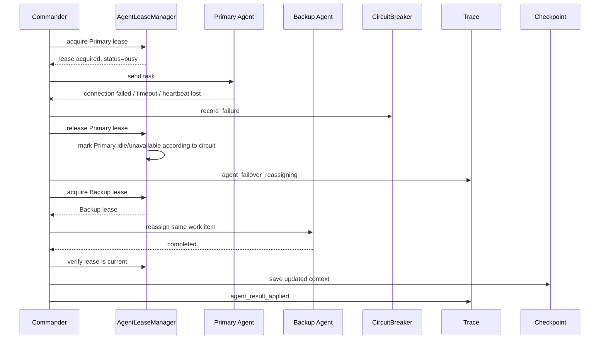
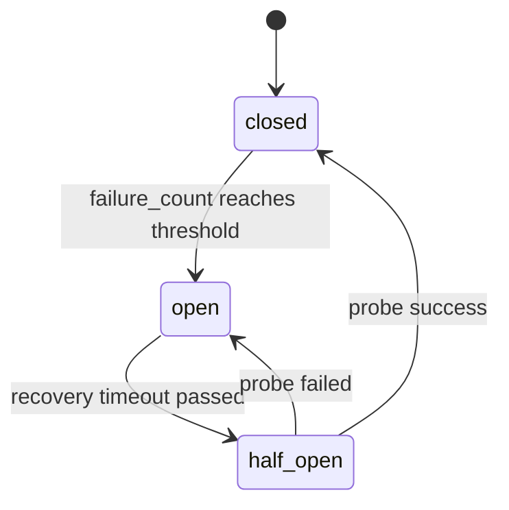

# 周报

## 一、本周工作概述

本周主要围绕 A2A 多 Agent 工作流中的 **失效检测与恢复机制** 进行梳理和完善，重点是让系统在 Agent 调用失败、运行中心跳丢失、连续故障、旧响应晚到、Commander 重启恢复等场景下，能够尽量保持 workflow 不被单点故障中断。

本周完成的核心能力包括：

1. 完成 Agent 级失效检测与恢复链路梳理。
2. 明确调用失败、心跳丢失、熔断、重指派、晚到响应拒绝之间的关系。
3. 明确 Commander 级恢复能力边界：系统支持 checkpoint resume / takeover API，但没有内置常驻 watchdog 服务。
4. 补充验证方式和汇报口径，避免把演示脚本中的 watchdog 误认为生产级内置 watchdog。

一句话总结：

```text
当前系统已经实现 Agent 级失效检测与恢复；
Commander 级恢复具备 checkpoint resume / takeover 能力，但自动拉起和持续监控需要外部 watchdog 或进程管理器触发。
```

## 二、为什么需要失效检测与恢复

在 A2A 多 Agent 工作流中，Commander 会把不同 activity 派发给 Recon、Artillery、Evaluator、Assault 等 Agent。真实运行时，Agent 可能出现以下问题：

```text
Agent 进程宕机
Agent HTTP 连接失败
Agent 请求超时
Agent ready=false
Agent 运行中停止心跳
Agent 连续返回 5xx
Agent 迟到返回旧结果
Commander 进程重启或被替换
```

如果没有失效检测与恢复机制，可能导致：

```text
workflow 卡死在某个 activity
故障 Agent 被反复调用
同一个任务被多个 Agent 重复写结果
旧 Agent 的迟到结果覆盖新结果
Commander 重启后丢失执行上下文
```

因此，系统需要做到：

```text
发现故障
隔离故障节点
释放旧租约
重新选择可用 Agent
拒绝失效响应
保存和恢复 workflow 上下文
```

## 三、当前已实现能力

| 能力 | 是否实现 | 说明 |
| --- | --- | --- |
| Agent 调用失败检测 | 已实现 | 捕获连接失败、超时、HTTP 5xx、not ready 等错误 |
| Agent 心跳丢失检测 | 已实现 | 执行中定期检查租约对应 Agent 是否仍然 fresh |
| Agent 重指派 | 已实现 | 故障后查找同 role / same skill 的备用 Agent |
| 熔断机制 | 已实现 | 连续失败后 `circuit_state=open`，短时间内不再调用故障 Agent |
| 半开恢复 | 已实现 | 熔断超时后进入 half-open，通过探测请求恢复 |
| 晚到响应拒绝 | 已实现 | 旧 Agent 迟到返回时检查租约是否仍有效，失效则忽略 |
| checkpoint resume | 已实现 | Commander 重启后可按 workflow_id 加载 checkpoint 继续执行 |
| takeover API | 已实现 | 备用 Commander 可通过 API 接管并 resume workflow |
| 内置 Commander watchdog | 未内置 | 当前依赖演示脚本或外部进程管理器触发 |

## 四、Agent 级失效检测与恢复流程

Agent 级恢复是当前系统已经实现的核心能力。

完整流程如下：



这个流程解决的是：

```text
某个业务 Agent 出问题后，当前 Commander 可以继续推进 workflow。
```

它不是 Commander 自己宕机后的恢复。

## 五、运行中心跳丢失恢复

调用失败比较容易检测，因为请求会直接抛异常或返回错误。但还有一种更隐蔽的情况：

```text
Agent 已经接收任务并开始执行，但执行过程中停止心跳。
```

当前系统通过 active lease heartbeat check 检测这种情况。

简化流程：

```text
Commander 派发任务给 Primary Agent
-> Primary Agent 持有 lease 并执行任务
-> Commander 周期性检查 lease 是否 fresh
-> 如果心跳过期，判定 heartbeat lost
-> 释放 Primary lease
-> 标记失败并记录 trace
-> 找同 role / same skill 的 Backup Agent
-> 重新派发同一个 work item
```

对应代码位置：

```text
commander_agent/main.py
_delegate_leased_candidate()
lease_heartbeat_check_interval
agent_heartbeat_lost trace
```

## 六、晚到响应拒绝

心跳丢失后，Primary Agent 可能并没有真正停止，它可能只是卡顿，稍后又返回结果。

如果系统直接接受这个迟到结果，可能造成：

```text
Backup 已经完成任务，但 Primary 的旧结果又覆盖 context
同一个 activity 被重复提交
workflow 状态不一致
```

因此当前系统在接受 Agent 结果前会检查：

```text
该响应对应的 lease 是否仍然是当前有效租约？
该 Agent 心跳是否仍然 fresh？
```

如果不是，则记录：

```text
agent_late_response_ignored
```

并拒绝写入 workflow context。

代码位置：

```text
commander_agent/main.py
_lease_allows_response()
```

## 七、熔断机制

如果某个 Agent 连续失败，系统不能每次都继续调用它，否则会造成：

```text
大量无效请求
workflow 延迟增加
故障节点被持续打满
日志和 trace 噪声变多
```

因此当前系统实现了 Agent 级熔断器：

```text
closed -> open -> half_open -> closed
```

状态含义：

| 状态 | 含义 |
| --- | --- |
| `closed` | 正常可调用 |
| `open` | 熔断打开，暂时拒绝请求 |
| `half_open` | 恢复窗口到达，允许一次探测请求 |

流程：



代码位置：

```text
commander_agent/circuit_breaker.py
AgentCircuitBreaker
```

## 八、checkpoint resume 与 takeover

除了 Agent 级恢复，系统还支持 workflow 级恢复。

当 Commander 进程重启或切换时，只要 workflow checkpoint 还在，就可以按同一个 `workflow_id` 恢复上下文。

已实现能力：

```text
checkpoint 保存 workflow context
resume 时加载 checkpoint
已完成 activity 不重复执行
running / failed activity 可被重置为 pending
takeover API 可由另一个 Commander 触发恢复
```

代码位置：

```text
workflow_state_store.py
commander_agent/main.py
commander_agent/recovery_api.py
```

API：

```text
POST /workflows/{workflow_id}/resume
POST /workflows/{workflow_id}/takeover
```

注意：

```text
这里提供的是恢复能力，不等于内置了一个常驻 watchdog。
```

## 九、Commander watchdog 的边界说明

当前项目没有实现一个常驻的生产级 Commander watchdog 服务。

也就是说，项目内没有一个长期运行的模块负责：

```text
持续监控 Commander 进程
发现 Commander 进程死亡
自动拉起新的 Commander
自动调用 takeover API
```

当前已有的是：

```text
checkpoint resume 能力
takeover API
演示脚本 demo_commander_failover_resume.py
```

演示脚本可以模拟：

```text
Primary Commander 健康检查失败
-> 启动 Failover Commander
-> 调用 resume/takeover
-> 从 checkpoint 继续执行
```

但严格说，这属于演示级 watchdog，不是生产级内置 watchdog。

```text
系统已经具备 Commander 恢复所需的 checkpoint 和 takeover 能力；
自动监控和自动拉起 Commander 当前由外部 watchdog、进程管理器或容器平台负责。
```

## 十、关键代码位置

| 模块 | 文件 | 说明 |
| --- | --- | --- |
| 租约管理 | `commander_agent/agent_leases.py` | 控制 Agent 独占使用、释放、心跳新鲜度判断 |
| 熔断器 | `commander_agent/circuit_breaker.py` | 管理 closed/open/half_open 状态 |
| 错误分类 | `commander_agent/error_classification.py` | 判断错误是否 retryable / failover |
| 调度与重指派 | `commander_agent/main.py` | 执行 Agent 调用、心跳检测、failover、晚到响应拒绝 |
| checkpoint | `workflow_state_store.py` | workflow 上下文保存和加载 |
| 恢复 API | `commander_agent/recovery_api.py` | resume / takeover HTTP API |
| Workflow Manager | `commander_agent/workflow_manager.py` | 多 workflow 执行、resume_workflow |

## 十一、验证情况

已通过的核心测试：

```powershell
D:\tools\miniforge3\envs\a2a\python.exe -m unittest tests.test_resource_monitor tests.test_agent_heartbeat tests.test_agent_leases tests.test_agent_circuit_breaker tests.test_exception_diagnostics
```

结果：

```text
Ran 25 tests
OK
```

覆盖内容：

| 测试 | 覆盖内容 |
| --- | --- |
| `tests.test_agent_leases` | 租约获取、释放、资源过滤、skill 匹配 |
| `tests.test_agent_circuit_breaker` | 熔断打开、半开探测、恢复 |
| `tests.test_agent_heartbeat` | 心跳 metadata 合并与 fresh 判断 |
| `tests.test_exception_diagnostics` | Agent 异常诊断和 traceback |
| `tests.test_resource_monitor` | 资源监控与调度过滤辅助能力 |

说明：

```text
tests.test_workflow_resume 需要额外测试依赖 httpx2。
当前环境未安装该测试依赖，因此没有纳入本次自动测试命令。
但代码中 resume / takeover API 已实现。
```

## 十二、本周结论

当前系统的失效检测与恢复能力可以分为两层：

### 12.1 已实现：Agent 级失效检测与恢复

包括：

```text
调用失败检测
运行中心跳丢失检测
租约释放
同 role / same skill 备用 Agent 重指派
熔断与半开恢复
晚到响应拒绝
trace 记录
checkpoint 更新
```

这部分已经属于系统核心逻辑。

### 12.2 已具备基础：Commander 级恢复

包括：

```text
checkpoint resume
takeover API
演示脚本验证 Commander failover 流程
```

但需要明确：

```text
Commander 自动 watchdog 没有做成内置常驻模块。
生产环境可由 systemd、supervisor、Kubernetes、外部 watchdog 或平台调度器负责拉起并调用 takeover。
```

## 十三、后续计划

后续可以继续完善：

1. 增加正式的 `CommanderWatchdogService`，将演示脚本中的 watchdog 逻辑模块化。
2. 增加 Commander 主备注册和选主机制。
3. 将 takeover 过程接入 Nacos 或独立控制面，实现前端可观测。
4. 增加 Agent 从 `unavailable` 自动恢复为 `idle` 的健康探测器。
5. 将 trace 输出接入统一日志或可视化页面。

```text
本周梳理并完善了失效检测与恢复模块。
当前系统已经实现 Agent 级失效检测与恢复，包括调用失败、运行中心跳丢失、熔断、重指派和晚到响应拒绝。

当某个 Agent 失效时，Commander 会释放旧租约，记录 trace，
并选择同 role 或 same skill 的备用 Agent 继续执行同一个 work item。

对于 Commander 自身宕机，系统已经具备 checkpoint resume 和 takeover API，
能够由另一个 Commander 根据 workflow_id 读取 checkpoint 继续执行。

需要说明的是，项目目前没有内置生产级常驻 watchdog；
自动发现 Commander 宕机并拉起备用 Commander 的动作，当前由演示脚本或外部进程管理器承担。
```

