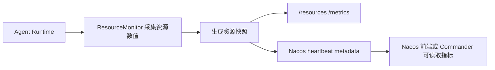

# 资源监控模块新增功能说明

## 1. 需求调整

最新对接后的要求是：

```text
资源监控模块只负责返回 CPU、内存、磁盘、进程资源等原始数值；
不再设置阈值；
不再划分 ok / warn / critical 等等级；
不再根据资源等级影响 Commander 调度。
```

因此，当前资源监控模块的定位调整为：

```text
采集资源数值
通过 Runtime 接口返回资源数值
通过心跳 metadata 上报资源数值
供 Nacos 前端、日志或后续外部策略查看
```

一句话：

```text
资源监控模块现在只做“指标采集与上报”，不做“资源健康判定与调度决策”。
```

## 2. Agent Runtime 是什么

在本项目中，Agent Runtime 指每个业务 Agent 共用的运行框架，核心代码是：

```text
a2a_protocol/server.py
A2ABaseAgent
```

可以理解为：

```text
Agent = Agent Runtime + 具体业务能力
```

例如：

```text
Recon Agent = Runtime + 侦察能力
Artillery Agent = Runtime + 火力压制能力
Evaluator Agent = Runtime + 评估能力
Assault Agent = Runtime + 突击能力
```

资源监控写在 Runtime 层，而不是分别写在每个业务 Agent 里，是为了：

```text
避免重复实现
统一资源指标格式
统一 Runtime 接口
保证新增 Agent 也能复用同一套资源采集能力
```

## 3. 当前新增实现

| 新增内容 | 文件 | 作用 |
| --- | --- | --- |
| 资源监控核心模块 | `resource_monitor.py` | 采集 CPU、内存、磁盘、进程资源数值 |
| Agent Runtime 接入 | `a2a_protocol/server.py` | 新增 `/resources`，并在 `/metrics` 中带上资源快照 |
| Nacos 心跳接入 | `registry/nacos_manager.py` | 每次 heartbeat 同步资源数值 metadata |
| 四类 Agent 注册接入 | `recon_agent/main.py`、`artillery_agent/main.py`、`evaluator_agent/main.py`、`assault_agent/main.py` | 注册和心跳时写入资源数值 |
| 依赖补充 | `requirements.txt` | 新增 `psutil` |
| 测试补充 | `tests/test_resource_monitor.py` 等 | 验证采集和心跳上报 |

## 4. 新增采集指标

资源监控模块采集两类指标。

| 类型 | 指标 |
| --- | --- |
| 系统级资源 | CPU 使用率、CPU 核心数、内存总量、可用内存、内存使用率、磁盘总量、已用空间、剩余空间、磁盘使用率、操作系统平台信息 |
| Agent 进程级资源 | PID、进程 CPU 使用率、RSS/VMS 内存、线程数、打开文件数、IO counters |

采集方式：

```text
使用 psutil 和 shutil.disk_usage 读取操作系统资源信息；
不是通过 top/free/df 等 Linux 命令解析文本输出。
```

## 5. 新增运行流程

整体流程如下：



说明：

```text
Agent 自己采集自己的资源；
心跳线程把资源数值上报到 Nacos；
Commander 可以看到这些 metadata，但当前不根据资源数值自动过滤 Agent。
```

## 6. Runtime 接口变化

| 接口 | 新增内容 |
| --- | --- |
| `GET /resources` | 新增接口，返回完整资源快照 |
| `GET /metrics` | 新增 `resources` 字段 |
| `GET /ready` | 保持原有 ready 语义，只额外返回资源监控是否可用 |
| `GET /health` | 保持 `status=ok`，额外返回资源监控是否可用 |
| `GET /.well-known/agent-card` | 新增 `resourcesEndpoint=/resources` |

`/resources` 返回的核心结构：

```text
monitor_available
sampled_at
system
process
```

## 7. Nacos Metadata 新增字段

Agent 注册和心跳时新增以下 metadata：

| 字段 | 含义 |
| --- | --- |
| `resource_monitor_available` | 资源监控是否可用 |
| `resource_cpu_percent` | 系统 CPU 使用率 |
| `resource_memory_percent` | 系统内存使用率 |
| `resource_disk_percent` | 磁盘使用率 |
| `process_cpu_percent` | Agent 进程 CPU 使用率 |
| `process_memory_mb` | Agent 进程内存占用 |
| `resource_sampled_at` | 资源采样时间 |

注意：

```text
当前不再上报 resource_state；
也不再上报 warn/critical 等等级。
```

## 8. 当前不再包含的逻辑

根据最新需求，以下逻辑已经移除：

```text
不再配置 CPU / 内存 / 磁盘 warn 阈值
不再配置 CPU / 内存 / 磁盘 critical 阈值
不再计算 resource_state
不再生成 violations
不再因为资源 critical 修改 /ready
不再因为资源 critical 修改 /health 为 degraded
不再因为资源 critical 拒绝 sendMessage
不再因为资源 critical 让 Commander 跳过 Agent
```

也就是说，资源监控模块现在只负责：

```text
把真实数值采集出来，并通过接口和心跳上报出去。
```

## 9. 新增配置和依赖

当前保留的配置：

```powershell
$env:A2A_RESOURCE_SAMPLE_TTL_SECONDS="1"
$env:A2A_RESOURCE_DISK_PATH="D:\AI\A2A"
```

含义：

| 配置 | 作用 |
| --- | --- |
| `A2A_RESOURCE_SAMPLE_TTL_SECONDS` | 资源采样缓存时间，避免每次请求都重新采集 |
| `A2A_RESOURCE_DISK_PATH` | 指定磁盘统计路径 |

新增依赖：

```text
psutil>=5.9,<8.0
```

安装：

```powershell
pip install -r requirements.txt
```

## 10. 验证方式

测试命令：

```powershell
python -m unittest tests.test_resource_monitor tests.test_agent_heartbeat tests.test_agent_leases
```

测试覆盖：

| 测试 | 覆盖内容 |
| --- | --- |
| `tests.test_resource_monitor` | 资源数值采集、资源快照、heartbeat metadata |
| `tests.test_agent_heartbeat` | heartbeat metadata 合并资源数值字段 |
| `tests.test_agent_leases` | 资源数值 metadata 不影响 Agent 租约获取 |

## 11. 重点

```text
根据最新需求，资源监控模块调整为只返回资源数值，不再设置阈值或划分等级。

当前模块在 Agent Runtime 层统一实现，每个 Agent 通过 ResourceMonitor 采集 CPU、内存、磁盘和进程资源。
这些指标会通过 /resources 和 /metrics 返回，也会随 Agent 心跳写入 Nacos metadata。

Commander 可以读取到这些资源指标，但当前不会根据资源指标自动跳过 Agent；
后续如果需要做调度策略，可以在这些原始指标基础上由外部策略或调度层再计算。
```
